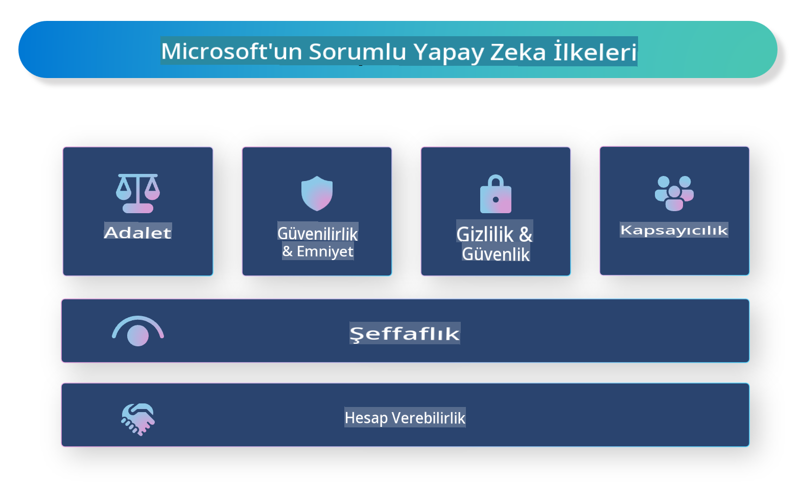

# **Sorumlu Yapay Zekayı Tanıtın**

[Microsoft Sorumlu Yapay Zeka](https://www.microsoft.com/ai/responsible-ai?WT.mc_id=aiml-138114-kinfeylo), geliştiricilere ve organizasyonlara şeffaf, güvenilir ve hesap verebilir yapay zeka sistemleri oluşturmalarına yardımcı olmayı amaçlayan bir girişimdir. Bu girişim, gizlilik, adalet ve şeffaflık gibi etik ilkelere uygun sorumlu yapay zeka çözümleri geliştirmek için rehberlik ve kaynaklar sunar. Ayrıca, sorumlu yapay zeka sistemleri oluşturmayla ilgili bazı zorlukları ve en iyi uygulamaları da inceleyeceğiz.

## Microsoft Sorumlu Yapay Zekaya Genel Bakış

**Etik İlkeler**

Microsoft Sorumlu Yapay Zeka, gizlilik, adalet, şeffaflık, hesap verebilirlik ve güvenlik gibi bir dizi etik ilke tarafından yönlendirilir. Bu ilkeler, yapay zeka sistemlerinin etik ve sorumlu bir şekilde geliştirilmesini sağlamak için tasarlanmıştır.

**Şeffaf Yapay Zeka**

Microsoft Sorumlu Yapay Zeka, yapay zeka sistemlerinde şeffaflığın önemini vurgular. Bu, yapay zeka modellerinin nasıl çalıştığına dair net açıklamalar sunmayı ve veri kaynaklarının ve algoritmaların kamuya açık olmasını sağlamayı içerir.

**Hesap Verebilir Yapay Zeka**

[Microsoft Sorumlu Yapay Zeka](https://www.microsoft.com/ai/responsible-ai?WT.mc_id=aiml-138114-kinfeylo), yapay zeka modellerinin nasıl karar verdiğine dair içgörüler sağlayabilen hesap verebilir yapay zeka sistemlerinin geliştirilmesini teşvik eder. Bu, kullanıcıların yapay zeka sistemlerinin çıktısını anlamalarına ve güvenmelerine yardımcı olabilir.

**Kapsayıcılık**

Yapay zeka sistemleri herkesin yararına olacak şekilde tasarlanmalıdır. Microsoft, farklı bakış açılarını dikkate alan ve önyargı veya ayrımcılıktan kaçınan kapsayıcı yapay zeka oluşturmayı hedefler.

**Güvenilirlik ve Güvenlik**

Yapay zeka sistemlerinin güvenilir ve güvenli olmasını sağlamak çok önemlidir. Microsoft, tutarlı performans gösteren ve zararlı sonuçlardan kaçınan sağlam modeller geliştirmeye odaklanır.

**Yapay Zekada Adalet**

Microsoft Sorumlu Yapay Zeka, yapay zeka sistemlerinin önyargılı veriler veya algoritmalarla eğitildiğinde önyargıları sürdürebileceğini kabul eder. Girişim, ırk, cinsiyet veya yaş gibi faktörlere dayalı ayrımcılık yapmayan adil yapay zeka sistemleri geliştirmek için rehberlik sağlar.

**Gizlilik ve Güvenlik**

Microsoft Sorumlu Yapay Zeka, yapay zeka sistemlerinde kullanıcı gizliliğini ve veri güvenliğini korumanın önemini vurgular. Bu, güçlü veri şifreleme ve erişim kontrolleri uygulamayı ve düzenli olarak yapay zeka sistemlerini güvenlik açıklarına karşı denetlemeyi içerir.

**Hesap Verebilirlik ve Sorumluluk**

Microsoft Sorumlu Yapay Zeka, yapay zeka geliştirme ve dağıtımında hesap verebilirliği ve sorumluluğu teşvik eder. Bu, geliştiricilerin ve organizasyonların yapay zeka sistemleriyle ilgili potansiyel risklerin farkında olmasını ve bu riskleri azaltmak için adımlar atmasını içerir.

## Sorumlu Yapay Zeka Sistemleri Oluşturmak İçin En İyi Uygulamalar

**Çeşitli veri setleri kullanarak yapay zeka modelleri geliştirin**

Yapay zeka sistemlerinde önyargıdan kaçınmak için, farklı bakış açılarını ve deneyimleri temsil eden çeşitli veri setleri kullanmak önemlidir.

**Açıklanabilir yapay zeka tekniklerini kullanın**

Açıklanabilir yapay zeka teknikleri, kullanıcıların yapay zeka modellerinin nasıl karar verdiğini anlamalarına yardımcı olabilir ve bu da sisteme olan güveni artırabilir.

**Yapay zeka sistemlerini düzenli olarak güvenlik açıklarına karşı denetleyin**

Yapay zeka sistemlerinin düzenli denetimleri, ele alınması gereken potansiyel riskleri ve güvenlik açıklarını belirlemeye yardımcı olabilir.

**Güçlü veri şifreleme ve erişim kontrolleri uygulayın**

Veri şifreleme ve erişim kontrolleri, yapay zeka sistemlerinde kullanıcı gizliliğini ve güvenliğini korumaya yardımcı olabilir.

**Yapay zeka geliştirmede etik ilkelere uyun**

Adalet, şeffaflık ve hesap verebilirlik gibi etik ilkelere uymak, yapay zeka sistemlerine olan güveni artırabilir ve bunların sorumlu bir şekilde geliştirilmesini sağlayabilir.

## Sorumlu Yapay Zeka için AI Foundry Kullanımı

[Azure AI Foundry](https://ai.azure.com?WT.mc_id=aiml-138114-kinfeylo), geliştiricilere ve organizasyonlara hızlı bir şekilde akıllı, ileri teknoloji, piyasaya hazır ve sorumlu uygulamalar oluşturma imkanı sunan güçlü bir platformdur. İşte Azure AI Foundry'nin bazı temel özellikleri ve yetenekleri:

**Hazır API'ler ve Modeller**

Azure AI Foundry, önceden oluşturulmuş ve özelleştirilebilir API'ler ve modeller sunar. Bu, üretken yapay zeka, konuşma için doğal dil işleme, arama, izleme, çeviri, konuşma, görme ve karar verme gibi çeşitli yapay zeka görevlerini kapsar.

**Prompt Flow**

Azure AI Foundry'deki prompt flow, konuşmaya dayalı yapay zeka deneyimleri oluşturmanıza olanak tanır. Sohbet botları, sanal asistanlar ve diğer etkileşimli uygulamaları oluşturmayı kolaylaştırarak konuşma akışlarını tasarlamanıza ve yönetmenize imkan tanır.

**Retrieval Augmented Generation (RAG)**

RAG, bilgi getirme tabanlı ve üretken tabanlı yaklaşımları birleştiren bir tekniktir. Bu yöntem, hem mevcut bilgileri (bilgi getirme) hem de yaratıcı üretimi (üretim) kullanarak oluşturulan yanıtların kalitesini artırır.

**Üretken Yapay Zeka için Değerlendirme ve İzleme Metrikleri**

Azure AI Foundry, üretken yapay zeka modellerini değerlendirmek ve izlemek için araçlar sunar. Bu araçlar, modellerin performansını, adaletini ve diğer önemli metriklerini değerlendirmenize olanak tanır. Ayrıca, bir pano oluşturduysanız, Azure Machine Learning Studio'daki kodsuz kullanıcı arayüzünü kullanarak [Sorumlu Yapay Zeka Araç Kutusu](https://responsibleaitoolbox.ai/?WT.mc_id=aiml-138114-kinfeylo) Python kütüphanelerine dayalı olarak bir Sorumlu Yapay Zeka Panosu ve ilgili skor kartı özelleştirebilir ve oluşturabilirsiniz. Bu skor kartı, adalet, özellik önemi ve diğer sorumlu dağıtım hususlarıyla ilgili önemli içgörüleri teknik ve teknik olmayan paydaşlarla paylaşmanıza yardımcı olur.

Sorumlu yapay zeka ile AI Foundry'yi kullanmak için şu en iyi uygulamaları takip edebilirsiniz:

**Yapay zeka sisteminizin problemini ve hedeflerini tanımlayın**

Geliştirme sürecine başlamadan önce, yapay zeka sisteminizin çözmeyi amaçladığı problemi veya hedefi net bir şekilde tanımlamak önemlidir. Bu, etkili bir model oluşturmak için ihtiyaç duyulan veri, algoritmalar ve kaynakları belirlemenize yardımcı olacaktır.

**İlgili verileri toplayın ve ön işleme tabi tutun**

Bir yapay zeka sisteminin eğitiminde kullanılan verilerin kalitesi ve miktarı, performansı üzerinde önemli bir etkiye sahip olabilir. Bu nedenle, ilgili verileri toplamak, temizlemek, ön işleme tabi tutmak ve çözmeye çalıştığınız nüfusu veya problemi temsil ettiğinden emin olmak önemlidir.

**Uygun değerlendirme yöntemini seçin**

Çeşitli değerlendirme algoritmaları mevcuttur. Verinize ve probleminize en uygun algoritmayı seçmek önemlidir.

**Modeli değerlendirin ve yorumlayın**

Bir yapay zeka modeli oluşturduktan sonra, performansını uygun metrikler kullanarak değerlendirmek ve sonuçları şeffaf bir şekilde yorumlamak önemlidir. Bu, modeldeki önyargıları veya sınırlamaları belirlemenize ve gerekli iyileştirmeleri yapmanıza yardımcı olacaktır.

**Şeffaflık ve açıklanabilirlik sağlayın**

Yapay zeka sistemleri, kullanıcıların nasıl çalıştığını ve kararların nasıl alındığını anlayabilmesi için şeffaf ve açıklanabilir olmalıdır. Bu, özellikle sağlık, finans ve hukuk sistemleri gibi insan yaşamı üzerinde önemli etkileri olan uygulamalar için önemlidir.

**Modeli izleyin ve güncelleyin**

Yapay zeka sistemleri, zamanla doğru ve etkili kalmalarını sağlamak için sürekli olarak izlenmeli ve güncellenmelidir. Bu, modelin sürekli bakımı, test edilmesi ve yeniden eğitilmesini gerektirir.

Sonuç olarak, Microsoft Sorumlu Yapay Zeka, geliştiricilere ve organizasyonlara şeffaf, güvenilir ve hesap verebilir yapay zeka sistemleri oluşturmalarına yardımcı olmayı amaçlayan bir girişimdir. Sorumlu yapay zeka uygulamasının hayati öneme sahip olduğunu unutmayın ve Azure AI Foundry, bunu organizasyonlar için uygulanabilir hale getirmeyi hedefler. Etik ilkelere ve en iyi uygulamalara uyarak, yapay zeka sistemlerinin topluma fayda sağlayacak şekilde sorumlu bir şekilde geliştirilmesini ve dağıtılmasını sağlayabiliriz.

**Feragatname**:  
Bu belge, yapay zeka tabanlı makine çeviri hizmetleri kullanılarak çevrilmiştir. Doğruluk için çaba göstersek de, otomatik çevirilerin hata veya yanlışlıklar içerebileceğini lütfen unutmayın. Orijinal belgenin kendi dilindeki versiyonu yetkili kaynak olarak kabul edilmelidir. Kritik bilgiler için profesyonel insan çevirisi önerilir. Bu çevirinin kullanımından kaynaklanan yanlış anlamalar veya yanlış yorumlamalardan sorumlu değiliz.