# Phi-3 modellerini özelleştir, ince ayar yap ve Prompt flow ile entegre et

Bu uçtan uca (E2E) örnek, Microsoft Tech Community'de yer alan "[Özelleştirilmiş Phi-3 Modellerini Prompt Flow ile İnce Ayar Yap ve Entegre Et: Adım Adım Kılavuz](https://techcommunity.microsoft.com/t5/educator-developer-blog/fine-tune-and-integrate-custom-phi-3-models-with-prompt-flow/ba-p/4178612?WT.mc_id=aiml-137032-kinfeylo)" rehberine dayanmaktadır. Bu rehber, Phi-3 modellerinin ince ayar yapılması, dağıtılması ve Prompt flow ile entegre edilmesi süreçlerini tanıtır.

## Genel Bakış

Bu E2E örneğinde, Phi-3 modeline ince ayar yapmayı ve Prompt flow ile entegre etmeyi öğreneceksiniz. Azure Machine Learning ve Prompt flow'dan yararlanarak özel yapay zeka modelleri için bir iş akışı oluşturacaksınız. Bu E2E örneği üç senaryoya ayrılmıştır:

**Senaryo 1: Azure kaynaklarını ayarlayın ve ince ayar için hazırlanın**

**Senaryo 2: Phi-3 modeline ince ayar yapın ve Azure Machine Learning Studio'da dağıtın**

**Senaryo 3: Prompt flow ile entegre edin ve özelleştirilmiş modelinizle sohbet edin**

İşte bu E2E örneğinin genel bir görünümü.


### İçindekiler

1. **[Senaryo 1: Azure kaynaklarını ayarlayın ve ince ayar için hazırlanın](../../../../../../md/02.Application/01.TextAndChat/Phi3)**
    - [Azure Machine Learning Çalışma Alanı oluşturun](../../../../../../md/02.Application/01.TextAndChat/Phi3)
    - [Azure Aboneliğinde GPU kotaları talep edin](../../../../../../md/02.Application/01.TextAndChat/Phi3)
    - [Rol ataması ekleyin](../../../../../../md/02.Application/01.TextAndChat/Phi3)
    - [Proje ayarlarını yapın](../../../../../../md/02.Application/01.TextAndChat/Phi3)
    - [İnce ayar için veri kümesini hazırlayın](../../../../../../md/02.Application/01.TextAndChat/Phi3)

1. **[Senaryo 2: Phi-3 modeline ince ayar yapın ve Azure Machine Learning Studio'da dağıtın](../../../../../../md/02.Application/01.TextAndChat/Phi3)**
    - [Azure CLI'yi ayarlayın](../../../../../../md/02.Application/01.TextAndChat/Phi3)
    - [Phi-3 modeline ince ayar yapın](../../../../../../md/02.Application/01.TextAndChat/Phi3)
    - [İnce ayar yapılmış modeli dağıtın](../../../../../../md/02.Application/01.TextAndChat/Phi3)

1. **[Senaryo 3: Prompt flow ile entegre edin ve özelleştirilmiş modelinizle sohbet edin](../../../../../../md/02.Application/01.TextAndChat/Phi3)**
    - [Özelleştirilmiş Phi-3 modelini Prompt flow ile entegre edin](../../../../../../md/02.Application/01.TextAndChat/Phi3)
    - [Özelleştirilmiş modelinizle sohbet edin](../../../../../../md/02.Application/01.TextAndChat/Phi3)

## Senaryo 1: Azure kaynaklarını ayarlayın ve ince ayar için hazırlanın

### Azure Machine Learning Çalışma Alanı oluşturun

1. Portal sayfasının üst kısmındaki **arama çubuğuna** *azure machine learning* yazın ve çıkan seçeneklerden **Azure Machine Learning** seçeneğini seçin.

    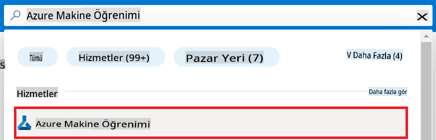

1. Gezinti menüsünden **+ Oluştur** seçeneğini seçin.

1. Gezinti menüsünden **Yeni çalışma alanı** seçeneğini seçin.

    

1. Aşağıdaki görevleri gerçekleştirin:

    - Azure **Aboneliğinizi** seçin.
    - Kullanmak istediğiniz **Kaynak grubunu** seçin (gerekirse yeni bir tane oluşturun).
    - **Çalışma Alanı Adı** girin. Bu değer benzersiz olmalıdır.
    - Kullanmak istediğiniz **Bölgeyi** seçin.
    - Kullanmak istediğiniz **Depolama hesabını** seçin (gerekirse yeni bir tane oluşturun).
    - Kullanmak istediğiniz **Anahtar kasasını** seçin (gerekirse yeni bir tane oluşturun).
    - Kullanmak istediğiniz **Uygulama içgörülerini** seçin (gerekirse yeni bir tane oluşturun).
    - Kullanmak istediğiniz **Kapsayıcı kaydını** seçin (gerekirse yeni bir tane oluşturun).

    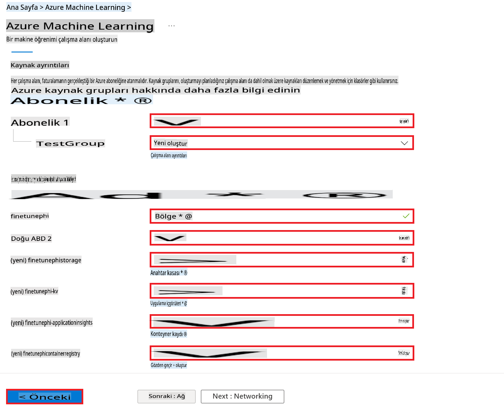

1. **Gözden Geçir + Oluştur** seçeneğini seçin.

1. **Oluştur** seçeneğini seçin.

### Azure Aboneliğinde GPU kotaları talep edin

Bu E2E örneğinde, ince ayar için *Standard_NC24ads_A100_v4 GPU* kullanılacak olup bu, bir kota talebi gerektirir. Dağıtım için ise *Standard_E4s_v3* CPU kullanılacaktır ve bu bir kota talebi gerektirmez.

> [!NOTE]
>
> Yalnızca Standart Abonelik türü olan "Kullandıkça Öde" abonelikleri GPU tahsisi için uygundur; avantaj abonelikleri şu anda desteklenmemektedir.
>
> Avantaj abonelikleri (örneğin Visual Studio Enterprise Aboneliği) kullananlar veya ince ayar ve dağıtım sürecini hızlıca test etmek isteyenler için, bu kılavuz CPU ile minimal bir veri kümesi kullanarak ince ayar yapma konusunda da rehberlik sunmaktadır. Ancak, daha büyük veri kümeleri ve GPU kullanıldığında ince ayar sonuçlarının önemli ölçüde daha iyi olduğunu belirtmek önemlidir.

1. [Azure ML Studio](https://ml.azure.com/home?wt.mc_id=studentamb_279723) adresini ziyaret edin.

1. *Standard NCADSA100v4 Family* kotası talep etmek için aşağıdaki görevleri gerçekleştirin:

    - Sol taraftaki sekmeden **Kota** seçeneğini seçin.
    - Kullanmak istediğiniz **Sanal makine ailesini** seçin. Örneğin, *Standard NCADSA100v4 Family Cluster Dedicated vCPUs* seçeneğini seçin, bu *Standard_NC24ads_A100_v4* GPU'yu içerir.
    - Gezinti menüsünden **Kota talep et** seçeneğini seçin.

        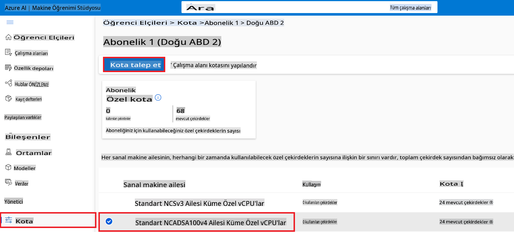

    - Kota talep etme sayfasında, kullanmak istediğiniz **Yeni çekirdek sınırını** girin. Örneğin, 24.
    - Kota talep etme sayfasında, GPU kotasını talep etmek için **Gönder** seçeneğini seçin.

> [!NOTE]
> İhtiyacınıza uygun GPU veya CPU'yu seçmek için [Azure'daki Sanal Makineler için Boyutlar](https://learn.microsoft.com/azure/virtual-machines/sizes/overview?tabs=breakdownseries%2Cgeneralsizelist%2Ccomputesizelist%2Cmemorysizelist%2Cstoragesizelist%2Cgpusizelist%2Cfpgasizelist%2Chpcsizelist) belgesine başvurabilirsiniz.

### Rol ataması ekleyin

Modellerinizi ince ayar yapmak ve dağıtmak için önce Kullanıcı Atamalı Yönetilen Kimlik (UAI) oluşturmanız ve buna uygun izinleri atamanız gerekir. Bu UAI, dağıtım sırasında kimlik doğrulama için kullanılacaktır.

#### Kullanıcı Atamalı Yönetilen Kimlik (UAI) oluşturun

1. Portal sayfasının üst kısmındaki **arama çubuğuna** *yönetilen kimlikler* yazın ve çıkan seçeneklerden **Yönetilen Kimlikler** seçeneğini seçin.

    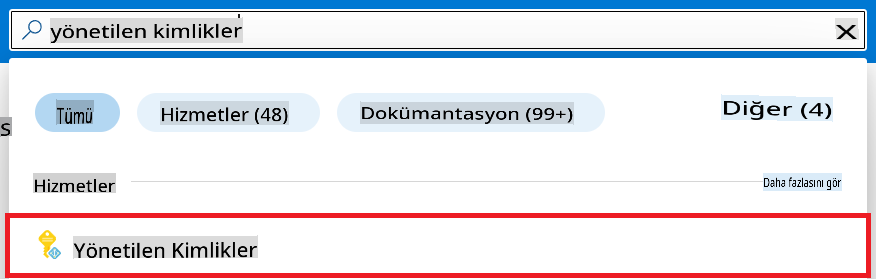

1. **+ Oluştur** seçeneğini seçin.

    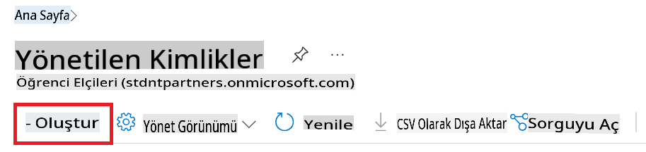

1. Aşağıdaki görevleri gerçekleştirin:

    - Azure **Aboneliğinizi** seçin.
    - Kullanmak istediğiniz **Kaynak grubunu** seçin (gerekirse yeni bir tane oluşturun).
    - Kullanmak istediğiniz **Bölgeyi** seçin.
    - **Ad** girin. Bu değer benzersiz olmalıdır.

1. **Gözden Geçir + Oluştur** seçeneğini seçin.

1. **+ Oluştur** seçeneğini seçin.

#### Yönetilen Kimliğe Katkıda Bulunan Rol Ataması Ekleyin

1. Oluşturduğunuz Yönetilen Kimlik kaynağına gidin.

1. Sol taraftaki sekmeden **Azure rol atamaları** seçeneğini seçin.

1. Gezinti menüsünden **+Rol ataması ekle** seçeneğini seçin.

1. Rol atama sayfasında aşağıdaki görevleri gerçekleştirin:
    - **Kapsam** için **Kaynak grubu** seçeneğini seçin.
    - Azure **Aboneliğinizi** seçin.
    - Kullanmak istediğiniz **Kaynak grubunu** seçin.
    - **Rol** için **Katkıda Bulunan** seçeneğini seçin.

    

1. **Kaydet** seçeneğini seçin. 

#### Yönetilen Kimliğe Depolama Blobu Veri Okuyucu Rol Ataması Ekleyin

1. Portal sayfasının üst kısmındaki **arama çubuğuna** *depolama hesapları* yazın ve çıkan seçeneklerden **Depolama hesapları** seçeneğini seçin.

    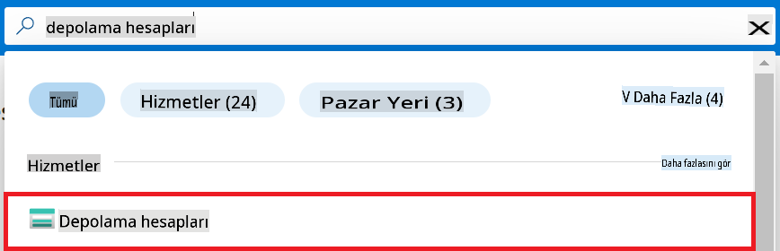

1. Oluşturduğunuz Azure Machine Learning çalışma alanıyla ilişkili depolama hesabını seçin. Örneğin, *finetunephistorage*.

1. Rol atama sayfasına gitmek için aşağıdaki görevleri gerçekleştirin:

    - Oluşturduğunuz Azure Depolama hesabına gidin.
    - Sol taraftaki sekmeden **Erişim Kontrolü (IAM)** seçeneğini seçin.
    - Gezinti menüsünden **+ Ekle** seçeneğini seçin.
    - Gezinti menüsünden **Rol ataması ekle** seçeneğini seçin.

    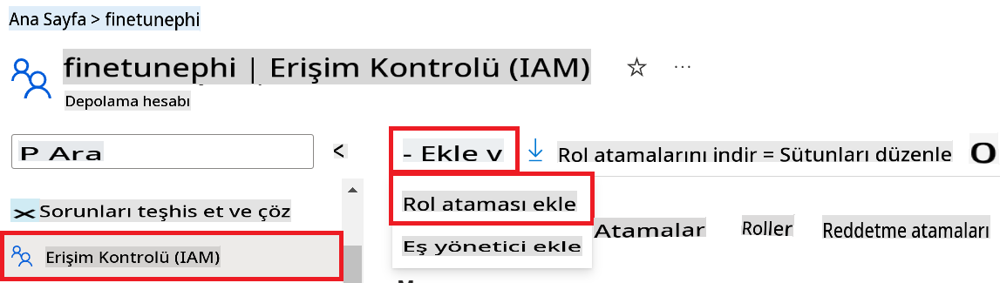

1. Rol atama sayfasında aşağıdaki görevleri gerçekleştirin:

    - Rol sayfasında, **arama çubuğuna** *Depolama Blobu Veri Okuyucu* yazın ve çıkan seçeneklerden **Depolama Blobu Veri Okuyucu** seçeneğini seçin.
    - Rol sayfasında, **Sonraki** seçeneğini seçin.
    - Üyeler sayfasında, **Erişim atamasını** **Yönetilen kimlik** olarak seçin.
    - Üyeler sayfasında, **+ Üyeleri seç** seçeneğini seçin.
    - Yönetilen kimlikler sayfasında, Azure **Aboneliğinizi** seçin.
    - Yönetilen kimlikler sayfasında, **Yönetilen kimlik** olarak **Yönetilen Kimlik** seçeneğini seçin.
    - Yönetilen kimlikler sayfasında, oluşturduğunuz Yönetilen Kimliği seçin. Örneğin, *finetunephi-managedidentity*.
    - Yönetilen kimlikler sayfasında, **Seç** seçeneğini seçin.

    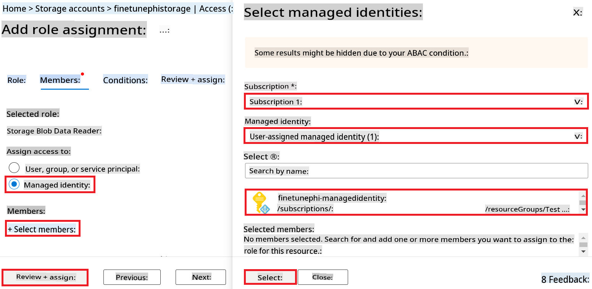

1. **Gözden Geçir + Ata** seçeneğini seçin.

#### Yönetilen Kimliğe AcrPull Rol Ataması Ekleyin

1. Portal sayfasının üst kısmındaki **arama çubuğuna** *kapsayıcı kayıtları* yazın ve çıkan seçeneklerden **Kapsayıcı kayıtları** seçeneğini seçin.

    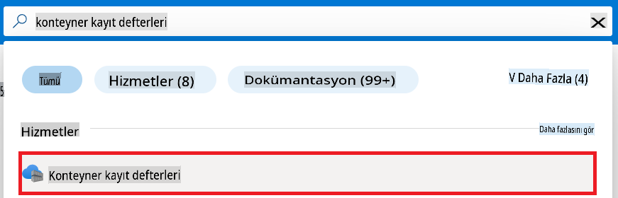

1. Azure Machine Learning çalışma alanıyla ilişkili kapsayıcı kaydını seçin. Örneğin, *finetunephicontainerregistries*.

1. Rol atama sayfasına gitmek için aşağıdaki görevleri gerçekleştirin:

    - Sol taraftaki sekmeden **Erişim Kontrolü (IAM)** seçeneğini seçin.
    - Gezinti menüsünden **+ Ekle** seçeneğini seçin.
    - Gezinti menüsünden **Rol ataması ekle** seçeneğini seçin.

1. Rol atama sayfasında aşağıdaki görevleri gerçekleştirin:

    - Rol sayfasında, **arama çubuğuna** *AcrPull* yazın ve çıkan seçeneklerden **AcrPull** seçeneğini seçin.
    - Rol sayfasında, **Sonraki** seçeneğini seçin.
    - Üyeler sayfasında, **Erişim atamasını** **Yönetilen kimlik** olarak seçin.
    - Üyeler sayfasında, **+ Üyeleri seç** seçeneğini seçin.
    - Yönetilen kimlikler sayfasında, Azure **Aboneliğinizi** seçin.
    - Yönetilen kimlikler sayfasında, **Yönetilen kimlik** olarak **Yönetilen Kimlik** seçeneğini seçin.
    - Yönetilen kimlikler sayfasında, oluşturduğunuz Yönetilen Kimliği seçin. Örneğin, *finetunephi-managedidentity*.
    - Yönetilen kimlikler sayfasında, **Seç** seçeneğini seçin.
    - **Gözden Geçir + Ata** seçeneğini seçin.

### Proje ayarlarını yapın

Şimdi, çalışmak için bir klasör oluşturacak ve Azure Cosmos DB'de depolanan sohbet geçmişini kullanarak kullanıcılarla etkileşime giren bir program geliştirmek için bir sanal ortam kuracaksınız.

#### Çalışmak için bir klasör oluşturun

1. Bir terminal penceresi açın ve varsayılan yolda *finetune-phi* adlı bir klasör oluşturmak için aşağıdaki komutu yazın.

    ```console
    mkdir finetune-phi
    ```

1. Oluşturduğunuz *finetune-phi* klasörüne gitmek için terminalde aşağıdaki komutu yazın.

    ```console
    cd finetune-phi
    ```

#### Bir sanal ortam oluşturun

1. *.venv* adlı bir sanal ortam oluşturmak için terminalde aşağıdaki komutu yazın.

    ```console
    python -m venv .venv
    ```

1. Sanal ortamı etkinleştirmek için terminalde aşağıdaki komutu yazın.

    ```console
    .venv\Scripts\activate.bat
    ```

> [!NOTE]
>
> Eğer başarılı olduysa, komut isteminin önünde *(.venv)* görmelisiniz.

#### Gerekli paketleri yükleyin

1. Gerekli paketleri yüklemek için terminalde aşağıdaki komutları yazın.

    ```console
    pip install datasets==2.19.1
    pip install transformers==4.41.1
    pip install azure-ai-ml==1.16.0
    pip install torch==2.3.1
    pip install trl==0.9.4
    pip install promptflow==1.12.0
    ```

#### Proje dosyalarını oluşturun

Bu alıştırmada, projemiz için temel dosyaları oluşturacaksınız. Bu dosyalar, veri kümesini indirme, Azure Machine Learning ortamını ayarlama, Phi-3 modeline ince ayar yapma ve ince ayar yapılmış modeli dağıtma için gerekli komut dosyalarını içerir. Ayrıca, ince ayar ortamını ayarlamak için bir *conda.yml* dosyası oluşturacaksınız.

Bu alıştırmada şunları yapacaksınız:

- Veri kümesini indirmek için bir *download_dataset.py* dosyası oluşturun.
- Azure Machine Learning ortamını ayarlamak için bir *setup_ml.py* dosyası oluşturun.
- Veri kümesini kullanarak Phi-3 modeline ince ayar yapmak için *finetuning_dir* klasöründe bir *fine_tune.py* dosyası oluşturun.
- İnce ayar ortamını ayarlamak için bir *conda.yml* dosyası oluşturun.
- İnce ayar yapılmış modeli dağıtmak için bir *deploy_model.py* dosyası oluşturun.
- İnce ayar yapılmış modeli entegre etmek ve Prompt flow kullanarak modeli çalıştırmak için bir *integrate_with_promptflow.py* dosyası oluşturun.
- Prompt flow için iş akışı yapısını ayarlamak üzere bir *flow.dag.yml* dosyası oluşturun.
- Azure bilgilerinizi girmek için bir *config.py* dosyası oluşturun.

> [!NOTE]
>
> Tam klasör yapısı:
>
> ```text
> └── YourUserName
> .    └── finetune-phi
> .        ├── finetuning_dir
> .        │      └── fine_tune.py
> .        ├── conda.yml
> .        ├── config.py
> .        ├── deploy_model.py
> .        ├── download_dataset.py
> .        ├── flow.dag.yml
> .        ├── integrate_with_promptflow.py
> .        └── setup_ml.py
> ```

1. **Visual Studio Code**'u açın.

1. Menü çubuğundan **Dosya** seçeneğini seçin.

1. **Klasör Aç** seçeneğini seçin.

1. *C:\Users\yourUserName\finetune-phi* konumunda oluşturduğunuz *finetune-phi* klasörünü seçin.

    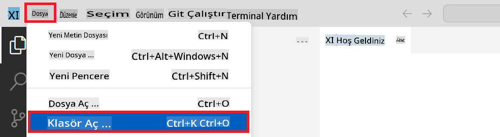

1. Visual Studio Code'un sol bölmesinde sağ tıklayın ve bir *download_dataset.py* adlı yeni bir dosya oluşturmak için **Yeni Dosya** seçeneğini seçin.

1. Visual Studio Code'un sol bölmesinde sağ tıklayın ve bir *setup


1. Azure Workspace Adını eklemek için aşağıdaki adımları gerçekleştirin:

    - Oluşturduğunuz Azure Machine Learning kaynağına gidin.
    - Hesap adınızı *config.py* dosyasına kopyalayıp yapıştırın.

    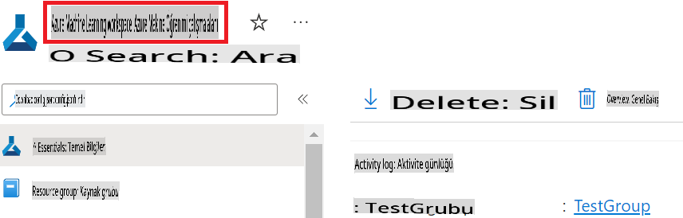

1. Azure Kaynak Grubu Adını eklemek için aşağıdaki adımları gerçekleştirin:

    - Oluşturduğunuz Azure Machine Learning kaynağına gidin.
    - Azure Kaynak Grubu Adınızı *config.py* dosyasına kopyalayıp yapıştırın.

    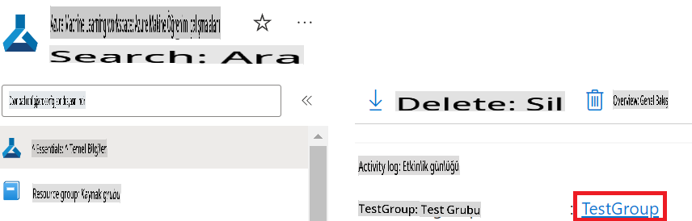

2. Azure Yönetilen Kimlik adını eklemek için aşağıdaki adımları gerçekleştirin:

    - Oluşturduğunuz Yönetilen Kimlik kaynağına gidin.
    - Azure Yönetilen Kimlik adınızı *config.py* dosyasına kopyalayıp yapıştırın.

    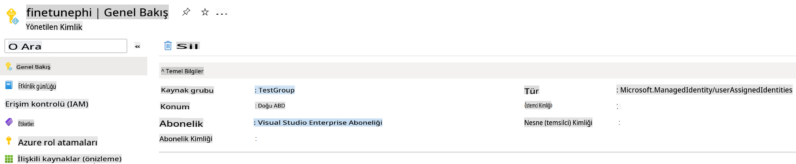

### İnce Ayar için Veri Setini Hazırlayın

Bu çalışmada, *download_dataset.py* dosyasını çalıştırarak *ULTRACHAT_200k* veri setlerini yerel ortamınıza indireceksiniz. Daha sonra bu veri setlerini Azure Machine Learning'de Phi-3 modeline ince ayar yapmak için kullanacaksınız.

#### Veri setinizi *download_dataset.py* ile indirin

1. Visual Studio Code'da *download_dataset.py* dosyasını açın.

1. Aşağıdaki kodu *download_dataset.py* dosyasına ekleyin.

    ```python
    import json
    import os
    from datasets import load_dataset
    from config import (
        TRAIN_DATA_PATH,
        TEST_DATA_PATH)

    def load_and_split_dataset(dataset_name, config_name, split_ratio):
        """
        Load and split a dataset.
        """
        # Load the dataset with the specified name, configuration, and split ratio
        dataset = load_dataset(dataset_name, config_name, split=split_ratio)
        print(f"Original dataset size: {len(dataset)}")
        
        # Split the dataset into train and test sets (80% train, 20% test)
        split_dataset = dataset.train_test_split(test_size=0.2)
        print(f"Train dataset size: {len(split_dataset['train'])}")
        print(f"Test dataset size: {len(split_dataset['test'])}")
        
        return split_dataset

    def save_dataset_to_jsonl(dataset, filepath):
        """
        Save a dataset to a JSONL file.
        """
        # Create the directory if it does not exist
        os.makedirs(os.path.dirname(filepath), exist_ok=True)
        
        # Open the file in write mode
        with open(filepath, 'w', encoding='utf-8') as f:
            # Iterate over each record in the dataset
            for record in dataset:
                # Dump the record as a JSON object and write it to the file
                json.dump(record, f)
                # Write a newline character to separate records
                f.write('\n')
        
        print(f"Dataset saved to {filepath}")

    def main():
        """
        Main function to load, split, and save the dataset.
        """
        # Load and split the ULTRACHAT_200k dataset with a specific configuration and split ratio
        dataset = load_and_split_dataset("HuggingFaceH4/ultrachat_200k", 'default', 'train_sft[:1%]')
        
        # Extract the train and test datasets from the split
        train_dataset = dataset['train']
        test_dataset = dataset['test']

        # Save the train dataset to a JSONL file
        save_dataset_to_jsonl(train_dataset, TRAIN_DATA_PATH)
        
        # Save the test dataset to a separate JSONL file
        save_dataset_to_jsonl(test_dataset, TEST_DATA_PATH)

    if __name__ == "__main__":
        main()

    ```

> [!TIP]
>
> **CPU kullanarak minimal bir veri setiyle ince ayar rehberi**
>
> Eğer ince ayar için bir CPU kullanmak istiyorsanız, bu yöntem Visual Studio Enterprise Aboneliği gibi avantajlı aboneliklere sahip olanlar veya ince ayar ve dağıtım sürecini hızlı bir şekilde test etmek isteyenler için idealdir.
>
> `dataset = load_and_split_dataset("HuggingFaceH4/ultrachat_200k", 'default', 'train_sft[:1%]')` with `dataset = load_and_split_dataset("HuggingFaceH4/ultrachat_200k", 'default', 'train_sft[:10]')` kodunu değiştirin.
>

1. Terminalde aşağıdaki komutu yazarak scripti çalıştırın ve veri setini yerel ortamınıza indirin.

    ```console
    python download_data.py
    ```

1. Veri setlerinin yerel *finetune-phi/data* dizininize başarıyla kaydedildiğini doğrulayın.

> [!NOTE]
>
> **Veri seti boyutu ve ince ayar süresi**
>
> Bu uçtan uca (E2E) örnekte, veri setinin yalnızca %1'ini (`train_sft[:1%]`) kullanıyorsunuz. Bu, veri miktarını önemli ölçüde azaltır ve hem yükleme hem de ince ayar süreçlerini hızlandırır. Eğitim süresi ve model performansı arasında doğru dengeyi bulmak için yüzdelik oranı ayarlayabilirsiniz. Daha küçük bir veri seti kullanmak, ince ayar sürecini daha yönetilebilir hale getirir.

## Senaryo 2: Phi-3 Modeline İnce Ayar Yapın ve Azure Machine Learning Studio'da Dağıtın

### Azure CLI Kurulumu

Azure CLI'yi ortamınızı kimlik doğrulamak için ayarlamanız gerekiyor. Azure CLI, Azure kaynaklarını doğrudan komut satırından yönetmenize olanak tanır ve Azure Machine Learning'in bu kaynaklara erişmesi için gerekli kimlik bilgilerini sağlar. Başlamak için [Azure CLI](https://learn.microsoft.com/cli/azure/install-azure-cli) yükleyin.

1. Bir terminal penceresi açın ve Azure hesabınıza giriş yapmak için aşağıdaki komutu yazın.

    ```console
    az login
    ```

1. Kullanmak istediğiniz Azure hesabını seçin.

1. Kullanmak istediğiniz Azure aboneliğini seçin.

    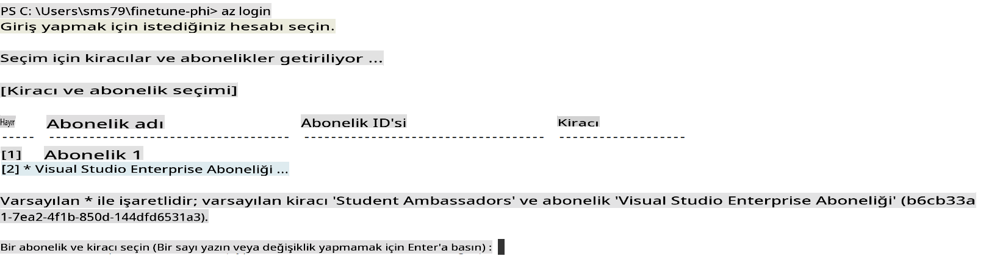

> [!TIP]
>
> Azure'a giriş yapmakta zorlanıyorsanız, bir cihaz kodu kullanmayı deneyin. Bir terminal penceresi açın ve Azure hesabınıza giriş yapmak için aşağıdaki komutu yazın:
>
> ```console
> az login --use-device-code
> ```
>

### Phi-3 Modeline İnce Ayar Yapın

Bu çalışmada, sağlanan veri setini kullanarak Phi-3 modeline ince ayar yapacaksınız. Öncelikle, *fine_tune.py* dosyasında ince ayar sürecini tanımlayacaksınız. Daha sonra, Azure Machine Learning ortamını yapılandırıp *setup_ml.py* dosyasını çalıştırarak ince ayar sürecini başlatacaksınız. Bu script, ince ayar işleminin Azure Machine Learning ortamında gerçekleşmesini sağlar.

*setup_ml.py* dosyasını çalıştırarak, ince ayar sürecini Azure Machine Learning ortamında başlatacaksınız.

#### *fine_tune.py* dosyasına kod ekleyin

1. *finetuning_dir* klasörüne gidin ve *fine_tune.py* dosyasını Visual Studio Code'da açın.

1. Aşağıdaki kodu *fine_tune.py* dosyasına ekleyin.

    ```python
    import argparse
    import sys
    import logging
    import os
    from datasets import load_dataset
    import torch
    import mlflow
    from transformers import AutoModelForCausalLM, AutoTokenizer, TrainingArguments
    from trl import SFTTrainer

    # To avoid the INVALID_PARAMETER_VALUE error in MLflow, disable MLflow integration
    os.environ["DISABLE_MLFLOW_INTEGRATION"] = "True"

    # Logging setup
    logging.basicConfig(
        format="%(asctime)s - %(levelname)s - %(name)s - %(message)s",
        datefmt="%Y-%m-%d %H:%M:%S",
        handlers=[logging.StreamHandler(sys.stdout)],
        level=logging.WARNING
    )
    logger = logging.getLogger(__name__)

    def initialize_model_and_tokenizer(model_name, model_kwargs):
        """
        Initialize the model and tokenizer with the given pretrained model name and arguments.
        """
        model = AutoModelForCausalLM.from_pretrained(model_name, **model_kwargs)
        tokenizer = AutoTokenizer.from_pretrained(model_name)
        tokenizer.model_max_length = 2048
        tokenizer.pad_token = tokenizer.unk_token
        tokenizer.pad_token_id = tokenizer.convert_tokens_to_ids(tokenizer.pad_token)
        tokenizer.padding_side = 'right'
        return model, tokenizer

    def apply_chat_template(example, tokenizer):
        """
        Apply a chat template to tokenize messages in the example.
        """
        messages = example["messages"]
        if messages[0]["role"] != "system":
            messages.insert(0, {"role": "system", "content": ""})
        example["text"] = tokenizer.apply_chat_template(
            messages, tokenize=False, add_generation_prompt=False
        )
        return example

    def load_and_preprocess_data(train_filepath, test_filepath, tokenizer):
        """
        Load and preprocess the dataset.
        """
        train_dataset = load_dataset('json', data_files=train_filepath, split='train')
        test_dataset = load_dataset('json', data_files=test_filepath, split='train')
        column_names = list(train_dataset.features)

        train_dataset = train_dataset.map(
            apply_chat_template,
            fn_kwargs={"tokenizer": tokenizer},
            num_proc=10,
            remove_columns=column_names,
            desc="Applying chat template to train dataset",
        )

        test_dataset = test_dataset.map(
            apply_chat_template,
            fn_kwargs={"tokenizer": tokenizer},
            num_proc=10,
            remove_columns=column_names,
            desc="Applying chat template to test dataset",
        )

        return train_dataset, test_dataset

    def train_and_evaluate_model(train_dataset, test_dataset, model, tokenizer, output_dir):
        """
        Train and evaluate the model.
        """
        training_args = TrainingArguments(
            bf16=True,
            do_eval=True,
            output_dir=output_dir,
            eval_strategy="epoch",
            learning_rate=5.0e-06,
            logging_steps=20,
            lr_scheduler_type="cosine",
            num_train_epochs=3,
            overwrite_output_dir=True,
            per_device_eval_batch_size=4,
            per_device_train_batch_size=4,
            remove_unused_columns=True,
            save_steps=500,
            seed=0,
            gradient_checkpointing=True,
            gradient_accumulation_steps=1,
            warmup_ratio=0.2,
        )

        trainer = SFTTrainer(
            model=model,
            args=training_args,
            train_dataset=train_dataset,
            eval_dataset=test_dataset,
            max_seq_length=2048,
            dataset_text_field="text",
            tokenizer=tokenizer,
            packing=True
        )

        train_result = trainer.train()
        trainer.log_metrics("train", train_result.metrics)

        mlflow.transformers.log_model(
            transformers_model={"model": trainer.model, "tokenizer": tokenizer},
            artifact_path=output_dir,
        )

        tokenizer.padding_side = 'left'
        eval_metrics = trainer.evaluate()
        eval_metrics["eval_samples"] = len(test_dataset)
        trainer.log_metrics("eval", eval_metrics)

    def main(train_file, eval_file, model_output_dir):
        """
        Main function to fine-tune the model.
        """
        model_kwargs = {
            "use_cache": False,
            "trust_remote_code": True,
            "torch_dtype": torch.bfloat16,
            "device_map": None,
            "attn_implementation": "eager"
        }

        # pretrained_model_name = "microsoft/Phi-3-mini-4k-instruct"
        pretrained_model_name = "microsoft/Phi-3.5-mini-instruct"

        with mlflow.start_run():
            model, tokenizer = initialize_model_and_tokenizer(pretrained_model_name, model_kwargs)
            train_dataset, test_dataset = load_and_preprocess_data(train_file, eval_file, tokenizer)
            train_and_evaluate_model(train_dataset, test_dataset, model, tokenizer, model_output_dir)

    if __name__ == "__main__":
        parser = argparse.ArgumentParser()
        parser.add_argument("--train-file", type=str, required=True, help="Path to the training data")
        parser.add_argument("--eval-file", type=str, required=True, help="Path to the evaluation data")
        parser.add_argument("--model_output_dir", type=str, required=True, help="Directory to save the fine-tuned model")
        args = parser.parse_args()
        main(args.train_file, args.eval_file, args.model_output_dir)

    ```

1. *fine_tune.py* dosyasını kaydedin ve kapatın.

> [!TIP]
> **Phi-3.5 modeline ince ayar yapabilirsiniz**
>
> *fine_tune.py* dosyasında, scriptteki `pretrained_model_name` from `"microsoft/Phi-3-mini-4k-instruct"` to any model you want to fine-tune. For example, if you change it to `"microsoft/Phi-3.5-mini-instruct"`, you'll be using the Phi-3.5-mini-instruct model for fine-tuning. To find and use the model name you prefer, visit [Hugging Face](https://huggingface.co/), search for the model you're interested in, and then copy and paste its name into the `pretrained_model_name` alanını değiştirebilirsiniz.
>
> :::image type="content" source="../../imgs/03/FineTuning-PromptFlow/finetunephi3.5.png" alt-text="Phi-3.5'e ince ayar yapın.":::
>

#### *setup_ml.py* dosyasına kod ekleyin

1. *setup_ml.py* dosyasını Visual Studio Code'da açın.

1. Aşağıdaki kodu *setup_ml.py* dosyasına ekleyin.

    ```python
    import logging
    from azure.ai.ml import MLClient, command, Input
    from azure.ai.ml.entities import Environment, AmlCompute
    from azure.identity import AzureCliCredential
    from config import (
        AZURE_SUBSCRIPTION_ID,
        AZURE_RESOURCE_GROUP_NAME,
        AZURE_ML_WORKSPACE_NAME,
        TRAIN_DATA_PATH,
        TEST_DATA_PATH
    )

    # Constants

    # Uncomment the following lines to use a CPU instance for training
    # COMPUTE_INSTANCE_TYPE = "Standard_E16s_v3" # cpu
    # COMPUTE_NAME = "cpu-e16s-v3"
    # DOCKER_IMAGE_NAME = "mcr.microsoft.com/azureml/openmpi4.1.0-ubuntu20.04:latest"

    # Uncomment the following lines to use a GPU instance for training
    COMPUTE_INSTANCE_TYPE = "Standard_NC24ads_A100_v4"
    COMPUTE_NAME = "gpu-nc24s-a100-v4"
    DOCKER_IMAGE_NAME = "mcr.microsoft.com/azureml/curated/acft-hf-nlp-gpu:59"

    CONDA_FILE = "conda.yml"
    LOCATION = "eastus2" # Replace with the location of your compute cluster
    FINETUNING_DIR = "./finetuning_dir" # Path to the fine-tuning script
    TRAINING_ENV_NAME = "phi-3-training-environment" # Name of the training environment
    MODEL_OUTPUT_DIR = "./model_output" # Path to the model output directory in azure ml

    # Logging setup to track the process
    logger = logging.getLogger(__name__)
    logging.basicConfig(
        format="%(asctime)s - %(levelname)s - %(name)s - %(message)s",
        datefmt="%Y-%m-%d %H:%M:%S",
        level=logging.WARNING
    )

    def get_ml_client():
        """
        Initialize the ML Client using Azure CLI credentials.
        """
        credential = AzureCliCredential()
        return MLClient(credential, AZURE_SUBSCRIPTION_ID, AZURE_RESOURCE_GROUP_NAME, AZURE_ML_WORKSPACE_NAME)

    def create_or_get_environment(ml_client):
        """
        Create or update the training environment in Azure ML.
        """
        env = Environment(
            image=DOCKER_IMAGE_NAME,  # Docker image for the environment
            conda_file=CONDA_FILE,  # Conda environment file
            name=TRAINING_ENV_NAME,  # Name of the environment
        )
        return ml_client.environments.create_or_update(env)

    def create_or_get_compute_cluster(ml_client, compute_name, COMPUTE_INSTANCE_TYPE, location):
        """
        Create or update the compute cluster in Azure ML.
        """
        try:
            compute_cluster = ml_client.compute.get(compute_name)
            logger.info(f"Compute cluster '{compute_name}' already exists. Reusing it for the current run.")
        except Exception:
            logger.info(f"Compute cluster '{compute_name}' does not exist. Creating a new one with size {COMPUTE_INSTANCE_TYPE}.")
            compute_cluster = AmlCompute(
                name=compute_name,
                size=COMPUTE_INSTANCE_TYPE,
                location=location,
                tier="Dedicated",  # Tier of the compute cluster
                min_instances=0,  # Minimum number of instances
                max_instances=1  # Maximum number of instances
            )
            ml_client.compute.begin_create_or_update(compute_cluster).wait()  # Wait for the cluster to be created
        return compute_cluster

    def create_fine_tuning_job(env, compute_name):
        """
        Set up the fine-tuning job in Azure ML.
        """
        return command(
            code=FINETUNING_DIR,  # Path to fine_tune.py
            command=(
                "python fine_tune.py "
                "--train-file ${{inputs.train_file}} "
                "--eval-file ${{inputs.eval_file}} "
                "--model_output_dir ${{inputs.model_output}}"
            ),
            environment=env,  # Training environment
            compute=compute_name,  # Compute cluster to use
            inputs={
                "train_file": Input(type="uri_file", path=TRAIN_DATA_PATH),  # Path to the training data file
                "eval_file": Input(type="uri_file", path=TEST_DATA_PATH),  # Path to the evaluation data file
                "model_output": MODEL_OUTPUT_DIR
            }
        )

    def main():
        """
        Main function to set up and run the fine-tuning job in Azure ML.
        """
        # Initialize ML Client
        ml_client = get_ml_client()

        # Create Environment
        env = create_or_get_environment(ml_client)
        
        # Create or get existing compute cluster
        create_or_get_compute_cluster(ml_client, COMPUTE_NAME, COMPUTE_INSTANCE_TYPE, LOCATION)

        # Create and Submit Fine-Tuning Job
        job = create_fine_tuning_job(env, COMPUTE_NAME)
        returned_job = ml_client.jobs.create_or_update(job)  # Submit the job
        ml_client.jobs.stream(returned_job.name)  # Stream the job logs
        
        # Capture the job name
        job_name = returned_job.name
        print(f"Job name: {job_name}")

    if __name__ == "__main__":
        main()

    ```

1. `COMPUTE_INSTANCE_TYPE`, `COMPUTE_NAME`, and `LOCATION` ile ilgili detayları kendi bilgilerinizle değiştirin.

    ```python
   # Uncomment the following lines to use a GPU instance for training
    COMPUTE_INSTANCE_TYPE = "Standard_NC24ads_A100_v4"
    COMPUTE_NAME = "gpu-nc24s-a100-v4"
    ...
    LOCATION = "eastus2" # Replace with the location of your compute cluster
    ```

> [!TIP]
>
> **CPU kullanarak minimal bir veri setiyle ince ayar rehberi**
>
> Eğer ince ayar için bir CPU kullanmak istiyorsanız, bu yöntem Visual Studio Enterprise Aboneliği gibi avantajlı aboneliklere sahip olanlar veya ince ayar ve dağıtım sürecini hızlı bir şekilde test etmek isteyenler için idealdir.
>
> 1. *setup_ml* dosyasını açın.
> 1. `COMPUTE_INSTANCE_TYPE`, `COMPUTE_NAME`, and `DOCKER_IMAGE_NAME` with the following. If you do not have access to *Standard_E16s_v3*, you can use an equivalent CPU instance or request a new quota.
> 1. Replace `LOCATION` ile ilgili detayları kendi bilgilerinizle değiştirin.
>
>    ```python
>    # Uncomment the following lines to use a CPU instance for training
>    COMPUTE_INSTANCE_TYPE = "Standard_E16s_v3" # cpu
>    COMPUTE_NAME = "cpu-e16s-v3"
>    DOCKER_IMAGE_NAME = "mcr.microsoft.com/azureml/openmpi4.1.0-ubuntu20.04:latest"
>    LOCATION = "eastus2" # Replace with the location of your compute cluster
>    ```
>

1. *setup_ml.py* scriptini çalıştırarak Azure Machine Learning'de ince ayar sürecini başlatmak için aşağıdaki komutu yazın.

    ```python
    python setup_ml.py
    ```

1. Bu çalışmada, Azure Machine Learning kullanarak Phi-3 modeline başarıyla ince ayar yaptınız. *setup_ml.py* scriptini çalıştırarak Azure Machine Learning ortamını kurdunuz ve *fine_tune.py* dosyasında tanımlanan ince ayar sürecini başlattınız. Lütfen ince ayar sürecinin oldukça uzun sürebileceğini unutmayın. `python setup_ml.py` command, you need to wait for the process to complete. You can monitor the status of the fine-tuning job by following the link provided in the terminal to the Azure Machine Learning portal.

    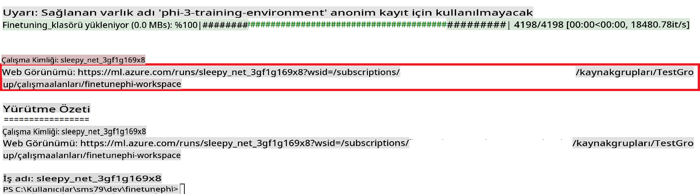

### Deploy the fine-tuned model

To integrate the fine-tuned Phi-3 model with Prompt Flow, you need to deploy the model to make it accessible for real-time inference. This process involves registering the model, creating an online endpoint, and deploying the model.

#### Set the model name, endpoint name, and deployment name for deployment

1. Open *config.py* file.

1. Replace `AZURE_MODEL_NAME = "your_fine_tuned_model_name"` with the desired name for your model.

1. Replace `AZURE_ENDPOINT_NAME = "your_fine_tuned_model_endpoint_name"` with the desired name for your endpoint.

1. Replace `AZURE_DEPLOYMENT_NAME = "your_fine_tuned_model_deployment_name"` komutunu, dağıtım için istediğiniz adlarla çalıştırın.

#### *deploy_model.py* dosyasına kod ekleyin

*deploy_model.py* dosyasını çalıştırmak, tüm dağıtım sürecini otomatikleştirir. Modeli kaydeder, bir uç nokta oluşturur ve *config.py* dosyasında belirtilen ayarlara (model adı, uç nokta adı ve dağıtım adı) göre dağıtımı gerçekleştirir.

1. *deploy_model.py* dosyasını Visual Studio Code'da açın.

1. Aşağıdaki kodu *deploy_model.py* dosyasına ekleyin.

    ```python
    import logging
    from azure.identity import AzureCliCredential
    from azure.ai.ml import MLClient
    from azure.ai.ml.entities import Model, ProbeSettings, ManagedOnlineEndpoint, ManagedOnlineDeployment, IdentityConfiguration, ManagedIdentityConfiguration, OnlineRequestSettings
    from azure.ai.ml.constants import AssetTypes

    # Configuration imports
    from config import (
        AZURE_SUBSCRIPTION_ID,
        AZURE_RESOURCE_GROUP_NAME,
        AZURE_ML_WORKSPACE_NAME,
        AZURE_MANAGED_IDENTITY_RESOURCE_ID,
        AZURE_MANAGED_IDENTITY_CLIENT_ID,
        AZURE_MODEL_NAME,
        AZURE_ENDPOINT_NAME,
        AZURE_DEPLOYMENT_NAME
    )

    # Constants
    JOB_NAME = "your-job-name"
    COMPUTE_INSTANCE_TYPE = "Standard_E4s_v3"

    deployment_env_vars = {
        "SUBSCRIPTION_ID": AZURE_SUBSCRIPTION_ID,
        "RESOURCE_GROUP_NAME": AZURE_RESOURCE_GROUP_NAME,
        "UAI_CLIENT_ID": AZURE_MANAGED_IDENTITY_CLIENT_ID,
    }

    # Logging setup
    logging.basicConfig(
        format="%(asctime)s - %(levelname)s - %(name)s - %(message)s",
        datefmt="%Y-%m-%d %H:%M:%S",
        level=logging.DEBUG
    )
    logger = logging.getLogger(__name__)

    def get_ml_client():
        """Initialize and return the ML Client."""
        credential = AzureCliCredential()
        return MLClient(credential, AZURE_SUBSCRIPTION_ID, AZURE_RESOURCE_GROUP_NAME, AZURE_ML_WORKSPACE_NAME)

    def register_model(ml_client, model_name, job_name):
        """Register a new model."""
        model_path = f"azureml://jobs/{job_name}/outputs/artifacts/paths/model_output"
        logger.info(f"Registering model {model_name} from job {job_name} at path {model_path}.")
        run_model = Model(
            path=model_path,
            name=model_name,
            description="Model created from run.",
            type=AssetTypes.MLFLOW_MODEL,
        )
        model = ml_client.models.create_or_update(run_model)
        logger.info(f"Registered model ID: {model.id}")
        return model

    def delete_existing_endpoint(ml_client, endpoint_name):
        """Delete existing endpoint if it exists."""
        try:
            endpoint_result = ml_client.online_endpoints.get(name=endpoint_name)
            logger.info(f"Deleting existing endpoint {endpoint_name}.")
            ml_client.online_endpoints.begin_delete(name=endpoint_name).result()
            logger.info(f"Deleted existing endpoint {endpoint_name}.")
        except Exception as e:
            logger.info(f"No existing endpoint {endpoint_name} found to delete: {e}")

    def create_or_update_endpoint(ml_client, endpoint_name, description=""):
        """Create or update an endpoint."""
        delete_existing_endpoint(ml_client, endpoint_name)
        logger.info(f"Creating new endpoint {endpoint_name}.")
        endpoint = ManagedOnlineEndpoint(
            name=endpoint_name,
            description=description,
            identity=IdentityConfiguration(
                type="user_assigned",
                user_assigned_identities=[ManagedIdentityConfiguration(resource_id=AZURE_MANAGED_IDENTITY_RESOURCE_ID)]
            )
        )
        endpoint_result = ml_client.online_endpoints.begin_create_or_update(endpoint).result()
        logger.info(f"Created new endpoint {endpoint_name}.")
        return endpoint_result

    def create_or_update_deployment(ml_client, endpoint_name, deployment_name, model):
        """Create or update a deployment."""

        logger.info(f"Creating deployment {deployment_name} for endpoint {endpoint_name}.")
        deployment = ManagedOnlineDeployment(
            name=deployment_name,
            endpoint_name=endpoint_name,
            model=model.id,
            instance_type=COMPUTE_INSTANCE_TYPE,
            instance_count=1,
            environment_variables=deployment_env_vars,
            request_settings=OnlineRequestSettings(
                max_concurrent_requests_per_instance=3,
                request_timeout_ms=180000,
                max_queue_wait_ms=120000
            ),
            liveness_probe=ProbeSettings(
                failure_threshold=30,
                success_threshold=1,
                period=100,
                initial_delay=500,
            ),
            readiness_probe=ProbeSettings(
                failure_threshold=30,
                success_threshold=1,
                period=100,
                initial_delay=500,
            ),
        )
        deployment_result = ml_client.online_deployments.begin_create_or_update(deployment).result()
        logger.info(f"Created deployment {deployment.name} for endpoint {endpoint_name}.")
        return deployment_result

    def set_traffic_to_deployment(ml_client, endpoint_name, deployment_name):
        """Set traffic to the specified deployment."""
        try:
            # Fetch the current endpoint details
            endpoint = ml_client.online_endpoints.get(name=endpoint_name)
            
            # Log the current traffic allocation for debugging
            logger.info(f"Current traffic allocation: {endpoint.traffic}")
            
            # Set the traffic allocation for the deployment
            endpoint.traffic = {deployment_name: 100}
            
            # Update the endpoint with the new traffic allocation
            endpoint_poller = ml_client.online_endpoints.begin_create_or_update(endpoint)
            updated_endpoint = endpoint_poller.result()
            
            # Log the updated traffic allocation for debugging
            logger.info(f"Updated traffic allocation: {updated_endpoint.traffic}")
            logger.info(f"Set traffic to deployment {deployment_name} at endpoint {endpoint_name}.")
            return updated_endpoint
        except Exception as e:
            # Log any errors that occur during the process
            logger.error(f"Failed to set traffic to deployment: {e}")
            raise


    def main():
        ml_client = get_ml_client()

        registered_model = register_model(ml_client, AZURE_MODEL_NAME, JOB_NAME)
        logger.info(f"Registered model ID: {registered_model.id}")

        endpoint = create_or_update_endpoint(ml_client, AZURE_ENDPOINT_NAME, "Endpoint for finetuned Phi-3 model")
        logger.info(f"Endpoint {AZURE_ENDPOINT_NAME} is ready.")

        try:
            deployment = create_or_update_deployment(ml_client, AZURE_ENDPOINT_NAME, AZURE_DEPLOYMENT_NAME, registered_model)
            logger.info(f"Deployment {AZURE_DEPLOYMENT_NAME} is created for endpoint {AZURE_ENDPOINT_NAME}.")

            set_traffic_to_deployment(ml_client, AZURE_ENDPOINT_NAME, AZURE_DEPLOYMENT_NAME)
            logger.info(f"Traffic is set to deployment {AZURE_DEPLOYMENT_NAME} at endpoint {AZURE_ENDPOINT_NAME}.")
        except Exception as e:
            logger.error(f"Failed to create or update deployment: {e}")

    if __name__ == "__main__":
        main()

    ```

1. `JOB_NAME`:

    - Navigate to Azure Machine Learning resource that you created.
    - Select **Studio web URL** to open the Azure Machine Learning workspace.
    - Select **Jobs** from the left side tab.
    - Select the experiment for fine-tuning. For example, *finetunephi*.
    - Select the job that you created.
    - Copy and paste your job Name into the `JOB_NAME = "your-job-name"` in *deploy_model.py* file.

1. Replace `COMPUTE_INSTANCE_TYPE` ile ilgili detayları kendi bilgilerinizle değiştirin.

1. *deploy_model.py* scriptini çalıştırarak Azure Machine Learning'de dağıtım sürecini başlatmak için aşağıdaki komutu yazın.

    ```python
    python deploy_model.py
    ```

> [!WARNING]
> Hesabınıza ek ücretler yansımaması için, Azure Machine Learning çalışma alanında oluşturulan uç noktayı silmeyi unutmayın.
>

#### Dağıtım durumunu Azure Machine Learning Çalışma Alanında Kontrol Edin

1. [Azure ML Studio](https://ml.azure.com/home?wt.mc_id=studentamb_279723) adresini ziyaret edin.

1. Oluşturduğunuz Azure Machine Learning çalışma alanına gidin.

1. **Studio web URL** seçeneğini seçerek Azure Machine Learning çalışma alanını açın.

1. Sol taraftaki sekmeden **Endpoints**'i seçin.

    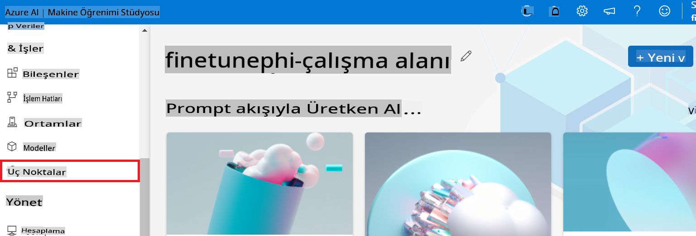

2. Oluşturduğunuz uç noktayı seçin.

    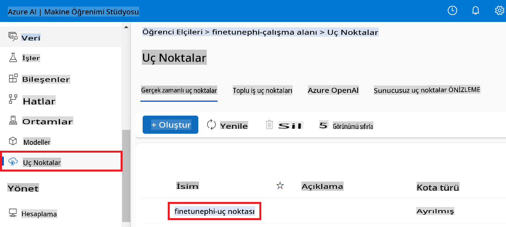

3. Bu sayfada, dağıtım süreci sırasında oluşturulan uç noktaları yönetebilirsiniz.

## Senaryo 3: Prompt Flow ile Entegre Edin ve Özel Modelinizle Sohbet Edin

### Özel Phi-3 Modelini Prompt Flow ile Entegre Edin

İnce ayar yapılmış modelinizi başarıyla dağıttıktan sonra, Prompt Flow ile entegre ederek modelinizi gerçek zamanlı uygulamalarda kullanabilirsiniz. Bu, özel Phi-3 modelinizle çeşitli etkileşimli görevleri mümkün kılar.

#### İnce Ayar Yapılmış Phi-3 Modelinin API Anahtarını ve Uç Nokta URI'sini Ayarlayın

1. Oluşturduğunuz Azure Machine Learning çalışma alanına gidin.
1. Sol taraftaki sekmeden **Endpoints**'i seçin.
1. Oluşturduğunuz uç noktayı seçin.
1. **Consume** sekmesini seçin.
1. **REST endpoint** değerini kopyalayıp *config.py* dosyasına yapıştırın. `AZURE_ML_ENDPOINT = "your_fine_tuned_model_endpoint_uri"` with your **REST endpoint**.
1. Copy and paste your **Primary key** into the *config.py* file, replacing `AZURE_ML_API_KEY = "your_fine_tuned_model_api_key"` değerlerini **Primary key** ile değiştirin.

    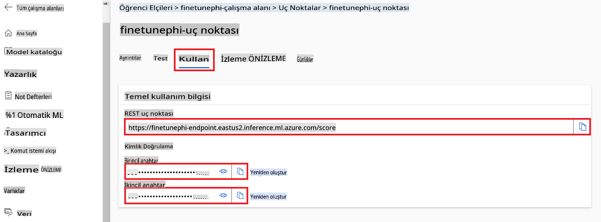

#### *flow.dag.yml* dosyasına kod ekleyin

1. *flow.dag.yml* dosyasını Visual Studio Code'da açın.

1. Aşağıdaki kodu *flow.dag.yml* dosyasına ekleyin.

    ```yml
    inputs:
      input_data:
        type: string
        default: "Who founded Microsoft?"

    outputs:
      answer:
        type: string
        reference: ${integrate_with_promptflow.output}

    nodes:
    - name: integrate_with_promptflow
      type: python
      source:
        type: code
        path: integrate_with_promptflow.py
      inputs:
        input_data: ${inputs.input_data}
    ```

#### *integrate_with_promptflow.py* dosyasına kod ekleyin

1. *integrate_with_promptflow.py* dosyasını Visual Studio Code'da açın.

1. Aşağıdaki kodu *integrate_with_promptflow.py* dosyasına ekleyin.

    ```python
    import logging
    import requests
    from promptflow.core import tool
    import asyncio
    import platform
    from config import (
        AZURE_ML_ENDPOINT,
        AZURE_ML_API_KEY
    )

    # Logging setup
    logging.basicConfig(
        format="%(asctime)s - %(levelname)s - %(name)s - %(message)s",
        datefmt="%Y-%m-%d %H:%M:%S",
        level=logging.DEBUG
    )
    logger = logging.getLogger(__name__)

    def query_azml_endpoint(input_data: list, endpoint_url: str, api_key: str) -> str:
        """
        Send a request to the Azure ML endpoint with the given input data.
        """
        headers = {
            "Content-Type": "application/json",
            "Authorization": f"Bearer {api_key}"
        }
        data = {
            "input_data": [input_data],
            "params": {
                "temperature": 0.7,
                "max_new_tokens": 128,
                "do_sample": True,
                "return_full_text": True
            }
        }
        try:
            response = requests.post(endpoint_url, json=data, headers=headers)
            response.raise_for_status()
            result = response.json()[0]
            logger.info("Successfully received response from Azure ML Endpoint.")
            return result
        except requests.exceptions.RequestException as e:
            logger.error(f"Error querying Azure ML Endpoint: {e}")
            raise

    def setup_asyncio_policy():
        """
        Setup asyncio event loop policy for Windows.
        """
        if platform.system() == 'Windows':
            asyncio.set_event_loop_policy(asyncio.WindowsSelectorEventLoopPolicy())
            logger.info("Set Windows asyncio event loop policy.")

    @tool
    def my_python_tool(input_data: str) -> str:
        """
        Tool function to process input data and query the Azure ML endpoint.
        """
        setup_asyncio_policy()
        return query_azml_endpoint(input_data, AZURE_ML_ENDPOINT, AZURE_ML_API_KEY)

    ```

### Özel Modelinizle Sohbet Edin

1. *deploy_model.py* scriptini çalıştırarak Azure Machine Learning'de dağıtım sürecini başlatmak için aşağıdaki komutu yazın.

    ```python
    pf flow serve --source ./ --port 8080 --host localhost
    ```

1. İşte sonuçlara bir örnek: Artık özel Phi-3 modelinizle sohbet edebilirsiniz. İnce ayar için kullanılan verilere dayalı sorular sormanız önerilir.

    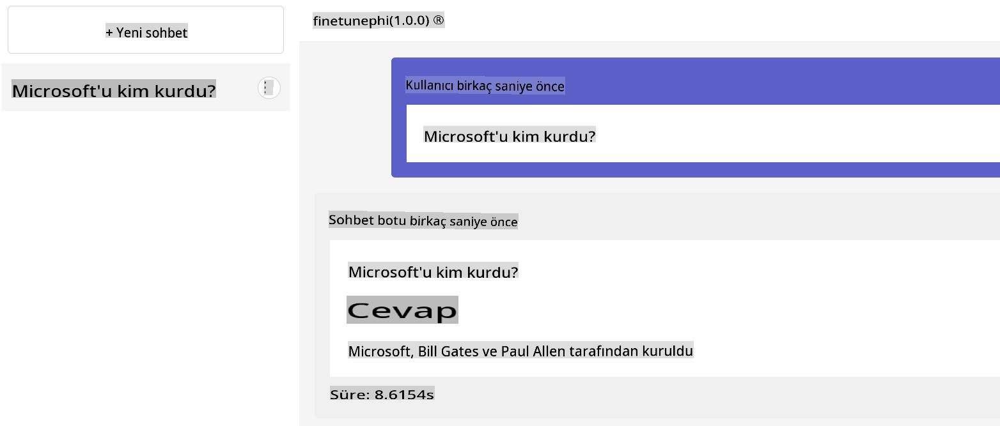

**Feragatname**:  
Bu belge, makine tabanlı yapay zeka çeviri hizmetleri kullanılarak çevrilmiştir. Doğruluk için çaba göstersek de, otomatik çevirilerin hata veya yanlışlıklar içerebileceğini lütfen unutmayın. Belgenin orijinal diliyle yazılmış hali, bağlayıcı kaynak olarak kabul edilmelidir. Kritik bilgiler için profesyonel bir insan çevirisi önerilir. Bu çevirinin kullanımından kaynaklanan yanlış anlama veya yorumlamalardan sorumlu değiliz.