# Azure AI Foundry'de Prompt Flow ile Özel Phi-3 Modellerini İnce Ayar Yapma ve Entegre Etme

Bu uçtan uca (E2E) örnek, Microsoft Tech Community'deki "[Azure AI Foundry'de Prompt Flow ile Özel Phi-3 Modellerini İnce Ayar Yapma ve Entegre Etme](https://techcommunity.microsoft.com/t5/educator-developer-blog/fine-tune-and-integrate-custom-phi-3-models-with-prompt-flow-in/ba-p/4191726?WT.mc_id=aiml-137032-kinfeylo)" rehberine dayanmaktadır. Özel Phi-3 modellerinin ince ayar yapılması, dağıtılması ve Prompt Flow ile entegre edilmesi süreçlerini tanıtmaktadır.  
Bu öğretici, "[Prompt Flow ile Özel Phi-3 Modellerini İnce Ayar Yapma ve Entegre Etme](./E2E_Phi-3-FineTuning_PromptFlow_Integration.md)" başlıklı E2E örneğinden farklı olarak, kodun yerel olarak çalıştırılmasını değil, modelinizin tamamen Azure AI / ML Studio içinde ince ayar yapılmasını ve entegre edilmesini ele alır.

## Genel Bakış

Bu E2E örneğinde, Phi-3 modeline nasıl ince ayar yapılacağını ve Azure AI Foundry'de Prompt Flow ile nasıl entegre edileceğini öğreneceksiniz. Azure AI / ML Studio'yu kullanarak, özel AI modellerini dağıtmak ve kullanmak için bir iş akışı oluşturacaksınız. Bu E2E örneği üç senaryoya ayrılmıştır:

**Senaryo 1: Azure kaynaklarını kurma ve ince ayar için hazırlık yapma**

**Senaryo 2: Phi-3 modeline ince ayar yapma ve Azure Machine Learning Studio'da dağıtma**

**Senaryo 3: Prompt Flow ile entegre etme ve Azure AI Foundry'de özel modelinizle sohbet etme**

Bu E2E örneğinin genel bir görünümü aşağıda verilmiştir.

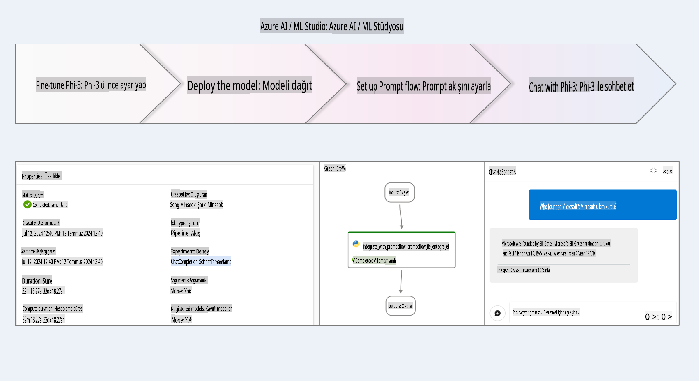

### İçindekiler

1. **[Senaryo 1: Azure kaynaklarını kurma ve ince ayar için hazırlık yapma](../../../../../../md/02.Application/01.TextAndChat/Phi3)**  
    - [Azure Machine Learning Çalışma Alanı oluşturma](../../../../../../md/02.Application/01.TextAndChat/Phi3)  
    - [Azure Aboneliğinde GPU kotaları talep etme](../../../../../../md/02.Application/01.TextAndChat/Phi3)  
    - [Rol ataması ekleme](../../../../../../md/02.Application/01.TextAndChat/Phi3)  
    - [Projeyi kurma](../../../../../../md/02.Application/01.TextAndChat/Phi3)  
    - [İnce ayar için veri kümesini hazırlama](../../../../../../md/02.Application/01.TextAndChat/Phi3)  

1. **[Senaryo 2: Phi-3 modeline ince ayar yapma ve Azure Machine Learning Studio'da dağıtma](../../../../../../md/02.Application/01.TextAndChat/Phi3)**  
    - [Phi-3 modeline ince ayar yapma](../../../../../../md/02.Application/01.TextAndChat/Phi3)  
    - [İnce ayar yapılmış Phi-3 modelini dağıtma](../../../../../../md/02.Application/01.TextAndChat/Phi3)  

1. **[Senaryo 3: Prompt Flow ile entegre etme ve Azure AI Foundry'de özel modelinizle sohbet etme](../../../../../../md/02.Application/01.TextAndChat/Phi3)**  
    - [Özel Phi-3 modelini Prompt Flow ile entegre etme](../../../../../../md/02.Application/01.TextAndChat/Phi3)  
    - [Özel Phi-3 modelinizle sohbet etme](../../../../../../md/02.Application/01.TextAndChat/Phi3)  

## Senaryo 1: Azure kaynaklarını kurma ve ince ayar için hazırlık yapma

### Azure Machine Learning Çalışma Alanı oluşturma

1. Portal sayfasının üst kısmındaki **arama çubuğuna** *azure machine learning* yazın ve çıkan seçeneklerden **Azure Machine Learning**'i seçin.

    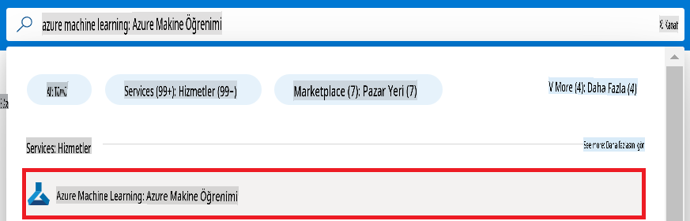

2. Gezinti menüsünden **+ Oluştur** seçeneğini seçin.

3. Gezinti menüsünden **Yeni çalışma alanı** seçeneğini seçin.

    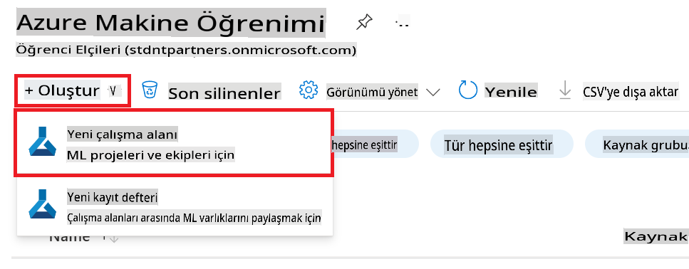

4. Aşağıdaki görevleri gerçekleştirin:

    - Azure **Aboneliğinizi** seçin.
    - Kullanmak istediğiniz **Kaynak grubunu** seçin (gerekirse yeni bir tane oluşturun).
    - **Çalışma Alanı Adı** girin. Bu değer benzersiz olmalıdır.
    - Kullanmak istediğiniz **Bölgeyi** seçin.
    - Kullanmak istediğiniz **Depolama hesabını** seçin (gerekirse yeni bir tane oluşturun).
    - Kullanmak istediğiniz **Anahtar kasasını** seçin (gerekirse yeni bir tane oluşturun).
    - Kullanmak istediğiniz **Uygulama içgörülerini** seçin (gerekirse yeni bir tane oluşturun).
    - Kullanmak istediğiniz **Kapsayıcı kaydını** seçin (gerekirse yeni bir tane oluşturun).

    

5. **Gözden Geçir + Oluştur** seçeneğini seçin.

6. **Oluştur** seçeneğini seçin.

### Azure Aboneliğinde GPU kotaları talep etme

Bu öğreticide, Phi-3 modeline ince ayar yapmayı ve bir GPU kullanarak dağıtmayı öğreneceksiniz. İnce ayar için *Standard_NC24ads_A100_v4* GPU'sunu kullanacaksınız, bu da bir kota talebi gerektirir. Dağıtım için ise *Standard_NC6s_v3* GPU'sunu kullanacaksınız, bu da bir kota talebi gerektirir.

> [!NOTE]  
> Yalnızca Kullan-Öde abonelikleri (standart abonelik türü) GPU tahsisi için uygundur; avantaj abonelikleri şu anda desteklenmemektedir.

1. [Azure ML Studio](https://ml.azure.com/home?wt.mc_id=studentamb_279723) adresini ziyaret edin.

1. *Standard NCADSA100v4 Family* kotası talep etmek için şu görevleri gerçekleştirin:

    - Sol taraftaki sekmeden **Kota** seçeneğini seçin.
    - Kullanmak istediğiniz **Sanal makine ailesini** seçin. Örneğin, *Standard NCADSA100v4 Family Cluster Dedicated vCPUs* seçeneğini seçin, bu *Standard_NC24ads_A100_v4* GPU'yu içerir.
    - Gezinti menüsünden **Kota talep et** seçeneğini seçin.

        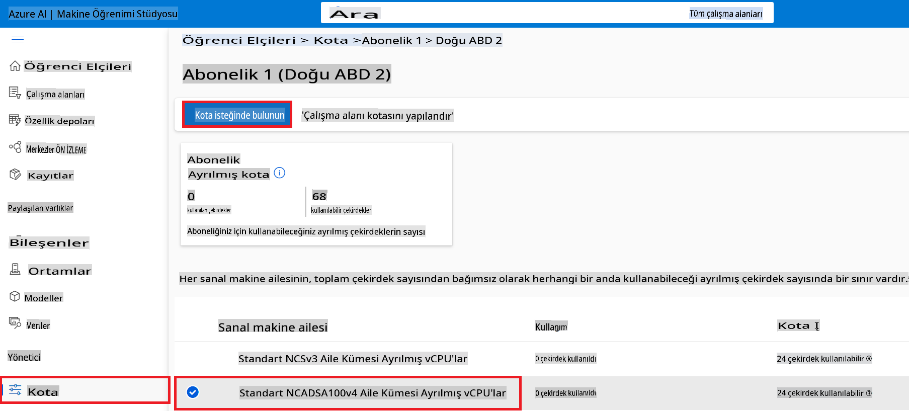

    - Kota talep etme sayfasında, kullanmak istediğiniz **Yeni çekirdek limiti** değerini girin. Örneğin, 24.
    - Kota talep etme sayfasında **Gönder** seçeneğini seçerek GPU kotasını talep edin.

1. *Standard NCSv3 Family* kotası talep etmek için şu görevleri gerçekleştirin:

    - Sol taraftaki sekmeden **Kota** seçeneğini seçin.
    - Kullanmak istediğiniz **Sanal makine ailesini** seçin. Örneğin, *Standard NCSv3 Family Cluster Dedicated vCPUs* seçeneğini seçin, bu *Standard_NC6s_v3* GPU'yu içerir.
    - Gezinti menüsünden **Kota talep et** seçeneğini seçin.
    - Kota talep etme sayfasında, kullanmak istediğiniz **Yeni çekirdek limiti** değerini girin. Örneğin, 24.
    - Kota talep etme sayfasında **Gönder** seçeneğini seçerek GPU kotasını talep edin.

### Rol ataması ekleme

Modellerinizi ince ayar yapmak ve dağıtmak için önce bir Kullanıcı Atamalı Yönetilen Kimlik (UAI) oluşturmanız ve uygun izinleri atamanız gerekir. Bu UAI, dağıtım sırasında kimlik doğrulama için kullanılacaktır.

#### Kullanıcı Atamalı Yönetilen Kimlik (UAI) Oluşturma

1. Portal sayfasının üst kısmındaki **arama çubuğuna** *managed identities* yazın ve çıkan seçeneklerden **Yönetilen Kimlikler**'i seçin.

    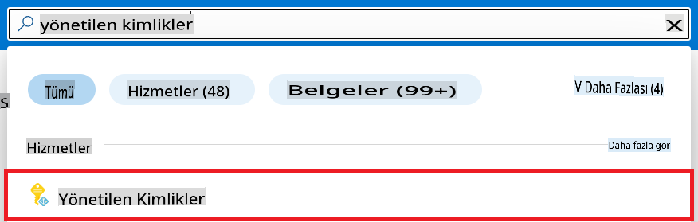

1. **+ Oluştur** seçeneğini seçin.

    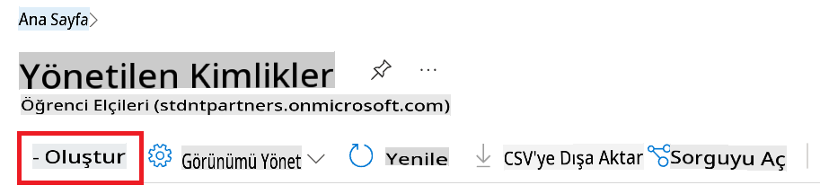

1. Aşağıdaki görevleri gerçekleştirin:

    - Azure **Aboneliğinizi** seçin.
    - Kullanmak istediğiniz **Kaynak grubunu** seçin (gerekirse yeni bir tane oluşturun).
    - Kullanmak istediğiniz **Bölgeyi** seçin.
    - **Ad** girin. Bu değer benzersiz olmalıdır.

    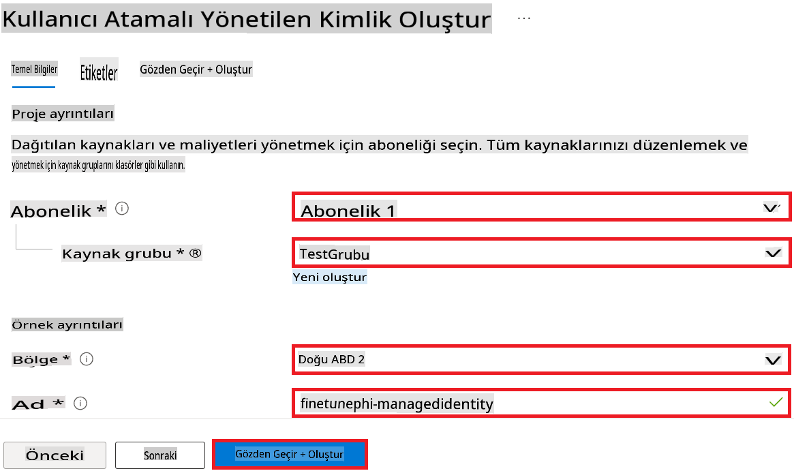

1. **Gözden Geçir + Oluştur** seçeneğini seçin.

1. **+ Oluştur** seçeneğini seçin.

#### Yönetilen Kimlik için Katkıda Bulunan Rol Ataması Ekleme

1. Oluşturduğunuz Yönetilen Kimlik kaynağına gidin.

1. Sol taraftaki sekmeden **Azure rol atamaları** seçeneğini seçin.

1. Gezinti menüsünden **+Rol ataması ekle** seçeneğini seçin.

1. Rol atama sayfasında şu görevleri gerçekleştirin:
    - **Kapsamı** **Kaynak grubu** olarak seçin.
    - Azure **Aboneliğinizi** seçin.
    - Kullanmak istediğiniz **Kaynak grubunu** seçin.
    - **Rolü** **Katkıda Bulunan** olarak seçin.

    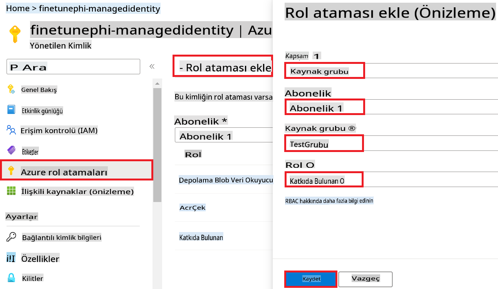

2. **Kaydet** seçeneğini seçin. 

#### Storage Blob Veri Okuyucu Rol Ataması Ekleme

1. Portalın üst kısmındaki **arama çubuğuna** *storage accounts* yazın ve çıkan seçeneklerden **Depolama hesapları**'nı seçin.

    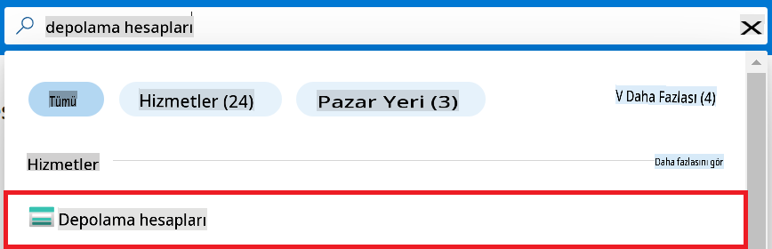

1. Azure Machine Learning çalışma alanınızla ilişkili depolama hesabını seçin. Örneğin, *finetunephistorage*.

1. Rol atama sayfasına gitmek için şu görevleri gerçekleştirin:

    - Oluşturduğunuz Azure Depolama hesabına gidin.
    - Sol taraftaki sekmeden **Erişim Kontrolü (IAM)** seçeneğini seçin.
    - Gezinti menüsünden **+ Ekle** seçeneğini seçin.
    - Gezinti menüsünden **Rol ataması ekle** seçeneğini seçin.

    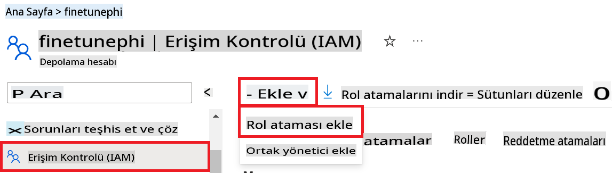

1. Rol atama sayfasında şu görevleri gerçekleştirin:

    - Rol sayfasında **Storage Blob Veri Okuyucu** yazın ve çıkan seçeneklerden **Storage Blob Veri Okuyucu**'yu seçin.
    - Rol sayfasında **İleri** seçeneğini seçin.
    - Üyeler sayfasında **Erişim atamasını** **Yönetilen kimlik** olarak seçin.
    - Üyeler sayfasında **+ Üyeleri seç** seçeneğini seçin.
    - Yönetilen kimlikleri seç sayfasında Azure **Aboneliğinizi** seçin.
    - Yönetilen kimlikleri seç sayfasında **Yönetilen kimliği** seçin.
    - Yönetilen kimlikleri seç sayfasında oluşturduğunuz Yönetilen Kimliği seçin. Örneğin, *finetunephi-managedidentity*.
    - Yönetilen kimlikleri seç sayfasında **Seç** seçeneğini seçin.

    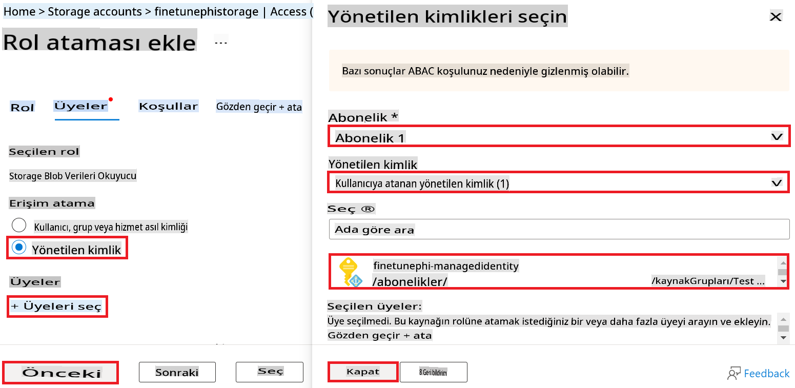

1. **Gözden Geçir + Ata** seçeneğini seçin. 

#### AcrPull Rol Ataması Ekleme

1. Portalın üst kısmındaki **arama çubuğuna** *container registries* yazın ve çıkan seçeneklerden **Kapsayıcı kayıtları**'nı seçin.

    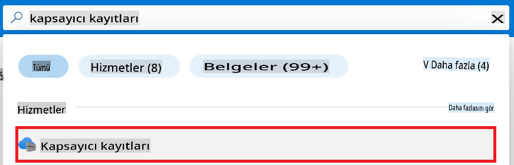

1. Azure Machine Learning çalışma alanınızla ilişkili kapsayıcı kaydını seçin. Örneğin, *finetunephicontainerregistry*.

1. Rol atama sayfasına gitmek için şu görevleri gerçekleştirin:

    - Sol taraftaki sekmeden **Erişim Kontrolü (IAM)** seçeneğini seçin.
    - Gezinti menüsünden **+ Ekle** seçeneğini seçin.
    - Gezinti menüsünden **Rol ataması ekle** seçeneğini seçin.

1. Rol atama sayfasında şu görevleri gerçekleştirin:

    - Rol sayfasında **AcrPull** yazın ve çıkan seçeneklerden **AcrPull**'u seçin.
    - Rol sayfasında **İleri** seçeneğini seçin.
    - Üyeler sayfasında **Erişim atamasını** **Yönetilen kimlik** olarak seçin.
    - Üyeler sayfasında **+ Üyeleri seç** seçeneğini seçin.
    - Yönetilen kimlikleri seç sayfasında Azure **Aboneliğinizi** seçin.
    - Yönetilen kimlikleri seç sayfasında **Yönetilen kimliği** seçin.
    - Yönetilen kimlikleri seç sayfasında oluşturduğunuz Yönetilen Kimliği seçin. Örneğin, *finetunephi-managedidentity*.
    - Yönetilen kimlikleri seç sayfasında **Seç** seçeneğini seçin.
    - **Gözden Geçir + Ata** seçeneğini seçin.

### Projeyi Kurma

İnce ayar için gereken veri kümelerini indirmek amacıyla bir yerel ortam oluşturacaksınız.

Bu alıştırmada şunları yapacaksınız:

- Çalışmak için bir klasör oluşturma.
- Bir sanal ortam oluşturma.
- Gerekli paketleri yükleme.
- Veri setini indirmek için bir *download_dataset.py* dosyası oluşturma.

#### Çalışmak için bir klasör oluşturma

1. Bir terminal penceresi açın ve varsayılan yolda *finetune-phi* adlı bir klasör oluşturmak için aşağıdaki komutu yazın:

    ```console
    mkdir finetune-phi
    ```

2. Oluşturduğunuz *finetune-phi* klasörüne gitmek için terminalinize şu komutu yazın:

    ```console
    cd finetune-phi
    ```

#### Sanal ortam oluşturma

1. Terminalinize aşağıdaki komutu yazarak *.venv* adlı bir sanal ortam oluşturun:

    ```console
    python -m venv .venv
    ```

2. Terminalinize aşağıdaki komutu yazarak sanal ortamı etkinleştirin:

    ```console
    .venv\Scripts\activate.bat
    ```

> [!NOTE]  
> Eğer çalıştıysa, komut isteminden önce *(.venv)* görmelisiniz.

#### Gerekli paketleri yükleme

1. Terminalinize aşağıdaki komutları yazarak gerekli paketleri yükleyin:

    ```console
    pip install datasets==2.19.1
    ```

#### `download_dataset.py` Oluşturma

> [!NOTE]  
> Tam klasör yapısı:  
>
> ```text
> └── YourUserName
> .    └── finetune-phi
> .        └── download_dataset.py
> ```

1. **Visual Studio Code**'u açın.

1. Menü çubuğundan **Dosya** seçeneğini seçin.

1. **Klasör Aç** seçeneğini seçin.

1. *C:\Users\yourUserName\finetune-phi* konumunda oluşturduğunuz *finetune-phi* klasörünü seçin.

    

1. Visual Studio Code'un sol panelinde sağ tıklayın ve **Yeni Dosya** seçeneğini seçerek *download_dataset.py* adlı yeni bir dosya oluşturun.

    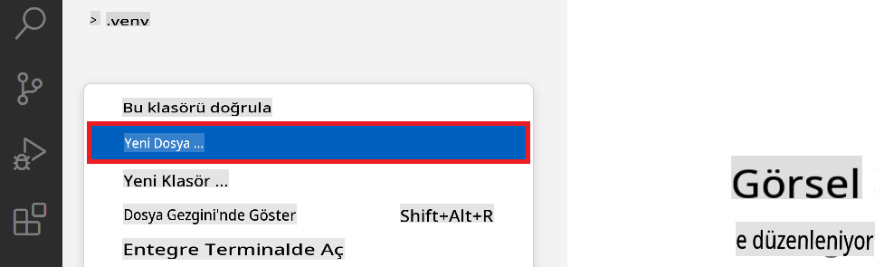

### İnce Ayar için Veri Kümesini Hazırlama

Bu alıştırmada, *download_dataset.py* dosyasını çalıştırarak *ultrachat_200k* veri kümelerini yerel ortamınıza indireceksiniz. Daha sonra bu veri kümelerini Azure Machine Learning'de Phi-3 modeline ince ayar yapmak için kullanacaksınız.

Bu alıştırmada şunları yapacaksınız:

- Veri kümelerini indirmek için *download_dataset.py* dosyasına kod ekleme.
- Veri kümelerini yerel ortamınıza indirmek için *download_dataset.py* dosyasını çalıştırma.

#### *download_dataset.py* Kullanarak Veri Kümen
1. [Azure ML Studio](https://ml.azure.com/home?wt.mc_id=studentamb_279723) adresini ziyaret edin.

1. Sol taraftaki sekmeden **Hesaplama** seçeneğini seçin.

1. Navigasyon menüsünden **Hesaplama kümeleri** seçeneğini seçin.

1. **+ Yeni** seçeneğini seçin.

    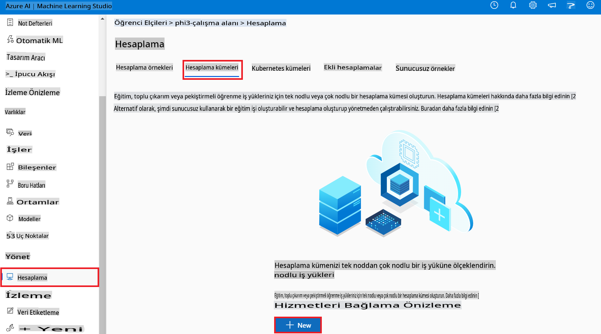

1. Aşağıdaki görevleri gerçekleştirin:

    - Kullanmak istediğiniz **Bölge**yi seçin.
    - **Sanal makine katmanı**nı **Dedicated** olarak ayarlayın.
    - **Sanal makine türü**nü **GPU** olarak ayarlayın.
    - **Sanal makine boyutu** filtresini **Tüm seçeneklerden seç** olarak ayarlayın.
    - **Sanal makine boyutu**nu **Standard_NC24ads_A100_v4** olarak seçin.

    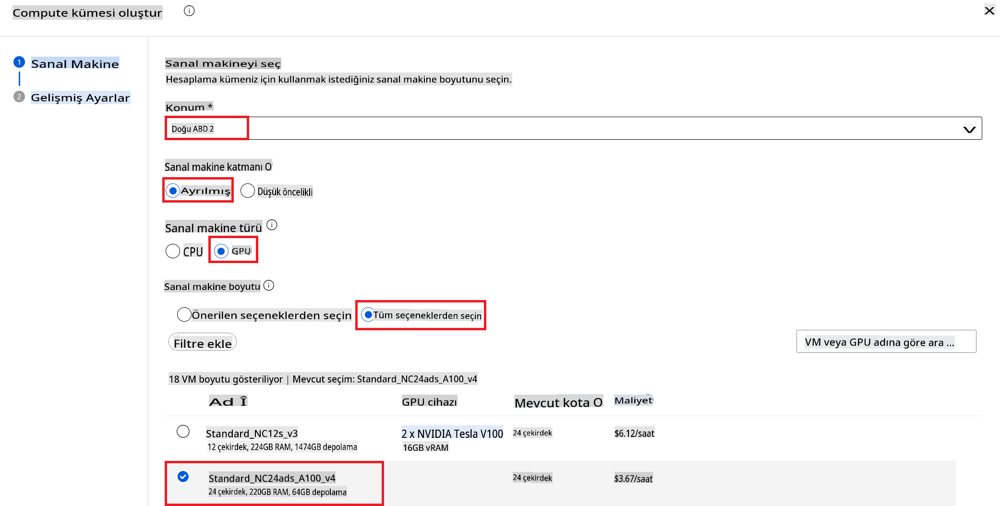

1. **İleri** seçeneğini seçin.

1. Aşağıdaki görevleri gerçekleştirin:

    - **Hesaplama adı** girin. Bu değer benzersiz olmalıdır.
    - **Düğüm sayısı (minimum)** değerini **0** olarak ayarlayın.
    - **Düğüm sayısı (maksimum)** değerini **1** olarak ayarlayın.
    - **İndirgenmeden önceki boşta geçen saniye** değerini **120** olarak ayarlayın.

    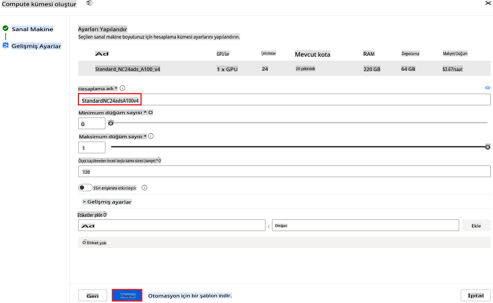

1. **Oluştur** seçeneğini seçin.

#### Phi-3 Modelini İnce Ayar Yapma

1. [Azure ML Studio](https://ml.azure.com/home?wt.mc_id=studentamb_279723) adresini ziyaret edin.

1. Oluşturduğunuz Azure Machine Learning çalışma alanını seçin.

    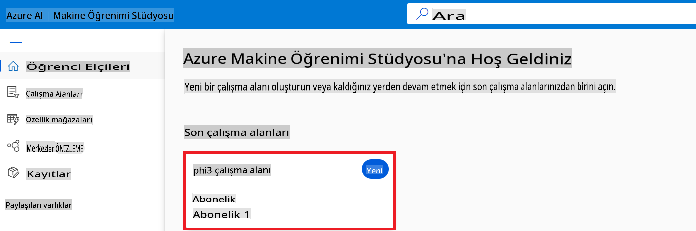

1. Aşağıdaki görevleri gerçekleştirin:

    - Sol taraftaki sekmeden **Model kataloğu** seçeneğini seçin.
    - **Arama çubuğu**na *phi-3-mini-4k* yazın ve çıkan seçeneklerden **Phi-3-mini-4k-instruct** modelini seçin.

    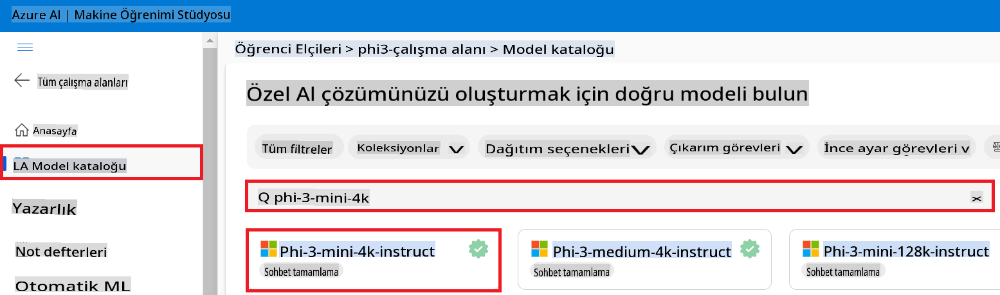

1. Navigasyon menüsünden **İnce ayar yap** seçeneğini seçin.

    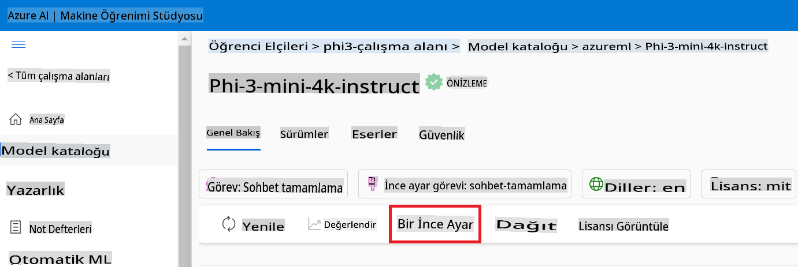

1. Aşağıdaki görevleri gerçekleştirin:

    - **Görev türü seçin** kısmını **Sohbet tamamlama** olarak ayarlayın.
    - **+ Veri seç** seçeneğini seçerek **Eğitim verilerini** yükleyin.
    - Doğrulama veri yükleme türünü **Farklı doğrulama verisi sağlayın** olarak ayarlayın.
    - **+ Veri seç** seçeneğini seçerek **Doğrulama verilerini** yükleyin.

    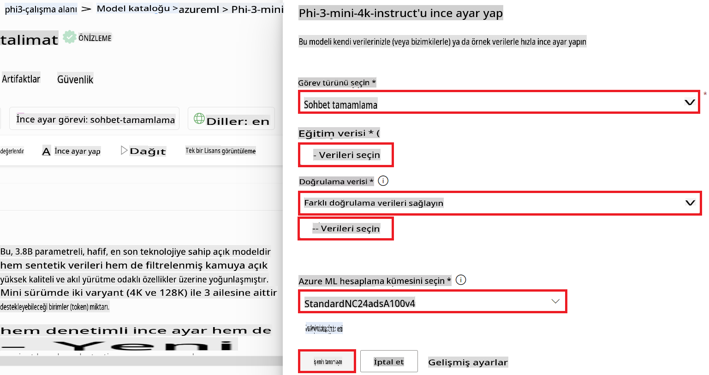

    > [!TIP]
    >
    > **Gelişmiş ayarlar** seçeneğini belirleyerek, ince ayar sürecini özel ihtiyaçlarınıza göre optimize etmek için **learning_rate** ve **lr_scheduler_type** gibi yapılandırmaları özelleştirebilirsiniz.

1. **Bitir** seçeneğini seçin.

1. Bu alıştırmada, Azure Machine Learning kullanarak Phi-3 modeline başarıyla ince ayar yaptınız. Lütfen ince ayar sürecinin oldukça uzun sürebileceğini unutmayın. İnce ayar işi çalıştırıldıktan sonra tamamlanmasını beklemeniz gerekecek. İnce ayar işinin durumunu, Azure Machine Learning Çalışma Alanınızdaki sol taraftaki **İşler** sekmesine giderek izleyebilirsiniz. Bir sonraki seride, ince ayar yapılan modeli dağıtacak ve Prompt flow ile entegre edeceksiniz.

    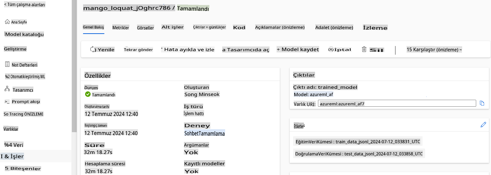

### İnce Ayar Yapılmış Phi-3 Modelini Dağıtma

İnce ayar yapılmış Phi-3 modelini Prompt flow ile entegre etmek için modeli gerçek zamanlı tahminler için erişilebilir hale getirmek üzere dağıtmanız gerekir. Bu işlem, modeli kaydetmeyi, bir çevrimiçi uç nokta oluşturmayı ve modeli dağıtmayı içerir.

Bu alıştırmada:

- İnce ayar yapılmış modeli Azure Machine Learning çalışma alanına kaydedeceksiniz.
- Bir çevrimiçi uç nokta oluşturacaksınız.
- Kayıtlı ince ayar yapılmış Phi-3 modelini dağıtacaksınız.

#### İnce Ayar Yapılmış Modeli Kaydetme

1. [Azure ML Studio](https://ml.azure.com/home?wt.mc_id=studentamb_279723) adresini ziyaret edin.

1. Oluşturduğunuz Azure Machine Learning çalışma alanını seçin.

    

1. Sol taraftaki sekmeden **Modeller** seçeneğini seçin.  
1. **+ Kaydet** seçeneğini seçin.  
1. **Bir iş çıktısından** seçeneğini seçin.

    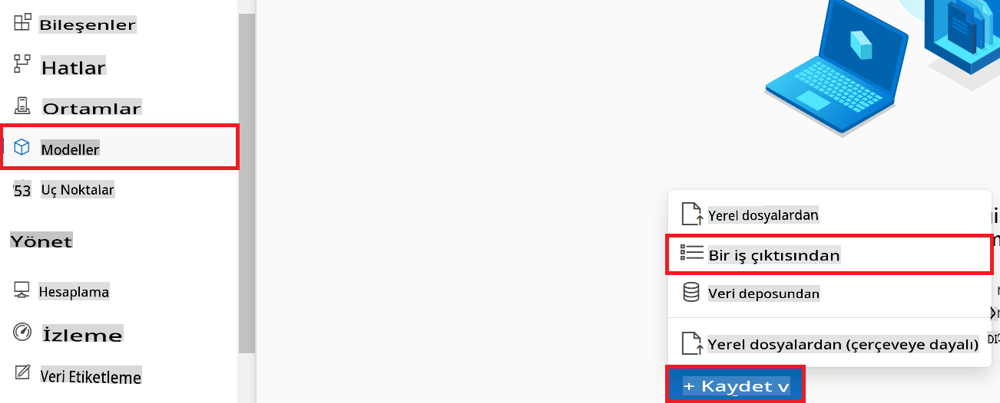

1. Oluşturduğunuz işi seçin.

    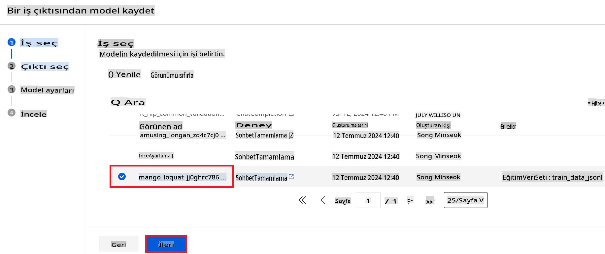

1. **İleri** seçeneğini seçin.

1. **Model türü**nü **MLflow** olarak seçin.

1. **İş çıktısı**nın seçili olduğundan emin olun; bu otomatik olarak seçilmiş olmalıdır.

    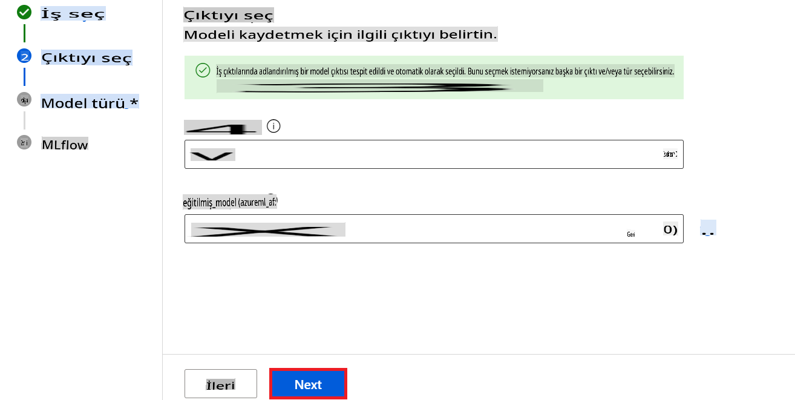

2. **İleri** seçeneğini seçin.

3. **Kaydet** seçeneğini seçin.

    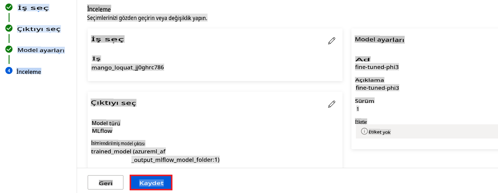

4. Sol taraftaki sekmeden **Modeller** menüsüne giderek kaydedilen modelinizi görüntüleyebilirsiniz.

    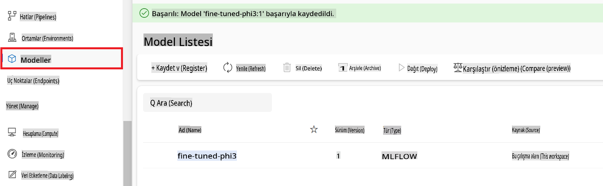

#### İnce Ayar Yapılmış Modeli Dağıtma

1. Oluşturduğunuz Azure Machine Learning çalışma alanına gidin.

1. Sol taraftaki sekmeden **Uç Noktalar** seçeneğini seçin.

1. Navigasyon menüsünden **Gerçek zamanlı uç noktalar** seçeneğini seçin.

    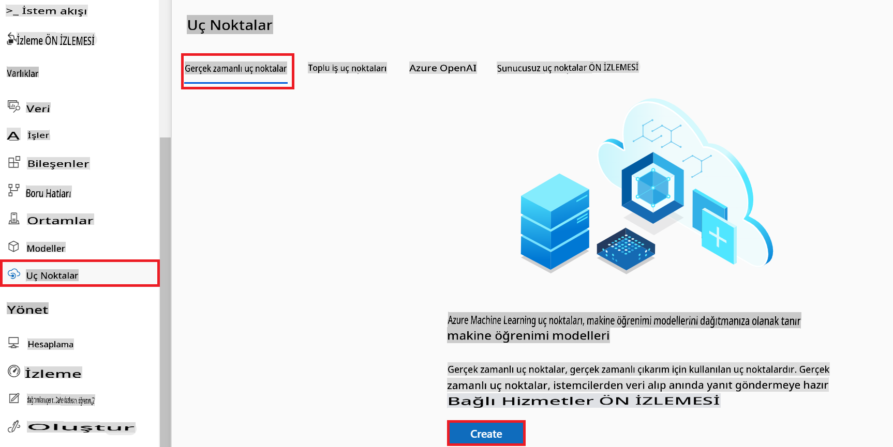

1. **Oluştur** seçeneğini seçin.

1. Oluşturduğunuz kayıtlı modeli seçin.

    

1. **Seç** seçeneğini seçin.

1. Aşağıdaki görevleri gerçekleştirin:

    - **Sanal makine**yi *Standard_NC6s_v3* olarak seçin.
    - Kullanmak istediğiniz **Örnek sayısı**nı seçin. Örneğin, *1*.
    - **Uç Nokta**yı **Yeni** olarak seçerek bir uç nokta oluşturun.
    - **Uç nokta adı** girin. Bu değer benzersiz olmalıdır.
    - **Dağıtım adı** girin. Bu değer benzersiz olmalıdır.

    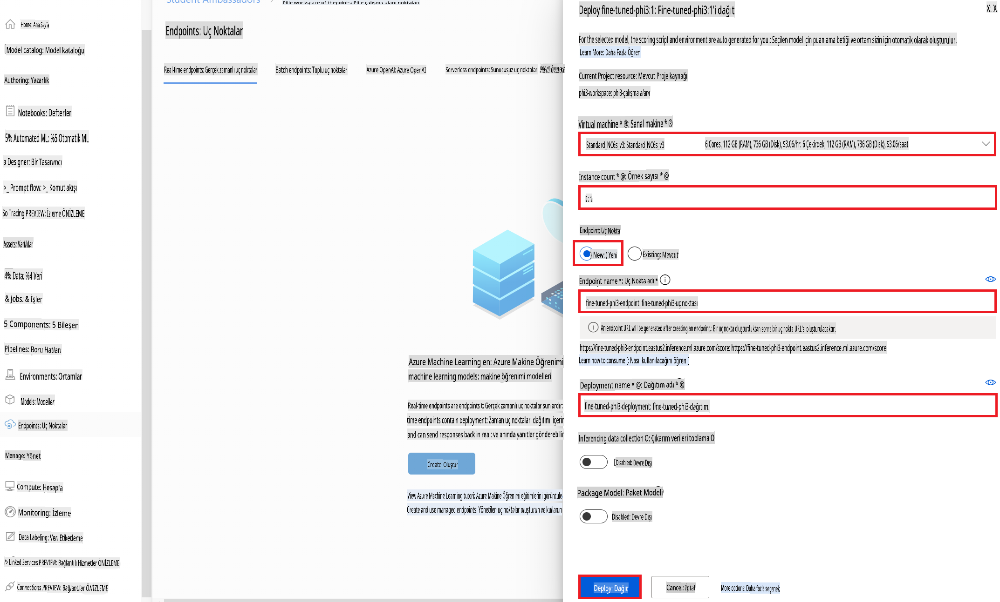

1. **Dağıt** seçeneğini seçin.

> [!WARNING]
> Hesabınıza ek ücret yansımaması için Azure Machine Learning çalışma alanında oluşturduğunuz uç noktayı silmeyi unutmayın.
>

#### Azure Machine Learning Çalışma Alanında Dağıtım Durumunu Kontrol Etme

1. Oluşturduğunuz Azure Machine Learning çalışma alanına gidin.

1. Sol taraftaki sekmeden **Uç Noktalar** seçeneğini seçin.

1. Oluşturduğunuz uç noktayı seçin.

    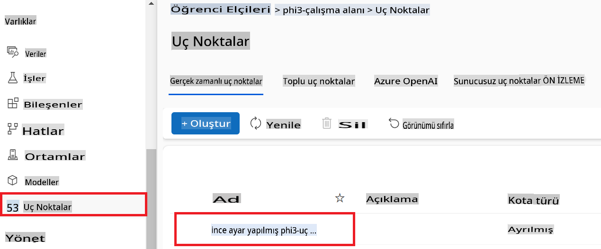

1. Bu sayfadan, dağıtım süreci sırasında uç noktaları yönetebilirsiniz.

> [!NOTE]
> Dağıtım tamamlandıktan sonra, **Canlı trafik**in **%100** olarak ayarlandığından emin olun. Eğer değilse, trafik ayarlarını güncellemek için **Trafiği güncelle** seçeneğini seçin. Trafik %0 olarak ayarlanmışsa modeli test edemezsiniz.
>
> 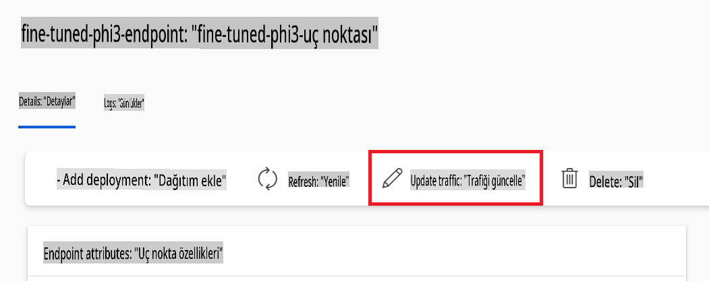
>

## Senaryo 3: Prompt Flow ile Entegre Edin ve Azure AI Foundry'de Özelleştirilmiş Modelinizle Sohbet Edin

### Özelleştirilmiş Phi-3 Modelini Prompt Flow ile Entegre Etme

İnce ayar yapılmış modelinizi başarıyla dağıttıktan sonra, Prompt Flow ile entegre ederek modelinizi gerçek zamanlı uygulamalarda kullanabilirsiniz. Bu, özelleştirilmiş Phi-3 modelinizle çeşitli etkileşimli görevleri gerçekleştirmenizi sağlar.

Bu alıştırmada:

- Azure AI Foundry Hub oluşturacaksınız.
- Azure AI Foundry Projesi oluşturacaksınız.
- Prompt Flow oluşturacaksınız.
- İnce ayar yapılmış Phi-3 modeli için özel bir bağlantı ekleyeceksiniz.
- Prompt Flow'u özelleştirilmiş Phi-3 modelinizle sohbet etmek için yapılandıracaksınız.

> [!NOTE]
> Azure ML Studio kullanarak da Promptflow ile entegrasyon yapabilirsiniz. Aynı entegrasyon süreci Azure ML Studio için de geçerlidir.

#### Azure AI Foundry Hub Oluşturma

Proje oluşturmadan önce bir Hub oluşturmanız gerekir. Hub, bir Kaynak Grubu gibi davranır ve Azure AI Foundry'de birden fazla projeyi organize etmenizi ve yönetmenizi sağlar.

1. [Azure AI Foundry](https://ai.azure.com/?WT.mc_id=aiml-137032-kinfeylo) adresini ziyaret edin.

1. Sol taraftaki sekmeden **Tüm hub'lar** seçeneğini seçin.

1. Navigasyon menüsünden **+ Yeni hub** seçeneğini seçin.

    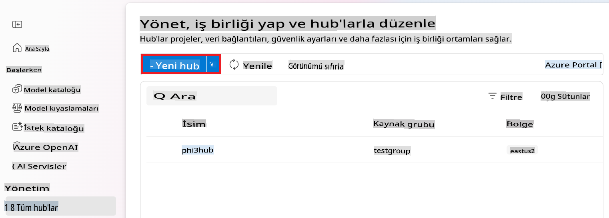

1. Aşağıdaki görevleri gerçekleştirin:

    - **Hub adı** girin. Bu değer benzersiz olmalıdır.
    - Azure **Aboneliğinizi** seçin.
    - Kullanmak istediğiniz **Kaynak grubunu** seçin (gerekirse yeni bir tane oluşturun).
    - Kullanmak istediğiniz **Konumu** seçin.
    - Kullanmak istediğiniz **Azure AI Hizmetlerini Bağla** seçeneğini seçin (gerekirse yeni bir tane oluşturun).
    - **Azure AI Aramasını Bağla** seçeneğini **Bağlantıyı atla** olarak ayarlayın.

    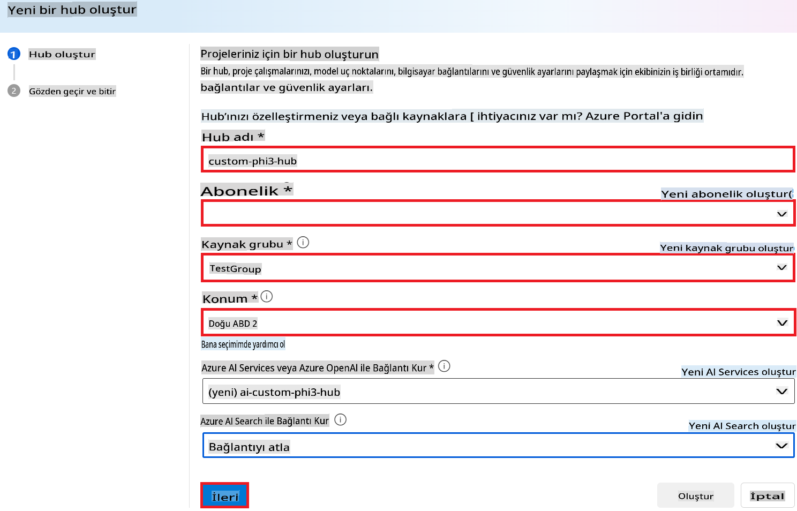

1. **İleri** seçeneğini seçin.

#### Azure AI Foundry Projesi Oluşturma

1. Oluşturduğunuz Hub'da, sol taraftaki sekmeden **Tüm projeler** seçeneğini seçin.

1. Navigasyon menüsünden **+ Yeni proje** seçeneğini seçin.

    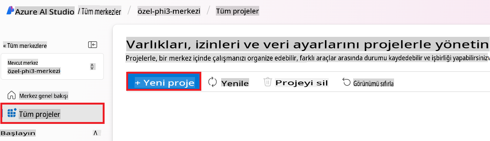

1. **Proje adı** girin. Bu değer benzersiz olmalıdır.

    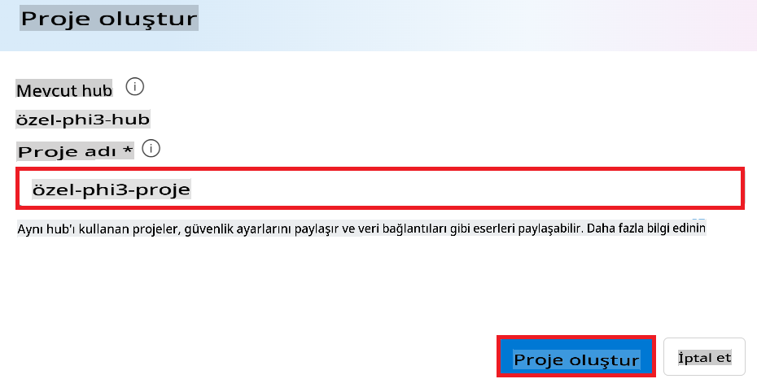

1. **Bir proje oluşturun** seçeneğini seçin.

#### İnce Ayar Yapılmış Phi-3 Modeli için Özel Bir Bağlantı Ekleme

Özelleştirilmiş Phi-3 modelinizi Prompt Flow ile entegre etmek için modelin uç noktası ve anahtarını özel bir bağlantıya kaydetmeniz gerekir. Bu kurulum, özelleştirilmiş Phi-3 modelinize Prompt Flow üzerinden erişim sağlar.

#### İnce Ayar Yapılmış Phi-3 Modelinin API Anahtarını ve Uç Nokta URI'sini Ayarlama

1. [Azure ML Studio](https://ml.azure.com/home?WT.mc_id=aiml-137032-kinfeylo) adresini ziyaret edin.

1. Oluşturduğunuz Azure Machine Learning çalışma alanına gidin.

1. Sol taraftaki sekmeden **Uç Noktalar** seçeneğini seçin.

    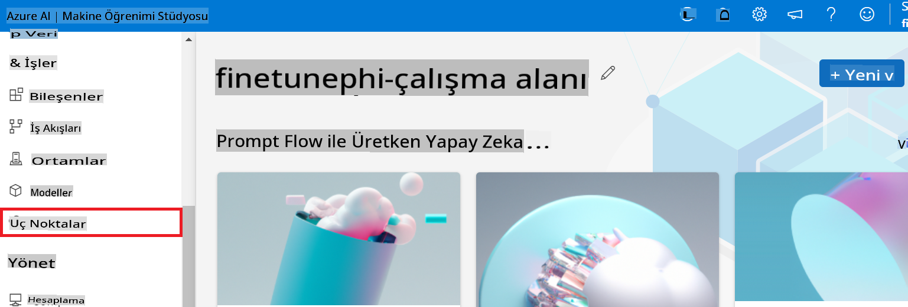

1. Oluşturduğunuz uç noktayı seçin.

    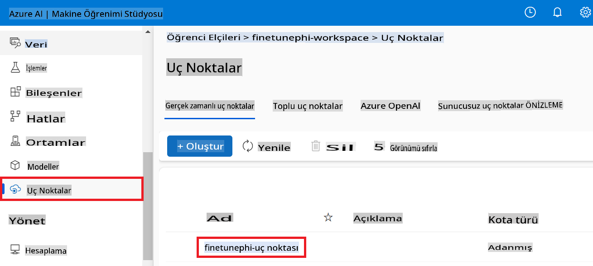

1. Navigasyon menüsünden **Tüketim** seçeneğini seçin.

1. **REST uç noktası** ve **Birincil anahtar** bilgilerinizi kopyalayın.
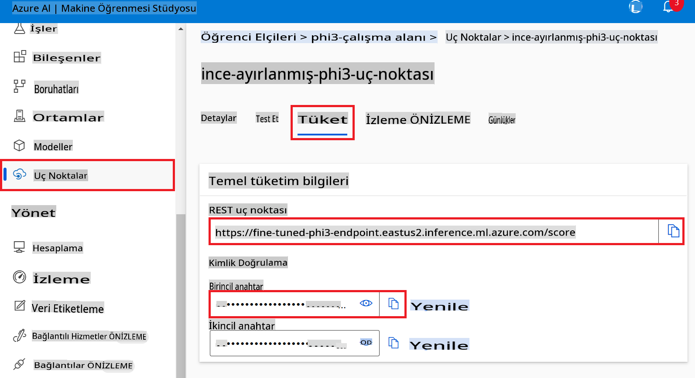

#### Özel Bağlantıyı Ekle

1. [Azure AI Foundry](https://ai.azure.com/?WT.mc_id=aiml-137032-kinfeylo) sayfasını ziyaret edin.

1. Oluşturduğunuz Azure AI Foundry projesine gidin.

1. Oluşturduğunuz projede, sol taraftaki sekmeden **Settings**'i seçin.

1. **+ New connection**'ı seçin.

    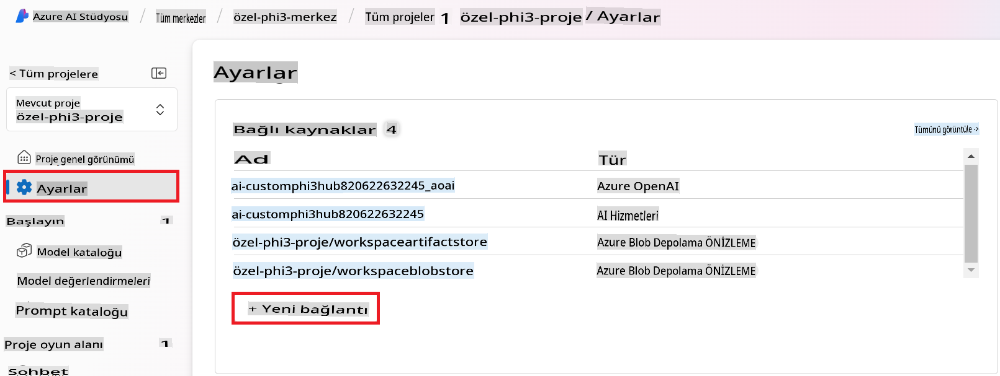

1. Navigasyon menüsünden **Custom keys**'i seçin.

    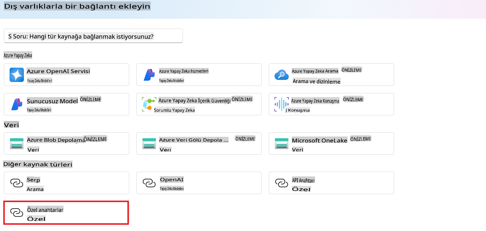

1. Aşağıdaki görevleri gerçekleştirin:

    - **+ Add key value pairs**'i seçin.
    - Anahtar adı için **endpoint** girin ve Azure ML Studio'dan kopyaladığınız uç noktayı değer alanına yapıştırın.
    - Tekrar **+ Add key value pairs**'i seçin.
    - Anahtar adı için **key** girin ve Azure ML Studio'dan kopyaladığınız anahtarı değer alanına yapıştırın.
    - Anahtarları ekledikten sonra, anahtarın görünmesini önlemek için **is secret** seçeneğini işaretleyin.

    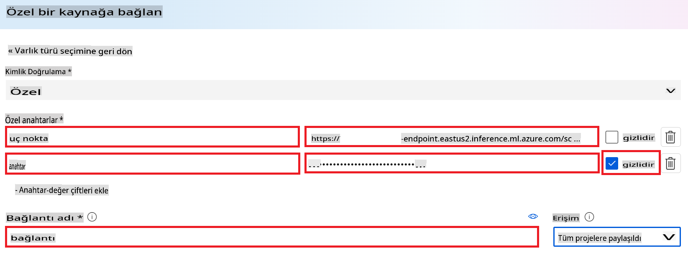

1. **Add connection**'ı seçin.

#### Prompt Flow Oluşturun

Azure AI Foundry'de özel bir bağlantı eklediniz. Şimdi, aşağıdaki adımları izleyerek bir Prompt flow oluşturacağız. Daha sonra, bu Prompt flow'u özel bağlantıya bağlayarak, ince ayar yapılmış modeli Prompt flow içinde kullanabilirsiniz.

1. Oluşturduğunuz Azure AI Foundry projesine gidin.

1. Sol taraftaki sekmeden **Prompt flow**'u seçin.

1. Navigasyon menüsünden **+ Create**'i seçin.

    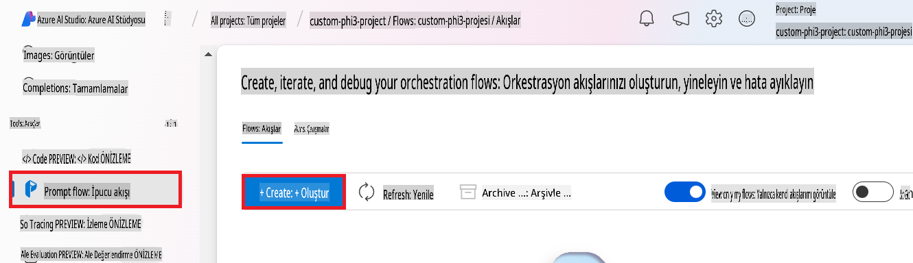

1. Navigasyon menüsünden **Chat flow**'u seçin.

    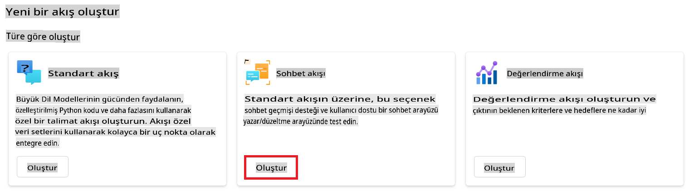

1. Kullanmak istediğiniz **Folder name**'i girin.

    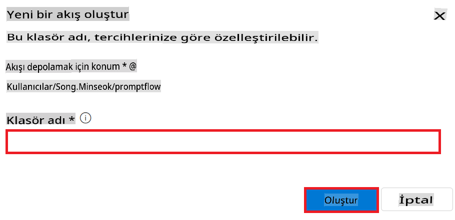

2. **Create**'i seçin.

#### Özel Phi-3 Modelinizle Sohbet Etmek İçin Prompt Flow'u Ayarlayın

İnce ayar yapılmış Phi-3 modelini bir Prompt flow'a entegre etmeniz gerekiyor. Ancak, mevcut Prompt flow bu amaç için tasarlanmamış. Bu nedenle, özel modeli entegre etmek için Prompt flow'u yeniden tasarlamanız gerekiyor.

1. Prompt flow içinde mevcut akışı yeniden oluşturmak için aşağıdaki görevleri gerçekleştirin:

    - **Raw file mode**'u seçin.
    - *flow.dag.yml* dosyasındaki mevcut tüm kodları silin.
    - Aşağıdaki kodu *flow.dag.yml* dosyasına ekleyin.

        ```yml
        inputs:
          input_data:
            type: string
            default: "Who founded Microsoft?"

        outputs:
          answer:
            type: string
            reference: ${integrate_with_promptflow.output}

        nodes:
        - name: integrate_with_promptflow
          type: python
          source:
            type: code
            path: integrate_with_promptflow.py
          inputs:
            input_data: ${inputs.input_data}
        ```

    - **Save**'i seçin.

    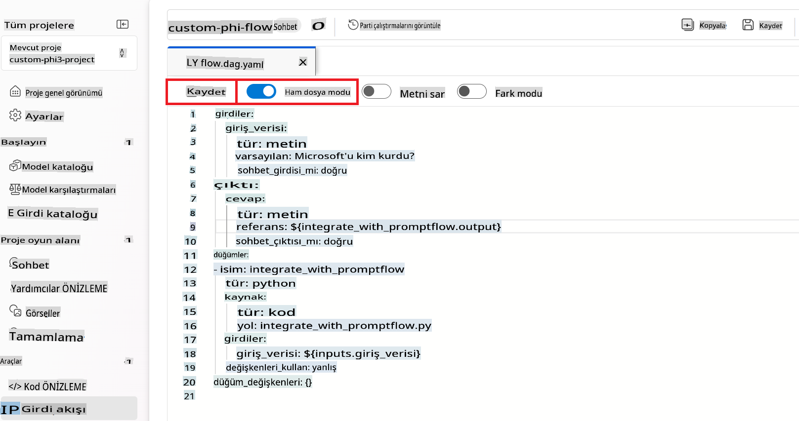

1. Özel Phi-3 modelini Prompt flow içinde kullanmak için aşağıdaki kodu *integrate_with_promptflow.py* dosyasına ekleyin.

    ```python
    import logging
    import requests
    from promptflow import tool
    from promptflow.connections import CustomConnection

    # Logging setup
    logging.basicConfig(
        format="%(asctime)s - %(levelname)s - %(name)s - %(message)s",
        datefmt="%Y-%m-%d %H:%M:%S",
        level=logging.DEBUG
    )
    logger = logging.getLogger(__name__)

    def query_phi3_model(input_data: str, connection: CustomConnection) -> str:
        """
        Send a request to the Phi-3 model endpoint with the given input data using Custom Connection.
        """

        # "connection" is the name of the Custom Connection, "endpoint", "key" are the keys in the Custom Connection
        endpoint_url = connection.endpoint
        api_key = connection.key

        headers = {
            "Content-Type": "application/json",
            "Authorization": f"Bearer {api_key}"
        }
        data = {
            "input_data": {
                "input_string": [
                    {"role": "user", "content": input_data}
                ],
                "parameters": {
                    "temperature": 0.7,
                    "max_new_tokens": 128
                }
            }
        }
        try:
            response = requests.post(endpoint_url, json=data, headers=headers)
            response.raise_for_status()
            
            # Log the full JSON response
            logger.debug(f"Full JSON response: {response.json()}")

            result = response.json()["output"]
            logger.info("Successfully received response from Azure ML Endpoint.")
            return result
        except requests.exceptions.RequestException as e:
            logger.error(f"Error querying Azure ML Endpoint: {e}")
            raise

    @tool
    def my_python_tool(input_data: str, connection: CustomConnection) -> str:
        """
        Tool function to process input data and query the Phi-3 model.
        """
        return query_phi3_model(input_data, connection)

    ```

    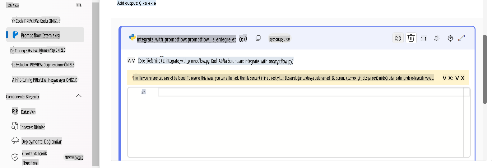

> [!NOTE]
> Azure AI Foundry'de Prompt flow kullanımı hakkında daha ayrıntılı bilgi için [Prompt flow in Azure AI Foundry](https://learn.microsoft.com/azure/ai-studio/how-to/prompt-flow) sayfasına başvurabilirsiniz.

1. Modelinizle sohbet etmek için **Chat input**, **Chat output**'u seçin.

    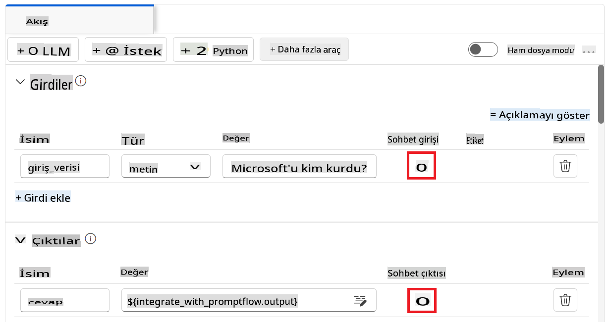

1. Artık özel Phi-3 modelinizle sohbet etmeye hazırsınız. Bir sonraki alıştırmada, Prompt flow'u başlatmayı ve ince ayar yapılmış Phi-3 modelinizle sohbet etmeyi öğreneceksiniz.

> [!NOTE]
>
> Yeniden oluşturulan akış aşağıdaki gibi görünmelidir:
>
> 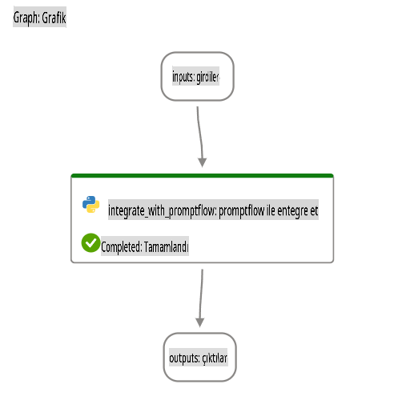
>

### Özel Phi-3 Modelinizle Sohbet Edin

Artık özel Phi-3 modelinizi ince ayar yaparak Prompt flow ile entegre ettiniz ve onunla etkileşime geçmeye hazırsınız. Bu alıştırma, modelinizle sohbet etmek için Prompt flow'u kurma ve başlatma sürecinde size rehberlik edecektir. Bu adımları izleyerek, ince ayar yapılmış Phi-3 modelinizin çeşitli görevler ve konuşmalar için tüm yeteneklerinden yararlanabilirsiniz.

- Prompt flow kullanarak özel Phi-3 modelinizle sohbet edin.

#### Prompt Flow'u Başlatın

1. Prompt flow'u başlatmak için **Start compute sessions**'ı seçin.

    

1. Parametreleri yenilemek için **Validate and parse input**'u seçin.

    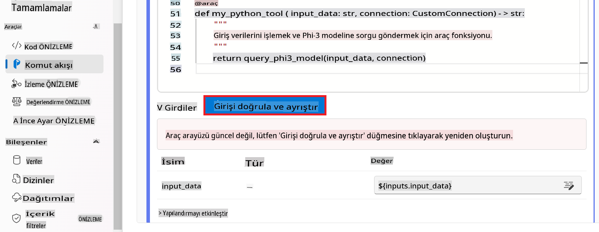

1. Oluşturduğunuz özel bağlantıya ait **connection**'ın **Value** değerini seçin. Örneğin, *connection*.

    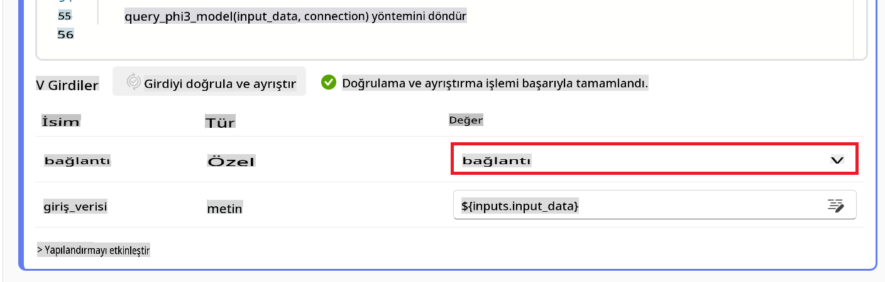

#### Özel Modelinizle Sohbet Edin

1. **Chat**'i seçin.

    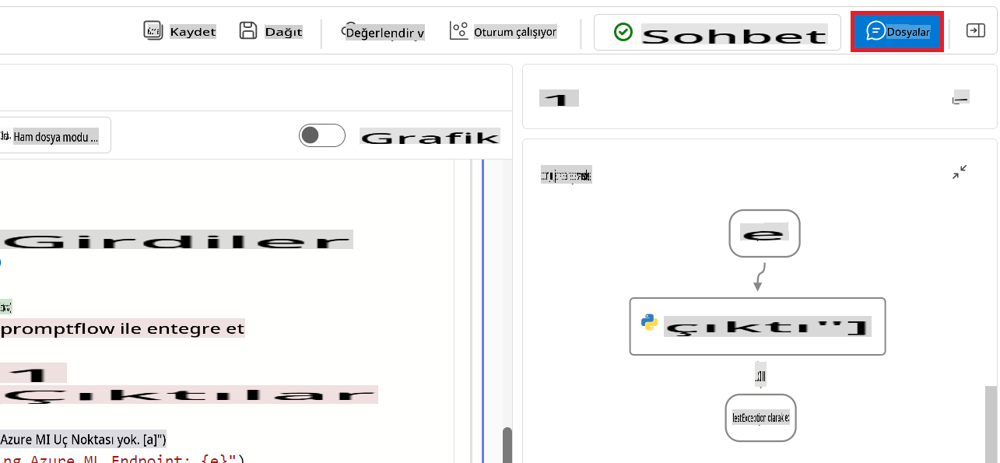

1. İşte bir sonuç örneği: Artık özel Phi-3 modelinizle sohbet edebilirsiniz. İnce ayar sırasında kullanılan verilere dayalı sorular sormanız önerilir.

    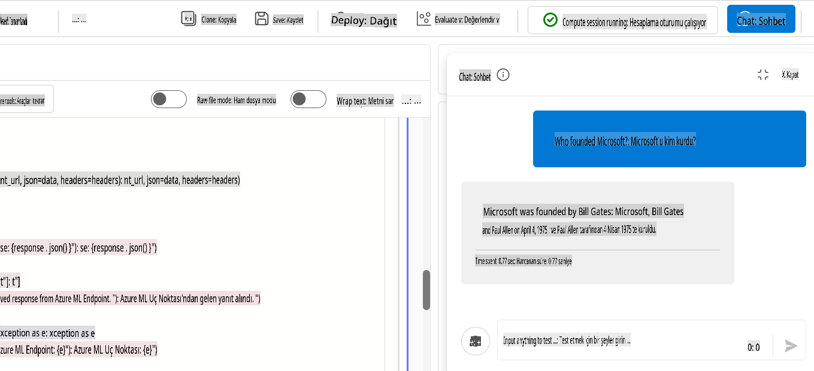

**Feragatname**:  
Bu belge, yapay zeka tabanlı makine çeviri hizmetleri kullanılarak çevrilmiştir. Doğruluk için çaba göstersek de, otomatik çevirilerin hata veya yanlışlıklar içerebileceğini lütfen unutmayın. Orijinal belge, kendi ana dilinde yetkili kaynak olarak kabul edilmelidir. Kritik bilgiler için profesyonel insan çevirisi önerilir. Bu çevirinin kullanımından kaynaklanan herhangi bir yanlış anlama veya yanlış yorumlamadan sorumlu değiliz.