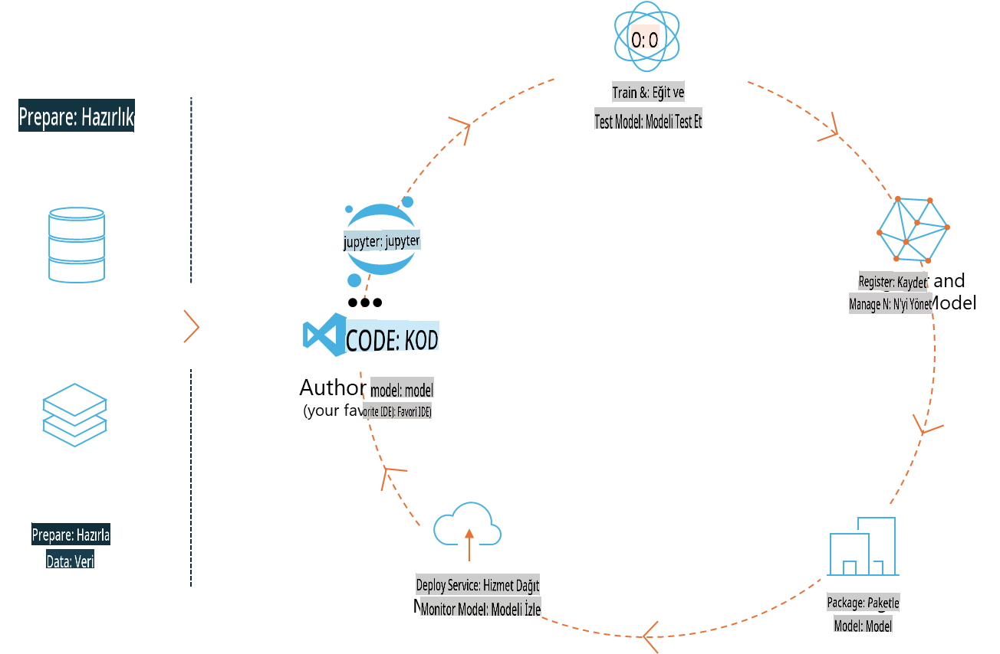
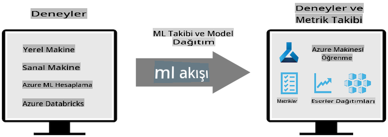
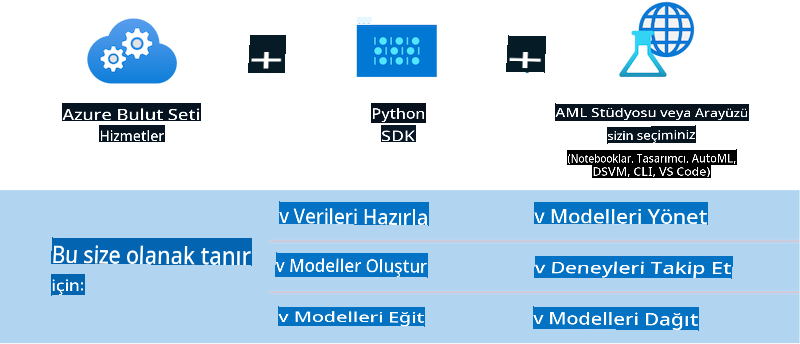

# MLflow

[MLflow](https://mlflow.org/), uçtan uca makine öğrenimi yaşam döngüsünü yönetmek için tasarlanmış açık kaynaklı bir platformdur.



MLFlow, ML yaşam döngüsünü yönetmek için kullanılır; buna deneyler, tekrarlanabilirlik, dağıtım ve merkezi bir model deposu dahildir. Şu anda MLFlow dört bileşen sunmaktadır:

- **MLflow Tracking:** Deneyleri, kodu, veri yapılandırmasını ve sonuçları kaydedin ve sorgulayın.
- **MLflow Projects:** Veri bilimi kodunu her platformda çalıştırılabilecek bir formatta paketleyin.
- **MLflow Models:** Makine öğrenimi modellerini farklı hizmet ortamlarına dağıtın.
- **Model Registry:** Modelleri merkezi bir depoda saklayın, açıklama ekleyin ve yönetin.

MLFlow, deneyleri izleme, kodu tekrarlanabilir çalışmalara paketleme ve modelleri paylaşma ve dağıtma özelliklerini içerir. MLFlow, Databricks ile entegredir ve çeşitli ML kütüphanelerini destekler, bu da onu kütüphane bağımsız hale getirir. REST API ve CLI sunduğu için herhangi bir makine öğrenimi kütüphanesi ve programlama diliyle kullanılabilir.



MLFlow’un temel özellikleri şunlardır:

- **Deney Takibi:** Parametreleri ve sonuçları kaydedin ve karşılaştırın.
- **Model Yönetimi:** Modelleri çeşitli hizmet ve çıkarım platformlarına dağıtın.
- **Model Kaydı:** MLflow Modellerinin yaşam döngüsünü işbirlikçi bir şekilde yönetin; buna sürüm kontrolü ve açıklamalar da dahildir.
- **Projeler:** ML kodunu paylaşım veya üretim için paketleyin.

MLFlow ayrıca MLOps döngüsünü destekler; bu döngü, verilerin hazırlanmasını, modellerin kaydedilmesini ve yönetilmesini, modellerin çalıştırılmak üzere paketlenmesini, hizmetlerin dağıtılmasını ve modellerin izlenmesini içerir. Özellikle bulut ve uç ortamlarında, bir prototipten üretim iş akışına geçiş sürecini basitleştirmeyi amaçlar.

## Uçtan Uca Senaryo - Phi-3 için bir sarmalayıcı oluşturma ve bunu bir MLFlow modeli olarak kullanma

Bu uçtan uca örnekte, Phi-3 küçük dil modeli (SLM) etrafında bir sarmalayıcı oluşturmanın iki farklı yaklaşımını göstereceğiz ve ardından bunu bir MLFlow modeli olarak yerel olarak veya bulutta, örneğin Azure Machine Learning çalışma alanında çalıştıracağız.



| Proje | Açıklama | Konum |
| ------------ | ----------- | -------- |
| Transformer Pipeline | Transformer Pipeline, bir HuggingFace modelini MLFlow’un deneysel transformers formatıyla kullanmak istiyorsanız bir sarmalayıcı oluşturmanın en kolay seçeneğidir. | [**TransformerPipeline.ipynb**](../../../../../../code/06.E2E/E2E_Phi-3-MLflow_TransformerPipeline.ipynb) |
| Özel Python Sarmalayıcı | Bu yazının yazıldığı sırada, transformer pipeline HuggingFace modelleri için ONNX formatında bir MLFlow sarmalayıcı oluşturmayı, deneysel optimum Python paketiyle bile desteklemiyordu. Bu gibi durumlarda, MLFlow modu için özel bir Python sarmalayıcı oluşturabilirsiniz. | [**CustomPythonWrapper.ipynb**](../../../../../../code/06.E2E/E2E_Phi-3-MLflow_CustomPythonWrapper.ipynb) |

## Proje: Transformer Pipeline

1. MLFlow ve HuggingFace'den ilgili Python paketlerine ihtiyacınız olacak:

    ``` Python
    import mlflow
    import transformers
    ```

2. Daha sonra, HuggingFace kaydındaki hedef Phi-3 modeline başvurarak bir transformer pipeline başlatmalısınız. _Phi-3-mini-4k-instruct_ model kartından görülebileceği üzere, görevi "Metin Üretimi" türündedir:

    ``` Python
    pipeline = transformers.pipeline(
        task = "text-generation",
        model = "microsoft/Phi-3-mini-4k-instruct"
    )
    ```

3. Artık Phi-3 modelinizin transformer pipeline'ını MLFlow formatında kaydedebilir ve hedef artefakt yolu, belirli model yapılandırma ayarları ve çıkarım API türü gibi ek ayrıntılar sağlayabilirsiniz:

    ``` Python
    model_info = mlflow.transformers.log_model(
        transformers_model = pipeline,
        artifact_path = "phi3-mlflow-model",
        model_config = model_config,
        task = "llm/v1/chat"
    )
    ```

## Proje: Özel Python Sarmalayıcı

1. Burada Microsoft'un [ONNX Runtime generate() API](https://github.com/microsoft/onnxruntime-genai)'sini ONNX modelinin çıkarımı ve token'ların kodlanması/çözümlenmesi için kullanabiliriz. Aşağıdaki örnek CPU'yu hedef alarak _onnxruntime_genai_ paketini seçmeniz gerekiyor:

    ``` Python
    import mlflow
    from mlflow.models import infer_signature
    import onnxruntime_genai as og
    ```

1. Özel sınıfımız iki yöntemi uygular: **Phi-3 Mini 4K Instruct** ONNX modelini, **üretici parametrelerini** ve **tokenizer**'ı başlatmak için _load_context()_; ve verilen prompt için çıktı token'ları üretmek için _predict()_:

    ``` Python
    class Phi3Model(mlflow.pyfunc.PythonModel):
        def load_context(self, context):
            # Retrieving model from the artifacts
            model_path = context.artifacts["phi3-mini-onnx"]
            model_options = {
                 "max_length": 300,
                 "temperature": 0.2,         
            }
        
            # Defining the model
            self.phi3_model = og.Model(model_path)
            self.params = og.GeneratorParams(self.phi3_model)
            self.params.set_search_options(**model_options)
            
            # Defining the tokenizer
            self.tokenizer = og.Tokenizer(self.phi3_model)
    
        def predict(self, context, model_input):
            # Retrieving prompt from the input
            prompt = model_input["prompt"][0]
            self.params.input_ids = self.tokenizer.encode(prompt)
    
            # Generating the model's response
            response = self.phi3_model.generate(self.params)
    
            return self.tokenizer.decode(response[0][len(self.params.input_ids):])
    ```

1. Şimdi, Phi-3 modeli için özel bir Python sarmalayıcı (pickle formatında), orijinal ONNX modeli ve gerekli bağımlılıklarla birlikte oluşturmak için _mlflow.pyfunc.log_model()_ işlevini kullanabilirsiniz:

    ``` Python
    model_info = mlflow.pyfunc.log_model(
        artifact_path = artifact_path,
        python_model = Phi3Model(),
        artifacts = {
            "phi3-mini-onnx": "cpu_and_mobile/cpu-int4-rtn-block-32-acc-level-4",
        },
        input_example = input_example,
        signature = infer_signature(input_example, ["Run"]),
        extra_pip_requirements = ["torch", "onnxruntime_genai", "numpy"],
    )
    ```

## Oluşturulan MLFlow modellerinin imzaları

1. Yukarıdaki Transformer Pipeline projesinin 3. adımında, MLFlow modelinin görevini "_llm/v1/chat_" olarak ayarladık. Bu tür bir talimat, aşağıda gösterildiği gibi OpenAI’nin Chat API’si ile uyumlu bir model API sarmalayıcısı oluşturur:

    ``` Python
    {inputs: 
      ['messages': Array({content: string (required), name: string (optional), role: string (required)}) (required), 'temperature': double (optional), 'max_tokens': long (optional), 'stop': Array(string) (optional), 'n': long (optional), 'stream': boolean (optional)],
    outputs: 
      ['id': string (required), 'object': string (required), 'created': long (required), 'model': string (required), 'choices': Array({finish_reason: string (required), index: long (required), message: {content: string (required), name: string (optional), role: string (required)} (required)}) (required), 'usage': {completion_tokens: long (required), prompt_tokens: long (required), total_tokens: long (required)} (required)],
    params: 
      None}
    ```

1. Sonuç olarak, prompt'unuzu şu formatta gönderebilirsiniz:

    ``` Python
    messages = [{"role": "user", "content": "What is the capital of Spain?"}]
    ```

1. Ardından, OpenAI API ile uyumlu bir son işlem, örneğin _response[0][‘choices’][0][‘message’][‘content’]_ kullanarak çıktınızı şu şekilde düzenleyebilirsiniz:

    ``` JSON
    Question: What is the capital of Spain?
    
    Answer: The capital of Spain is Madrid. It is the largest city in Spain and serves as the political, economic, and cultural center of the country. Madrid is located in the center of the Iberian Peninsula and is known for its rich history, art, and architecture, including the Royal Palace, the Prado Museum, and the Plaza Mayor.
    
    Usage: {'prompt_tokens': 11, 'completion_tokens': 73, 'total_tokens': 84}
    ```

1. Yukarıdaki Özel Python Sarmalayıcı projesinin 3. adımında, MLFlow paketinin verilen bir giriş örneğinden model imzasını oluşturmasına izin verdik. MLFlow sarmalayıcımızın imzası şu şekilde görünecektir:

    ``` Python
    {inputs: 
      ['prompt': string (required)],
    outputs: 
      [string (required)],
    params: 
      None}
    ```

1. Bu nedenle, prompt'umuzun şu şekilde bir "prompt" sözlük anahtarı içermesi gerekecektir:

    ``` Python
    {"prompt": "<|system|>You are a stand-up comedian.<|end|><|user|>Tell me a joke about atom<|end|><|assistant|>",}
    ```

1. Modelin çıktısı daha sonra string formatında sağlanacaktır:

    ``` JSON
    Alright, here's a little atom-related joke for you!
    
    Why don't electrons ever play hide and seek with protons?
    
    Because good luck finding them when they're always "sharing" their electrons!
    
    Remember, this is all in good fun, and we're just having a little atomic-level humor!
    ```

**Feragatname**:  
Bu belge, yapay zeka tabanlı makine çeviri hizmetleri kullanılarak çevrilmiştir. Doğruluk için çaba göstersek de, otomatik çevirilerin hata veya yanlışlıklar içerebileceğini lütfen unutmayın. Orijinal belge, kendi ana dilindeki haliyle yetkili kaynak olarak kabul edilmelidir. Kritik bilgiler için profesyonel bir insan çevirisi önerilir. Bu çevirinin kullanımından kaynaklanan herhangi bir yanlış anlama veya yanlış yorumlama için sorumluluk kabul edilmemektedir.