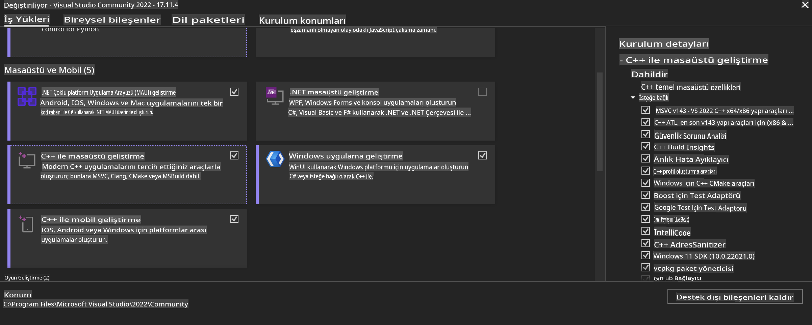
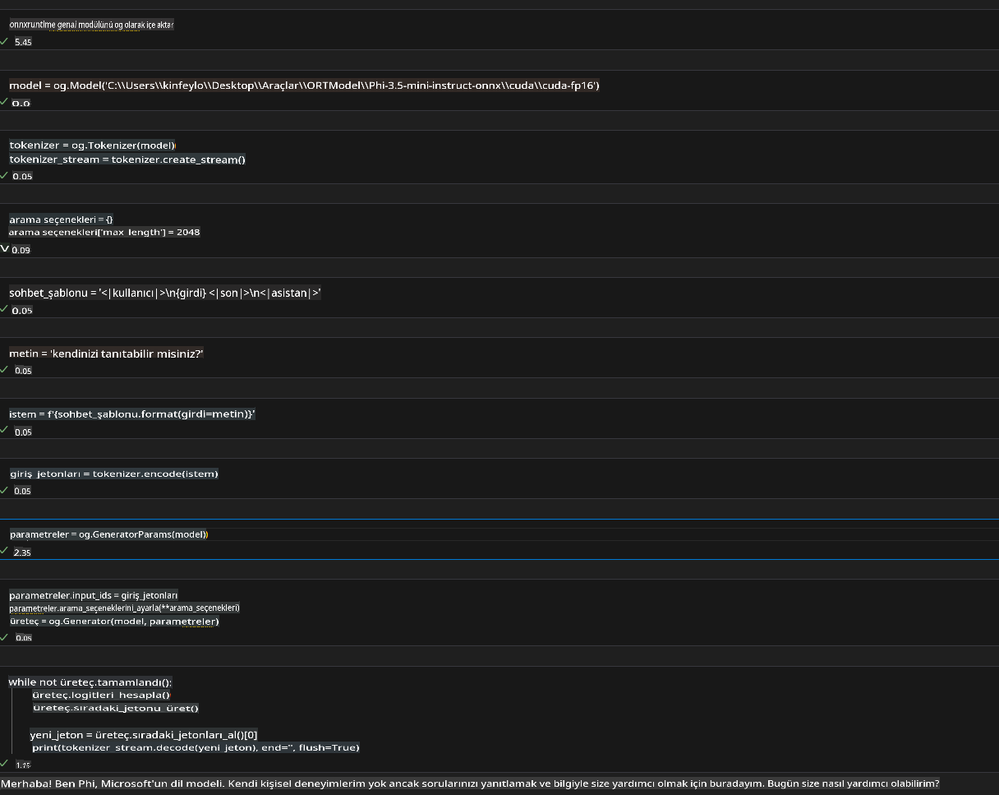
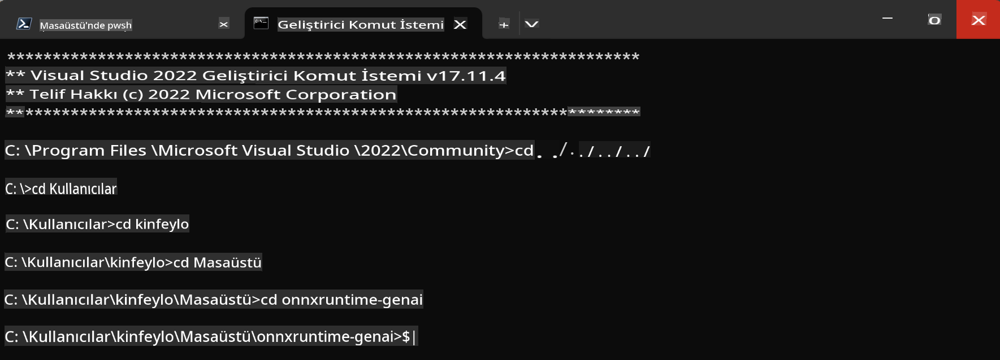

# **OnnxRuntime GenAI Windows GPU için Kılavuz**

Bu kılavuz, Windows'ta GPU'larla ONNX Runtime (ORT) kurulumunu ve kullanımını adım adım anlatır. Modellerinizin performansını ve verimliliğini artırmak için GPU hızlandırmasından faydalanmanıza yardımcı olmayı amaçlar.

Belge şu konularda rehberlik eder:

- Ortam Kurulumu: CUDA, cuDNN ve ONNX Runtime gibi gerekli bağımlılıkların nasıl yükleneceği.
- Yapılandırma: GPU kaynaklarını etkili bir şekilde kullanmak için ortam ve ONNX Runtime'ın nasıl yapılandırılacağı.
- Optimizasyon İpuçları: GPU ayarlarınızı en iyi performans için nasıl ince ayar yapabileceğiniz.

### **1. Python 3.10.x /3.11.8**

   ***Not*** [miniforge](https://github.com/conda-forge/miniforge/releases/latest/download/Miniforge3-Windows-x86_64.exe) kullanmanız önerilir.

   ```bash

   conda create -n pydev python==3.11.8

   conda activate pydev

   ```

   ***Hatırlatma*** Python ile ilgili herhangi bir ONNX kütüphanesi yüklediyseniz, lütfen kaldırın.

### **2. winget ile CMake Yükleme**

   ```bash

   winget install -e --id Kitware.CMake

   ```

### **3. Visual Studio 2022 - C++ ile Masaüstü Geliştirme Yükleme**

   ***Not*** Derleme yapmak istemiyorsanız bu adımı atlayabilirsiniz.



### **4. NVIDIA Sürücüsünü Yükleme**

1. **NVIDIA GPU Sürücüsü**  [https://www.nvidia.com/en-us/drivers/](https://www.nvidia.com/en-us/drivers/)

2. **NVIDIA CUDA 12.4** [https://developer.nvidia.com/cuda-12-4-0-download-archive](https://developer.nvidia.com/cuda-12-4-0-download-archive)

3. **NVIDIA CUDNN 9.4**  [https://developer.nvidia.com/cudnn-downloads](https://developer.nvidia.com/cudnn-downloads)

***Hatırlatma*** Kurulum akışında varsayılan ayarları kullanın.

### **5. NVIDIA Ortamını Ayarlama**

NVIDIA CUDNN 9.4 lib, bin, include dosyalarını NVIDIA CUDA 12.4 lib, bin, include dizinlerine kopyalayın.

- *'C:\Program Files\NVIDIA\CUDNN\v9.4\bin\12.6'* dosyalarını *'C:\Program Files\NVIDIA GPU Computing Toolkit\CUDA\v12.4\bin'* dizinine kopyalayın.

- *'C:\Program Files\NVIDIA\CUDNN\v9.4\include\12.6'* dosyalarını *'C:\Program Files\NVIDIA GPU Computing Toolkit\CUDA\v12.4\include'* dizinine kopyalayın.

- *'C:\Program Files\NVIDIA\CUDNN\v9.4\lib\12.6'* dosyalarını *'C:\Program Files\NVIDIA GPU Computing Toolkit\CUDA\v12.4\lib\x64'* dizinine kopyalayın.

### **6. Phi-3.5-mini-instruct-onnx'i İndirme**

   ```bash

   winget install -e --id Git.Git

   winget install -e --id GitHub.GitLFS

   git lfs install

   git clone https://huggingface.co/microsoft/Phi-3.5-mini-instruct-onnx

   ```

### **7. InferencePhi35Instruct.ipynb'yi Çalıştırma**

   [Notebook](../../../../../../code/09.UpdateSamples/Aug/ortgpu-phi35-instruct.ipynb) dosyasını açın ve çalıştırın.



### **8. ORT GenAI GPU Derleme**

   ***Not*** 

   1. Öncelikle tüm onnx, onnxruntime ve onnxruntime-genai ile ilgili kütüphaneleri kaldırın.

   ```bash

   pip list 
   
   ```

   Daha sonra tüm onnxruntime kütüphanelerini kaldırın, örneğin:

   ```bash

   pip uninstall onnxruntime

   pip uninstall onnxruntime-genai

   pip uninstall onnxruntume-genai-cuda
   
   ```

   2. Visual Studio Uzantı Desteğini Kontrol Etme 

   C:\Program Files\NVIDIA GPU Computing Toolkit\CUDA\v12.4\extras dizininde C:\Program Files\NVIDIA GPU Computing Toolkit\CUDA\v12.4\extras\visual_studio_integration klasörünün bulunduğundan emin olun. 

   Eğer bulunamazsa, diğer Cuda araç seti sürücü klasörlerini kontrol edin ve visual_studio_integration klasörünü ve içeriklerini C:\Program Files\NVIDIA GPU Computing Toolkit\CUDA\v12.4\extras\visual_studio_integration dizinine kopyalayın.

   - Eğer derleme yapmak istemiyorsanız bu adımı atlayabilirsiniz.

   ```bash

   git clone https://github.com/microsoft/onnxruntime-genai

   ```

   - [https://github.com/microsoft/onnxruntime/releases/download/v1.19.2/onnxruntime-win-x64-gpu-1.19.2.zip](https://github.com/microsoft/onnxruntime/releases/download/v1.19.2/onnxruntime-win-x64-gpu-1.19.2.zip) dosyasını indirin.

   - onnxruntime-win-x64-gpu-1.19.2.zip dosyasını çıkarın ve **ort** olarak yeniden adlandırın, ardından ort klasörünü onnxruntime-genai dizinine kopyalayın.

   - Windows Terminal'i kullanarak VS 2022 için Geliştirici Komut İstemine gidin ve onnxruntime-genai dizinine geçin.



   - Python ortamınızı kullanarak derleyin.

   ```bash

   cd onnxruntime-genai

   python build.py --use_cuda  --cuda_home "C:\Program Files\NVIDIA GPU Computing Toolkit\CUDA\v12.4" --config Release
 

   cd build/Windows/Release/Wheel

   pip install .whl

   ```

**Feragatname**:  
Bu belge, makine tabanlı yapay zeka çeviri hizmetleri kullanılarak çevrilmiştir. Doğruluk için çaba göstersek de, otomatik çevirilerin hata veya yanlışlıklar içerebileceğini lütfen unutmayın. Belgenin orijinal dilindeki hali, bağlayıcı ve nihai kaynak olarak kabul edilmelidir. Kritik bilgiler için profesyonel insan çevirisi önerilir. Bu çevirinin kullanımından kaynaklanan yanlış anlama veya yanlış yorumlamalardan sorumlu değiliz.