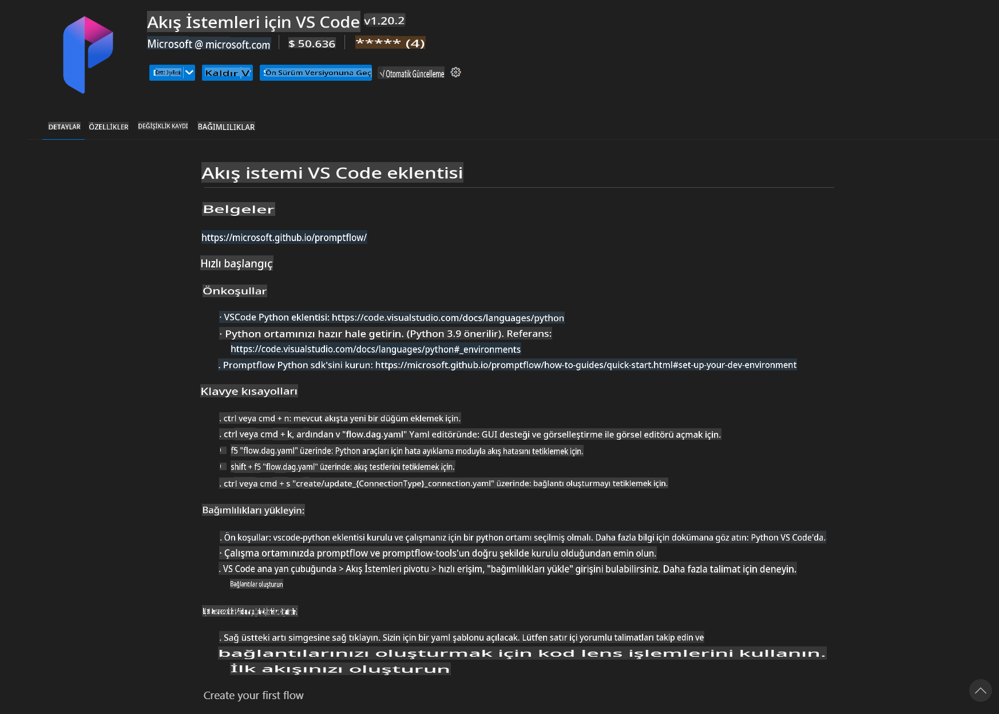
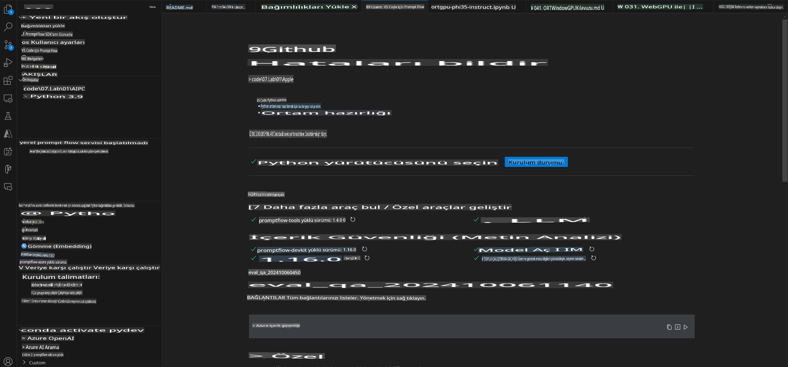
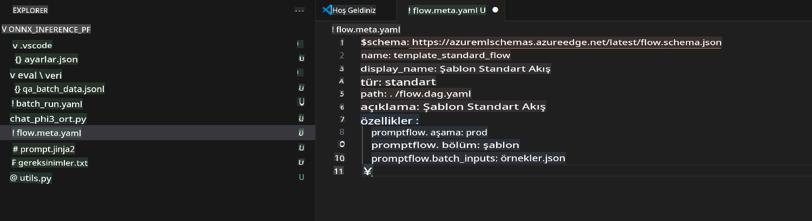
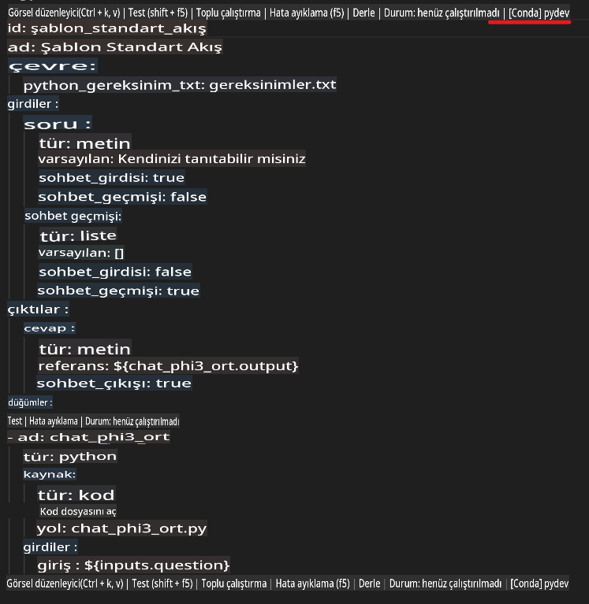
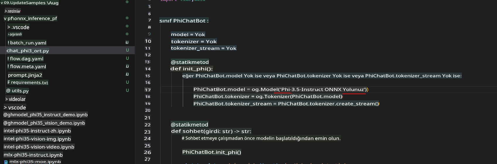
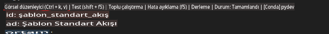
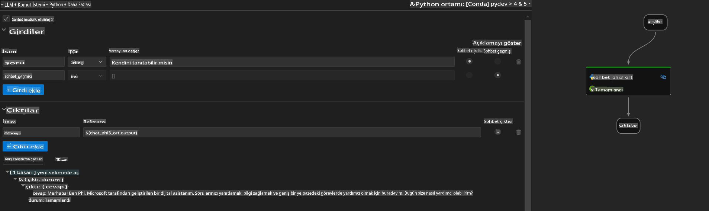
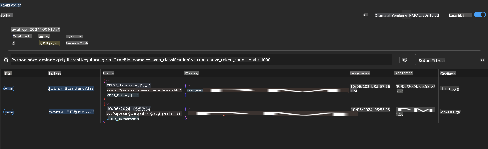

# Windows GPU Kullanarak Phi-3.5-Instruct ONNX ile Prompt Flow Çözümü Oluşturma

Bu belge, Phi-3 modellerine dayalı AI uygulamaları geliştirmek için PromptFlow'un ONNX (Open Neural Network Exchange) ile nasıl kullanılacağına dair bir örnek sunar.

PromptFlow, LLM tabanlı (Büyük Dil Modeli) AI uygulamalarının fikir aşamasından prototip oluşturma, test etme ve değerlendirmeye kadar uçtan uca geliştirme sürecini kolaylaştırmak için tasarlanmış bir geliştirme araçları setidir.

PromptFlow'u ONNX ile entegre ederek geliştiriciler şunları yapabilir:

- **Model Performansını Optimize Etme**: ONNX'i kullanarak model çıkarımı ve dağıtımını daha verimli hale getirin.
- **Geliştirmeyi Basitleştirme**: İş akışını yönetmek ve tekrarlayan görevleri otomatikleştirmek için PromptFlow'u kullanın.
- **İşbirliğini Artırma**: Ekip üyeleri arasında daha iyi işbirliği sağlamak için birleşik bir geliştirme ortamı sunun.

**Prompt flow**, LLM tabanlı AI uygulamalarının fikir üretimi, prototip oluşturma, test etme, değerlendirme, üretim dağıtımı ve izleme gibi uçtan uca geliştirme döngüsünü kolaylaştırmak için tasarlanmış bir geliştirme araçları setidir. Prompt mühendisliğini çok daha kolay hale getirir ve üretim kalitesinde LLM uygulamaları oluşturmanıza olanak tanır.

Prompt flow, OpenAI, Azure OpenAI Service ve özelleştirilebilir modeller (Huggingface, yerel LLM/SLM) ile bağlantı kurabilir. Phi-3.5'in quantized ONNX modelini yerel uygulamalara dağıtmayı hedefliyoruz. Prompt flow, iş planlamamızı daha iyi yapmamıza ve Phi-3.5'e dayalı yerel çözümleri tamamlamamıza yardımcı olabilir. Bu örnekte, Windows GPU tabanlı Prompt flow çözümünü tamamlamak için ONNX Runtime GenAI Library'yi birleştireceğiz.

## **Kurulum**

### **Windows GPU için ONNX Runtime GenAI**

Windows GPU için ONNX Runtime GenAI kurulum rehberini okumak için [buraya tıklayın](./ORTWindowGPUGuideline.md)

### **VSCode'da Prompt flow Kurulumu**

1. Prompt flow VS Code Uzantısını Yükleyin



2. Prompt flow VS Code Uzantısını yükledikten sonra, uzantıya tıklayın ve **Kurulum bağımlılıkları** seçeneğini seçin. Bu rehberi izleyerek Prompt flow SDK'sını ortamınıza yükleyin.



3. [Örnek Kod](../../../../../../code/09.UpdateSamples/Aug/pf/onnx_inference_pf) dosyasını indirin ve bu örneği açmak için VS Code'u kullanın.



4. **flow.dag.yaml** dosyasını açarak Python ortamınızı seçin.



   **chat_phi3_ort.py** dosyasını açarak Phi-3.5-instruct ONNX Model konumunuzu değiştirin.



5. Prompt flow'unuzu çalıştırarak test edin.

**flow.dag.yaml** dosyasını açın ve görsel düzenleyiciye tıklayın.



Bu seçeneğe tıkladıktan sonra, testi çalıştırın.



1. Daha fazla sonuç görmek için terminalde toplu işlem çalıştırabilirsiniz.

```bash

pf run create --file batch_run.yaml --stream --name 'Your eval qa name'    

```

Sonuçları varsayılan tarayıcınızda kontrol edebilirsiniz.



**Feragatname**:  
Bu belge, yapay zeka tabanlı makine çeviri hizmetleri kullanılarak çevrilmiştir. Doğruluk için çaba göstersek de, otomatik çevirilerin hata veya yanlışlıklar içerebileceğini lütfen unutmayın. Orijinal belge, kendi ana dilinde yetkili kaynak olarak kabul edilmelidir. Kritik bilgiler için profesyonel insan çevirisi önerilir. Bu çevirinin kullanımından kaynaklanan herhangi bir yanlış anlama veya yanlış yorumlama durumunda sorumluluk kabul etmiyoruz.