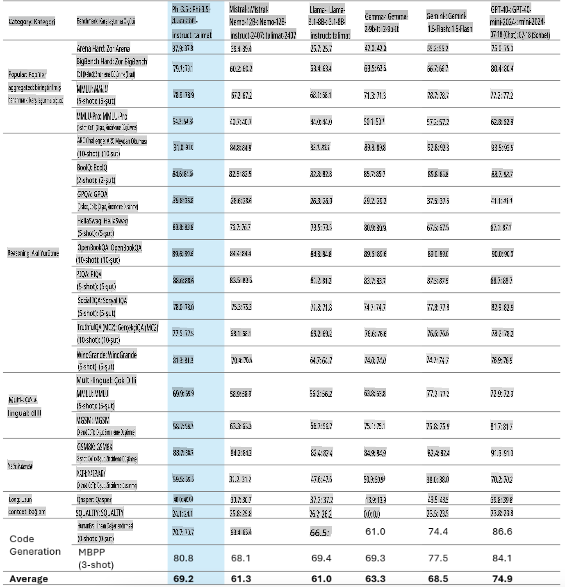
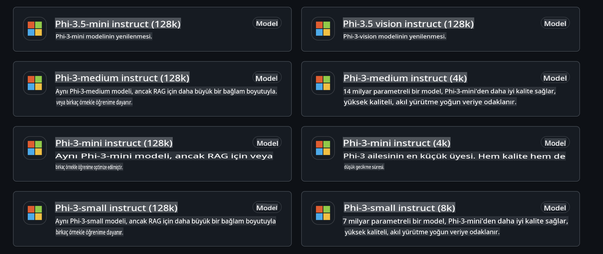
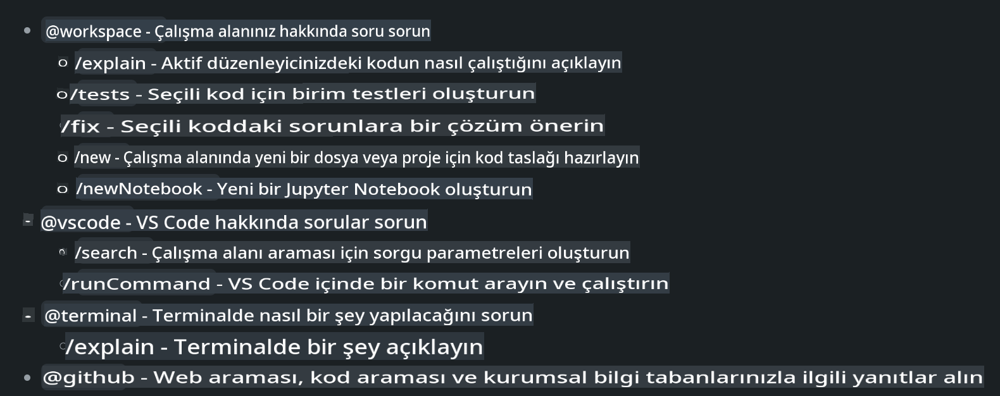
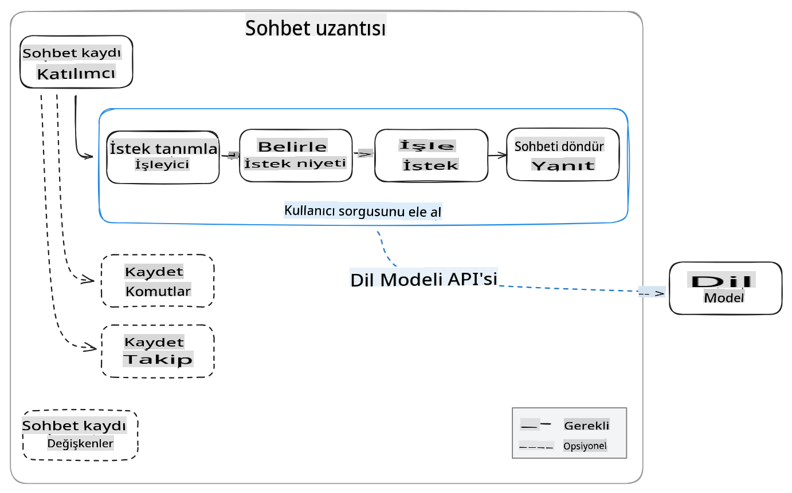
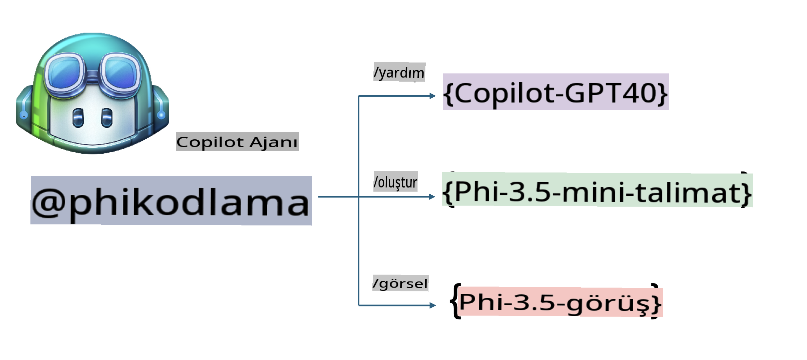
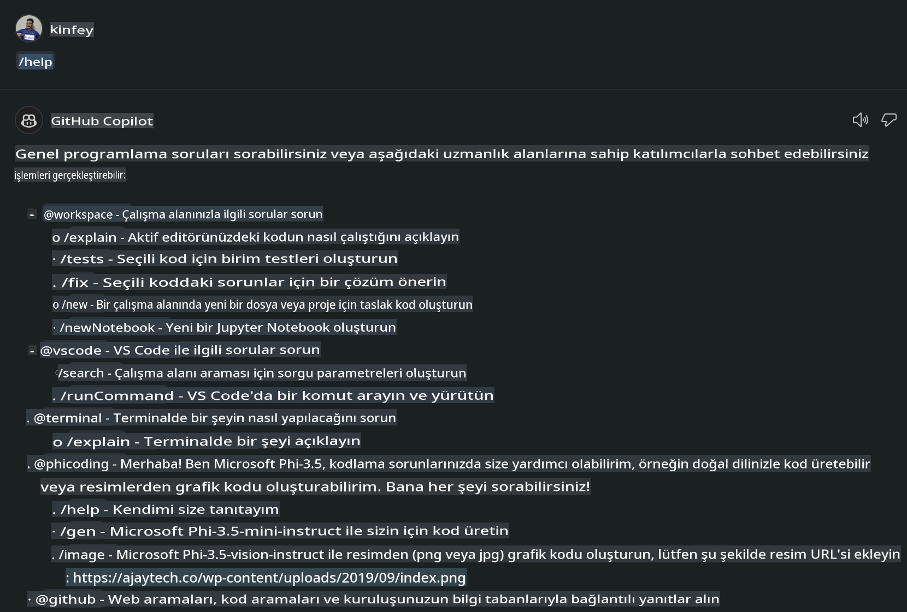
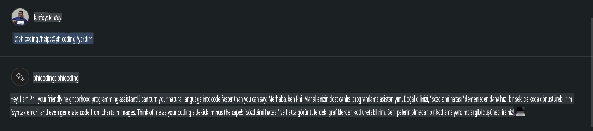
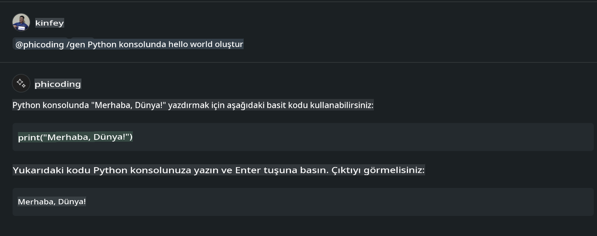
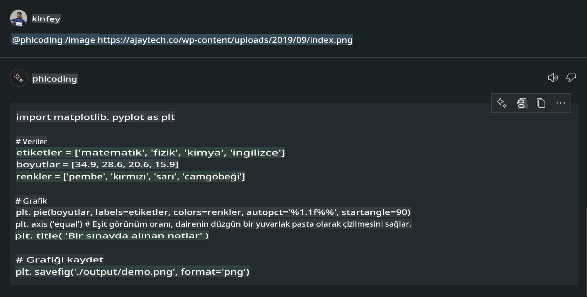

# **Kendi Visual Studio Code Chat Copilot Agent'inizi GitHub Modelleri ile Phi-3.5 Kullanarak Oluşturun**

Visual Studio Code Copilot kullanıyor musunuz? Özellikle Chat'te, Visual Studio Code'da projeleri oluşturma, yazma ve yönetme yeteneğinizi geliştirmek için farklı ajanlar kullanabilirsiniz. Visual Studio Code, şirketlerin ve bireylerin kendi iş alanlarına uygun ajanlar oluşturup farklı özel alanlarda yeteneklerini genişletmelerine olanak tanıyan bir API sunar. Bu makalede, GitHub Modellerinin **Phi-3.5-mini-instruct (128k)** ve **Phi-3.5-vision-instruct (128k)** modellerini kullanarak kendi Visual Studio Code Agent'inizi nasıl oluşturacağınızı ele alacağız.

## **GitHub Modellerindeki Phi-3.5 Hakkında**

Phi-3/3.5 Family serisindeki Phi-3.5-mini-instruct'un güçlü bir kod anlama ve oluşturma yeteneğine sahip olduğunu, ayrıca Gemma-2-9b ve Mistral-Nemo-12B-instruct-2407'e göre avantaj sağladığını biliyoruz.



En son GitHub Modelleri, Phi-3.5-mini-instruct (128k) ve Phi-3.5-vision-instruct (128k) modellerine erişim sağlamaktadır. Geliştiriciler bu modellere OpenAI SDK, Azure AI Inference SDK ve REST API üzerinden ulaşabilir.



***Not:*** Burada Azure AI Inference SDK'nın kullanılması önerilir, çünkü üretim ortamında Azure Model Catalog ile daha iyi bir şekilde geçiş yapabilir.

Aşağıda, GitHub Modellerine bağlandıktan sonra **Phi-3.5-mini-instruct (128k)** ve **Phi-3.5-vision-instruct (128k)** modellerinin kod oluşturma senaryosundaki sonuçları yer almakta olup, sonraki örnekler için de hazırlık yapılmıştır.

**Demo: GitHub Modelleri Phi-3.5-mini-instruct (128k) ile Prompt'tan Kod Oluşturma** ([bu bağlantıya tıklayın](../../../../../../code/09.UpdateSamples/Aug/ghmodel_phi35_instruct_demo.ipynb))

**Demo: GitHub Modelleri Phi-3.5-vision-instruct (128k) ile Görselden Kod Oluşturma** ([bu bağlantıya tıklayın](../../../../../../code/09.UpdateSamples/Aug/ghmodel_phi35_vision_demo.ipynb))

## **GitHub Copilot Chat Agent Hakkında**

GitHub Copilot Chat Agent, kod tabanlı olarak farklı proje senaryolarında çeşitli görevleri tamamlayabilir. Sistem, workspace, github, terminal, vscode olmak üzere dört ajan içerir.



Ajan adının önüne ‘@’ ekleyerek ilgili işi hızlıca tamamlayabilirsiniz. Şirketler için, kendi işlerine özgü içerikleri (örneğin gereksinimler, kodlama, test spesifikasyonları ve yayın) ekleyerek GitHub Copilot'un sunduğu güçlü özel işlevlere sahip olabilirler.

Visual Studio Code Chat Agent, artık API'sini resmi olarak yayınladı ve şirketlerin ya da kurumsal geliştiricilerin farklı yazılım iş ekosistemlerine dayalı ajanlar geliştirmesine olanak tanıyor. Visual Studio Code Extension Development yöntemine dayalı geliştirme ile Visual Studio Code Chat Agent API'sinin arayüzüne kolayca erişebilirsiniz. Bu süreç temel alınarak geliştirme yapabiliriz.



Geliştirme senaryosu, üçüncü taraf model API'lerine (örneğin GitHub Modelleri, Azure Model Catalog ve açık kaynak modellere dayalı kendi hizmetleriniz) erişimi destekleyebilir ve ayrıca GitHub Copilot tarafından sağlanan gpt-35-turbo, gpt-4 ve gpt-4o modellerini kullanabilir.

## **Phi-3.5 Tabanlı @phicoding Ajanını Ekleyin**

Phi-3.5'in programlama yeteneklerini entegre ederek kod yazma, görselden kod oluşturma gibi görevleri tamamlamayı deniyoruz. Phi-3.5 etrafında oluşturulmuş bir Agent - @PHI tamamlanacak. İşte bazı işlevler:

1. **@phicoding /help** komutu ile GitHub Copilot tarafından sağlanan GPT-4o'ya dayalı bir öz tanıtım oluşturun.

2. **@phicoding /gen** komutu ile **Phi-3.5-mini-instruct (128k)** kullanarak farklı programlama dilleri için kod oluşturun.

3. **@phicoding /image** komutu ile **Phi-3.5-vision-instruct (128k)** kullanarak görsel tabanlı kod oluşturun ve tamamlayın.



## **İlgili Adımlar**

1. npm kullanarak Visual Studio Code Extension geliştirme desteğini yükleyin.

```bash

npm install --global yo generator-code 

```

2. Bir Visual Studio Code Extension eklentisi oluşturun (Typescript geliştirme modunda, adı phiext olacak).

```bash

yo code 

```

3. Oluşturulan projeyi açın ve package.json dosyasını düzenleyin. Burada ilgili talimatlar ve yapılandırmalar, ayrıca GitHub Modellerinin yapılandırması yer alır. GitHub Modelleri token'ınızı buraya eklemeniz gerektiğini unutmayın.

```json

{
  "name": "phiext",
  "displayName": "phiext",
  "description": "",
  "version": "0.0.1",
  "engines": {
    "vscode": "^1.93.0"
  },
  "categories": [
    "AI",
    "Chat"
  ],
  "activationEvents": [],
  "enabledApiProposals": [
      "chatVariableResolver"
  ],
  "main": "./dist/extension.js",
  "contributes": {
    "chatParticipants": [
        {
            "id": "chat.phicoding",
            "name": "phicoding",
            "description": "Hey! I am Microsoft Phi-3.5, She can help me with coding problems, such as generation code with your natural language, or even generation code about chart from images. Just ask me anything!",
            "isSticky": true,
            "commands": [
                {
                    "name": "help",
                    "description": "Introduce myself to you"
                },
                {
                    "name": "gen",
                    "description": "Generate code for you with Microsoft Phi-3.5-mini-instruct"
                },
                {
                    "name": "image",
                    "description": "Generate code for chart from image(png or jpg) with Microsoft Phi-3.5-vision-instruct, please add image url like this : https://ajaytech.co/wp-content/uploads/2019/09/index.png"
                }
            ]
        }
    ],
    "commands": [
        {
            "command": "phicoding.namesInEditor",
            "title": "Use Microsoft Phi 3.5 in Editor"
        }
    ],
    "configuration": {
      "type": "object",
      "title": "githubmodels",
      "properties": {
        "githubmodels.endpoint": {
          "type": "string",
          "default": "https://models.inference.ai.azure.com",
          "description": "Your GitHub Models Endpoint",
          "order": 0
        },
        "githubmodels.api_key": {
          "type": "string",
          "default": "Your GitHub Models Token",
          "description": "Your GitHub Models Token",
          "order": 1
        },
        "githubmodels.phi35instruct": {
          "type": "string",
          "default": "Phi-3.5-mini-instruct",
          "description": "Your Phi-35-Instruct Model",
          "order": 2
        },
        "githubmodels.phi35vision": {
          "type": "string",
          "default": "Phi-3.5-vision-instruct",
          "description": "Your Phi-35-Vision Model",
          "order": 3
        }
      }
    }
  },
  "scripts": {
    "vscode:prepublish": "npm run package",
    "compile": "webpack",
    "watch": "webpack --watch",
    "package": "webpack --mode production --devtool hidden-source-map",
    "compile-tests": "tsc -p . --outDir out",
    "watch-tests": "tsc -p . -w --outDir out",
    "pretest": "npm run compile-tests && npm run compile && npm run lint",
    "lint": "eslint src",
    "test": "vscode-test"
  },
  "devDependencies": {
    "@types/vscode": "^1.93.0",
    "@types/mocha": "^10.0.7",
    "@types/node": "20.x",
    "@typescript-eslint/eslint-plugin": "^8.3.0",
    "@typescript-eslint/parser": "^8.3.0",
    "eslint": "^9.9.1",
    "typescript": "^5.5.4",
    "ts-loader": "^9.5.1",
    "webpack": "^5.94.0",
    "webpack-cli": "^5.1.4",
    "@vscode/test-cli": "^0.0.10",
    "@vscode/test-electron": "^2.4.1"
  },
  "dependencies": {
    "@types/node-fetch": "^2.6.11",
    "node-fetch": "^3.3.2",
    "@azure-rest/ai-inference": "latest",
    "@azure/core-auth": "latest",
    "@azure/core-sse": "latest"
  }
}


```

4. src/extension.ts dosyasını düzenleyin.

```typescript

// The module 'vscode' contains the VS Code extensibility API
// Import the module and reference it with the alias vscode in your code below
import * as vscode from 'vscode';
import ModelClient from "@azure-rest/ai-inference";
import { AzureKeyCredential } from "@azure/core-auth";


interface IPhiChatResult extends vscode.ChatResult {
    metadata: {
        command: string;
    };
}


const MODEL_SELECTOR: vscode.LanguageModelChatSelector = { vendor: 'copilot', family: 'gpt-4o' };

function isValidImageUrl(url: string): boolean {
    const regex = /^(https?:\/\/.*\.(?:png|jpg))$/i;
    return regex.test(url);
}
  

// This method is called when your extension is activated
// Your extension is activated the very first time the command is executed
export function activate(context: vscode.ExtensionContext) {

    const codinghandler: vscode.ChatRequestHandler = async (request: vscode.ChatRequest, context: vscode.ChatContext, stream: vscode.ChatResponseStream, token: vscode.CancellationToken): Promise<IPhiChatResult> => {


        const config : any = vscode.workspace.getConfiguration('githubmodels');
        const endPoint: string = config.get('endpoint');
        const apiKey: string = config.get('api_key');
        const phi35instruct: string = config.get('phi35instruct');
        const phi35vision: string = config.get('phi35vision');
        
        if (request.command === 'help') {

            const content = "Welcome to Coding assistant with Microsoft Phi-3.5"; 
            stream.progress(content);


            try {
                const [model] = await vscode.lm.selectChatModels(MODEL_SELECTOR);
                if (model) {
                    const messages = [
                        vscode.LanguageModelChatMessage.User("Please help me express this content in a humorous way: I am a programming assistant who can help you convert natural language into code and generate code based on the charts in the images. output format like this : Hey I am Phi ......")
                    ];
                    const chatResponse = await model.sendRequest(messages, {}, token);
                    for await (const fragment of chatResponse.text) {
                        stream.markdown(fragment);
                    }
                }
            } catch(err) {
                console.log(err);
            }


            return { metadata: { command: 'help' } };

        }

        
        if (request.command === 'gen') {

            const content = "Welcome to use phi-3.5 to generate code";

            stream.progress(content);

            const client = new ModelClient(endPoint, new AzureKeyCredential(apiKey));

            const response = await client.path("/chat/completions").post({
              body: {
                messages: [
                  { role:"system", content: "You are a coding assistant.Help answer all code generation questions." },
                  { role:"user", content: request.prompt }
                ],
                model: phi35instruct,
                temperature: 0.4,
                max_tokens: 1000,
                top_p: 1.
              }
            });

            stream.markdown(response.body.choices[0].message.content);

            return { metadata: { command: 'gen' } };

        }


        
        if (request.command === 'image') {


            const content = "Welcome to use phi-3.5 to generate code from image(png or jpg),image url like this:https://ajaytech.co/wp-content/uploads/2019/09/index.png";

            stream.progress(content);

            if (!isValidImageUrl(request.prompt)) {
                stream.markdown('Please provide a valid image URL');
                return { metadata: { command: 'image' } };
            }
            else
            {

                const client = new ModelClient(endPoint, new AzureKeyCredential(apiKey));
    
                const response = await client.path("/chat/completions").post({
                    body: {
                      messages: [
                        { role: "system", content: "You are a helpful assistant that describes images in details." },
                        { role: "user", content: [
                            { type: "text", text: "Please generate code according to the chart in the picture according to the following requirements\n1. Keep all information in the chart, including data and text\n2. Do not generate additional information that is not included in the chart\n3. Please extract data from the picture, do not generate it from csv\n4. Please save the regenerated chart as a chart and save it to ./output/demo.png"},
                            { type: "image_url", image_url: {url: request.prompt}
                            }
                          ]
                        }
                      ],
                      model: phi35vision,
                      temperature: 0.4,
                      max_tokens: 2048,
                      top_p: 1.
                    }
                  });
    
                
                stream.markdown(response.body.choices[0].message.content);
    
                return { metadata: { command: 'image' } };
            }


        }


        return { metadata: { command: '' } };
    };


    const phi_ext = vscode.chat.createChatParticipant("chat.phicoding", codinghandler);

    phi_ext.iconPath = new vscode.ThemeIcon('sparkle');


    phi_ext.followupProvider = {
        provideFollowups(result: IPhiChatResult, context: vscode.ChatContext, token: vscode.CancellationToken) {
            return [{
                prompt: 'Let us coding with Phi-3.5 😋😋😋😋',
                label: vscode.l10n.t('Enjoy coding with Phi-3.5'),
                command: 'help'
            } satisfies vscode.ChatFollowup];
        }
    };

    context.subscriptions.push(phi_ext);
}

// This method is called when your extension is deactivated
export function deactivate() {}


```

6. Çalıştırma

***/help***



***@phicoding /help***



***@phicoding /gen***



***@phicoding /image***



Örnek kodu indirebilirsiniz: [tıklayın](../../../../../../code/09.UpdateSamples/Aug/vscode)

## **Kaynaklar**

1. GitHub Modellerine kaydolun [https://gh.io/models](https://gh.io/models)

2. Visual Studio Code Extension Geliştirmeyi Öğrenin [https://code.visualstudio.com/api/get-started/your-first-extension](https://code.visualstudio.com/api/get-started/your-first-extension)

3. Visual Studio Code Coilot Chat API Hakkında Bilgi Edinin [https://code.visualstudio.com/api/extension-guides/chat](https://code.visualstudio.com/api/extension-guides/chat)

**Feragatname**:  
Bu belge, yapay zeka tabanlı makine çeviri hizmetleri kullanılarak çevrilmiştir. Doğruluk için çaba göstersek de, otomatik çevirilerin hata veya yanlışlıklar içerebileceğini lütfen unutmayın. Orijinal belgenin kendi ana dilindeki hali, yetkili kaynak olarak kabul edilmelidir. Kritik bilgiler için profesyonel insan çevirisi önerilir. Bu çevirinin kullanımından kaynaklanan herhangi bir yanlış anlama veya yanlış yorumlama için sorumluluk kabul edilmemektedir.