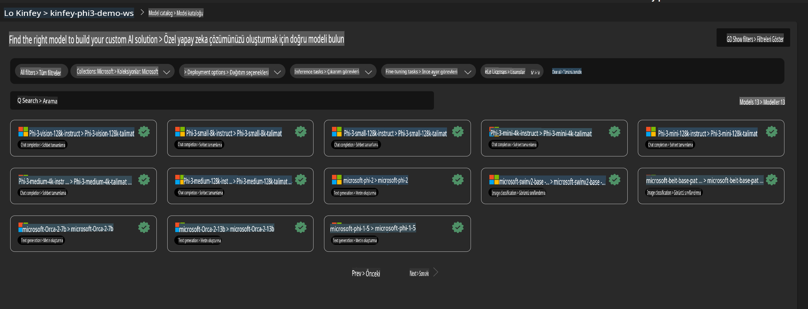
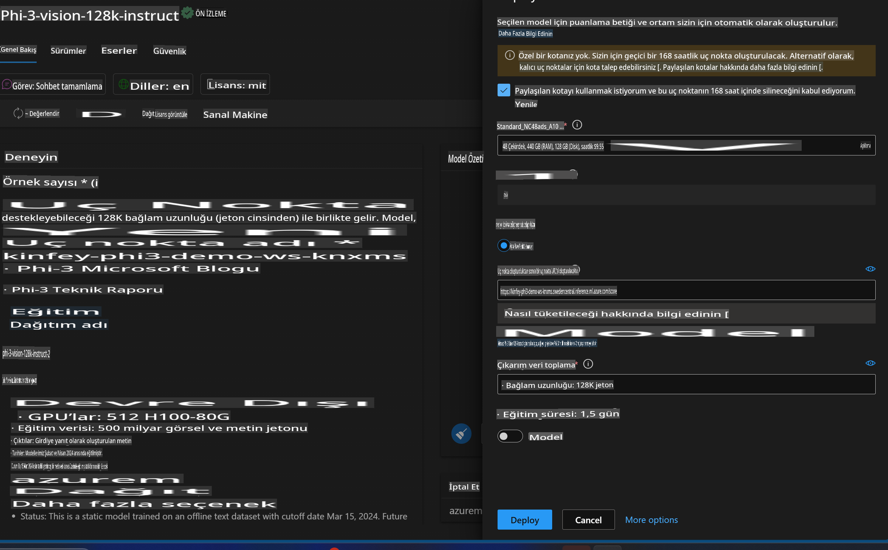
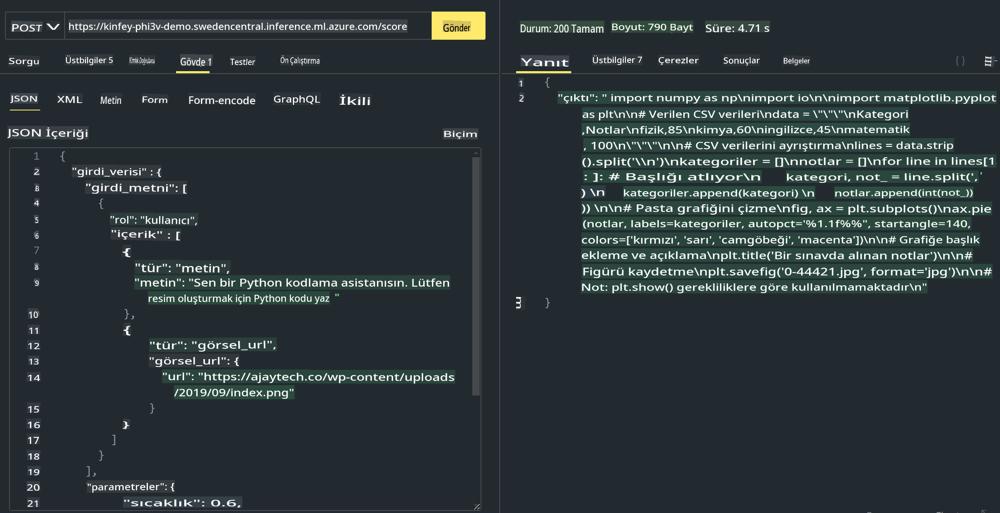

# **Lab 3 - Azure Machine Learning Service üzerinde Phi-3-Vision'u Dağıtma**

NPU kullanarak yerel kodun üretim dağıtımını tamamlıyoruz ve ardından PHI-3-VISION'u tanıtarak resimlerden kod üretme yeteneğini tanıtmak istiyoruz.

Bu girişte, Azure Machine Learning Service üzerinde hızlı bir şekilde bir Model As Service Phi-3 Vision servisi oluşturabiliriz.

***Not***: Phi-3 Vision, içerik oluşturma hızını artırmak için hesaplama gücüne ihtiyaç duyar. Bu hedefe ulaşmamıza yardımcı olması için bulut hesaplama gücüne ihtiyacımız var.

### **1. Azure Machine Learning Service Oluşturma**

Azure Portal'da bir Azure Machine Learning Service oluşturmamız gerekiyor. Nasıl yapılacağını öğrenmek isterseniz, lütfen şu bağlantıyı ziyaret edin: [https://learn.microsoft.com/azure/machine-learning/quickstart-create-resources?view=azureml-api-2](https://learn.microsoft.com/azure/machine-learning/quickstart-create-resources?view=azureml-api-2)

### **2. Azure Machine Learning Service'te Phi-3 Vision Seçimi**



### **3. Azure'da Phi-3-Vision Dağıtımı**



### **4. Postman'de Uç Noktayı Test Etme**



***Not***

1. Gönderilecek parametreler arasında Authorization, azureml-model-deployment ve Content-Type bulunmalıdır. Bu bilgileri almak için dağıtım bilgilerini kontrol etmeniz gerekir.

2. Parametreleri iletmek için Phi-3-Vision bir resim bağlantısı iletmelidir. Parametrelerin nasıl iletileceği konusunda GPT-4-Vision yöntemine başvurabilirsiniz, örneğin:

```json

{
  "input_data":{
    "input_string":[
      {
        "role":"user",
        "content":[ 
          {
            "type": "text",
            "text": "You are a Python coding assistant.Please create Python code for image "
          },
          {
              "type": "image_url",
              "image_url": {
                "url": "https://ajaytech.co/wp-content/uploads/2019/09/index.png"
              }
          }
        ]
      }
    ],
    "parameters":{
          "temperature": 0.6,
          "top_p": 0.9,
          "do_sample": false,
          "max_new_tokens": 2048
    }
  }
}

```

3. **/score** metodunu Post yöntemiyle çağırın.

**Tebrikler**! Hızlı PHI-3-VISION dağıtımını tamamladınız ve resimlerden kod üretmenin nasıl çalıştığını denediniz. Şimdi, NPU'lar ve bulutları birleştirerek uygulamalar oluşturabiliriz.

**Feragatname**:  
Bu belge, yapay zeka tabanlı makine çeviri hizmetleri kullanılarak çevrilmiştir. Doğruluk için çaba göstersek de, otomatik çevirilerin hata veya yanlışlıklar içerebileceğini lütfen unutmayın. Orijinal belgenin kendi dilindeki hali yetkili kaynak olarak kabul edilmelidir. Kritik bilgiler için profesyonel insan çevirisi önerilir. Bu çevirinin kullanımından kaynaklanan herhangi bir yanlış anlama veya yanlış yorumlamadan sorumlu değiliz.