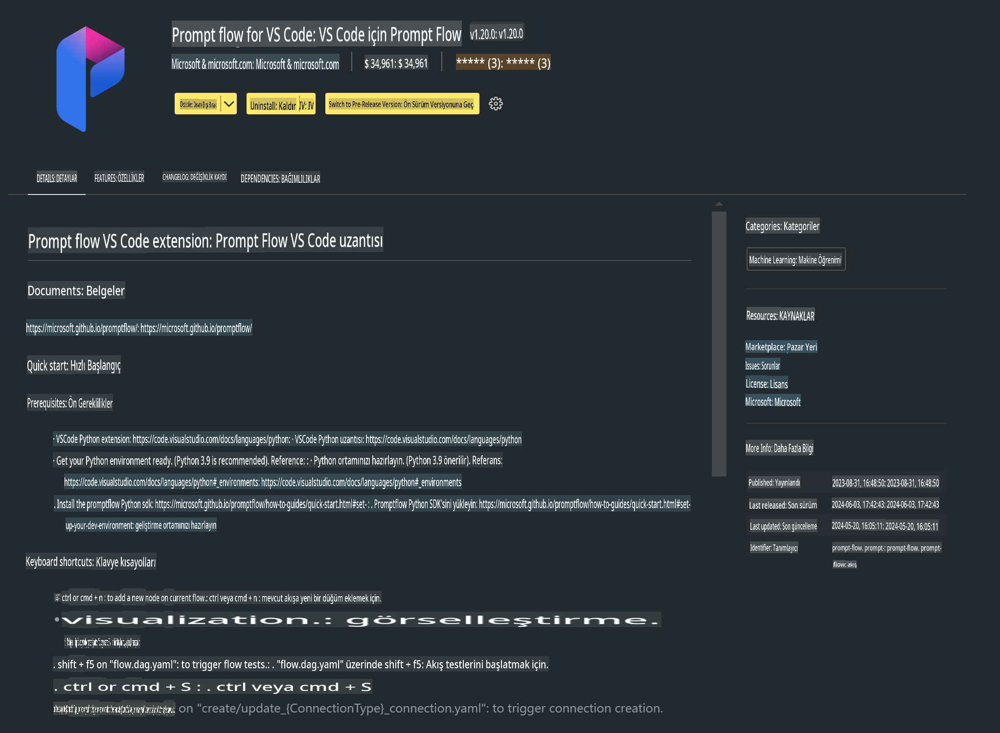

# **Lab 0 - Kurulum**

Lab'e girdiğimizde ilgili ortamı yapılandırmamız gerekiyor:

### **1. Python 3.11+**

Python ortamınızı yapılandırmak için miniforge kullanmanız önerilir.

Miniforge'u yapılandırmak için şu adrese göz atabilirsiniz: [https://github.com/conda-forge/miniforge](https://github.com/conda-forge/miniforge)

Miniforge'u yapılandırdıktan sonra, Power Shell'de aşağıdaki komutu çalıştırın:

```bash

conda create -n pyenv python==3.11.8 -y

conda activate pyenv

```

### **2. Prompt flow SDK Kurulumu**

Lab 1'de Prompt flow kullanacağız, bu yüzden Prompt flow SDK'sını yapılandırmanız gerekiyor.

```bash

pip install promptflow --upgrade

```

Prompt flow SDK'sını bu komutla kontrol edebilirsiniz:

```bash

pf --version

```

### **3. Visual Studio Code Prompt flow Eklentisi Kurulumu**



### **4. Apple's MLX Framework**

MLX, Apple silikonunda makine öğrenimi araştırmaları için bir dizi framework olup, Apple makine öğrenimi araştırmaları tarafından geliştirilmiştir. **Apple MLX framework** ile Apple Silicon kullanarak LLM / SLM işlemlerini hızlandırabilirsiniz. Daha fazla bilgi edinmek isterseniz, şu bağlantıya göz atabilirsiniz: [https://github.com/microsoft/PhiCookBook/blob/main/md/01.Introduction/03/MLX_Inference.md](https://github.com/microsoft/PhiCookBook/blob/main/md/01.Introduction/03/MLX_Inference.md).

MLX framework kütüphanesini bash üzerinden kurun:

```bash

pip install mlx-lm

```

### **5. Diğer Python Kütüphaneleri**

requirements.txt oluşturun ve aşağıdaki içeriği ekleyin:

```txt

notebook
numpy 
scipy 
scikit-learn 
matplotlib 
pandas 
pillow 
graphviz

```

### **6. NVM Kurulumu**

Powershell'de nvm kurun:

```bash

brew install nvm

```

Node.js 18.20 sürümünü kurun:

```bash

nvm install 18.20.0

nvm use 18.20.0

```

### **7. Visual Studio Code Geliştirme Desteği Kurulumu**

```bash

npm install --global yo generator-code

```

Tebrikler! SDK'yı başarıyla yapılandırdınız. Şimdi uygulamalı adımlara geçebilirsiniz.

**Feragatname**:  
Bu belge, makine tabanlı yapay zeka çeviri hizmetleri kullanılarak çevrilmiştir. Doğruluk için çaba göstersek de, otomatik çevirilerin hata veya yanlışlıklar içerebileceğini lütfen unutmayın. Orijinal belge, kendi ana dilinde yetkili kaynak olarak kabul edilmelidir. Kritik bilgiler için profesyonel insan çevirisi önerilir. Bu çevirinin kullanımından kaynaklanan herhangi bir yanlış anlama veya yanlış yorumlama durumunda sorumluluk kabul edilmemektedir.