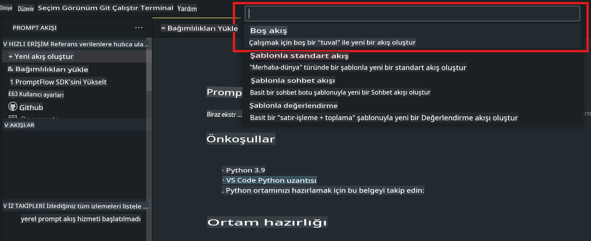
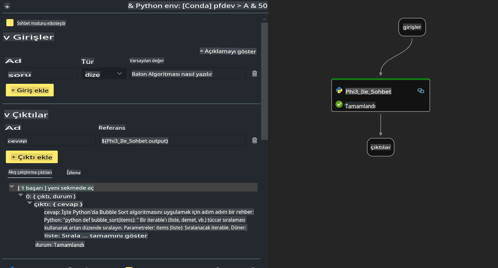
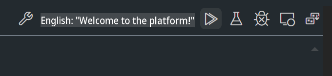

# **Lab 2 - AIPC'de Phi-3-mini ile Prompt flow Çalıştırma**

## **Prompt flow Nedir?**

Prompt flow, fikir aşamasından prototip oluşturmaya, test etmeye, değerlendirmeye, üretime geçirmeye ve izlemeye kadar, LLM tabanlı yapay zeka uygulamalarının uçtan uca geliştirme döngüsünü kolaylaştırmak için tasarlanmış bir geliştirme araçları setidir. Bu araç, prompt mühendisliğini çok daha kolay hale getirir ve üretim kalitesinde LLM uygulamaları oluşturmanıza olanak tanır.

Prompt flow ile şunları yapabilirsiniz:

- LLM'leri, promptları, Python kodunu ve diğer araçları birleştirerek çalıştırılabilir iş akışları oluşturabilirsiniz.

- Özellikle LLM'lerle olan etkileşimlerinizi kolayca hata ayıklayabilir ve yineleyebilirsiniz.

- İş akışlarınızı değerlendirebilir, daha büyük veri kümeleriyle kalite ve performans ölçümleri hesaplayabilirsiniz.

- Test ve değerlendirme süreçlerini CI/CD sisteminize entegre ederek iş akışınızın kalitesini garanti altına alabilirsiniz.

- İş akışlarınızı seçtiğiniz servis platformuna dağıtabilir veya uygulamanızın kod tabanına kolayca entegre edebilirsiniz.

- (Opsiyonel ancak şiddetle tavsiye edilir) Azure AI üzerindeki Prompt flow'un bulut versiyonundan faydalanarak ekibinizle iş birliği yapabilirsiniz.


## **Apple Silicon Üzerinde Kod Üretim Akışları Oluşturma**

***Not***: Eğer ortam kurulumunu tamamlamadıysanız, lütfen [Lab 0 - Kurulumlar](./01.Installations.md) bağlantısını ziyaret edin.

1. Visual Studio Code'da Prompt flow Eklentisini açın ve boş bir akış projesi oluşturun.



2. Girdi ve Çıktı parametreleri ekleyin ve yeni bir akış olarak Python Kodunu ekleyin.



Bu yapıyı (flow.dag.yaml) referans alarak akışınızı oluşturabilirsiniz.

```yaml

inputs:
  prompt:
    type: string
    default: Write python code for Fibonacci serie. Please use markdown as output
outputs:
  result:
    type: string
    reference: ${gen_code_by_phi3.output}
nodes:
- name: gen_code_by_phi3
  type: python
  source:
    type: code
    path: gen_code_by_phi3.py
  inputs:
    prompt: ${inputs.prompt}


```

3. Phi-3-mini'yi Kuantize Edin

SLM'yi yerel cihazlarda daha iyi çalıştırmayı hedefliyoruz. Genelde modeli kuantize ederiz (INT4, FP16, FP32).

```bash

python -m mlx_lm.convert --hf-path microsoft/Phi-3-mini-4k-instruct

```

**Not:** Varsayılan klasör mlx_model'dir.

4. ***Chat_With_Phi3.py*** dosyasına kod ekleyin.

```python


from promptflow import tool

from mlx_lm import load, generate


# The inputs section will change based on the arguments of the tool function, after you save the code
# Adding type to arguments and return value will help the system show the types properly
# Please update the function name/signature per need
@tool
def my_python_tool(prompt: str) -> str:

    model_id = './mlx_model_phi3_mini'

    model, tokenizer = load(model_id)

    # <|user|>\nWrite python code for Fibonacci serie. Please use markdown as output<|end|>\n<|assistant|>

    response = generate(model, tokenizer, prompt="<|user|>\n" + prompt  + "<|end|>\n<|assistant|>", max_tokens=2048, verbose=True)

    return response


```

4. Kod üretiminin doğru çalışıp çalışmadığını kontrol etmek için Debug veya Run'dan akışı test edebilirsiniz.



5. Terminalde geliştirme API'si olarak akışı çalıştırın.

```

pf flow serve --source ./ --port 8080 --host localhost   

```

Bunu Postman / Thunder Client'da test edebilirsiniz.


### **Notlar**

1. İlk çalıştırma uzun sürer. Phi-3 modelini Hugging Face CLI'dan indirmeniz önerilir.

2. Intel NPU'nun sınırlı işlem gücünü göz önünde bulundurarak, Phi-3-mini-4k-instruct kullanmanız tavsiye edilir.

3. INT4 dönüştürmesi için Intel NPU Hızlandırmayı kullanıyoruz, ancak servisi yeniden çalıştırırsanız önbellek ve nc_workshop klasörlerini silmeniz gerekir.


## **Kaynaklar**

1. Promptflow'u öğrenin [https://microsoft.github.io/promptflow/](https://microsoft.github.io/promptflow/)

2. Intel NPU Hızlandırmayı öğrenin [https://github.com/intel/intel-npu-acceleration-library](https://github.com/intel/intel-npu-acceleration-library)

3. Örnek Kod, indirin [Yerel NPU Agent Örnek Kodu](../../../../../../../../../code/07.Lab/01/AIPC/local-npu-agent)

**Feragatname**:  
Bu belge, yapay zeka tabanlı makine çeviri hizmetleri kullanılarak çevrilmiştir. Doğruluk için çaba göstersek de, otomatik çevirilerin hata veya yanlışlıklar içerebileceğini lütfen unutmayın. Orijinal belgenin kendi dilindeki hali yetkili kaynak olarak kabul edilmelidir. Kritik bilgiler için profesyonel insan çevirisi önerilir. Bu çevirinin kullanımından kaynaklanan herhangi bir yanlış anlama veya yanlış yorumlamadan sorumlu değiliz.