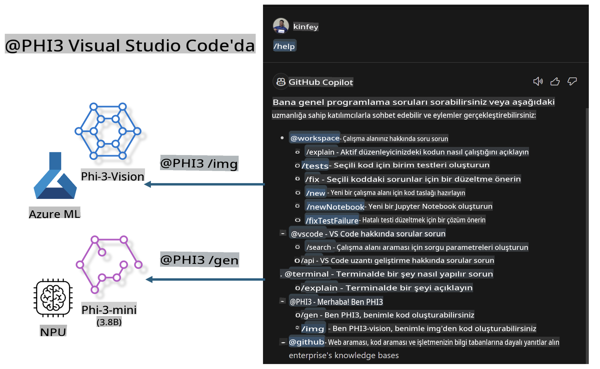

# **Kendi Visual Studio Code GitHub Copilot Chat'inizi Microsoft Phi-3 Ailesi ile Oluşturun**

GitHub Copilot Chat'teki çalışma alanı ajanını kullandınız mı? Kendi ekibinizin kod ajanını oluşturmak ister misiniz? Bu uygulamalı laboratuvar, açık kaynak modeli bir araya getirerek kurumsal düzeyde bir kod iş ajanı oluşturmayı amaçlıyor.

## **Temel Bilgiler**

### **Neden Microsoft Phi-3'ü Seçmelisiniz**

Phi-3, phi-3-mini, phi-3-small ve phi-3-medium gibi farklı eğitim parametrelerine dayalı olarak metin üretimi, diyalog tamamlama ve kod üretimi için tasarlanmış bir seri ailesidir. Ayrıca Vision'a dayalı phi-3-vision da bulunmaktadır. Bu modeller, işletmeler veya farklı ekipler için çevrimdışı üretken yapay zeka çözümleri oluşturmak için uygundur.

Bu bağlantıyı okumanız önerilir: [https://github.com/microsoft/PhiCookBook/blob/main/md/01.Introduction/01/01.PhiFamily.md](https://github.com/microsoft/PhiCookBook/blob/main/md/01.Introduction/01/01.PhiFamily.md)

### **Microsoft GitHub Copilot Chat**

GitHub Copilot Chat uzantısı, GitHub Copilot ile etkileşim kurmanızı ve doğrudan VS Code içinde kodla ilgili sorulara cevap almanızı sağlayan bir sohbet arayüzü sunar. Bu sayede dokümantasyon arasında gezmenize veya çevrimiçi forumlarda arama yapmanıza gerek kalmaz.

Copilot Chat, üretilen yanıta açıklık kazandırmak için sözdizimi vurgulama, girinti ve diğer biçimlendirme özelliklerini kullanabilir. Kullanıcının sorduğu sorunun türüne bağlı olarak, sonuçta kaynak kod dosyaları veya dokümantasyon gibi yanıtın oluşturulmasında kullanılan bağlamlara bağlantılar veya VS Code işlevlerine erişim düğmeleri yer alabilir.

- Copilot Chat, geliştirici akışınıza entegre olur ve ihtiyacınız olan yerde size yardımcı olur:

- Editör veya terminalden doğrudan bir sohbet başlatarak kod yazarken yardım alın

- Sohbet görünümünü kullanarak her zaman yanınızda bir yapay zeka asistanı bulundurun

- Hızlı Sohbet'i başlatarak hızlı bir soru sorun ve işinize geri dönün

GitHub Copilot Chat'i çeşitli senaryolarda kullanabilirsiniz, örneğin:

- Bir sorunu en iyi şekilde çözmek için kodlama sorularına yanıt vermek

- Başkasının kodunu açıklamak ve geliştirme önerilerinde bulunmak

- Kod düzeltmeleri önermek

- Birim test senaryoları oluşturmak

- Kod dokümantasyonu oluşturmak

Bu bağlantıyı okumanız önerilir: [https://code.visualstudio.com/docs/copilot/copilot-chat](https://code.visualstudio.com/docs/copilot/copilot-chat?WT.mc_id=aiml-137032-kinfeylo)

### **Microsoft GitHub Copilot Chat @workspace**

Copilot Chat'te **@workspace** özelliğini referans almak, tüm kod tabanınız hakkında sorular sormanıza olanak tanır. Sorunun içeriğine bağlı olarak, Copilot ilgili dosyaları ve sembolleri akıllıca bulur ve yanıtında bunları bağlantılar ve kod örnekleri olarak kullanır.

**@workspace**, bir geliştiricinin VS Code'da bir kod tabanında gezinirken kullandığı kaynakları arar:

- Çalışma alanındaki tüm dosyalar (.gitignore dosyası tarafından yok sayılanlar hariç)

- İç içe klasör ve dosya adlarıyla dizin yapısı

- Çalışma alanı bir GitHub deposuysa ve kod aramasıyla indekslenmişse, GitHub'ın kod arama dizini

- Çalışma alanındaki semboller ve tanımlar

- Aktif editörde seçili veya görünen metin

Not: Bir dosya açıksa veya yok sayılan bir dosyada metin seçilmişse, .gitignore göz ardı edilir.

Bu bağlantıyı okumanız önerilir: [[https://code.visualstudio.com/docs/copilot/copilot-chat](https://code.visualstudio.com/docs/copilot/workspace-context?WT.mc_id=aiml-137032-kinfeylo)]

## **Bu Laboratuvar Hakkında Daha Fazla Bilgi**

GitHub Copilot, işletmelerin programlama verimliliğini büyük ölçüde artırdı ve her işletme GitHub Copilot'un ilgili işlevlerini özelleştirmek istiyor. Birçok işletme, kendi iş senaryolarına ve açık kaynak modellere dayalı olarak GitHub Copilot'a benzer Uzantılar özelleştirdi. İşletmeler için özelleştirilmiş Uzantılar daha kolay kontrol edilebilir, ancak bu aynı zamanda kullanıcı deneyimini de etkiler. Sonuçta, GitHub Copilot genel senaryolar ve profesyonellik konusunda daha güçlü işlevlere sahiptir. Deneyim tutarlı tutulabilirse, işletmenin kendi Uzantısını özelleştirmesi daha iyi olur. GitHub Copilot Chat, işletmelerin Sohbet deneyimini genişletmesi için ilgili API'ler sağlar. Tutarlı bir deneyim sağlamak ve özelleştirilmiş işlevlere sahip olmak daha iyi bir kullanıcı deneyimidir.

Bu laboratuvar, Phi-3 modelini yerel NPU ve Azure hibritiyle birleştirerek GitHub Copilot Chat'te ***@PHI3*** adlı özel bir Ajan oluşturmayı amaçlar. Bu ajan, kurumsal geliştiricilere kod üretimini tamamlamada ***(@PHI3 /gen)*** ve görüntülere dayalı kod üretiminde ***(@PHI3 /img)*** yardımcı olur.

### ***Not:*** 

Bu laboratuvar şu anda Intel CPU ve Apple Silicon'un AIPC'sinde uygulanmıştır. Qualcomm'un NPU sürümü için güncellemeler yapmaya devam edeceğiz.

## **Laboratuvar**

| Adı | Açıklama | AIPC | Apple |
| ------------ | ----------- | -------- |-------- |
| Lab0 - Kurulumlar (✅) | İlgili ortamları ve kurulum araçlarını yapılandırma ve kurma | [Git](./HOL/AIPC/01.Installations.md) |[Git](./HOL/Apple/01.Installations.md) |
| Lab1 - Phi-3-mini ile Prompt flow'u çalıştırın (✅) | AIPC / Apple Silicon ile birleştirilmiş, Phi-3-mini ile yerel NPU kullanarak kod üretimi oluşturma | [Git](./HOL/AIPC/02.PromptflowWithNPU.md) |  [Git](./HOL/Apple/02.PromptflowWithMLX.md) |
| Lab2 - Phi-3-vision'ı Azure Machine Learning Service'de Dağıtma (✅) | Azure Machine Learning Service'in Model Catalog - Phi-3-vision görüntüsünü dağıtarak kod üretimi | [Git](./HOL/AIPC/03.DeployPhi3VisionOnAzure.md) |[Git](./HOL/Apple/03.DeployPhi3VisionOnAzure.md) |
| Lab3 - GitHub Copilot Chat'te bir @phi-3 ajanı oluşturun (✅)  | GitHub Copilot Chat'te özel bir Phi-3 ajanı oluşturarak kod üretimi, grafik üretimi kodu, RAG vb. işlemleri tamamlayın | [Git](./HOL/AIPC/04.CreatePhi3AgentInVSCode.md) | [Git](./HOL/Apple/04.CreatePhi3AgentInVSCode.md) |
| Örnek Kod (✅)  | Örnek kodu indirin | [Git](../../../../../../../code/07.Lab/01/AIPC) | [Git](../../../../../../../code/07.Lab/01/Apple) |

## **Kaynaklar**

1. Phi-3 Cookbook [https://github.com/microsoft/Phi-3CookBook](https://github.com/microsoft/Phi-3CookBook)

2. GitHub Copilot hakkında daha fazla bilgi edinin [https://learn.microsoft.com/training/paths/copilot/](https://learn.microsoft.com/training/paths/copilot/?WT.mc_id=aiml-137032-kinfeylo)

3. GitHub Copilot Chat hakkında daha fazla bilgi edinin [https://learn.microsoft.com/training/paths/accelerate-app-development-using-github-copilot/](https://learn.microsoft.com/training/paths/accelerate-app-development-using-github-copilot/?WT.mc_id=aiml-137032-kinfeylo)

4. GitHub Copilot Chat API hakkında daha fazla bilgi edinin [https://code.visualstudio.com/api/extension-guides/chat](https://code.visualstudio.com/api/extension-guides/chat?WT.mc_id=aiml-137032-kinfeylo)

5. Azure AI Foundry hakkında daha fazla bilgi edinin [https://learn.microsoft.com/training/paths/create-custom-copilots-ai-studio/](https://learn.microsoft.com/training/paths/create-custom-copilots-ai-studio/?WT.mc_id=aiml-137032-kinfeylo)

6. Azure AI Foundry'nin Model Catalog'u hakkında daha fazla bilgi edinin [https://learn.microsoft.com/azure/ai-studio/how-to/model-catalog-overview](https://learn.microsoft.com/azure/ai-studio/how-to/model-catalog-overview)

**Feragatname**:  
Bu belge, yapay zeka tabanlı makine çeviri hizmetleri kullanılarak çevrilmiştir. Doğruluk için çaba göstersek de, otomatik çevirilerin hata veya yanlışlıklar içerebileceğini lütfen unutmayın. Orijinal belgenin kendi dilindeki hali, bağlayıcı kaynak olarak kabul edilmelidir. Kritik bilgiler için profesyonel insan çevirisi önerilir. Bu çevirinin kullanımından kaynaklanan herhangi bir yanlış anlama veya yanlış yorumlama durumunda sorumluluk kabul edilmez.