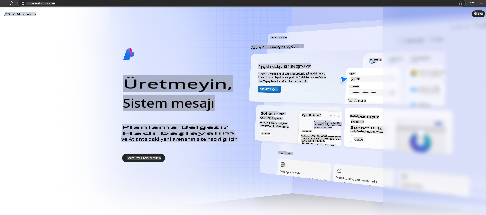

# **Azure AI Foundry'de Phi-3 Kullanımı**

Üretken Yapay Zeka'nın gelişimiyle, farklı LLM ve SLM'leri yönetmek, kurumsal veri entegrasyonu sağlamak, ince ayar/RAG işlemleri yapmak ve LLM ile SLM entegre edildikten sonra farklı kurumsal işlerin değerlendirilmesi gibi işlemleri tek bir platform üzerinden gerçekleştirmeyi hedefliyoruz. Böylece üretken yapay zeka uygulamaları daha akıllıca hayata geçirilebilir. [Azure AI Foundry](https://ai.azure.com), kurumsal düzeyde bir üretken yapay zeka uygulama platformudur.

Azure AI Foundry ile büyük dil modeli (LLM) yanıtlarını değerlendirebilir ve daha iyi performans için prompt flow ile prompt uygulama bileşenlerini organize edebilirsiniz. Platform, kavram ispatlarını kolaylıkla tam teşekküllü üretime dönüştürmek için ölçeklenebilirlik sağlar. Sürekli izleme ve iyileştirme uzun vadeli başarıyı destekler.

Basit adımlarla Phi-3 modelini Azure AI Foundry'de hızlıca dağıtabilir ve ardından Phi-3 ile ilgili Playground/Chat, ince ayar, değerlendirme gibi işlemleri Azure AI Foundry'de gerçekleştirebilirsiniz.

## **1. Hazırlık**

Eğer bilgisayarınızda [Azure Developer CLI](https://learn.microsoft.com/azure/developer/azure-developer-cli/overview?WT.mc_id=aiml-138114-kinfeylo) kuruluysa, bu şablonu kullanmak yeni bir dizinde bu komutu çalıştırmak kadar basittir.

## Manuel Oluşturma

Microsoft Azure AI Foundry projesi ve hub'ı oluşturmak, yapay zeka çalışmalarınızı organize etmek ve yönetmek için harika bir yöntemdir. İşte başlangıç için adım adım bir kılavuz:

### Azure AI Foundry'de Proje Oluşturma

1. **Azure AI Foundry'ye gidin**: Azure AI Foundry portalına giriş yapın.
2. **Bir Proje Oluşturun**:
   - Eğer bir projedeyseniz, sayfanın sol üst kısmındaki "Azure AI Foundry" seçeneğini tıklayarak Ana Sayfa'ya gidin.
   - "+ Proje oluştur" seçeneğini seçin.
   - Proje için bir isim girin.
   - Eğer bir hub'ınız varsa, varsayılan olarak seçilecektir. Birden fazla hub'a erişiminiz varsa, açılır menüden farklı bir hub seçebilirsiniz. Yeni bir hub oluşturmak istiyorsanız, "Yeni hub oluştur" seçeneğini seçip bir isim girin.
   - "Oluştur" seçeneğini tıklayın.

### Azure AI Foundry'de Hub Oluşturma

1. **Azure AI Foundry'ye gidin**: Azure hesabınızla giriş yapın.
2. **Bir Hub Oluşturun**:
   - Sol menüden Yönetim merkezi seçeneğini seçin.
   - "Tüm kaynaklar"ı seçin, ardından "+ Yeni proje"nin yanındaki aşağı okuna tıklayın ve "+ Yeni hub" seçeneğini seçin.
   - "Yeni bir hub oluştur" diyalog kutusunda hub'ınız için bir isim (örneğin, contoso-hub) girin ve diğer alanları istediğiniz gibi düzenleyin.
   - "İleri" seçeneğini tıklayın, bilgileri gözden geçirin ve ardından "Oluştur" seçeneğini seçin.

Daha ayrıntılı talimatlar için resmi [Microsoft dokümantasyonuna](https://learn.microsoft.com/azure/ai-studio/how-to/create-projects) başvurabilirsiniz.

Başarıyla oluşturduktan sonra, oluşturduğunuz stüdyoya [ai.azure.com](https://ai.azure.com/) üzerinden erişebilirsiniz.

Bir AI Foundry üzerinde birden fazla proje bulunabilir. AI Foundry'de bir proje oluşturarak hazırlık yapın.

Azure AI Foundry [Hızlı Başlangıçlar](https://learn.microsoft.com/azure/ai-studio/quickstarts/get-started-code)

## **2. Azure AI Foundry'de Phi Modeli Dağıtımı**

Projenin Keşfet seçeneğine tıklayarak Model Kataloğu'na girin ve Phi-3'ü seçin.

Phi-3-mini-4k-instruct seçeneğini seçin.

Phi-3-mini-4k-instruct modelini dağıtmak için 'Deploy' seçeneğine tıklayın.

> [!NOTE]
>
> Dağıtım sırasında işlem gücünü seçebilirsiniz.

## **3. Azure AI Foundry'de Phi ile Playground Sohbeti**

Dağıtım sayfasına gidin, Playground'u seçin ve Azure AI Foundry'deki Phi-3 ile sohbet edin.

## **4. Azure AI Foundry'den Model Dağıtımı**

Azure Model Kataloğu'ndan bir modeli dağıtmak için şu adımları izleyebilirsiniz:

- Azure AI Foundry'ye giriş yapın.
- Azure AI Foundry model kataloğundan dağıtmak istediğiniz modeli seçin.
- Modelin Detaylar sayfasında "Deploy" seçeneğini ve ardından Azure AI Content Safety ile Serverless API'yi seçin.
- Modellerinizi dağıtmak istediğiniz projeyi seçin. Serverless API teklifini kullanmak için çalışma alanınızın East US 2 veya Sweden Central bölgesine ait olması gerekir. Dağıtım adını özelleştirebilirsiniz.
- Dağıtım sihirbazında, Fiyatlandırma ve koşulları inceleyin.
- "Deploy" seçeneğini seçin. Dağıtım hazır olana kadar bekleyin ve ardından Dağıtımlar sayfasına yönlendirilirsiniz.
- Modelle etkileşim kurmaya başlamak için "Playground'da aç" seçeneğini seçin.
- Dağıtımlar sayfasına geri dönebilir, dağıtımı seçebilir ve dağıtımı çağırmak ve sonuçlar oluşturmak için kullanabileceğiniz hedef URL'si ve Gizli Anahtar'ı not edebilirsiniz.
- Daima hedef URL'si ve erişim anahtarları gibi ayrıntıları Bul sekmesine giderek ve Bileşenler bölümünden Dağıtımlar'ı seçerek bulabilirsiniz.

> [!NOTE]
> Bu adımları gerçekleştirmek için hesabınızın Resource Group üzerinde Azure AI Developer rolü izinlerine sahip olması gerektiğini unutmayın.

## **5. Azure AI Foundry'de Phi API Kullanımı**

Postman GET ile https://{Proje adınız}.region.inference.ml.azure.com/swagger.json adresine erişebilir ve Key ile birlikte sunulan arayüzleri öğrenebilirsiniz.

İstek parametrelerini ve yanıt parametrelerini oldukça kolay bir şekilde alabilirsiniz.

**Feragatname**:  
Bu belge, yapay zeka tabanlı makine çeviri hizmetleri kullanılarak çevrilmiştir. Doğruluk için çaba göstersek de, otomatik çevirilerin hata veya yanlışlıklar içerebileceğini lütfen unutmayın. Orijinal belgenin kendi dilindeki hali, bağlayıcı ve kesin kaynak olarak kabul edilmelidir. Kritik bilgiler için profesyonel insan çevirisi önerilir. Bu çevirinin kullanımından kaynaklanan herhangi bir yanlış anlama veya yanlış yorumlamadan sorumlu değiliz.