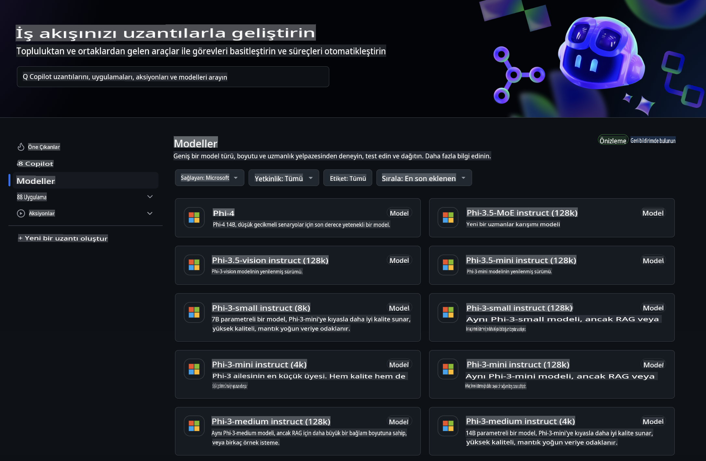
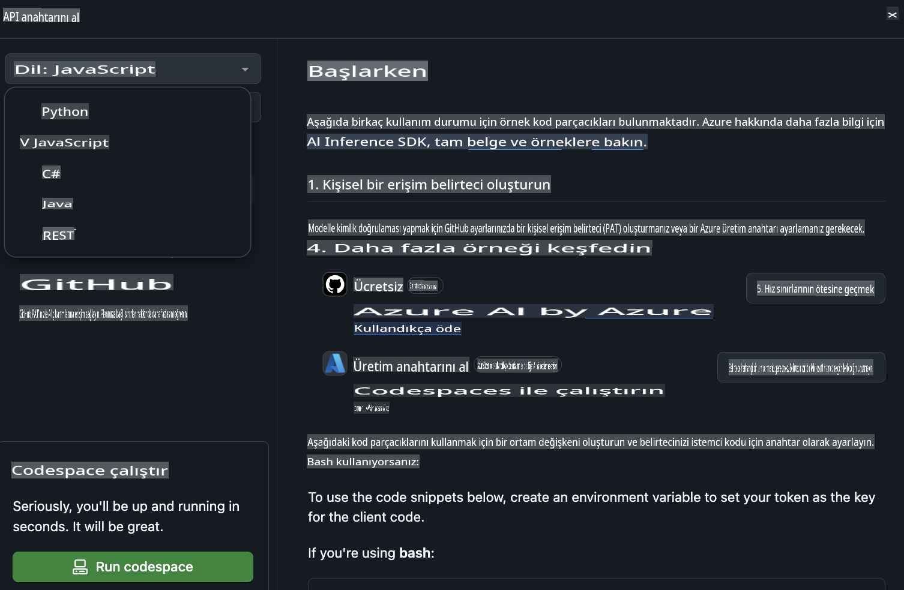
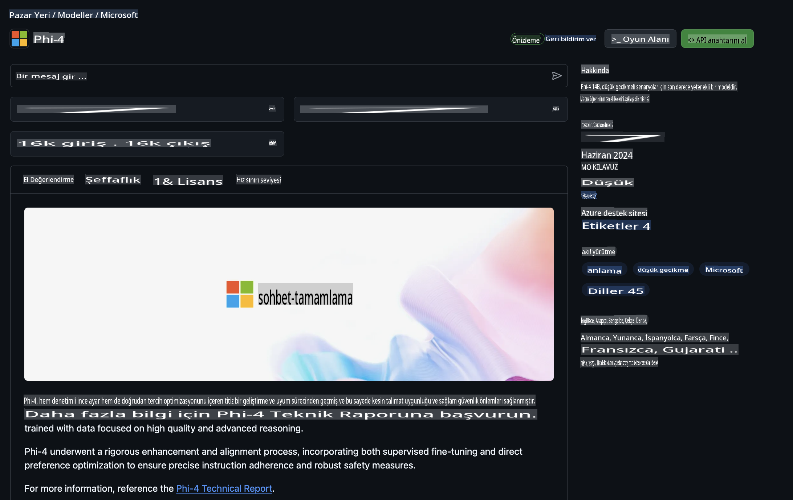

## GitHub Modeller - Sınırlı Genel Beta

[GitHub Modeller](https://github.com/marketplace/models)'e hoş geldiniz! Azure AI üzerinde barındırılan yapay zeka modellerini keşfetmeye hazırız.



GitHub Modeller'de mevcut olan modeller hakkında daha fazla bilgi için [GitHub Model Marketplace](https://github.com/marketplace/models)'i ziyaret edin.

## Mevcut Modeller

Her model için özel bir deneme alanı ve örnek kod bulunmaktadır.


### GitHub Model Kataloğundaki Phi-3 Modelleri

[Phi-3-Medium-128k-Instruct](https://github.com/marketplace/models/azureml/Phi-3-medium-128k-instruct)

[Phi-3-medium-4k-instruct](https://github.com/marketplace/models/azureml/Phi-3-medium-4k-instruct)

[Phi-3-mini-128k-instruct](https://github.com/marketplace/models/azureml/Phi-3-mini-128k-instruct)

[Phi-3-mini-4k-instruct](https://github.com/marketplace/models/azureml/Phi-3-mini-4k-instruct)

[Phi-3-small-128k-instruct](https://github.com/marketplace/models/azureml/Phi-3-small-128k-instruct)

[Phi-3-small-8k-instruct](https://github.com/marketplace/models/azureml/Phi-3-small-8k-instruct)

## Başlarken

Çalıştırmaya hazır birkaç temel örnek bulunmaktadır. Bu örnekleri samples dizininde bulabilirsiniz. Favori programlama dilinize doğrudan geçmek isterseniz, örnekler aşağıdaki dillerde mevcuttur:

- Python
- JavaScript
- cURL

Ayrıca, örnekleri ve modelleri çalıştırmak için özel bir Codespaces Ortamı da bulunmaktadır.



## Örnek Kod

Aşağıda birkaç kullanım durumu için örnek kod parçacıkları bulunmaktadır. Azure AI Inference SDK hakkında daha fazla bilgi için tam belgeleri ve örnekleri inceleyin.

## Kurulum

1. Kişisel bir erişim belirteci oluşturun  
Belirtece herhangi bir izin vermeniz gerekmez. Belirtecin bir Microsoft hizmetine gönderileceğini unutmayın.

Aşağıdaki kod parçacıklarını kullanmak için, belirtecinizi istemci kodu için anahtar olarak ayarlamak üzere bir ortam değişkeni oluşturun.

Bash kullanıyorsanız:  
```
export GITHUB_TOKEN="<your-github-token-goes-here>"
```  
Powershell kullanıyorsanız:  
```
$Env:GITHUB_TOKEN="<your-github-token-goes-here>"
```  

Windows komut istemcisi kullanıyorsanız:  
```
set GITHUB_TOKEN=<your-github-token-goes-here>
```  

## Python Örneği

### Bağımlılıkları yükleyin  
Azure AI Inference SDK'sını pip ile yükleyin (Gereksinim: Python >=3.8):  

```
pip install azure-ai-inference
```  

### Temel bir örnek çalıştırın  

Bu örnek, sohbet tamamlama API'sine temel bir çağrıyı göstermektedir. GitHub AI model çıkarım uç noktasını ve GitHub belirtecinizi kullanmaktadır. Çağrı eş zamanlıdır.

```
import os
from azure.ai.inference import ChatCompletionsClient
from azure.ai.inference.models import SystemMessage, UserMessage
from azure.core.credentials import AzureKeyCredential

endpoint = "https://models.inference.ai.azure.com"
# Replace Model_Name 
model_name = "Phi-3-small-8k-instruct"
token = os.environ["GITHUB_TOKEN"]

client = ChatCompletionsClient(
    endpoint=endpoint,
    credential=AzureKeyCredential(token),
)

response = client.complete(
    messages=[
        SystemMessage(content="You are a helpful assistant."),
        UserMessage(content="What is the capital of France?"),
    ],
    model=model_name,
    temperature=1.,
    max_tokens=1000,
    top_p=1.
)

print(response.choices[0].message.content)
```  

### Çok adımlı bir konuşma yürütün  

Bu örnek, sohbet tamamlama API'siyle çok adımlı bir konuşmayı göstermektedir. Modeli bir sohbet uygulaması için kullanırken, bu konuşmanın geçmişini yönetmeniz ve en son mesajları modele göndermeniz gerekecektir.

```
import os
from azure.ai.inference import ChatCompletionsClient
from azure.ai.inference.models import AssistantMessage, SystemMessage, UserMessage
from azure.core.credentials import AzureKeyCredential

token = os.environ["GITHUB_TOKEN"]
endpoint = "https://models.inference.ai.azure.com"
# Replace Model_Name
model_name = "Phi-3-small-8k-instruct"

client = ChatCompletionsClient(
    endpoint=endpoint,
    credential=AzureKeyCredential(token),
)

messages = [
    SystemMessage(content="You are a helpful assistant."),
    UserMessage(content="What is the capital of France?"),
    AssistantMessage(content="The capital of France is Paris."),
    UserMessage(content="What about Spain?"),
]

response = client.complete(messages=messages, model=model_name)

print(response.choices[0].message.content)
```  

### Çıktıyı akış olarak alın  

Daha iyi bir kullanıcı deneyimi için modelin yanıtını akış olarak almanız, böylece ilk token'ın erken görünmesini sağlamanız ve uzun yanıtlar için beklemekten kaçınmanız gerekir.

```
import os
from azure.ai.inference import ChatCompletionsClient
from azure.ai.inference.models import SystemMessage, UserMessage
from azure.core.credentials import AzureKeyCredential

token = os.environ["GITHUB_TOKEN"]
endpoint = "https://models.inference.ai.azure.com"
# Replace Model_Name
model_name = "Phi-3-small-8k-instruct"

client = ChatCompletionsClient(
    endpoint=endpoint,
    credential=AzureKeyCredential(token),
)

response = client.complete(
    stream=True,
    messages=[
        SystemMessage(content="You are a helpful assistant."),
        UserMessage(content="Give me 5 good reasons why I should exercise every day."),
    ],
    model=model_name,
)

for update in response:
    if update.choices:
        print(update.choices[0].delta.content or "", end="")

client.close()
```  

## JavaScript  

### Bağımlılıkları yükleyin  

Node.js'i yükleyin.

Aşağıdaki metin satırlarını kopyalayın ve klasörünüzün içine package.json adlı bir dosya olarak kaydedin.

```
{
  "type": "module",
  "dependencies": {
    "@azure-rest/ai-inference": "latest",
    "@azure/core-auth": "latest",
    "@azure/core-sse": "latest"
  }
}
```  

Not: @azure/core-sse yalnızca sohbet tamamlama yanıtını akış olarak alırken gereklidir.

Bu klasörde bir terminal penceresi açın ve npm install komutunu çalıştırın.

Aşağıdaki kod parçacıklarının her biri için içeriği sample.js adlı bir dosyaya kopyalayın ve node sample.js ile çalıştırın.

### Temel bir örnek çalıştırın  

Bu örnek, sohbet tamamlama API'sine temel bir çağrıyı göstermektedir. GitHub AI model çıkarım uç noktasını ve GitHub belirtecinizi kullanmaktadır. Çağrı eş zamanlıdır.

```
import ModelClient from "@azure-rest/ai-inference";
import { AzureKeyCredential } from "@azure/core-auth";

const token = process.env["GITHUB_TOKEN"];
const endpoint = "https://models.inference.ai.azure.com";
// Update your modelname
const modelName = "Phi-3-small-8k-instruct";

export async function main() {

  const client = new ModelClient(endpoint, new AzureKeyCredential(token));

  const response = await client.path("/chat/completions").post({
    body: {
      messages: [
        { role:"system", content: "You are a helpful assistant." },
        { role:"user", content: "What is the capital of France?" }
      ],
      model: modelName,
      temperature: 1.,
      max_tokens: 1000,
      top_p: 1.
    }
  });

  if (response.status !== "200") {
    throw response.body.error;
  }
  console.log(response.body.choices[0].message.content);
}

main().catch((err) => {
  console.error("The sample encountered an error:", err);
});
```  

### Çok adımlı bir konuşma yürütün  

Bu örnek, sohbet tamamlama API'siyle çok adımlı bir konuşmayı göstermektedir. Modeli bir sohbet uygulaması için kullanırken, bu konuşmanın geçmişini yönetmeniz ve en son mesajları modele göndermeniz gerekecektir.

```
import ModelClient from "@azure-rest/ai-inference";
import { AzureKeyCredential } from "@azure/core-auth";

const token = process.env["GITHUB_TOKEN"];
const endpoint = "https://models.inference.ai.azure.com";
// Update your modelname
const modelName = "Phi-3-small-8k-instruct";

export async function main() {

  const client = new ModelClient(endpoint, new AzureKeyCredential(token));

  const response = await client.path("/chat/completions").post({
    body: {
      messages: [
        { role: "system", content: "You are a helpful assistant." },
        { role: "user", content: "What is the capital of France?" },
        { role: "assistant", content: "The capital of France is Paris." },
        { role: "user", content: "What about Spain?" },
      ],
      model: modelName,
    }
  });

  if (response.status !== "200") {
    throw response.body.error;
  }

  for (const choice of response.body.choices) {
    console.log(choice.message.content);
  }
}

main().catch((err) => {
  console.error("The sample encountered an error:", err);
});
```  

### Çıktıyı akış olarak alın  
Daha iyi bir kullanıcı deneyimi için modelin yanıtını akış olarak almanız, böylece ilk token'ın erken görünmesini sağlamanız ve uzun yanıtlar için beklemekten kaçınmanız gerekir.

```
import ModelClient from "@azure-rest/ai-inference";
import { AzureKeyCredential } from "@azure/core-auth";
import { createSseStream } from "@azure/core-sse";

const token = process.env["GITHUB_TOKEN"];
const endpoint = "https://models.inference.ai.azure.com";
// Update your modelname
const modelName = "Phi-3-small-8k-instruct";

export async function main() {

  const client = new ModelClient(endpoint, new AzureKeyCredential(token));

  const response = await client.path("/chat/completions").post({
    body: {
      messages: [
        { role: "system", content: "You are a helpful assistant." },
        { role: "user", content: "Give me 5 good reasons why I should exercise every day." },
      ],
      model: modelName,
      stream: true
    }
  }).asNodeStream();

  const stream = response.body;
  if (!stream) {
    throw new Error("The response stream is undefined");
  }

  if (response.status !== "200") {
    stream.destroy();
    throw new Error(`Failed to get chat completions, http operation failed with ${response.status} code`);
  }

  const sseStream = createSseStream(stream);

  for await (const event of sseStream) {
    if (event.data === "[DONE]") {
      return;
    }
    for (const choice of (JSON.parse(event.data)).choices) {
        process.stdout.write(choice.delta?.content ?? ``);
    }
  }
}

main().catch((err) => {
  console.error("The sample encountered an error:", err);
});
```  

## REST  

### Temel bir örnek çalıştırın  

Bir kabuğa aşağıdakileri yapıştırın:

```
curl -X POST "https://models.inference.ai.azure.com/chat/completions" \
    -H "Content-Type: application/json" \
    -H "Authorization: Bearer $GITHUB_TOKEN" \
    -d '{
        "messages": [
            {
                "role": "system",
                "content": "You are a helpful assistant."
            },
            {
                "role": "user",
                "content": "What is the capital of France?"
            }
        ],
        "model": "Phi-3-small-8k-instruct"
    }'
```  

### Çok adımlı bir konuşma yürütün  

Sohbet tamamlama API'sini çağırın ve sohbet geçmişini iletin:

```
curl -X POST "https://models.inference.ai.azure.com/chat/completions" \
    -H "Content-Type: application/json" \
    -H "Authorization: Bearer $GITHUB_TOKEN" \
    -d '{
        "messages": [
            {
                "role": "system",
                "content": "You are a helpful assistant."
            },
            {
                "role": "user",
                "content": "What is the capital of France?"
            },
            {
                "role": "assistant",
                "content": "The capital of France is Paris."
            },
            {
                "role": "user",
                "content": "What about Spain?"
            }
        ],
        "model": "Phi-3-small-8k-instruct"
    }'
```  

### Çıktıyı akış olarak alın  

Bu, uç noktayı çağırma ve yanıtı akış olarak alma örneğidir.

```
curl -X POST "https://models.inference.ai.azure.com/chat/completions" \
    -H "Content-Type: application/json" \
    -H "Authorization: Bearer $GITHUB_TOKEN" \
    -d '{
        "messages": [
            {
                "role": "system",
                "content": "You are a helpful assistant."
            },
            {
                "role": "user",
                "content": "Give me 5 good reasons why I should exercise every day."
            }
        ],
        "stream": true,
        "model": "Phi-3-small-8k-instruct"
    }'
```  

## GitHub Modeller için ÜCRETSİZ Kullanım ve Hız Sınırları



[Oyun alanı ve ücretsiz API kullanımı için hız sınırları](https://docs.github.com/en/github-models/prototyping-with-ai-models#rate-limits), modellerle denemeler yapmanıza ve AI uygulamanızın prototipini oluşturmanıza yardımcı olmak için tasarlanmıştır. Bu sınırların ötesinde kullanım ve uygulamanızı ölçeklendirmek için bir Azure hesabından kaynak sağlamanız ve GitHub kişisel erişim belirteciniz yerine oradan kimlik doğrulaması yapmanız gerekir. Kodunuzda başka bir değişiklik yapmanız gerekmez. Azure AI'da ücretsiz katman sınırlarının ötesine nasıl geçileceğini öğrenmek için bu bağlantıyı kullanın.

### Bildirimler  

Bir modelle etkileşimde bulunurken yapay zeka ile deney yaptığınızı unutmayın, bu nedenle içerik hataları mümkün olabilir.

Bu özellik çeşitli sınırlarla (dakikada istek, günlük istek, istek başına token ve eş zamanlı istekler dahil) sınırlıdır ve üretim kullanım durumları için tasarlanmamıştır.

GitHub Modeller, Azure AI İçerik Güvenliği kullanır. Bu filtreler, GitHub Modeller deneyiminin bir parçası olarak devre dışı bırakılamaz. Modelleri ücretli bir hizmet aracılığıyla kullanmaya karar verirseniz, içerik filtrelerinizi gereksinimlerinize uygun şekilde yapılandırın.

Bu hizmet GitHub’ın Ön Sürüm Koşullarına tabidir.

**Feragatname**:  
Bu belge, yapay zeka tabanlı makine çeviri hizmetleri kullanılarak çevrilmiştir. Doğruluk için çaba göstersek de, otomatik çevirilerin hata veya yanlışlıklar içerebileceğini lütfen unutmayın. Belgenin orijinal dilindeki hali yetkili kaynak olarak kabul edilmelidir. Kritik bilgiler için profesyonel insan çevirisi önerilir. Bu çevirinin kullanımından kaynaklanabilecek yanlış anlama veya yanlış yorumlamalardan sorumlu değiliz.