# Azure AI Foundry ile Phi-3'u İnce Ayar Yapma

Microsoft’un Phi-3 Mini dil modelini Azure AI Foundry kullanarak nasıl ince ayar yapacağımızı keşfedelim. İnce ayar, Phi-3 Mini’yi belirli görevlere uyarlamanızı sağlar ve modeli daha güçlü ve bağlama duyarlı hale getirir.

## Dikkat Edilmesi Gerekenler

- **Yetenekler:** Hangi modellerin ince ayarı yapılabilir? Temel model hangi yeteneklere sahip olabilir?
- **Maliyet:** İnce ayar için fiyatlandırma modeli nedir?
- **Özelleştirilebilirlik:** Temel modeli ne kadar ve hangi yollarla değiştirebilirim?
- **Kullanım Kolaylığı:** İnce ayar nasıl gerçekleşir – özel kod yazmam gerekir mi? Kendi işlem gücümü getirmem gerekir mi?
- **Güvenlik:** İnce ayar yapılmış modellerin güvenlik riskleri olduğu bilinir – istenmeyen zararları önlemek için herhangi bir güvenlik önlemi var mı?

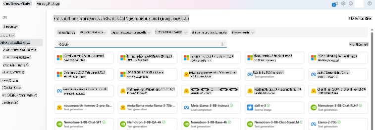

## İnce Ayar için Hazırlık

### Ön Gereksinimler

> [!NOTE]
> Phi-3 ailesi modelleri için kullandıkça öde modeliyle ince ayar teklifi yalnızca **East US 2** bölgelerinde oluşturulan hub'lar için geçerlidir.

- Bir Azure aboneliği. Eğer bir Azure aboneliğiniz yoksa, [ücretli bir Azure hesabı](https://azure.microsoft.com/pricing/purchase-options/pay-as-you-go) oluşturarak başlayabilirsiniz.

- Bir [AI Foundry projesi](https://ai.azure.com?WT.mc_id=aiml-138114-kinfeylo).
- Azure AI Foundry'deki işlemlere erişim sağlamak için Azure rol tabanlı erişim kontrolleri (Azure RBAC) kullanılır. Bu makaledeki adımları gerçekleştirmek için kullanıcı hesabınızın __Azure AI Developer rolü__ ile kaynak grubuna atanmış olması gerekir.

### Abonelik Sağlayıcısının Kaydedilmesi

Aboneliğin `Microsoft.Network` kaynak sağlayıcısına kayıtlı olduğunu doğrulayın.

1. [Azure portalına](https://portal.azure.com) giriş yapın.
1. Sol menüden **Abonelikler**'i seçin.
1. Kullanmak istediğiniz aboneliği seçin.
1. Sol menüden **AI proje ayarları** > **Kaynak sağlayıcılar**'ı seçin.
1. **Microsoft.Network**'ün kaynak sağlayıcılar listesinde olduğundan emin olun. Aksi takdirde ekleyin.

### Veri Hazırlığı

Modelinizi ince ayar yapmak için eğitim ve doğrulama verilerinizi hazırlayın. Eğitim ve doğrulama veri setleriniz, modelin nasıl performans göstermesini istediğinize dair giriş ve çıkış örneklerinden oluşur.

Tüm eğitim örneklerinizin çıkarım için beklenen formatı takip ettiğinden emin olun. Modellerin etkili bir şekilde ince ayar yapılması için dengeli ve çeşitli bir veri seti sağlanmalıdır.

Bu, veri dengesini korumayı, çeşitli senaryoları içermeyi ve eğitim verilerini gerçek dünya beklentilerine uyacak şekilde düzenli olarak güncellemeyi içerir. Bu süreç, daha doğru ve dengeli model yanıtlarına yol açar.

Farklı model türleri, farklı formatlarda eğitim verisi gerektirir.

### Sohbet Tamamlama

Kullandığınız eğitim ve doğrulama verileri **JSON Lines (JSONL)** belgesi formatında olmalıdır. `Phi-3-mini-128k-instruct` için ince ayar veri seti, Sohbet Tamamlama API'si tarafından kullanılan konuşma formatında biçimlendirilmelidir.

### Örnek Dosya Formatı

```json
    {"messages": [{"role": "system", "content": "You are an Xbox customer support agent whose primary goal is to help users with issues they are experiencing with their Xbox devices. You are friendly and concise. You only provide factual answers to queries, and do not provide answers that are not related to Xbox."}, {"role": "user", "content": "Is Xbox better than PlayStation?"}, {"role": "assistant", "content": "I apologize, but I cannot provide personal opinions. My primary job is to assist you with any issues related to your Xbox device. Do you have any Xbox-related issues that need addressing?"}]}
    {"messages": [{"role": "system", "content": "You are an Xbox customer support agent whose primary goal is to help users with issues they are experiencing with their Xbox devices. You are friendly and concise. You only provide factual answers to queries, and do not provide answers that are not related to Xbox."}, {"role": "user", "content": "Can I play PC games on my Xbox?"}, {"role": "assistant", "content": "While Xbox consoles don't natively support PC games, they can play an array of Xbox games, many of which are also available on PC. Can I assist you with finding games compatible with your Xbox device?"}]}
    {"messages": [{"role": "system", "content": "You are an Xbox customer support agent whose primary goal is to help users with issues they are experiencing with their Xbox devices. You are friendly and concise. You only provide factual answers to queries, and do not provide answers that are not related to Xbox."}, {"role": "user", "content": "I'm having trouble connecting my Xbox to the Wi-Fi."}, {"role": "assistant", "content": "No worries, let's go through the network settings on your Xbox. Can you please tell me what happens when you try to connect it to the Wi-Fi?"}]}
```

Desteklenen dosya türü JSON Lines'dır. Dosyalar varsayılan veri deposuna yüklenir ve projenizde kullanılabilir hale getirilir.

## Azure AI Foundry ile Phi-3'ü İnce Ayar Yapma

Azure AI Foundry, büyük dil modellerini kendi veri setlerinize uyarlamanıza olanak tanır. İnce ayar süreci, belirli görevler ve uygulamalar için özelleştirme ve optimizasyon sağlayarak önemli bir değer sunar. Bu süreç, geliştirilmiş performans, maliyet etkinliği, azaltılmış gecikme süresi ve özelleştirilmiş çıktılar sağlar.

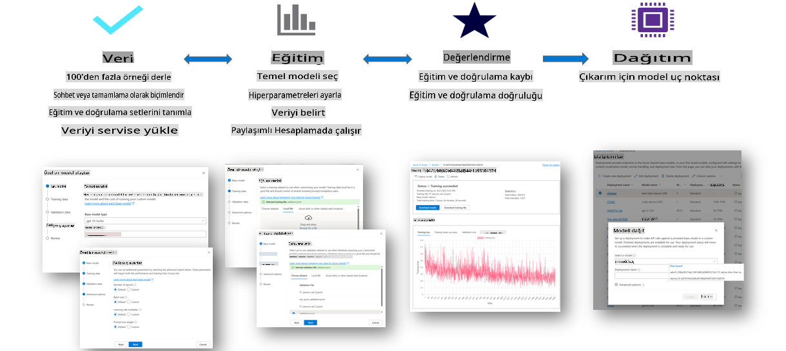

### Yeni Proje Oluşturma

1. [Azure AI Foundry](https://ai.azure.com)'ye giriş yapın.

1. **+Yeni proje** seçeneğini seçerek Azure AI Foundry'de yeni bir proje oluşturun.

    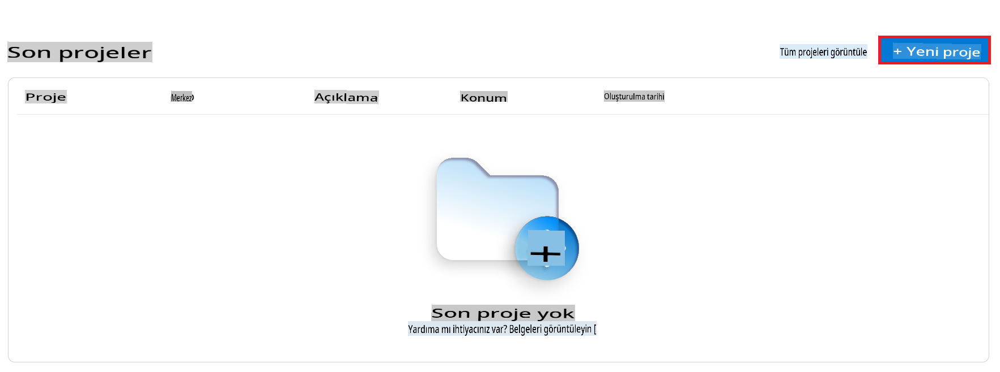

1. Şu görevleri gerçekleştirin:

    - Proje **Hub adı**. Benzersiz bir değer olmalıdır.
    - Kullanmak istediğiniz **Hub**'ı seçin (gerekirse yeni bir tane oluşturun).

    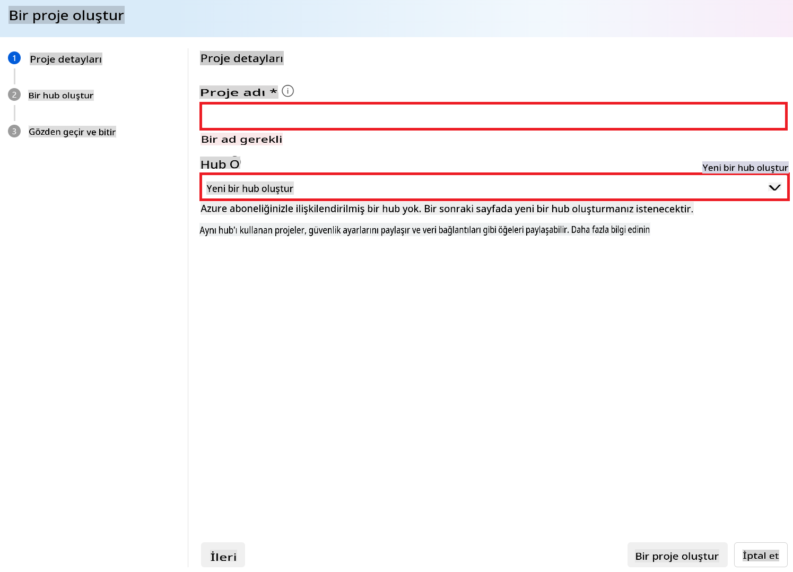

1. Yeni bir hub oluşturmak için şu görevleri gerçekleştirin:

    - **Hub adı** girin. Benzersiz bir değer olmalıdır.
    - Azure **Aboneliği**'ni seçin.
    - Kullanmak istediğiniz **Kaynak grubunu** seçin (gerekirse yeni bir tane oluşturun).
    - Kullanmak istediğiniz **Konumu** seçin.
    - Kullanmak istediğiniz **Azure AI Hizmetlerini Bağla** seçeneğini seçin (gerekirse yeni bir tane oluşturun).
    - **Azure AI Aramasını Bağla** seçeneğini **Bağlantıyı atla** olarak ayarlayın.

    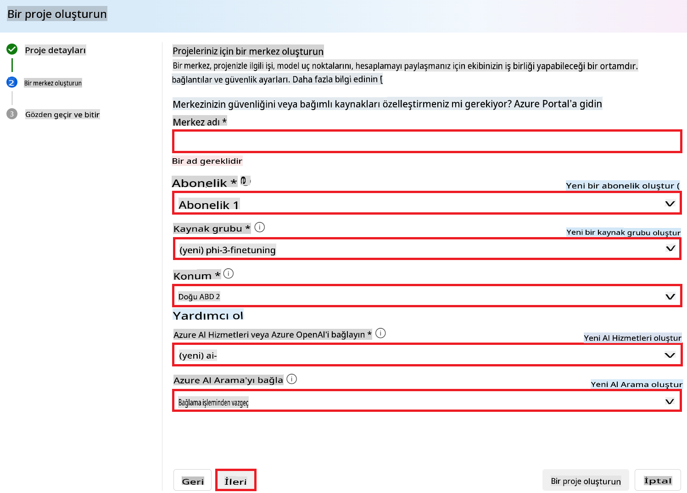

1. **İleri**'yi seçin.
1. **Proje oluştur**'u seçin.

### Veri Hazırlığı

İnce ayar yapmadan önce, sohbet talimatları, soru-cevap çiftleri veya ilgili diğer metin verileri gibi görevinizle ilgili bir veri seti toplayın veya oluşturun. Bu verileri temizleyin ve ön işleme yapın; gürültüyü kaldırın, eksik değerleri yönetin ve metni tokenize edin.

### Azure AI Foundry'de Phi-3 Modellerine İnce Ayar Yapma

> [!NOTE]
> Phi-3 modellerinin ince ayarı şu anda East US 2'de bulunan projelerde desteklenmektedir.

1. Sol sekmeden **Model kataloğu**'nu seçin.

1. **Arama çubuğuna** *phi-3* yazın ve kullanmak istediğiniz phi-3 modelini seçin.

    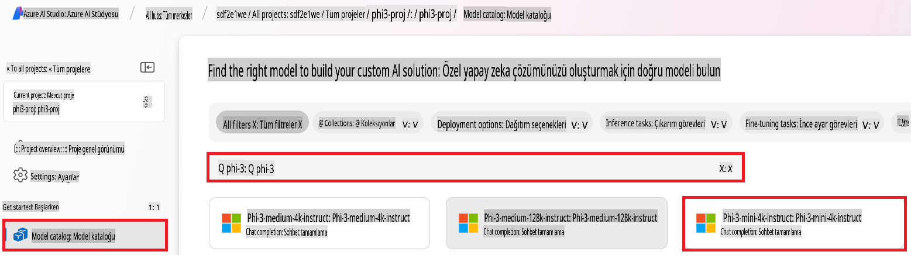

1. **İnce ayar**'ı seçin.

    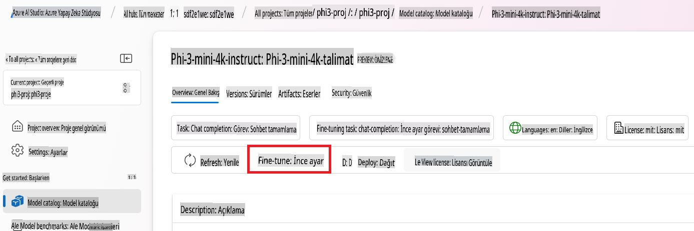

1. **İnce ayar yapılmış model adını** girin.

    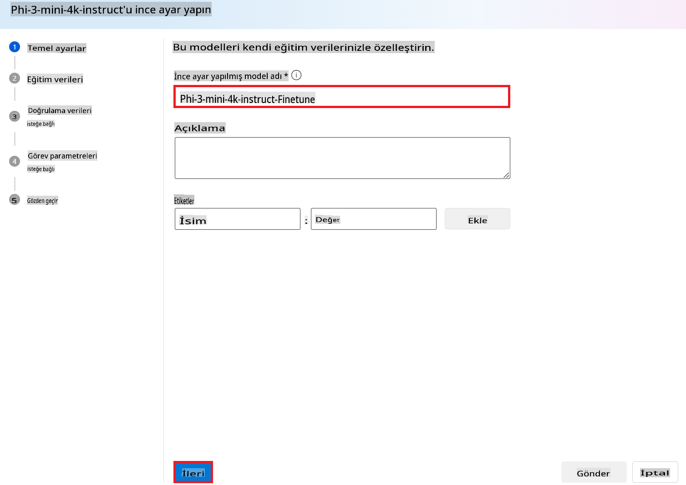

1. **İleri**'yi seçin.

1. Şu görevleri gerçekleştirin:

    - **Görev türünü** **Sohbet tamamlama** olarak seçin.
    - Kullanmak istediğiniz **Eğitim verilerini** seçin. Verileri Azure AI Foundry'nin veri deposu üzerinden veya yerel ortamınızdan yükleyebilirsiniz.

    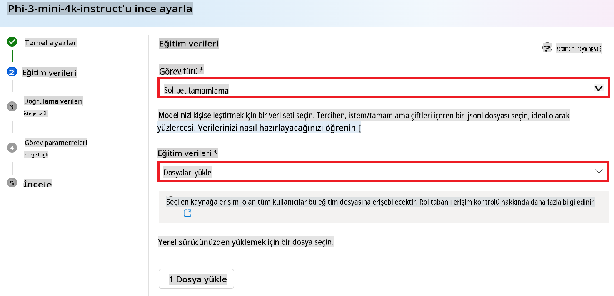

1. **İleri**'yi seçin.

1. Kullanmak istediğiniz **Doğrulama verilerini** yükleyin veya **Eğitim verilerinin otomatik bölünmesi** seçeneğini seçin.

    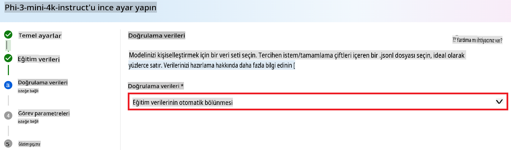

1. **İleri**'yi seçin.

1. Şu görevleri gerçekleştirin:

    - Kullanmak istediğiniz **Toplu iş çarpanını** seçin.
    - Kullanmak istediğiniz **Öğrenme oranını** seçin.
    - Kullanmak istediğiniz **Epoch sayısını** seçin.

    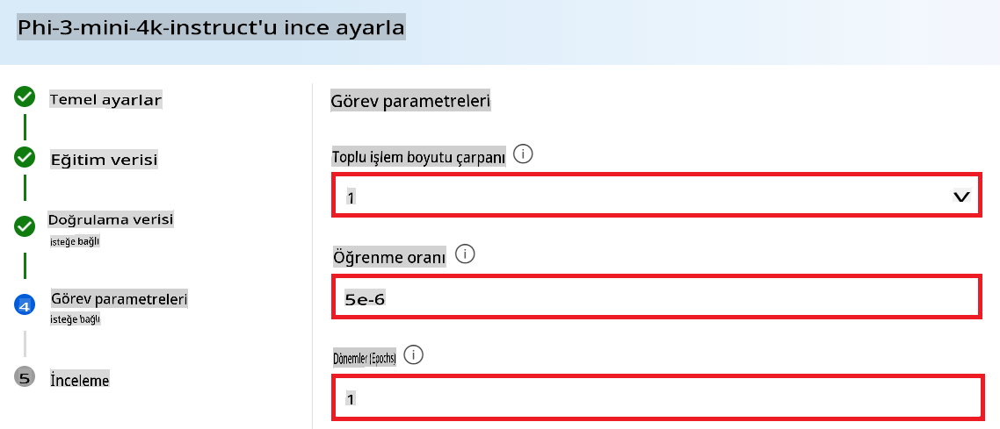

1. İnce ayar sürecini başlatmak için **Gönder**'i seçin.

    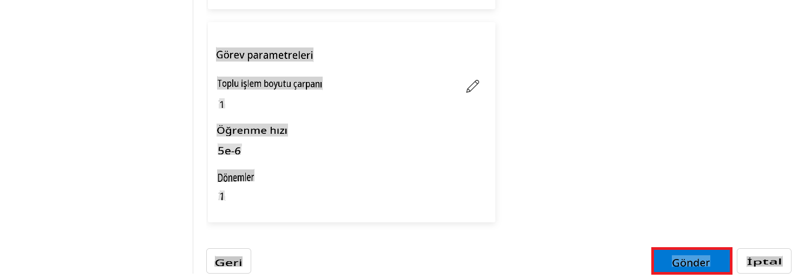

1. Modelinizin ince ayarı tamamlandığında, durum **Tamamlandı** olarak görüntülenecektir. Artık modeli dağıtabilir ve kendi uygulamanızda, oyun alanında veya istem akışında kullanabilirsiniz. Daha fazla bilgi için [Azure AI Foundry ile Phi-3 küçük dil modellerini nasıl dağıtacağınızı öğrenin](https://learn.microsoft.com/azure/ai-studio/how-to/deploy-models-phi-3?tabs=phi-3-5&pivots=programming-language-python).

    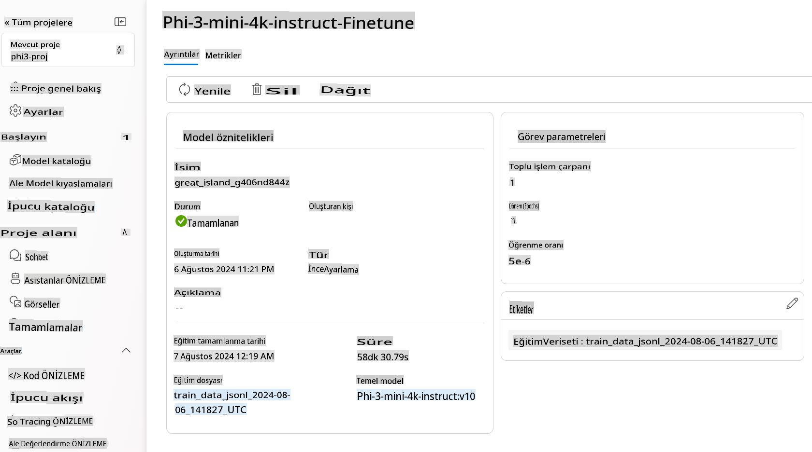

> [!NOTE]
> Phi-3'ün ince ayarı hakkında daha ayrıntılı bilgi için lütfen [Azure AI Foundry'de Phi-3 modellerine ince ayar yapma](https://learn.microsoft.com/azure/ai-studio/how-to/fine-tune-phi-3?tabs=phi-3-mini) sayfasını ziyaret edin.

## İnce Ayar Yapılmış Modellerinizi Temizleme

İnce ayar yapılmış bir modeli [Azure AI Foundry](https://ai.azure.com)'deki ince ayar modeli listesinden veya model detay sayfasından silebilirsiniz. İnce Ayar sayfasından silmek istediğiniz ince ayar yapılmış modeli seçin ve ardından silme düğmesini seçin.

> [!NOTE]
> Mevcut bir dağıtımı olan özel bir modeli silemezsiniz. Özel modelinizi silmeden önce model dağıtımınızı silmelisiniz.

## Maliyet ve Kotalar

### Hizmet olarak ince ayar yapılan Phi-3 modelleri için maliyet ve kota değerlendirmeleri

Hizmet olarak ince ayar yapılan Phi modelleri, Microsoft tarafından sunulur ve Azure AI Foundry ile entegre şekilde kullanıma sunulur. Modelleri [dağıtırken](https://learn.microsoft.com/azure/ai-studio/how-to/deploy-models-phi-3?tabs=phi-3-5&pivots=programming-language-python) veya ince ayar yaparken fiyatlandırmayı, dağıtım sihirbazındaki Fiyatlandırma ve koşullar sekmesinde bulabilirsiniz.

## İçerik Filtreleme

Kullandıkça öde modeliyle hizmet olarak dağıtılan modeller, Azure AI İçerik Güvenliği ile korunmaktadır. Gerçek zamanlı uç noktalara dağıtıldığında, bu özelliği devre dışı bırakabilirsiniz. Azure AI içerik güvenliği etkinleştirildiğinde, hem istem hem de tamamlama, zararlı içeriğin çıktısını algılamayı ve önlemeyi amaçlayan sınıflandırma modellerinden oluşan bir topluluktan geçer. İçerik filtreleme sistemi, hem giriş istemlerinde hem de çıkış tamamlamalarında potansiyel olarak zararlı içeriğin belirli kategorilerini algılar ve bunlara yönelik işlem yapar. Daha fazla bilgi için [Azure AI İçerik Güvenliği](https://learn.microsoft.com/azure/ai-studio/concepts/content-filtering) sayfasını inceleyin.

**İnce Ayar Yapılandırması**

Hiperparametreler: Öğrenme oranı, toplu iş boyutu ve eğitim epoch sayısı gibi hiperparametreleri tanımlayın.

**Kayıp Fonksiyonu**

Göreviniz için uygun bir kayıp fonksiyonu seçin (ör. çapraz entropi).

**Optimizasyon**

Eğitim sırasında gradyan güncellemeleri için bir optimizasyon algoritması seçin (ör. Adam).

**İnce Ayar Süreci**

- Önceden Eğitilmiş Modeli Yükleyin: Phi-3 Mini kontrol noktasını yükleyin.
- Özel Katmanlar Ekleyin: Göreve özel katmanlar ekleyin (ör. sohbet talimatları için sınıflandırma başlığı).

**Modeli Eğitin**
Hazırladığınız veri setini kullanarak modeli ince ayar yapın. Eğitim ilerlemesini izleyin ve gerekirse hiperparametreleri ayarlayın.

**Değerlendirme ve Doğrulama**

Doğrulama Seti: Verilerinizi eğitim ve doğrulama setlerine ayırın.

**Performansı Değerlendirin**

Model performansını değerlendirmek için doğruluk, F1 skoru veya karmaşıklık gibi metrikler kullanın.

## İnce Ayar Yapılmış Modeli Kaydetme

**Kontrol Noktası**
İnce ayar yapılmış model kontrol noktasını gelecekteki kullanım için kaydedin.

## Dağıtım

- Web Hizmeti Olarak Dağıtın: İnce ayar yapılmış modelinizi Azure AI Foundry'de bir web hizmeti olarak dağıtın.
- Uç Noktayı Test Edin: Dağıtılan uç noktaya test sorguları göndererek işlevselliğini doğrulayın.

## Yineleyin ve Geliştirin

Yineleme: Performans tatmin edici değilse, hiperparametreleri ayarlayarak, daha fazla veri ekleyerek veya ek epoch'lar için ince ayar yaparak yineleyin.

## İzleyin ve Geliştirin

Modelin davranışını sürekli izleyin ve gerektiğinde iyileştirin.

## Özelleştirin ve Genişletin

Özel Görevler: Phi-3 Mini, sohbet talimatlarının ötesinde çeşitli görevler için ince ayar yapılabilir. Diğer kullanım alanlarını keşfedin!
Deneyin: Performansı artırmak için farklı mimariler, katman kombinasyonları ve teknikler deneyin.

> [!NOTE]
> İnce ayar bir yineleme sürecidir. Deneyin, öğrenin ve modelinizi belirli göreviniz için en iyi sonuçları elde etmek üzere uyarlayın!

**Feragatname**:  
Bu belge, yapay zeka tabanlı makine çeviri hizmetleri kullanılarak çevrilmiştir. Doğruluk için çaba göstersek de, otomatik çevirilerin hata veya yanlışlıklar içerebileceğini lütfen unutmayın. Orijinal belge, kendi ana dilinde yetkili kaynak olarak kabul edilmelidir. Kritik bilgiler için profesyonel insan çevirisi önerilir. Bu çevirinin kullanımından kaynaklanan yanlış anlama veya yanlış yorumlamalardan sorumlu değiliz.