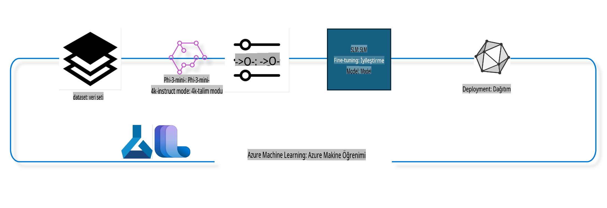

## Azure ML sistem kayıt defterinden chat-completion bileşenlerini kullanarak bir modeli nasıl ince ayar yapabilirsiniz?

Bu örnekte, ultrachat_200k veri setini kullanarak iki kişi arasındaki bir konuşmayı tamamlama amacıyla Phi-3-mini-4k-instruct modelinin ince ayarını yapacağız.



Bu örnek, Azure ML SDK ve Python kullanarak bir modelin ince ayarının nasıl yapılacağını ve ardından ince ayarlı modelin gerçek zamanlı tahminler için çevrimiçi bir uç noktaya nasıl dağıtılacağını gösterecek.

### Eğitim Verisi

Ultrachat_200k veri setini kullanacağız. Bu, UltraChat veri setinin yoğun şekilde filtrelenmiş bir versiyonudur ve Zephyr-7B-β adlı, 7 milyarlık bir sohbet modelini eğitmek için kullanılmıştır.

### Model

Chat-completion görevi için bir modeli ince ayar yapmak üzere Phi-3-mini-4k-instruct modelini kullanacağız. Bu not defterini belirli bir model kartından açtıysanız, model adını buna göre değiştirmeyi unutmayın.

### Görevler

- İnce ayar yapılacak bir model seçin.
- Eğitim verilerini seçin ve keşfedin.
- İnce ayar işini yapılandırın.
- İnce ayar işini çalıştırın.
- Eğitim ve değerlendirme metriklerini inceleyin.
- İnce ayarlı modeli kaydedin.
- İnce ayarlı modeli gerçek zamanlı tahmin için dağıtın.
- Kaynakları temizleyin.

## 1. Ön Gereksinimlerin Ayarlanması

- Bağımlılıkları yükleyin.
- AzureML Çalışma Alanına bağlanın. SDK kimlik doğrulamasını ayarlama hakkında daha fazla bilgi edinin. Aşağıdaki <WORKSPACE_NAME>, <RESOURCE_GROUP> ve <SUBSCRIPTION_ID>'yi değiştirin.
- AzureML sistem kayıt defterine bağlanın.
- İsteğe bağlı bir deney adı belirleyin.
- Hesaplama birimini kontrol edin veya oluşturun.

> [!NOTE]
> Gereksinimler: Tek bir GPU düğümünde birden fazla GPU kartı olabilir. Örneğin, Standard_NC24rs_v3'ün bir düğümünde 4 NVIDIA V100 GPU varken, Standard_NC12s_v3'te 2 NVIDIA V100 GPU bulunur. Bu bilgi için dokümanlara bakın. Düğüm başına GPU kartı sayısı aşağıdaki parametre gpus_per_node'da ayarlanır. Bu değeri doğru ayarlamak, düğümdeki tüm GPU'ların kullanılmasını sağlar. Önerilen GPU hesaplama SKU'larını burada ve burada bulabilirsiniz.

### Python Kütüphaneleri

Aşağıdaki hücreyi çalıştırarak bağımlılıkları yükleyin. Yeni bir ortamda çalışıyorsanız bu adım zorunludur.

```bash
pip install azure-ai-ml
pip install azure-identity
pip install datasets==2.9.0
pip install mlflow
pip install azureml-mlflow
```

### Azure ML ile Etkileşim

1. Bu Python betiği, Azure Machine Learning (Azure ML) hizmetiyle etkileşim kurmak için kullanılır. İşte yaptığı şeylerin özeti:

    - Azure ML, azure.identity ve azure.ai.ml.entities paketlerinden gerekli modülleri içe aktarır. Ayrıca time modülünü de içe aktarır.

    - DefaultAzureCredential() kullanarak kimlik doğrulamayı dener. Bu, Azure bulutunda çalışan uygulamaları hızlı bir şekilde geliştirmek için basitleştirilmiş bir kimlik doğrulama deneyimi sunar. Başarısız olursa, InteractiveBrowserCredential()'a geri döner, bu da etkileşimli bir oturum açma istemi sağlar.

    - from_config yöntemiyle bir MLClient örneği oluşturmaya çalışır. Bu yöntem, varsayılan yapılandırma dosyasından (config.json) yapılandırmayı okur. Başarısız olursa, subscription_id, resource_group_name ve workspace_name bilgilerini manuel olarak sağlayarak bir MLClient örneği oluşturur.

    - "azureml" adlı Azure ML kayıt defteri için başka bir MLClient örneği oluşturur. Bu kayıt defteri, modellerin, ince ayar iş akışlarının ve ortamların saklandığı yerdir.

    - experiment_name'i "chat_completion_Phi-3-mini-4k-instruct" olarak ayarlar.

    - Zaman damgası oluşturur. Bu, mevcut zamanı (epoch'tan bu yana geçen saniye cinsinden) bir tamsayıya ve ardından bir dizeye dönüştürerek yapılır. Bu zaman damgası, benzersiz adlar ve sürümler oluşturmak için kullanılabilir.

    ```python
    # Import necessary modules from Azure ML and Azure Identity
    from azure.ai.ml import MLClient
    from azure.identity import (
        DefaultAzureCredential,
        InteractiveBrowserCredential,
    )
    from azure.ai.ml.entities import AmlCompute
    import time  # Import time module
    
    # Try to authenticate using DefaultAzureCredential
    try:
        credential = DefaultAzureCredential()
        credential.get_token("https://management.azure.com/.default")
    except Exception as ex:  # If DefaultAzureCredential fails, use InteractiveBrowserCredential
        credential = InteractiveBrowserCredential()
    
    # Try to create an MLClient instance using the default config file
    try:
        workspace_ml_client = MLClient.from_config(credential=credential)
    except:  # If that fails, create an MLClient instance by manually providing the details
        workspace_ml_client = MLClient(
            credential,
            subscription_id="<SUBSCRIPTION_ID>",
            resource_group_name="<RESOURCE_GROUP>",
            workspace_name="<WORKSPACE_NAME>",
        )
    
    # Create another MLClient instance for the Azure ML registry named "azureml"
    # This registry is where models, fine-tuning pipelines, and environments are stored
    registry_ml_client = MLClient(credential, registry_name="azureml")
    
    # Set the experiment name
    experiment_name = "chat_completion_Phi-3-mini-4k-instruct"
    
    # Generate a unique timestamp that can be used for names and versions that need to be unique
    timestamp = str(int(time.time()))
    ```

## 2. İnce Ayar Yapılacak Bir Temel Model Seçin

1. Phi-3-mini-4k-instruct, 3.8 milyar parametreye sahip, hafif, son teknoloji bir açık modeldir ve Phi-2 için kullanılan veri setleri üzerine inşa edilmiştir. Model, Phi-3 model ailesine aittir ve Mini versiyonu 4K ve 128K olmak üzere iki varyantta gelir. Bu varyantlar, destekleyebileceği bağlam uzunluğunu (token cinsinden) ifade eder. Modeli kullanabilmek için belirli bir amaç için ince ayar yapmamız gerekmektedir. Bu modelleri AzureML Studio'daki Model Kataloğunda, chat-completion görevi filtresini kullanarak inceleyebilirsiniz. Bu örnekte Phi-3-mini-4k-instruct modelini kullanıyoruz. Eğer bu not defterini farklı bir model için açtıysanız, model adını ve sürümünü buna göre değiştirin.

    > [!NOTE]
    > Modelin model id özelliği. Bu, ince ayar işine giriş olarak geçirilecektir. Ayrıca AzureML Studio Model Kataloğu'ndaki model detayları sayfasında Varlık Kimliği alanı olarak mevcuttur.

2. Bu Python betiği, Azure Machine Learning (Azure ML) hizmetiyle etkileşim kurmaktadır. İşte yaptığı şeylerin özeti:

    - model_name'i "Phi-3-mini-4k-instruct" olarak ayarlar.

    - registry_ml_client nesnesinin models özelliğinin get yöntemini kullanarak, belirtilen ada sahip modelin en son sürümünü Azure ML kayıt defterinden alır. get yöntemi, modelin adını ve en son sürümün alınması gerektiğini belirten bir etiketi argüman olarak alır.

    - İnce ayar için kullanılacak modelin adı, sürümü ve kimliğini belirten bir mesajı konsola yazdırır. Bu bilgileri mesajın içine yerleştirmek için format yöntemi kullanılır. Modelin adı, sürümü ve kimliği foundation_model nesnesinin özellikleri olarak erişilebilir.

    ```python
    # Set the model name
    model_name = "Phi-3-mini-4k-instruct"
    
    # Get the latest version of the model from the Azure ML registry
    foundation_model = registry_ml_client.models.get(model_name, label="latest")
    
    # Print the model name, version, and id
    # This information is useful for tracking and debugging
    print(
        "\n\nUsing model name: {0}, version: {1}, id: {2} for fine tuning".format(
            foundation_model.name, foundation_model.version, foundation_model.id
        )
    )
    ```

## 3. İş için kullanılacak bir hesaplama birimi oluşturun

İnce ayar işi SADECE GPU hesaplama birimiyle çalışır. Hesaplama biriminin boyutu modelin büyüklüğüne bağlıdır ve çoğu durumda iş için doğru hesaplama birimini belirlemek zor olabilir. Bu hücrede, kullanıcıya doğru hesaplama birimini seçmesi konusunda rehberlik ediyoruz.

> [!NOTE]
> Aşağıda listelenen hesaplama birimleri, en optimize edilmiş yapılandırma ile çalışır. Yapılandırmada yapılan herhangi bir değişiklik Cuda Bellek Yetersiz hatasına yol açabilir. Böyle bir durumda, hesaplama birimini daha büyük bir boyuta yükseltmeyi deneyin.

> [!NOTE]
> Aşağıdaki compute_cluster_size'ı seçerken, hesaplama biriminin kaynak grubunuzda mevcut olduğundan emin olun. Belirli bir hesaplama birimi mevcut değilse, hesaplama kaynaklarına erişim talebinde bulunabilirsiniz.

### İnce Ayar Desteği İçin Model Kontrolü

1. Bu Python betiği, bir Azure Machine Learning (Azure ML) modeliyle etkileşim kurmaktadır. İşte yaptığı şeylerin özeti:

    - ast modülünü içe aktarır. Bu modül, Python soyut sözdizimi dilbilgisinin ağaçlarını işlemek için işlevler sağlar.

    - foundation_model nesnesinin (Azure ML'deki bir modeli temsil eder) finetune_compute_allow_list adlı bir etikete sahip olup olmadığını kontrol eder. Azure ML'deki etiketler, modelleri filtrelemek ve sıralamak için oluşturulabilecek ve kullanılabilecek anahtar-değer çiftleridir.

    - Eğer finetune_compute_allow_list etiketi mevcutsa, ast.literal_eval işlevini kullanarak bu etiketin değerini (bir dize) güvenli bir şekilde bir Python listesine dönüştürür. Bu liste computes_allow_list değişkenine atanır. Daha sonra, listedeki bir hesaplama biriminden bir hesaplama oluşturulması gerektiğini belirten bir mesaj yazdırır.

    - Eğer finetune_compute_allow_list etiketi mevcut değilse, computes_allow_list değişkenini None olarak ayarlar ve modelin etiketlerinde finetune_compute_allow_list etiketinin bulunmadığını belirten bir mesaj yazdırır.

    - Özetle, bu betik modelin meta verilerinde belirli bir etiketi kontrol eder, etiketin değerini bir listeye dönüştürür ve buna göre kullanıcıya geri bildirim sağlar.

    ```python
    # Import the ast module, which provides functions to process trees of the Python abstract syntax grammar
    import ast
    
    # Check if the 'finetune_compute_allow_list' tag is present in the model's tags
    if "finetune_compute_allow_list" in foundation_model.tags:
        # If the tag is present, use ast.literal_eval to safely parse the tag's value (a string) into a Python list
        computes_allow_list = ast.literal_eval(
            foundation_model.tags["finetune_compute_allow_list"]
        )  # convert string to python list
        # Print a message indicating that a compute should be created from the list
        print(f"Please create a compute from the above list - {computes_allow_list}")
    else:
        # If the tag is not present, set computes_allow_list to None
        computes_allow_list = None
        # Print a message indicating that the 'finetune_compute_allow_list' tag is not part of the model's tags
        print("`finetune_compute_allow_list` is not part of model tags")
    ```

### Hesaplama Birimi Kontrolü

1. Bu Python betiği, Azure Machine Learning (Azure ML) hizmetiyle etkileşim kurmakta ve bir hesaplama birimi üzerinde çeşitli kontroller gerçekleştirmektedir. İşte yaptığı şeylerin özeti:

    - compute_cluster içinde saklanan adla Azure ML çalışma alanından hesaplama birimini almaya çalışır. Eğer hesaplama biriminin sağlama durumu "failed" ise, bir ValueError hatası yükseltir.

    - computes_allow_list değişkeninin None olmadığını kontrol eder. Eğer değilse, listedeki tüm hesaplama birimi boyutlarını küçük harfe çevirir ve mevcut hesaplama biriminin boyutunun listede olup olmadığını kontrol eder. Eğer değilse, bir ValueError hatası yükseltir.

    - Eğer computes_allow_list None ise, mevcut hesaplama biriminin boyutunun desteklenmeyen GPU VM boyutları listesinde olup olmadığını kontrol eder. Eğer öyleyse, bir ValueError hatası yükseltir.

    - Çalışma alanındaki tüm mevcut hesaplama boyutlarının bir listesini alır. Daha sonra bu listeyi döngüye alır ve her hesaplama boyutu için, adının mevcut hesaplama biriminin boyutuyla eşleşip eşleşmediğini kontrol eder. Eğer eşleşirse, bu hesaplama boyutundaki GPU sayısını alır ve gpu_count_found değişkenini True olarak ayarlar.

    - Eğer gpu_count_found True ise, hesaplama birimindeki GPU sayısını yazdırır. Eğer gpu_count_found False ise, bir ValueError hatası yükseltir.

    - Özetle, bu betik bir Azure ML çalışma alanındaki bir hesaplama birimi üzerinde çeşitli kontroller gerçekleştirir, bunlar arasında sağlama durumu, boyut kontrolü ve GPU sayısı yer alır.

    ```python
    # Print the exception message
    print(e)
    # Raise a ValueError if the compute size is not available in the workspace
    raise ValueError(
        f"WARNING! Compute size {compute_cluster_size} not available in workspace"
    )
    
    # Retrieve the compute instance from the Azure ML workspace
    compute = workspace_ml_client.compute.get(compute_cluster)
    # Check if the provisioning state of the compute instance is "failed"
    if compute.provisioning_state.lower() == "failed":
        # Raise a ValueError if the provisioning state is "failed"
        raise ValueError(
            f"Provisioning failed, Compute '{compute_cluster}' is in failed state. "
            f"please try creating a different compute"
        )
    
    # Check if computes_allow_list is not None
    if computes_allow_list is not None:
        # Convert all compute sizes in computes_allow_list to lowercase
        computes_allow_list_lower_case = [x.lower() for x in computes_allow_list]
        # Check if the size of the compute instance is in computes_allow_list_lower_case
        if compute.size.lower() not in computes_allow_list_lower_case:
            # Raise a ValueError if the size of the compute instance is not in computes_allow_list_lower_case
            raise ValueError(
                f"VM size {compute.size} is not in the allow-listed computes for finetuning"
            )
    else:
        # Define a list of unsupported GPU VM sizes
        unsupported_gpu_vm_list = [
            "standard_nc6",
            "standard_nc12",
            "standard_nc24",
            "standard_nc24r",
        ]
        # Check if the size of the compute instance is in unsupported_gpu_vm_list
        if compute.size.lower() in unsupported_gpu_vm_list:
            # Raise a ValueError if the size of the compute instance is in unsupported_gpu_vm_list
            raise ValueError(
                f"VM size {compute.size} is currently not supported for finetuning"
            )
    
    # Initialize a flag to check if the number of GPUs in the compute instance has been found
    gpu_count_found = False
    # Retrieve a list of all available compute sizes in the workspace
    workspace_compute_sku_list = workspace_ml_client.compute.list_sizes()
    available_sku_sizes = []
    # Iterate over the list of available compute sizes
    for compute_sku in workspace_compute_sku_list:
        available_sku_sizes.append(compute_sku.name)
        # Check if the name of the compute size matches the size of the compute instance
        if compute_sku.name.lower() == compute.size.lower():
            # If it does, retrieve the number of GPUs for that compute size and set gpu_count_found to True
            gpus_per_node = compute_sku.gpus
            gpu_count_found = True
    # If gpu_count_found is True, print the number of GPUs in the compute instance
    if gpu_count_found:
        print(f"Number of GPU's in compute {compute.size}: {gpus_per_node}")
    else:
        # If gpu_count_found is False, raise a ValueError
        raise ValueError(
            f"Number of GPU's in compute {compute.size} not found. Available skus are: {available_sku_sizes}."
            f"This should not happen. Please check the selected compute cluster: {compute_cluster} and try again."
        )
    ```

## 4. Modelin ince ayarı için veri setini seçin

1. Ultrachat_200k veri setini kullanıyoruz. Veri seti, Denetimli İnce Ayar (sft) için uygun dört bölüme sahiptir. Bu bölümler şunlardır: Generation ranking (gen). Bölümlere göre örnek sayısı şu şekildedir:

    ```bash
    train_sft test_sft  train_gen  test_gen
    207865  23110  256032  28304
    ```

1. Aşağıdaki birkaç hücre, ince ayar için temel veri hazırlığını göstermektedir:

### Bazı Veri Satırlarını Görselleştirin

Bu örneğin hızlı çalışmasını istiyoruz, bu yüzden zaten kırpılmış satırların %5'ini içeren train_sft, test_sft dosyalarını kaydediyoruz. Bu, ince ayarlı modelin daha düşük bir doğruluğa sahip olacağı anlamına gelir, bu nedenle gerçek dünyada kullanılmamalıdır.
Download-dataset.py, ultrachat_200k veri setini indirmek ve veri setini ince ayar iş akışı bileşeni tarafından tüketilebilir formata dönüştürmek için kullanılır. Ayrıca, veri seti büyük olduğu için burada yalnızca veri setinin bir kısmı bulunmaktadır.

1. Aşağıdaki betiği çalıştırmak yalnızca verilerin %5'ini indirir. Bu oran, dataset_split_pc parametresini istenen yüzdeye değiştirerek artırılabilir.

    > [!NOTE]
    > Bazı dil modellerinin farklı dil kodları vardır ve bu nedenle veri setindeki sütun adlarının bunu yansıtması gerekir.

1. Verilerin nasıl görünmesi gerektiğine dair bir örnek:
Chat-completion veri seti, her bir girdinin aşağıdaki şemayı kullandığı parquet formatında saklanır:

    - Bu, popüler bir veri değişim formatı olan JSON (JavaScript Object Notation) belgesidir. Çalıştırılabilir bir kod değil, verileri saklamak ve taşımak için bir yoldur. İşte yapısının bir özeti:

    - "prompt": Bu anahtar, bir yapay zeka asistanına yöneltilen bir görev veya soruyu temsil eden bir dize değerini tutar.

    - "messages": Bu anahtar, bir kullanıcı ve bir yapay zeka asistanı arasındaki bir konuşmadaki mesajları temsil eden nesnelerin bir dizisini tutar. Her bir mesaj nesnesinin iki anahtarı vardır:

    - "content": Bu anahtar, mesajın içeriğini temsil eden bir dize değerini tutar.
    - "role": Bu anahtar, mesajı gönderen varlığın rolünü temsil eden bir dize değerini tutar. Bu değer "user" veya "assistant" olabilir.
    - "prompt_id": Bu anahtar, bir komut için benzersiz bir tanımlayıcıyı temsil eden bir dize değerini tutar.

1. Bu özel JSON belgesinde, bir kullanıcı bir yapay zeka asistanından distopik bir hikaye için bir ana karakter oluşturmasını ister. Asistan yanıt verir ve kullanıcı daha fazla ayrıntı ister. Asistan, daha fazla ayrıntı sağlayacağını kabul eder. Tüm konuşma belirli bir prompt_id ile ilişkilendirilmiştir.

    ```python
    {
        // The task or question posed to an AI assistant
        "prompt": "Create a fully-developed protagonist who is challenged to survive within a dystopian society under the rule of a tyrant. ...",
        
        // An array of objects, each representing a message in a conversation between a user and an AI assistant
        "messages":[
            {
                // The content of the user's message
                "content": "Create a fully-developed protagonist who is challenged to survive within a dystopian society under the rule of a tyrant. ...",
                // The role of the entity that sent the message
                "role": "user"
            },
            {
                // The content of the assistant's message
                "content": "Name: Ava\n\n Ava was just 16 years old when the world as she knew it came crashing down. The government had collapsed, leaving behind a chaotic and lawless society. ...",
                // The role of the entity that sent the message
                "role": "assistant"
            },
            {
                // The content of the user's message
                "content": "Wow, Ava's story is so intense and inspiring! Can you provide me with more details.  ...",
                // The role of the entity that sent the message
                "role": "user"
            }, 
            {
                // The content of the assistant's message
                "content": "Certainly! ....",
                // The role of the entity that sent the message
                "role": "assistant"
            }
        ],
        
        // A unique identifier for the prompt
        "prompt_id": "d938b65dfe31f05f80eb8572964c6673eddbd68eff3db6bd234d7f1e3b86c2af"
    }
    ```

### Veriyi İndirin

1. Bu Python betiği, download-dataset.py adlı bir yardımcı betik kullanarak bir veri setini indirmek için kullanılır. İşte yaptığı şeylerin özeti:

    - Os modülünü içe aktarır. Bu modül, işletim sistemi bağımlı işlevselliği taşınabilir bir şekilde kullanmanın bir yolunu sağlar.

    - Os.system işlevini kullanarak download-dataset.py betiğini belirli komut satırı argümanlarıyla kabukta çalıştırır. Argümanlar, indirilecek veri setini (HuggingFaceH4/ultrachat_200k), indirileceği dizini (ultrachat_200k_dataset) ve veri setini bölme yüzdesini (5) belirtir. Os.system işlevi, çalıştırdığı komutun çıkış durumunu döndürür; bu durum exit_status değişkeninde saklanır.

    - Exit_status'ın 0 olup olmadığını kontrol eder. Unix benzeri işletim sistemlerinde, 0 çıkış durumu genellikle bir komutun başarılı olduğunu, diğer herhangi bir sayının ise bir hatayı gösterdiğini ifade eder. Eğer exit_status 0 değilse, veri setini indirirken bir hata olduğunu belirten bir mesajla bir Exception yükseltir.

    - Özetle, bu betik bir yardımcı betik kullanarak bir veri setini indirmek için bir komut çalıştırır ve komut başarısız olursa bir istisna yükseltir.

    ```python
    # Import the os module, which provides a way of using operating system dependent functionality
    import os
    
    # Use the os.system function to run the download-dataset.py script in the shell with specific command-line arguments
    # The arguments specify the dataset to download (HuggingFaceH4/ultrachat_200k), the directory to download it to (ultrachat_200k_dataset), and the percentage of the dataset to split (5)
    # The os.system function returns the exit status of the command it executed; this status is stored in the exit_status variable
    exit_status = os.system(
        "python ./download-dataset.py --dataset HuggingFaceH4/ultrachat_200k --download_dir ultrachat_200k_dataset --dataset_split_pc 5"
    )
    
    # Check if exit_status is not 0
    # In Unix-like operating systems, an exit status of 0 usually indicates that a command has succeeded, while any other number indicates an error
    # If exit_status is not 0, raise an Exception with a message indicating that there was an error downloading the dataset
    if exit_status != 0:
        raise Exception("Error downloading dataset")
    ```

### Veriyi Bir DataFrame'e Yükleme

1. Bu Python betiği, bir JSON Lines dosyasını pandas DataFrame'e yükler ve ilk 5 satırı görüntüler. İşte yaptığı şeylerin özeti:

    - Güçlü bir veri manipülasyonu ve analiz kütüphanesi olan pandas'ı içe aktarır.

    - Pandas'ın görüntüleme seçenekleri için maksimum sütun genişliğini 0 olarak ayarlar. Bu, DataFrame yazdırıldığında her sütunun tam metninin kesilmeden görüntüleneceği anlamına gelir.

    - Ultrachat_200k_dataset dizinindeki train_sft.jsonl dosyasını pandas DataFrame'e yüklemek için pd.read_json işlevini kullanır. Lines=True argümanı, dosyanın JSON Lines formatında olduğunu ve her satırın ayrı bir JSON nesnesi olduğunu belirtir.

    - Head yöntemini kullanarak DataFrame'in ilk 5 satırını görüntüler. Eğer DataFrame 5'ten az satır içeriyorsa, tümünü görüntüler.

    - Özetle, bu betik bir JSON Lines dosyasını bir DataFrame'e yükler ve tam sütun metniyle ilk 5 satırı görüntüler.

    ```python
    # Import the pandas library, which is a powerful data manipulation and analysis library
    import pandas as pd
    
    # Set the maximum column width for pandas' display options to 0
    # This means that the full text of each column will be displayed without truncation when the DataFrame is printed
    pd.set_option("display.max_colwidth", 0)
    
    # Use the pd.read_json function to load the train_sft.jsonl file from the ultrachat_200k_dataset directory into a DataFrame
    # The lines=True argument indicates that the file is in JSON Lines format, where each line is a separate JSON object
    df = pd.read_json("./ultrachat_200k_dataset/train_sft.jsonl", lines=True)
    
    # Use the head method to display the first 5 rows of the DataFrame
    # If the DataFrame has less than 5 rows, it will display all of them
    df.head()
    ```

## 5. Model ve veri girişleri kullanılarak ince ayar işini gönderin

Chat-completion iş akışı bileşenini kullanan işi oluşturun. İnce ayar için desteklenen tüm parametreler hakkında daha fazla bilgi edinin.

### İnce Ayar Parametrelerini Tanımlayın

1. İnce ayar parametreleri 2 kategoriye ayrılabilir - eğitim parametreleri, optimizasyon parametreleri.

1. Eğitim parametreleri aşağıdaki gibi eğitimle ilgili yönleri tanımlar:

    - Kullanılacak optimizasyon yöntemi, zamanlayıcı.
    - İnce ayarı optimize etmek için metrik.
    - Eğitim adımlarının sayısı, batch boyutu vb.
    - Optimizasyon parametreleri, GPU belleğini optimize etmeye ve hesaplama kaynaklarını etkili bir şekilde kullanmaya yardımcı olur.

1. Bu kategoriye ait birkaç parametre aşağıda verilmiştir. Optimizasyon parametreleri her model için farklılık gösterir ve bu varyasyonları ele almak için modelle birlikte paketlenmiştir.

    - Deepspeed ve LoRA'yı etkinleştirin.
    - Karma hassasiyetli eğitimi etkinleştirin.
    - Çoklu düğüm eğitimini etkinleştirin.

> [!NOTE]
> Denetimli ince ayar, hizalamayı kaybetme veya felaket unutma ile sonuçlanabilir. Bu sorunu kontrol etmenizi ve ince ayar yaptıktan sonra bir hizalama aşaması çalıştırmanızı öneririz.

### İnce Ayar Parametreleri

1. Bu Python betiği, bir makine öğren
### Eğitim Boru Hattı

Farklı parametrelere dayalı bir eğitim boru hattı oluşturur ve ardından bu görüntüleme adını yazdırır. ```python
    # Define a function to generate a display name for the training pipeline
    def get_pipeline_display_name():
        # Calculate the total batch size by multiplying the per-device batch size, the number of gradient accumulation steps, the number of GPUs per node, and the number of nodes used for fine-tuning
        batch_size = (
            int(finetune_parameters.get("per_device_train_batch_size", 1))
            * int(finetune_parameters.get("gradient_accumulation_steps", 1))
            * int(gpus_per_node)
            * int(finetune_parameters.get("num_nodes_finetune", 1))
        )
        # Retrieve the learning rate scheduler type
        scheduler = finetune_parameters.get("lr_scheduler_type", "linear")
        # Retrieve whether DeepSpeed is applied
        deepspeed = finetune_parameters.get("apply_deepspeed", "false")
        # Retrieve the DeepSpeed stage
        ds_stage = finetune_parameters.get("deepspeed_stage", "2")
        # If DeepSpeed is applied, include "ds" followed by the DeepSpeed stage in the display name; if not, include "nods"
        if deepspeed == "true":
            ds_string = f"ds{ds_stage}"
        else:
            ds_string = "nods"
        # Retrieve whether Layer-wise Relevance Propagation (LoRa) is applied
        lora = finetune_parameters.get("apply_lora", "false")
        # If LoRa is applied, include "lora" in the display name; if not, include "nolora"
        if lora == "true":
            lora_string = "lora"
        else:
            lora_string = "nolora"
        # Retrieve the limit on the number of model checkpoints to keep
        save_limit = finetune_parameters.get("save_total_limit", -1)
        # Retrieve the maximum sequence length
        seq_len = finetune_parameters.get("max_seq_length", -1)
        # Construct the display name by concatenating all these parameters, separated by hyphens
        return (
            model_name
            + "-"
            + "ultrachat"
            + "-"
            + f"bs{batch_size}"
            + "-"
            + f"{scheduler}"
            + "-"
            + ds_string
            + "-"
            + lora_string
            + f"-save_limit{save_limit}"
            + f"-seqlen{seq_len}"
        )
    
    # Call the function to generate the display name
    pipeline_display_name = get_pipeline_display_name()
    # Print the display name
    print(f"Display name used for the run: {pipeline_display_name}")
    ```

### Boru Hattını Yapılandırma

Bu Python betiği, Azure Machine Learning SDK'sını kullanarak bir makine öğrenimi boru hattını tanımlar ve yapılandırır. İşte ne yaptığına dair bir özet:

1. Azure AI ML SDK'dan gerekli modülleri içe aktarır.  
1. Kayıttan "chat_completion_pipeline" adlı bir boru hattı bileşenini alır.  
1. `@pipeline` decorator and the function `create_pipeline`. The name of the pipeline is set to `pipeline_display_name`.

1. Inside the `create_pipeline` function, it initializes the fetched pipeline component with various parameters, including the model path, compute clusters for different stages, dataset splits for training and testing, the number of GPUs to use for fine-tuning, and other fine-tuning parameters.

1. It maps the output of the fine-tuning job to the output of the pipeline job. This is done so that the fine-tuned model can be easily registered, which is required to deploy the model to an online or batch endpoint.

1. It creates an instance of the pipeline by calling the `create_pipeline` function.

1. It sets the `force_rerun` setting of the pipeline to `True`, meaning that cached results from previous jobs will not be used.

1. It sets the `continue_on_step_failure` setting of the pipeline to `False` kullanarak bir boru hattı işi tanımlar, yani herhangi bir adım başarısız olursa boru hattı duracaktır.  
1. Özetle, bu betik Azure Machine Learning SDK'sını kullanarak bir sohbet tamamlama görevi için bir makine öğrenimi boru hattı tanımlıyor ve yapılandırıyor.  

```python
    # Import necessary modules from the Azure AI ML SDK
    from azure.ai.ml.dsl import pipeline
    from azure.ai.ml import Input
    
    # Fetch the pipeline component named "chat_completion_pipeline" from the registry
    pipeline_component_func = registry_ml_client.components.get(
        name="chat_completion_pipeline", label="latest"
    )
    
    # Define the pipeline job using the @pipeline decorator and the function create_pipeline
    # The name of the pipeline is set to pipeline_display_name
    @pipeline(name=pipeline_display_name)
    def create_pipeline():
        # Initialize the fetched pipeline component with various parameters
        # These include the model path, compute clusters for different stages, dataset splits for training and testing, the number of GPUs to use for fine-tuning, and other fine-tuning parameters
        chat_completion_pipeline = pipeline_component_func(
            mlflow_model_path=foundation_model.id,
            compute_model_import=compute_cluster,
            compute_preprocess=compute_cluster,
            compute_finetune=compute_cluster,
            compute_model_evaluation=compute_cluster,
            # Map the dataset splits to parameters
            train_file_path=Input(
                type="uri_file", path="./ultrachat_200k_dataset/train_sft.jsonl"
            ),
            test_file_path=Input(
                type="uri_file", path="./ultrachat_200k_dataset/test_sft.jsonl"
            ),
            # Training settings
            number_of_gpu_to_use_finetuning=gpus_per_node,  # Set to the number of GPUs available in the compute
            **finetune_parameters
        )
        return {
            # Map the output of the fine tuning job to the output of pipeline job
            # This is done so that we can easily register the fine tuned model
            # Registering the model is required to deploy the model to an online or batch endpoint
            "trained_model": chat_completion_pipeline.outputs.mlflow_model_folder
        }
    
    # Create an instance of the pipeline by calling the create_pipeline function
    pipeline_object = create_pipeline()
    
    # Don't use cached results from previous jobs
    pipeline_object.settings.force_rerun = True
    
    # Set continue on step failure to False
    # This means that the pipeline will stop if any step fails
    pipeline_object.settings.continue_on_step_failure = False
    ```

### İşi Gönderme

1. Bu Python betiği, bir Azure Machine Learning çalışma alanına bir makine öğrenimi boru hattı işi gönderir ve işin tamamlanmasını bekler. İşte ne yaptığına dair bir özet:  
   - Çalışma alanındaki jobs nesnesinin create_or_update yöntemini çağırarak boru hattı işini gönderir. Çalıştırılacak boru hattı `pipeline_object` ile belirtilir ve işin çalıştırıldığı deney `experiment_name` ile belirtilir.  
   - Daha sonra, jobs nesnesinin stream yöntemini çağırarak boru hattı işinin tamamlanmasını bekler. Beklenecek iş, `pipeline_job` nesnesinin name özelliği ile belirtilir.  
   - Özetle, bu betik bir Azure Machine Learning çalışma alanına bir makine öğrenimi boru hattı işi gönderir ve işin tamamlanmasını bekler.  

```python
    # Submit the pipeline job to the Azure Machine Learning workspace
    # The pipeline to be run is specified by pipeline_object
    # The experiment under which the job is run is specified by experiment_name
    pipeline_job = workspace_ml_client.jobs.create_or_update(
        pipeline_object, experiment_name=experiment_name
    )
    
    # Wait for the pipeline job to complete
    # The job to wait for is specified by the name attribute of the pipeline_job object
    workspace_ml_client.jobs.stream(pipeline_job.name)
    ```

## 6. İnce Ayar Yapılmış Modeli Çalışma Alanına Kaydetme

İnce ayar işi çıktısından modeli kaydedeceğiz. Bu, ince ayar yapılmış model ile ince ayar işi arasında bir soy kütüğü izler. İnce ayar işi ayrıca temel model, veri ve eğitim koduna kadar olan soy kütüğünü izler.

### ML Modelini Kaydetme

1. Bu Python betiği, bir Azure Machine Learning boru hattında eğitilmiş bir makine öğrenimi modelini kaydediyor. İşte ne yaptığına dair bir özet:  
   - Azure AI ML SDK'sından gerekli modülleri içe aktarır.  
   - `workspace_ml_client` içindeki jobs nesnesinin get yöntemini çağırarak ve outputs özelliğine erişerek, eğitilmiş model çıktısının boru hattı işinden mevcut olup olmadığını kontrol eder.  
   - Modelin yolunu, boru hattı işinin adı ve "trained_model" çıktısının adıyla bir dizeyi biçimlendirerek oluşturur.  
   - Orijinal model adına "-ultrachat-200k" ekleyerek ve eğik çizgileri tire ile değiştirerek ince ayar yapılmış model için bir ad tanımlar.  
   - Modeli kaydetmek için bir Model nesnesi oluşturur ve modele giden yol, model türü (MLflow modeli), modelin adı ve versiyonu ve modelin açıklaması gibi çeşitli parametreler içerir.  
   - Model nesnesini argüman olarak kullanarak `workspace_ml_client` içindeki models nesnesinin create_or_update yöntemini çağırarak modeli kaydeder.  
   - Kaydedilen modeli yazdırır.  
1. Özetle, bu betik bir Azure Machine Learning boru hattında eğitilmiş bir makine öğrenimi modelini kaydediyor.  

```python
    # Import necessary modules from the Azure AI ML SDK
    from azure.ai.ml.entities import Model
    from azure.ai.ml.constants import AssetTypes
    
    # Check if the `trained_model` output is available from the pipeline job
    print("pipeline job outputs: ", workspace_ml_client.jobs.get(pipeline_job.name).outputs)
    
    # Construct a path to the trained model by formatting a string with the name of the pipeline job and the name of the output ("trained_model")
    model_path_from_job = "azureml://jobs/{0}/outputs/{1}".format(
        pipeline_job.name, "trained_model"
    )
    
    # Define a name for the fine-tuned model by appending "-ultrachat-200k" to the original model name and replacing any slashes with hyphens
    finetuned_model_name = model_name + "-ultrachat-200k"
    finetuned_model_name = finetuned_model_name.replace("/", "-")
    
    print("path to register model: ", model_path_from_job)
    
    # Prepare to register the model by creating a Model object with various parameters
    # These include the path to the model, the type of the model (MLflow model), the name and version of the model, and a description of the model
    prepare_to_register_model = Model(
        path=model_path_from_job,
        type=AssetTypes.MLFLOW_MODEL,
        name=finetuned_model_name,
        version=timestamp,  # Use timestamp as version to avoid version conflict
        description=model_name + " fine tuned model for ultrachat 200k chat-completion",
    )
    
    print("prepare to register model: \n", prepare_to_register_model)
    
    # Register the model by calling the create_or_update method of the models object in the workspace_ml_client with the Model object as the argument
    registered_model = workspace_ml_client.models.create_or_update(
        prepare_to_register_model
    )
    
    # Print the registered model
    print("registered model: \n", registered_model)
    ```

## 7. İnce Ayar Yapılmış Modeli Çevrimiçi Bir Uç Noktaya Dağıtma

Çevrimiçi uç noktalar, modeli kullanması gereken uygulamalarla entegre etmek için dayanıklı bir REST API sağlar.

### Uç Noktayı Yönetme

1. Bu Python betiği, Azure Machine Learning'de bir kayıtlı model için yönetilen bir çevrimiçi uç nokta oluşturuyor. İşte ne yaptığına dair bir özet:  
   - Azure AI ML SDK'sından gerekli modülleri içe aktarır.  
   - "ultrachat-completion-" dizisine bir zaman damgası ekleyerek çevrimiçi uç nokta için benzersiz bir ad tanımlar.  
   - Uç noktayı oluşturmak için bir ManagedOnlineEndpoint nesnesi hazırlar. Bu nesne, uç noktanın adı, açıklaması ve kimlik doğrulama modu ("key") gibi çeşitli parametreleri içerir.  
   - `workspace_ml_client` içindeki begin_create_or_update yöntemini çağırarak çevrimiçi uç noktayı oluşturur. Ardından wait yöntemini çağırarak oluşturma işleminin tamamlanmasını bekler.  
1. Özetle, bu betik Azure Machine Learning'de bir kayıtlı model için yönetilen bir çevrimiçi uç nokta oluşturuyor.  

```python
    # Import necessary modules from the Azure AI ML SDK
    from azure.ai.ml.entities import (
        ManagedOnlineEndpoint,
        ManagedOnlineDeployment,
        ProbeSettings,
        OnlineRequestSettings,
    )
    
    # Define a unique name for the online endpoint by appending a timestamp to the string "ultrachat-completion-"
    online_endpoint_name = "ultrachat-completion-" + timestamp
    
    # Prepare to create the online endpoint by creating a ManagedOnlineEndpoint object with various parameters
    # These include the name of the endpoint, a description of the endpoint, and the authentication mode ("key")
    endpoint = ManagedOnlineEndpoint(
        name=online_endpoint_name,
        description="Online endpoint for "
        + registered_model.name
        + ", fine tuned model for ultrachat-200k-chat-completion",
        auth_mode="key",
    )
    
    # Create the online endpoint by calling the begin_create_or_update method of the workspace_ml_client with the ManagedOnlineEndpoint object as the argument
    # Then wait for the creation operation to complete by calling the wait method
    workspace_ml_client.begin_create_or_update(endpoint).wait()
    ```

> [!NOTE]  
> Dağıtım için desteklenen SKU listesini burada bulabilirsiniz - [Managed online endpoints SKU list](https://learn.microsoft.com/azure/machine-learning/reference-managed-online-endpoints-vm-sku-list)

### ML Modelini Dağıtma

1. Bu Python betiği, Azure Machine Learning'de yönetilen bir çevrimiçi uç noktaya kayıtlı bir makine öğrenimi modelini dağıtıyor. İşte ne yaptığına dair bir özet:  
   - Python soyut sözdizimi gramerinin ağaçlarını işlemek için işlevler sağlayan `ast` modülünü içe aktarır.  
   - Dağıtım için örnek türünü "Standard_NC6s_v3" olarak ayarlar.  
   - Temel modelde `inference_compute_allow_list` etiketi varsa, etiket değerini bir dizeden bir Python listesine dönüştürür ve `inference_computes_allow_list` değişkenine atar. Yoksa, `inference_computes_allow_list` değerini None olarak ayarlar.  
   - Belirtilen örnek türü izin verilen listede değilse, kullanıcıdan izin verilen listeden bir örnek türü seçmesini isteyen bir mesaj yazdırır.  
   - Dağıtımı oluşturmak için bir ManagedOnlineDeployment nesnesi hazırlar. Bu nesne, dağıtımın adı, uç noktanın adı, modelin kimliği, örnek türü ve sayısı, canlılık kontrol ayarları ve istek ayarları gibi çeşitli parametreleri içerir.  
   - `workspace_ml_client` içindeki begin_create_or_update yöntemini çağırarak dağıtımı oluşturur. Ardından wait yöntemini çağırarak oluşturma işleminin tamamlanmasını bekler.  
   - Uç noktanın trafiğini "demo" dağıtımına %100 yönlendirecek şekilde ayarlar.  
   - `workspace_ml_client` içindeki begin_create_or_update yöntemini uç nokta nesnesiyle birlikte çağırarak uç noktayı günceller. Daha sonra result yöntemini çağırarak güncelleme işleminin tamamlanmasını bekler.  
1. Özetle, bu betik Azure Machine Learning'de yönetilen bir çevrimiçi uç noktaya kayıtlı bir makine öğrenimi modelini dağıtıyor.  

```python
    # Import the ast module, which provides functions to process trees of the Python abstract syntax grammar
    import ast
    
    # Set the instance type for the deployment
    instance_type = "Standard_NC6s_v3"
    
    # Check if the `inference_compute_allow_list` tag is present in the foundation model
    if "inference_compute_allow_list" in foundation_model.tags:
        # If it is, convert the tag value from a string to a Python list and assign it to `inference_computes_allow_list`
        inference_computes_allow_list = ast.literal_eval(
            foundation_model.tags["inference_compute_allow_list"]
        )
        print(f"Please create a compute from the above list - {computes_allow_list}")
    else:
        # If it's not, set `inference_computes_allow_list` to `None`
        inference_computes_allow_list = None
        print("`inference_compute_allow_list` is not part of model tags")
    
    # Check if the specified instance type is in the allow list
    if (
        inference_computes_allow_list is not None
        and instance_type not in inference_computes_allow_list
    ):
        print(
            f"`instance_type` is not in the allow listed compute. Please select a value from {inference_computes_allow_list}"
        )
    
    # Prepare to create the deployment by creating a `ManagedOnlineDeployment` object with various parameters
    demo_deployment = ManagedOnlineDeployment(
        name="demo",
        endpoint_name=online_endpoint_name,
        model=registered_model.id,
        instance_type=instance_type,
        instance_count=1,
        liveness_probe=ProbeSettings(initial_delay=600),
        request_settings=OnlineRequestSettings(request_timeout_ms=90000),
    )
    
    # Create the deployment by calling the `begin_create_or_update` method of the `workspace_ml_client` with the `ManagedOnlineDeployment` object as the argument
    # Then wait for the creation operation to complete by calling the `wait` method
    workspace_ml_client.online_deployments.begin_create_or_update(demo_deployment).wait()
    
    # Set the traffic of the endpoint to direct 100% of the traffic to the "demo" deployment
    endpoint.traffic = {"demo": 100}
    
    # Update the endpoint by calling the `begin_create_or_update` method of the `workspace_ml_client` with the `endpoint` object as the argument
    # Then wait for the update operation to complete by calling the `result` method
    workspace_ml_client.begin_create_or_update(endpoint).result()
    ```

## 8. Uç Noktayı Örnek Verilerle Test Etme

Test veri setinden bazı örnek verileri alacağız ve tahmin için çevrimiçi uç noktaya göndereceğiz. Daha sonra, tahmin edilen etiketleri gerçek etiketlerle yan yana göstereceğiz.

### Sonuçları Okuma

1. Bu Python betiği, bir JSON Lines dosyasını bir pandas DataFrame'e okur, rastgele bir örnek alır ve dizini sıfırlar. İşte ne yaptığına dair bir özet:  
   - `./ultrachat_200k_dataset/test_gen.jsonl` dosyasını bir pandas DataFrame'e okur. Dosya JSON Lines formatında olduğu için `read_json` işlevi `lines=True` argümanıyla kullanılır.  
   - DataFrame'den 1 satırlık rastgele bir örnek alır. `sample` işlevi, seçilecek rastgele satır sayısını belirtmek için `n=1` argümanıyla kullanılır.  
   - DataFrame'in dizinini sıfırlar. `reset_index` işlevi, orijinal dizini düşürmek ve yerine varsayılan tamsayı değerlerinden oluşan yeni bir dizin koymak için `drop=True` argümanıyla kullanılır.  
   - DataFrame'in ilk 2 satırını `head` işleviyle görüntüler. Ancak, örnekleme sonrasında DataFrame yalnızca bir satır içerdiği için yalnızca o satırı görüntüler.  
1. Özetle, bu betik bir JSON Lines dosyasını bir pandas DataFrame'e okur, 1 satırlık rastgele bir örnek alır, dizini sıfırlar ve ilk satırı görüntüler.  

```python
    # Import pandas library
    import pandas as pd
    
    # Read the JSON Lines file './ultrachat_200k_dataset/test_gen.jsonl' into a pandas DataFrame
    # The 'lines=True' argument indicates that the file is in JSON Lines format, where each line is a separate JSON object
    test_df = pd.read_json("./ultrachat_200k_dataset/test_gen.jsonl", lines=True)
    
    # Take a random sample of 1 row from the DataFrame
    # The 'n=1' argument specifies the number of random rows to select
    test_df = test_df.sample(n=1)
    
    # Reset the index of the DataFrame
    # The 'drop=True' argument indicates that the original index should be dropped and replaced with a new index of default integer values
    # The 'inplace=True' argument indicates that the DataFrame should be modified in place (without creating a new object)
    test_df.reset_index(drop=True, inplace=True)
    
    # Display the first 2 rows of the DataFrame
    # However, since the DataFrame only contains one row after the sampling, this will only display that one row
    test_df.head(2)
    ```

### JSON Nesnesi Oluşturma

1. Bu Python betiği, belirli parametrelerle bir JSON nesnesi oluşturur ve bir dosyaya kaydeder. İşte ne yaptığına dair bir özet:  
   - JSON verileriyle çalışmak için işlevler sağlayan `json` modülünü içe aktarır.  
   - Bir makine öğrenimi modeli için parametreleri temsil eden anahtarlar ve değerlerle bir `parameters` sözlüğü oluşturur. Anahtarlar "temperature", "top_p", "do_sample" ve "max_new_tokens" olup, bunların karşılık gelen değerleri sırasıyla 0.6, 0.9, True ve 200'dür.  
   - İki anahtar içeren bir `test_json` sözlüğü oluşturur: "input_data" ve "params". "input_data" anahtarının değeri, "input_string" ve "parameters" anahtarlarına sahip başka bir sözlüktür. "input_string" anahtarının değeri, `test_df` DataFrame'inden alınan ilk mesajı içeren bir listedir. "parameters" anahtarının değeri, daha önce oluşturulan `parameters` sözlüğüdür. "params" anahtarının değeri ise boş bir sözlüktür.  
   - `sample_score.json` adlı bir dosyayı açar.  

```python
    # Import the json module, which provides functions to work with JSON data
    import json
    
    # Create a dictionary `parameters` with keys and values that represent parameters for a machine learning model
    # The keys are "temperature", "top_p", "do_sample", and "max_new_tokens", and their corresponding values are 0.6, 0.9, True, and 200 respectively
    parameters = {
        "temperature": 0.6,
        "top_p": 0.9,
        "do_sample": True,
        "max_new_tokens": 200,
    }
    
    # Create another dictionary `test_json` with two keys: "input_data" and "params"
    # The value of "input_data" is another dictionary with keys "input_string" and "parameters"
    # The value of "input_string" is a list containing the first message from the `test_df` DataFrame
    # The value of "parameters" is the `parameters` dictionary created earlier
    # The value of "params" is an empty dictionary
    test_json = {
        "input_data": {
            "input_string": [test_df["messages"][0]],
            "parameters": parameters,
        },
        "params": {},
    }
    
    # Open a file named `sample_score.json` in the `./ultrachat_200k_dataset` directory in write mode
    with open("./ultrachat_200k_dataset/sample_score.json", "w") as f:
        # Write the `test_json` dictionary to the file in JSON format using the `json.dump` function
        json.dump(test_json, f)
    ```

### Uç Noktayı Çağırma

1. Bu Python betiği, bir JSON dosyasını puanlamak için Azure Machine Learning'deki bir çevrimiçi uç noktayı çağırır. İşte ne yaptığına dair bir özet:  
   - `workspace_ml_client` nesnesinin `online_endpoints` özelliğinin `invoke` yöntemini çağırır. Bu yöntem, bir çevrimiçi uç noktaya istek göndermek ve yanıt almak için kullanılır.  
   - Uç noktanın ve dağıtımın adını `endpoint_name` ve `deployment_name` argümanlarıyla belirtir. Bu durumda, uç nokta adı `online_endpoint_name` değişkeninde ve dağıtım adı "demo" olarak saklanmıştır.  
   - Puanlanacak JSON dosyasının yolunu `request_file` argümanıyla belirtir. Bu durumda dosya, `./ultrachat_200k_dataset/sample_score.json` yolundadır.  
   - Uç noktadan gelen yanıtı `response` değişkeninde saklar.  
   - Ham yanıtı yazdırır.  
1. Özetle, bu betik bir JSON dosyasını puanlamak için Azure Machine Learning'deki bir çevrimiçi uç noktayı çağırır ve yanıtı yazdırır.  

```python
    # Invoke the online endpoint in Azure Machine Learning to score the `sample_score.json` file
    # The `invoke` method of the `online_endpoints` property of the `workspace_ml_client` object is used to send a request to an online endpoint and get a response
    # The `endpoint_name` argument specifies the name of the endpoint, which is stored in the `online_endpoint_name` variable
    # The `deployment_name` argument specifies the name of the deployment, which is "demo"
    # The `request_file` argument specifies the path to the JSON file to be scored, which is `./ultrachat_200k_dataset/sample_score.json`
    response = workspace_ml_client.online_endpoints.invoke(
        endpoint_name=online_endpoint_name,
        deployment_name="demo",
        request_file="./ultrachat_200k_dataset/sample_score.json",
    )
    
    # Print the raw response from the endpoint
    print("raw response: \n", response, "\n")
    ```

## 9. Çevrimiçi Uç Noktayı Silme

1. Çevrimiçi uç noktayı silmeyi unutmayın, aksi takdirde uç noktanın kullandığı hesaplama için faturalama devam eder. Bu Python kod satırı, Azure Machine Learning'deki bir çevrimiçi uç noktayı siler. İşte ne yaptığına dair bir özet:  
   - `workspace_ml_client` nesnesinin `online_endpoints` özelliğinin `begin_delete` yöntemini çağırır. Bu yöntem, bir çevrimiçi uç noktanın silinmesini başlatmak için kullanılır.  
   - Silinecek uç noktanın adını `name` argümanıyla belirtir. Bu durumda, uç nokta adı `online_endpoint_name` değişkeninde saklanmıştır.  
   - Silme işleminin tamamlanmasını beklemek için `wait` yöntemini çağırır. Bu, betiğin silme işlemi tamamlanana kadar devam etmesini engelleyen bir işlemdir.  
   - Özetle, bu kod satırı Azure Machine Learning'deki bir çevrimiçi uç noktanın silinmesini başlatır ve işlemin tamamlanmasını bekler.  

```python
    # Delete the online endpoint in Azure Machine Learning
    # The `begin_delete` method of the `online_endpoints` property of the `workspace_ml_client` object is used to start the deletion of an online endpoint
    # The `name` argument specifies the name of the endpoint to be deleted, which is stored in the `online_endpoint_name` variable
    # The `wait` method is called to wait for the deletion operation to complete. This is a blocking operation, meaning that it will prevent the script from continuing until the deletion is finished
    workspace_ml_client.online_endpoints.begin_delete(name=online_endpoint_name).wait()
    ```  

**Feragatname**:  
Bu belge, yapay zeka tabanlı makine çeviri hizmetleri kullanılarak çevrilmiştir. Doğruluk için çaba göstersek de, otomatik çevirilerin hata veya yanlışlıklar içerebileceğini lütfen unutmayın. Belgenin orijinal dilindeki hali yetkili kaynak olarak kabul edilmelidir. Kritik bilgiler için profesyonel insan çevirisi önerilir. Bu çevirinin kullanımından kaynaklanan yanlış anlamalar veya yanlış yorumlamalardan sorumlu değiliz.