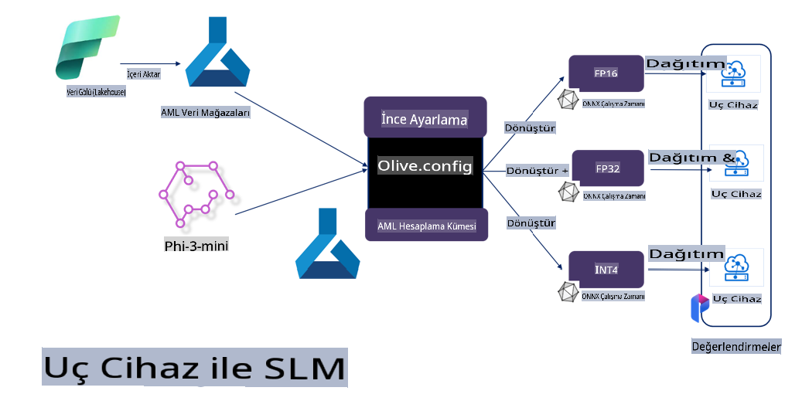

# **Microsoft Olive ile Phi-3'ü İnce Ayar Yapma**

[Olive](https://github.com/microsoft/OLive?WT.mc_id=aiml-138114-kinfeylo), model sıkıştırma, optimizasyon ve derleme alanında sektör lideri teknikleri bir araya getiren, donanım odaklı, kullanımı kolay bir model optimizasyon aracıdır.

Bu araç, makine öğrenimi modellerini optimize etme sürecini kolaylaştırmak ve belirli donanım mimarilerinden en verimli şekilde yararlanılmasını sağlamak için tasarlanmıştır.

İster bulut tabanlı uygulamalar üzerinde çalışıyor olun ister uç cihazlar üzerinde, Olive modellerinizi zahmetsizce ve etkili bir şekilde optimize etmenize olanak tanır.

## Temel Özellikler:
- Olive, hedef donanımlar için optimizasyon tekniklerini bir araya getirir ve otomatikleştirir.
- Tek bir optimizasyon tekniği tüm senaryolara uymaz; bu yüzden Olive, uzmanların kendi yeniliklerini ekleyebilmesi için genişletilebilirlik sağlar.

## Mühendislik Çabasını Azaltın:
- Geliştiriciler, eğitilmiş modelleri dağıtım için hazırlamak ve optimize etmek adına genellikle donanım sağlayıcılarına özgü birçok araç zincirini öğrenmek ve kullanmak zorunda kalır.
- Olive, istenilen donanım için optimizasyon tekniklerini otomatikleştirerek bu süreci kolaylaştırır.

## Kullanıma Hazır Uçtan Uca Optimizasyon Çözümü:

Entegre teknikleri birleştirip ayarlayarak Olive, uçtan uca optimizasyon için birleşik bir çözüm sunar. Optimizasyon sırasında doğruluk ve gecikme gibi kısıtlamaları da göz önünde bulundurur.

## Microsoft Olive Kullanarak İnce Ayar Yapma

Microsoft Olive, üretken yapay zeka alanında hem ince ayar hem de referanslama için kullanılabilen, kullanımı oldukça kolay bir açık kaynak model optimizasyon aracıdır. Sadece basit bir yapılandırma ile, açık kaynaklı küçük dil modelleri ve ilgili çalışma ortamlarını (AzureML / yerel GPU, CPU, DirectML) kullanarak modeli otomatik optimizasyonla ince ayar yapabilir veya referans alabilir ve buluta ya da uç cihazlara dağıtılacak en iyi modeli bulabilirsiniz. Bu, işletmelerin kendi sektörlerine özgü modelleri yerel olarak ve bulutta geliştirmelerine olanak tanır.


## Microsoft Olive ile Phi-3 İnce Ayarı 



## Phi-3 Olive Örnek Kodu ve Örneği
Bu örnekte Olive kullanarak:

- LoRA adaptörünü ifadeleri Üzgün, Mutlu, Korku, Şaşkın olarak sınıflandırmak için ince ayar yapacaksınız.
- Adaptör ağırlıklarını temel modele birleştireceksiniz.
- Modeli optimize edip int4 olarak kuantize edeceksiniz.

[Örnek Kod](../../code/03.Finetuning/olive-ort-example/README.md)

### Microsoft Olive Kurulumu

Microsoft Olive kurulumu oldukça basittir ve CPU, GPU, DirectML ve Azure ML için de kurulabilir.

```bash
pip install olive-ai
```

Bir ONNX modelini CPU ile çalıştırmak istiyorsanız:

```bash
pip install olive-ai[cpu]
```

Bir ONNX modelini GPU ile çalıştırmak istiyorsanız:

```python
pip install olive-ai[gpu]
```

Azure ML kullanmak istiyorsanız:

```python
pip install git+https://github.com/microsoft/Olive#egg=olive-ai[azureml]
```

**Not:**
İşletim Sistemi Gereksinimi: Ubuntu 20.04 / 22.04 

### **Microsoft Olive'in Config.json Dosyası**

Kurulumdan sonra, veri, hesaplama, eğitim, dağıtım ve model oluşturma gibi modelle ilgili farklı ayarları Config dosyası aracılığıyla yapılandırabilirsiniz.

**1. Veri**

Microsoft Olive üzerinde, yerel veri ve bulut verisiyle eğitim desteklenir ve ayarlarda yapılandırılabilir.

*Yerel veri ayarları*

İnce ayar için eğitilecek veri setini basitçe ayarlayabilirsiniz. Genellikle json formatında olur ve veri şablonuyla uyumlu hale getirilir. Bu, modelin gereksinimlerine göre ayarlanmalıdır (örneğin, Microsoft Phi-3-mini'nin gerektirdiği formata uyarlayın. Başka modelleriniz varsa, lütfen diğer modellerin gerektirdiği ince ayar formatlarına bakarak işleme yapın).

```json

    "data_configs": [
        {
            "name": "dataset_default_train",
            "type": "HuggingfaceContainer",
            "load_dataset_config": {
                "params": {
                    "data_name": "json", 
                    "data_files":"dataset/dataset-classification.json",
                    "split": "train"
                }
            },
            "pre_process_data_config": {
                "params": {
                    "dataset_type": "corpus",
                    "text_cols": [
                            "phrase",
                            "tone"
                    ],
                    "text_template": "### Text: {phrase}\n### The tone is:\n{tone}",
                    "corpus_strategy": "join",
                    "source_max_len": 2048,
                    "pad_to_max_len": false,
                    "use_attention_mask": false
                }
            }
        }
    ],
```

**Bulut veri kaynağı ayarları**

Azure AI Studio/Azure Machine Learning Service'in veri deposunu bağlayarak buluttaki veriyi bağlayabilirsiniz. Microsoft Fabric ve Azure Data aracılığıyla farklı veri kaynaklarını Azure AI Studio/Azure Machine Learning Service'e tanıtarak ince ayar için veri desteği sağlayabilirsiniz.

```json

    "data_configs": [
        {
            "name": "dataset_default_train",
            "type": "HuggingfaceContainer",
            "load_dataset_config": {
                "params": {
                    "data_name": "json", 
                    "data_files": {
                        "type": "azureml_datastore",
                        "config": {
                            "azureml_client": {
                                "subscription_id": "Your Azure Subscrition ID",
                                "resource_group": "Your Azure Resource Group",
                                "workspace_name": "Your Azure ML Workspaces name"
                            },
                            "datastore_name": "workspaceblobstore",
                            "relative_path": "Your train_data.json Azure ML Location"
                        }
                    },
                    "split": "train"
                }
            },
            "pre_process_data_config": {
                "params": {
                    "dataset_type": "corpus",
                    "text_cols": [
                            "Question",
                            "Best Answer"
                    ],
                    "text_template": "<|user|>\n{Question}<|end|>\n<|assistant|>\n{Best Answer}\n<|end|>",
                    "corpus_strategy": "join",
                    "source_max_len": 2048,
                    "pad_to_max_len": false,
                    "use_attention_mask": false
                }
            }
        }
    ],
    
```

**2. Hesaplama Yapılandırması**

Yerel bir ortam kullanmanız gerekiyorsa, doğrudan yerel veri kaynaklarını kullanabilirsiniz. Azure AI Studio / Azure Machine Learning Service'in kaynaklarını kullanmanız gerekiyorsa, ilgili Azure parametrelerini, işlem gücü adını vb. yapılandırmanız gerekir.

```json

    "systems": {
        "aml": {
            "type": "AzureML",
            "config": {
                "accelerators": ["gpu"],
                "hf_token": true,
                "aml_compute": "Your Azure AI Studio / Azure Machine Learning Service Compute Name",
                "aml_docker_config": {
                    "base_image": "Your Azure AI Studio / Azure Machine Learning Service docker",
                    "conda_file_path": "conda.yaml"
                }
            }
        },
        "azure_arc": {
            "type": "AzureML",
            "config": {
                "accelerators": ["gpu"],
                "aml_compute": "Your Azure AI Studio / Azure Machine Learning Service Compute Name",
                "aml_docker_config": {
                    "base_image": "Your Azure AI Studio / Azure Machine Learning Service docker",
                    "conda_file_path": "conda.yaml"
                }
            }
        }
    },
```

***Not:***

Azure AI Studio/Azure Machine Learning Service üzerinde bir konteyner aracılığıyla çalıştırıldığından, gerekli ortamın yapılandırılması gerekir. Bu, conda.yaml ortamında yapılandırılmıştır.

```yaml

name: project_environment
channels:
  - defaults
dependencies:
  - python=3.8.13
  - pip=22.3.1
  - pip:
      - einops
      - accelerate
      - azure-keyvault-secrets
      - azure-identity
      - bitsandbytes
      - datasets
      - huggingface_hub
      - peft
      - scipy
      - sentencepiece
      - torch>=2.2.0
      - transformers
      - git+https://github.com/microsoft/Olive@jiapli/mlflow_loading_fix#egg=olive-ai[gpu]
      - --extra-index-url https://aiinfra.pkgs.visualstudio.com/PublicPackages/_packaging/ORT-Nightly/pypi/simple/ 
      - ort-nightly-gpu==1.18.0.dev20240307004
      - --extra-index-url https://aiinfra.pkgs.visualstudio.com/PublicPackages/_packaging/onnxruntime-genai/pypi/simple/
      - onnxruntime-genai-cuda

    

```

**3. Küçük Dil Modelinizi (SLM) Seçin**

Modeli Hugging Face'den doğrudan kullanabilir ya da Azure AI Studio / Azure Machine Learning'in Model Kataloğu ile birleştirerek kullanmak istediğiniz modeli seçebilirsiniz. Aşağıdaki kod örneğinde Microsoft Phi-3-mini'yi örnek olarak kullanacağız.

Eğer modeliniz yerel olarak mevcutsa, bu yöntemi kullanabilirsiniz:

```json

    "input_model":{
        "type": "PyTorchModel",
        "config": {
            "hf_config": {
                "model_name": "model-cache/microsoft/phi-3-mini",
                "task": "text-generation",
                "model_loading_args": {
                    "trust_remote_code": true
                }
            }
        }
    },
```

Azure AI Studio / Azure Machine Learning Service'den bir model kullanmak istiyorsanız, bu yöntemi kullanabilirsiniz:

```json

    "input_model":{
        "type": "PyTorchModel",
        "config": {
            "model_path": {
                "type": "azureml_registry_model",
                "config": {
                    "name": "microsoft/Phi-3-mini-4k-instruct",
                    "registry_name": "azureml-msr",
                    "version": "11"
                }
            },
             "model_file_format": "PyTorch.MLflow",
             "hf_config": {
                "model_name": "microsoft/Phi-3-mini-4k-instruct",
                "task": "text-generation",
                "from_pretrained_args": {
                    "trust_remote_code": true
                }
            }
        }
    },
```

**Not:**
Azure AI Studio / Azure Machine Learning Service ile entegre olmamız gerektiğinden, modeli ayarlarken lütfen sürüm numarasına ve ilgili adlandırmalara dikkat edin.

Azure üzerindeki tüm modeller PyTorch.MLflow olarak ayarlanmalıdır.

Hugging Face hesabınız olmalı ve Azure AI Studio / Azure Machine Learning'in Anahtar değerine bağlanmalıdır.

**4. Algoritma**

Microsoft Olive, Lora ve QLora ince ayar algoritmalarını oldukça iyi bir şekilde kapsar. Sadece bazı ilgili parametreleri yapılandırmanız yeterlidir. Burada QLora'yı örnek alıyorum.

```json
        "lora": {
            "type": "LoRA",
            "config": {
                "target_modules": [
                    "o_proj",
                    "qkv_proj"
                ],
                "double_quant": true,
                "lora_r": 64,
                "lora_alpha": 64,
                "lora_dropout": 0.1,
                "train_data_config": "dataset_default_train",
                "eval_dataset_size": 0.3,
                "training_args": {
                    "seed": 0,
                    "data_seed": 42,
                    "per_device_train_batch_size": 1,
                    "per_device_eval_batch_size": 1,
                    "gradient_accumulation_steps": 4,
                    "gradient_checkpointing": false,
                    "learning_rate": 0.0001,
                    "num_train_epochs": 3,
                    "max_steps": 10,
                    "logging_steps": 10,
                    "evaluation_strategy": "steps",
                    "eval_steps": 187,
                    "group_by_length": true,
                    "adam_beta2": 0.999,
                    "max_grad_norm": 0.3
                }
            }
        },
```

Eğer kuantizasyon dönüşümü yapmak istiyorsanız, Microsoft Olive ana dalı onnxruntime-genai yöntemini zaten desteklemektedir. İhtiyacınıza göre şu şekilde ayarlayabilirsiniz:

1. Adaptör ağırlıklarını temel modele birleştirin.
2. Modeli, gerekli hassasiyetle onnx modeline dönüştürün (ModelBuilder ile).

Örneğin, kuantize edilmiş INT4'e dönüştürme:

```json

        "merge_adapter_weights": {
            "type": "MergeAdapterWeights"
        },
        "builder": {
            "type": "ModelBuilder",
            "config": {
                "precision": "int4"
            }
        }
```

**Not:** 
- QLoRA kullanıyorsanız, ONNXRuntime-genai'nin kuantizasyon dönüşümü şu anda desteklenmemektedir.

- Burada, yukarıdaki adımları kendi ihtiyaçlarınıza göre ayarlayabileceğinizi belirtmek önemlidir. Tüm bu adımları tamamen yapılandırmanız gerekmez. İhtiyacınıza göre, algoritmanın adımlarını ince ayar yapmadan doğrudan kullanabilirsiniz. Son olarak, ilgili motorları yapılandırmanız gerekir.

```json

    "engine": {
        "log_severity_level": 0,
        "host": "aml",
        "target": "aml",
        "search_strategy": false,
        "execution_providers": ["CUDAExecutionProvider"],
        "cache_dir": "../model-cache/models/phi3-finetuned/cache",
        "output_dir" : "../model-cache/models/phi3-finetuned"
    }
```

**5. İnce Ayar Tamamlandı**

Komut satırında, olive-config.json dizininde şu komutu çalıştırın:

```bash
olive run --config olive-config.json  
```

**Feragatname**:  
Bu belge, yapay zeka tabanlı makine çeviri hizmetleri kullanılarak çevrilmiştir. Doğruluk için çaba göstersek de, otomatik çevirilerin hata veya yanlışlıklar içerebileceğini lütfen unutmayın. Orijinal belgenin kendi dilindeki versiyonu, bağlayıcı kaynak olarak kabul edilmelidir. Kritik bilgiler için profesyonel insan çevirisi önerilir. Bu çevirinin kullanımından kaynaklanan herhangi bir yanlış anlama veya yanlış yorumlama durumunda sorumluluk kabul edilmez.