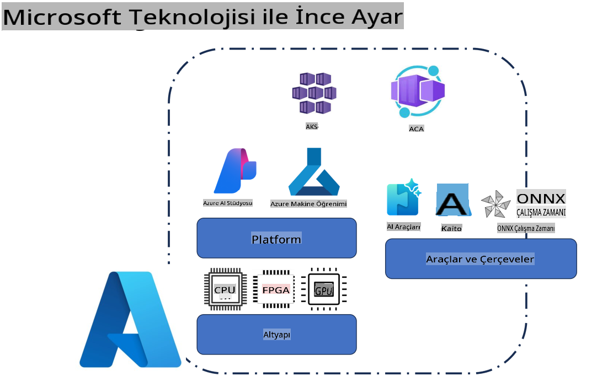
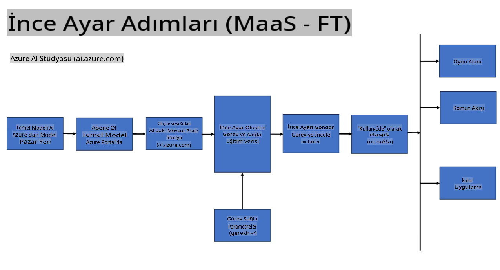
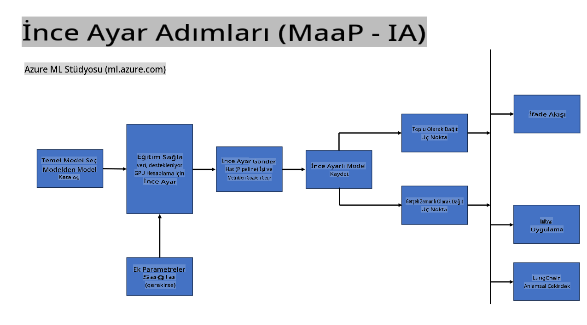
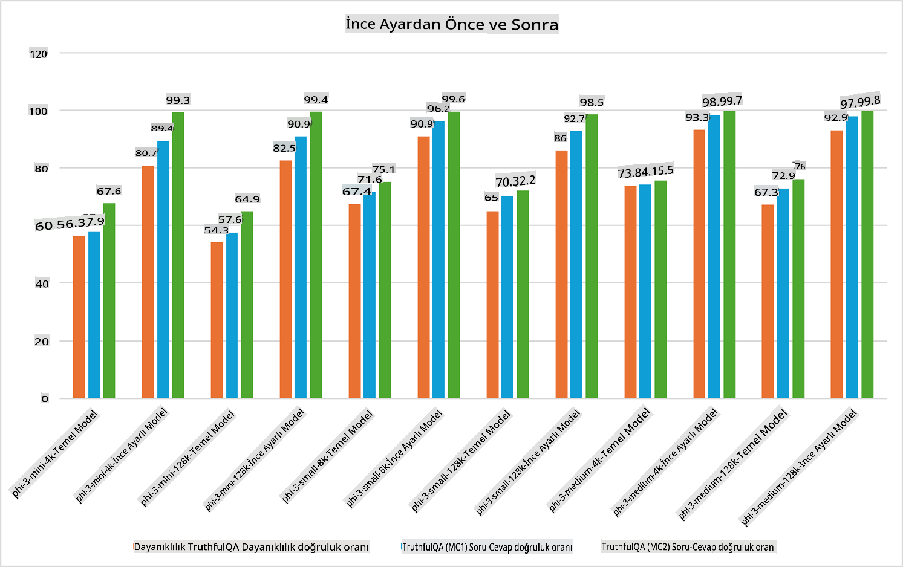

## İnce Ayar Senaryoları

**Platform** Bu, Azure AI Foundry, Azure Machine Learning, AI Tools, Kaito ve ONNX Runtime gibi çeşitli teknolojileri içerir. 

**Altyapı** Bu, ince ayar süreci için temel olan CPU ve FPGA'yı içerir. Şimdi size bu teknolojilerin simgelerini göstereyim.

**Araçlar ve Çerçeve** Bu, ONNX Runtime ve ONNX Runtime'ı içerir. Şimdi size bu teknolojilerin simgelerini göstereyim.  
[ONNX Runtime ve ONNX Runtime simgelerini ekleyin]

Microsoft teknolojileriyle ince ayar süreci, çeşitli bileşenleri ve araçları içerir. Bu teknolojileri anlayarak ve kullanarak, uygulamalarımızı etkili bir şekilde ince ayar yapabilir ve daha iyi çözümler oluşturabiliriz.

## Hizmet Olarak Model

Bilgi işlem oluşturma ve yönetme ihtiyacı olmadan barındırılan ince ayar kullanarak modeli özelleştirin.

Phi-3-mini ve Phi-3-medium modelleri için sunucusuz ince ayar mevcuttur ve bu, geliştiricilerin modelleri bulut ve uç senaryoları için hızla ve kolayca özelleştirmelerini sağlar. Ayrıca, Phi-3-small'un artık Hizmet Olarak Modeller teklifimiz aracılığıyla kullanılabildiğini duyurduk; bu sayede geliştiriciler, temel altyapıyı yönetmek zorunda kalmadan AI geliştirmeye hızla ve kolayca başlayabilir.

## Platform Olarak Model

Kullanıcılar, modellerini ince ayar yapmak için kendi bilgi işlem altyapılarını yönetir.

[İnce Ayar Örneği](https://github.com/Azure/azureml-examples/blob/main/sdk/python/foundation-models/system/finetune/chat-completion/chat-completion.ipynb)

## İnce Ayar Senaryoları 

| | | | | | | |
|-|-|-|-|-|-|-|
|Senaryo|LoRA|QLoRA|PEFT|DeepSpeed|ZeRO|DORA|
|Önceden eğitilmiş LLM'leri belirli görevler veya alanlara uyarlama|Evet|Evet|Evet|Evet|Evet|Evet|
|Metin sınıflandırma, adlandırılmış varlık tanıma ve makine çevirisi gibi NLP görevleri için ince ayar yapma|Evet|Evet|Evet|Evet|Evet|Evet|
|Soru-cevap görevleri için ince ayar yapma|Evet|Evet|Evet|Evet|Evet|Evet|
|Sohbet botlarında insan benzeri yanıtlar oluşturmak için ince ayar yapma|Evet|Evet|Evet|Evet|Evet|Evet|
|Müzik, sanat veya diğer yaratıcı içerikler oluşturmak için ince ayar yapma|Evet|Evet|Evet|Evet|Evet|Evet|
|Hesaplama ve finansal maliyetleri azaltma|Evet|Evet|Hayır|Evet|Evet|Hayır|
|Bellek kullanımını azaltma|Hayır|Evet|Hayır|Evet|Evet|Evet|
|Verimli ince ayar için daha az parametre kullanma|Hayır|Evet|Evet|Hayır|Hayır|Evet|
|Mevcut tüm GPU cihazlarının toplam GPU belleğine erişim sağlayan bellek verimli bir veri paralelliği formu kullanma|Hayır|Hayır|Hayır|Evet|Evet|Evet|

## İnce Ayar Performans Örnekleri

**Feragatname**:  
Bu belge, yapay zeka tabanlı makine çeviri hizmetleri kullanılarak çevrilmiştir. Doğruluk için çaba göstersek de, otomatik çevirilerin hata veya yanlışlıklar içerebileceğini lütfen unutmayın. Belgenin orijinal dilindeki hali yetkili kaynak olarak kabul edilmelidir. Kritik bilgiler için profesyonel insan çevirisi önerilir. Bu çevirinin kullanımından kaynaklanan yanlış anlamalar veya yanlış yorumlamalardan sorumlu değiliz.