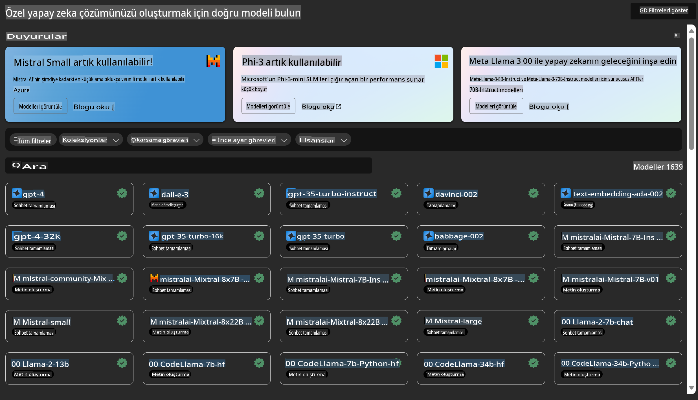

# **Azure Machine Learning Hizmetini Tanıtın**

[Azure Machine Learning](https://ml.azure.com?WT.mc_id=aiml-138114-kinfeylo), makine öğrenimi (ML) proje yaşam döngüsünü hızlandırmak ve yönetmek için kullanılan bir bulut hizmetidir.

ML uzmanları, veri bilimciler ve mühendisler günlük iş akışlarında bu hizmeti şu amaçlarla kullanabilir:

- Modelleri eğitmek ve dağıtmak.
- Makine öğrenimi operasyonlarını (MLOps) yönetmek.
- Azure Machine Learning'de bir model oluşturabilir veya PyTorch, TensorFlow ya da scikit-learn gibi açık kaynaklı bir platformda oluşturulmuş bir modeli kullanabilirsiniz.
- MLOps araçları, modelleri izleme, yeniden eğitme ve yeniden dağıtma süreçlerinde size yardımcı olur.

## Azure Machine Learning Kimler İçin?

**Veri Bilimciler ve ML Mühendisleri**

Günlük iş akışlarını hızlandırmak ve otomatikleştirmek için araçlar kullanabilirler.  
Azure ML, adalet, açıklanabilirlik, izlenebilirlik ve denetlenebilirlik özelliklerini sunar.

**Uygulama Geliştiriciler**

Modelleri sorunsuz bir şekilde uygulamalara veya hizmetlere entegre edebilirler.

**Platform Geliştiriciler**

Azure Resource Manager API'leri tarafından desteklenen sağlam bir araç setine erişim sağlar.  
Bu araçlar, gelişmiş ML araçları oluşturmayı mümkün kılar.

**Kurumsal Kullanıcılar**

Microsoft Azure bulutunda çalışırken, tanıdık güvenlik ve rol tabanlı erişim kontrolünden faydalanabilirler.  
Korunan verilere ve belirli işlemlere erişimi kontrol etmek için projeler oluşturabilirsiniz.

## Takımdaki Herkes İçin Verimlilik
ML projeleri genellikle inşa ve bakım süreçlerinde farklı becerilere sahip bir ekibin çalışmasını gerektirir.

Azure ML, şunları yapmanıza olanak tanır:
- Paylaşılan not defterleri, hesaplama kaynakları, sunucusuz işlem, veri ve ortamlar üzerinden ekibinizle iş birliği yapın.
- Doğruluk, açıklanabilirlik, izlenebilirlik ve denetlenebilirlik özellikleriyle modeller geliştirin ve soy kütüğü ile denetim uyumluluğu gereksinimlerini karşılayın.
- ML modellerini hızlı ve kolay bir şekilde ölçeklendirin, bunları etkili bir şekilde yönetin ve MLOps ile düzenleyin.
- Yerleşik yönetişim, güvenlik ve uyumluluk ile makine öğrenimi iş yüklerini her yerde çalıştırın.

## Çapraz Uyumlu Platform Araçları

Bir ML ekibindeki herkes, işi tamamlamak için tercih ettiği araçları kullanabilir.  
Hızlı deneyler yapmak, hiperparametre ayarlamak, boru hatları oluşturmak veya çıkarımları yönetmek gibi işler için şu tanıdık arayüzleri kullanabilirsiniz:
- Azure Machine Learning Studio
- Python SDK (v2)
- Azure CLI (v2)
- Azure Resource Manager REST API'leri

Modelleri geliştirirken ve geliştirme döngüsü boyunca iş birliği yaparken, Azure Machine Learning studio arayüzünde varlıkları, kaynakları ve metrikleri paylaşabilir ve bulabilirsiniz.

## **Azure ML'de LLM/SLM**

Azure ML, LLMOps ve SLMOps'u birleştirerek kurumsal düzeyde üretken yapay zeka teknolojisi platformu oluşturmak için birçok LLM/SLM ile ilgili işlev eklemiştir.

### **Model Kataloğu**

Kurumsal kullanıcılar, farklı iş senaryolarına göre farklı modelleri Model Kataloğu aracılığıyla dağıtabilir ve bu modelleri, kurumsal geliştiricilerin veya kullanıcıların erişimi için bir Hizmet Olarak Model olarak sunabilir.

Azure Machine Learning studio'daki Model Kataloğu, Üretken Yapay Zeka uygulamaları oluşturmanıza olanak tanıyan geniş bir model yelpazesini keşfetmek ve kullanmak için merkezdir. Model kataloğu, Microsoft tarafından eğitilen modeller de dahil olmak üzere Azure OpenAI hizmeti, Mistral, Meta, Cohere, Nvidia, Hugging Face gibi model sağlayıcıları arasında yüzlerce model içerir. Microsoft dışındaki sağlayıcılardan gelen modeller, Microsoft Ürün Koşulları'nda tanımlandığı üzere Microsoft Dışı Ürünlerdir ve modelle birlikte sağlanan koşullara tabidir.

### **İş Boru Hattı**

Makine öğrenimi boru hattının temel amacı, bir makine öğrenimi görevini çok adımlı bir iş akışına bölmektir. Her adım, ayrı ayrı geliştirilebilen, optimize edilebilen, yapılandırılabilen ve otomatikleştirilebilen yönetilebilir bir bileşendir. Adımlar, iyi tanımlanmış arayüzlerle birbirine bağlanır. Azure Machine Learning boru hattı hizmeti, boru hattı adımları arasındaki tüm bağımlılıkları otomatik olarak düzenler.

SLM / LLM'i ince ayarlarken, veri, eğitim ve üretim süreçlerimizi Boru Hattı üzerinden yönetebiliriz.

### **Prompt Flow**

Azure Machine Learning prompt flow kullanmanın avantajları  
Azure Machine Learning prompt flow, kullanıcıların fikirden deneye ve nihayetinde üretime hazır LLM tabanlı uygulamalara geçişine yardımcı olan bir dizi avantaj sunar:

**Prompt mühendisliğinde çeviklik**

Etkileşimli yazma deneyimi: Azure Machine Learning prompt flow, akış yapısının görsel bir temsilini sunar ve kullanıcıların projelerini kolayca anlamalarını ve gezinmelerini sağlar. Ayrıca, akış geliştirme ve hata ayıklama için verimli bir not defteri benzeri kodlama deneyimi sunar.  
Prompt ayarı için varyantlar: Kullanıcılar, birden fazla prompt varyantı oluşturabilir ve karşılaştırabilir, böylece yinelemeli bir iyileştirme sürecine olanak tanır.

Değerlendirme: Dahili değerlendirme akışları, kullanıcıların promptlarının ve akışlarının kalitesini ve etkinliğini değerlendirmelerine olanak tanır.

Kapsamlı kaynaklar: Azure Machine Learning prompt flow, geliştirme için başlangıç noktası sağlayan yerleşik araçlar, örnekler ve şablonlardan oluşan bir kitaplık içerir, yaratıcılığı teşvik eder ve süreci hızlandırır.

**LLM tabanlı uygulamalar için kurumsal hazırlık**

İş birliği: Azure Machine Learning prompt flow, ekip iş birliğini destekler ve birden fazla kullanıcının prompt mühendisliği projelerinde birlikte çalışmasına, bilgi paylaşmasına ve sürüm kontrolünü sürdürmesine olanak tanır.

Tümleşik platform: Azure Machine Learning prompt flow, geliştirme, değerlendirme, dağıtım ve izlemeyi kapsayan tüm prompt mühendisliği sürecini kolaylaştırır. Kullanıcılar, akışlarını Azure Machine Learning uç noktaları olarak kolayca dağıtabilir ve performanslarını gerçek zamanlı olarak izleyebilir, böylece optimal çalışma ve sürekli iyileştirme sağlar.

Azure Machine Learning Kurumsal Hazırlık Çözümleri: Prompt flow, Azure Machine Learning'in sağlam kurumsal hazırlık çözümlerinden yararlanır ve akışların geliştirilmesi, test edilmesi ve dağıtılması için güvenli, ölçeklenebilir ve güvenilir bir temel sağlar.

Azure Machine Learning prompt flow ile kullanıcılar, prompt mühendisliği çevikliğini artırabilir, etkili bir şekilde iş birliği yapabilir ve başarılı LLM tabanlı uygulama geliştirme ve dağıtımı için kurumsal düzeyde çözümlerden yararlanabilir.

Azure ML'nin işlem gücü, verileri ve farklı bileşenlerini birleştirerek, kurumsal geliştiriciler kendi yapay zeka uygulamalarını kolayca oluşturabilirler.

**Feragatname**:  
Bu belge, yapay zeka tabanlı makine çeviri hizmetleri kullanılarak çevrilmiştir. Doğruluk için çaba göstersek de, otomatik çevirilerin hata veya yanlışlıklar içerebileceğini lütfen unutmayın. Belgenin orijinal dili, yetkili kaynak olarak kabul edilmelidir. Kritik bilgiler için profesyonel insan çevirisi önerilir. Bu çevirinin kullanımından kaynaklanan yanlış anlama veya yorumlamalardan sorumlu değiliz.