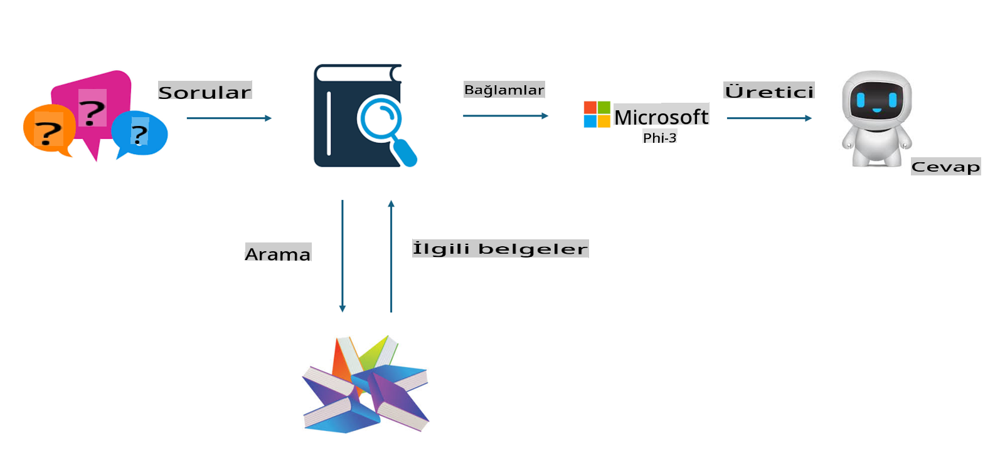

# **Phi-3'ü bir sektör uzmanı yapın**

Phi-3 modelini bir sektöre entegre etmek için, modelinize sektörle ilgili iş verilerini eklemeniz gerekir. Bunun için iki farklı seçeneğimiz var: RAG (Retrieval Augmented Generation) ve Fine Tuning.

## **RAG ve Fine-Tuning Karşılaştırması**

### **Retrieval Augmented Generation**

RAG, veri alımı + metin oluşturma anlamına gelir. Şirketin yapılandırılmış ve yapılandırılmamış verileri bir vektör veritabanında saklanır. İlgili içerik arandığında, uygun özet ve içerik bulunarak bir bağlam oluşturulur ve LLM/SLM'nin metin tamamlama yeteneğiyle birleştirilerek içerik üretilir.

### **Fine-tuning**

Fine-tuning, belirli bir modelin iyileştirilmesine dayanır. Model algoritmasından başlamak gerekmez, ancak verilerin sürekli olarak birikmesi gerekir. Sektörel uygulamalarda daha hassas terminoloji ve dil kullanımı istiyorsanız, fine-tuning daha iyi bir seçimdir. Ancak verileriniz sık sık değişiyorsa, fine-tuning karmaşık hale gelebilir.

### **Nasıl Seçim Yapılır**

1. Eğer cevabımızın dış verilerden yararlanması gerekiyorsa, RAG en iyi seçimdir.

2. Eğer kararlı ve hassas sektör bilgisi üretmek istiyorsanız, fine-tuning iyi bir tercih olacaktır. RAG, ilgili içeriği çekmeye öncelik verir ancak her zaman uzmanlık gerektiren nüansları yakalayamayabilir.

3. Fine-tuning için yüksek kaliteli bir veri seti gereklidir ve eğer veriler yalnızca küçük bir kapsamdaysa, büyük bir fark yaratmayacaktır. RAG daha esnektir.

4. Fine-tuning bir kara kutudur, iç mekanizmasını anlamak zordur. Ancak RAG, verilerin kaynağını bulmayı kolaylaştırarak halüsinasyonları veya içerik hatalarını etkili bir şekilde düzenlemeye ve daha fazla şeffaflık sağlamaya olanak tanır.

### **Senaryolar**

1. Dikey sektörler için belirli profesyonel terminoloji ve ifadeler gerekiyorsa, ***Fine-tuning*** en iyi seçim olacaktır.

2. Farklı bilgi noktalarının sentezini içeren bir Soru-Cevap sistemi için, ***RAG*** en iyi seçim olacaktır.

3. Otomatik iş akışlarının bir kombinasyonu için, ***RAG + Fine-tuning*** en iyi seçimdir.

## **RAG Nasıl Kullanılır**

Bir vektör veritabanı, matematiksel formda saklanan bir veri koleksiyonudur. Vektör veritabanları, makine öğrenimi modellerinin önceki girdileri hatırlamasını kolaylaştırır ve bu da arama, öneriler ve metin oluşturma gibi kullanım durumlarını desteklemek için makine öğreniminin kullanılmasını sağlar. Veriler, tam eşleşmeler yerine benzerlik ölçütlerine göre tanımlanabilir, bu da bilgisayar modellerinin verilerin bağlamını anlamasını sağlar.

Vektör veritabanı, RAG'yi gerçekleştirmek için kilit bir unsurdur. Verileri text-embedding-3, jina-ai-embedding gibi vektör modelleri aracılığıyla vektör formatında saklamaya dönüştürebiliriz.

RAG uygulaması oluşturmayı öğrenin: [https://github.com/microsoft/Phi-3CookBook](https://github.com/microsoft/Phi-3CookBook?WT.mc_id=aiml-138114-kinfeylo)

## **Fine-tuning Nasıl Kullanılır**

Fine-tuning'de yaygın olarak kullanılan algoritmalar Lora ve QLora'dır. Peki hangisini seçmelisiniz?
- [Bu örnek not defteriyle daha fazlasını öğrenin](../../../../code/04.Finetuning/Phi_3_Inference_Finetuning.ipynb)
- [Python FineTuning Örnek Scripti](../../../../code/04.Finetuning/FineTrainingScript.py)

### **Lora ve QLora**

LoRA (Low-Rank Adaptation) ve QLoRA (Quantized Low-Rank Adaptation), Büyük Dil Modellerini (LLM) Parameter Efficient Fine Tuning (PEFT) kullanarak ince ayarlamak için kullanılan tekniklerdir. PEFT teknikleri, modelleri geleneksel yöntemlerden daha verimli bir şekilde eğitmek için tasarlanmıştır.  
LoRA, ağırlık güncelleme matrisine düşük rütbeli bir yaklaşım uygulayarak bellek kullanımını azaltan bağımsız bir ince ayar tekniğidir. Hızlı eğitim süreleri sunar ve geleneksel fine-tuning yöntemlerine yakın performansı korur.  

QLoRA, bellek kullanımını daha da azaltmak için kuantizasyon tekniklerini içeren LoRA'nın genişletilmiş bir versiyonudur. QLoRA, önceden eğitilmiş LLM'deki ağırlık parametrelerinin hassasiyetini 4-bit seviyesine indirerek bellek açısından daha verimli hale gelir. Ancak, QLoRA eğitimi, ek kuantizasyon ve dekuantizasyon adımları nedeniyle LoRA eğitimine göre yaklaşık %30 daha yavaştır.  

QLoRA, kuantizasyon sırasında oluşan hataları düzeltmek için LoRA'yı bir tamamlayıcı olarak kullanır. QLoRA, milyarlarca parametreye sahip devasa modelleri, nispeten küçük ve kolayca erişilebilir GPU'larda ince ayar yapmayı mümkün kılar. Örneğin, QLoRA, 36 GPU gerektiren 70B parametreli bir modeli yalnızca 2 GPU ile ince ayar yapabilir.

**Feragatname**:  
Bu belge, yapay zeka tabanlı makine çeviri hizmetleri kullanılarak çevrilmiştir. Doğruluk için çaba göstersek de, otomatik çevirilerin hata veya yanlışlıklar içerebileceğini lütfen unutmayın. Belgenin orijinal dilindeki hali, bağlayıcı kaynak olarak kabul edilmelidir. Kritik bilgiler için profesyonel insan çevirisi önerilir. Bu çevirinin kullanımından kaynaklanan yanlış anlamalar veya yanlış yorumlamalar için sorumluluk kabul edilmez.