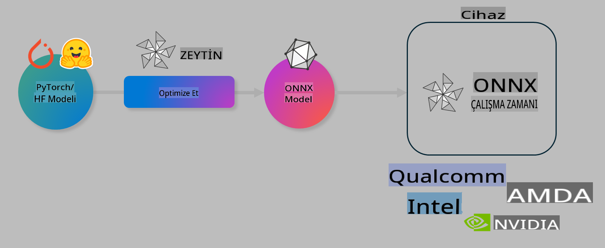

# Lab. AI Modellerini Cihaz Üzerinde Çıkarım için Optimize Et

## Giriş 

> [!IMPORTANT]
> Bu laboratuvar, ilgili sürücüler ve CUDA araç seti (sürüm 12+) ile birlikte bir **Nvidia A10 veya A100 GPU** gerektirir.

> [!NOTE]
> Bu, OLIVE kullanarak cihaz üzerinde çıkarım için modelleri optimize etmenin temel kavramlarına uygulamalı bir giriş sağlayacak **35 dakikalık** bir laboratuvardır.

## Öğrenme Hedefleri

Bu laboratuvarın sonunda OLIVE kullanarak şunları yapabileceksiniz:

- AWQ kuantizasyon yöntemini kullanarak bir AI modelini kuantize etmek.
- Belirli bir görev için bir AI modelini ince ayar yapmak.
- ONNX Runtime üzerinde verimli cihaz içi çıkarım için LoRA adaptörleri (ince ayarlı model) oluşturmak.

### Olive Nedir?

Olive (*O*NNX *live*), ONNX runtime +++https://onnxruntime.ai+++ için modelleri dağıtmak amacıyla kullanılan bir model optimizasyon araç setidir ve bir CLI ile birlikte gelir.



Olive'e genellikle bir PyTorch veya Hugging Face modeli giriş olarak verilir ve çıktı olarak ONNX runtime çalıştıran bir cihazda (dağıtım hedefi) çalışan optimize edilmiş bir ONNX modeli elde edilir. Olive, modelin dağıtım hedefinin AI hızlandırıcısı (NPU, GPU, CPU) için, Qualcomm, AMD, Nvidia veya Intel gibi bir donanım sağlayıcısı tarafından optimize edilmesini sağlar.

Olive, *workflow* adı verilen bir işlem yürütür. Bu, model optimizasyonu görevlerinden oluşan sıralı bir dizi olan *passes* (geçişler) ile gerçekleştirilir. Örneğin, model sıkıştırma, grafik yakalama, kuantizasyon, grafik optimizasyonu gibi geçişler. Her geçişin, doğruluk ve gecikme gibi en iyi metrikleri elde etmek için ayarlanabilecek bir dizi parametresi vardır. Olive, her bir geçişi ya da bir dizi geçişi otomatik olarak ayarlamak için bir arama algoritması kullanan bir arama stratejisi uygular.

#### Olive'in Faydaları

- Grafik optimizasyonu, sıkıştırma ve kuantizasyon gibi farklı tekniklerle deneme yanılma sürecini **zaman ve stresten kurtarır**. Kalite ve performans kısıtlamalarınızı tanımlayın ve Olive sizin için en iyi modeli otomatik olarak bulsun.
- Kuantizasyon, sıkıştırma, grafik optimizasyonu ve ince ayar alanlarında **40'tan fazla yerleşik model optimizasyon bileşeni**.
- Yaygın model optimizasyon görevleri için **kullanımı kolay CLI**. Örneğin: olive quantize, olive auto-opt, olive finetune.
- Model paketleme ve dağıtım dahildir.
- **Çoklu LoRA hizmeti** için modeller oluşturmayı destekler.
- Model optimizasyonu ve dağıtım görevlerini düzenlemek için YAML/JSON ile iş akışları oluşturun.
- **Hugging Face** ve **Azure AI** Entegrasyonu.
- **Maliyet tasarrufu** sağlayan yerleşik **önbellekleme** mekanizması.

## Laboratuvar Talimatları
> [!NOTE]
> Azure AI Hub ve Projenizi hazırladığınızdan ve A100 bilgisayarınızı Lab 1'e göre kurduğunuzdan emin olun.

### Adım 0: Azure AI Compute'a Bağlanın

Azure AI bilgisayarına **VS Code**'un uzaktan bağlantı özelliğini kullanarak bağlanacaksınız.

1. **VS Code** masaüstü uygulamanızı açın:
1. **Shift+Ctrl+P** tuşlarına basarak **komut paletini** açın.
1. Komut paletinde **AzureML - remote: Connect to compute instance in New Window** arayın.
1. Lab 1'de kurduğunuz Azure Aboneliği, Kaynak Grubu, Proje ve Bilgisayar adını seçerek ekrandaki talimatları izleyin.
1. Azure ML Compute düğümüne bağlandığınızda bu, **VS Code'un sol alt köşesinde** gösterilecektir `><Azure ML: Compute Name`

### Adım 1: Bu Depoyu Klonlayın

VS Code'da, **Ctrl+J** ile yeni bir terminal açabilir ve bu depoyu klonlayabilirsiniz:

Terminalde aşağıdaki istemi göreceksiniz:

```
azureuser@computername:~/cloudfiles/code$ 
```
Çözümü klonlayın:

```bash
cd ~/localfiles
git clone https://github.com/microsoft/phi-3cookbook.git
```

### Adım 2: Klasörü VS Code'da Açın

İlgili klasörde VS Code'u açmak için terminalde aşağıdaki komutu çalıştırın. Bu, yeni bir pencere açacaktır:

```bash
code phi-3cookbook/code/04.Finetuning/Olive-lab
```

Alternatif olarak, **Dosya** > **Klasör Aç** seçeneğini seçerek klasörü açabilirsiniz.

### Adım 3: Bağımlılıklar

Azure AI Compute Instance'da VS Code'da bir terminal penceresi açın (ipucu: **Ctrl+J**) ve bağımlılıkları yüklemek için aşağıdaki komutları çalıştırın:

```bash
conda create -n olive-ai python=3.11 -y
conda activate olive-ai
pip install -r requirements.txt
az extension remove -n azure-cli-ml
az extension add -n ml
```

> [!NOTE]
> Tüm bağımlılıkların yüklenmesi yaklaşık **5 dakika** sürecektir.

Bu laboratuvarda, modelleri Azure AI Model kataloğuna indirip yükleyeceksiniz. Model kataloğuna erişebilmeniz için Azure'da oturum açmanız gerekecek:

```bash
az login
```

> [!NOTE]
> Oturum açma sırasında aboneliğinizi seçmeniz istenecektir. Bu laboratuvar için sağlanan aboneliği seçtiğinizden emin olun.

### Adım 4: Olive Komutlarını Çalıştırın 

Azure AI Compute Instance'da VS Code'da bir terminal penceresi açın (ipucu: **Ctrl+J**) ve `olive-ai` conda ortamının etkinleştirildiğinden emin olun:

```bash
conda activate olive-ai
```

Ardından, komut satırında aşağıdaki Olive komutlarını çalıştırın.

1. **Veriyi inceleyin:** Bu örnekte, Phi-3.5-Mini modelini seyahatle ilgili soruları yanıtlamada uzmanlaşacak şekilde ince ayar yapacaksınız. Aşağıdaki kod, JSON lines formatındaki veri kümesinin ilk birkaç kaydını gösterir:
   
    ```bash
    head data/data_sample_travel.jsonl
    ```
1. **Modeli Kuantize Edin:** Modeli eğitmeden önce, Active Aware Quantization (AWQ) +++https://arxiv.org/abs/2306.00978+++ adlı bir teknik kullanan aşağıdaki komutla kuantize edin. AWQ, çıkarım sırasında üretilen aktivasyonları dikkate alarak bir modelin ağırlıklarını kuantize eder. Bu, kuantizasyon sürecinin aktivasyonlardaki gerçek veri dağılımını dikkate aldığı anlamına gelir ve bu da geleneksel ağırlık kuantizasyon yöntemlerine kıyasla model doğruluğunun daha iyi korunmasını sağlar.
    
    ```bash
    olive quantize \
       --model_name_or_path microsoft/Phi-3.5-mini-instruct \
       --trust_remote_code \
       --algorithm awq \
       --output_path models/phi/awq \
       --log_level 1
    ```
    
    AWQ kuantizasyonunun tamamlanması **~8 dakika** sürer ve bu işlem **model boyutunu ~7.5GB'den ~2.5GB'ye** düşürür.
   
   Bu laboratuvarda, Hugging Face'den modellerin nasıl girdileceğini gösteriyoruz (örneğin: `microsoft/Phi-3.5-mini-instruct`). However, Olive also allows you to input models from the Azure AI catalog by updating the `model_name_or_path` argument to an Azure AI asset ID (for example:  `azureml://registries/azureml/models/Phi-3.5-mini-instruct/versions/4`). 

1. **Train the model:** Next, the `olive finetune` komutu kuantize edilmiş modeli ince ayar yapar. Modeli ince ayar yapmadan önce kuantize etmek, doğruluğu daha iyi hale getirir çünkü ince ayar süreci kuantizasyondan kaynaklanan bazı kayıpları telafi eder.
    
    ```bash
    olive finetune \
        --method lora \
        --model_name_or_path models/phi/awq \
        --data_files "data/data_sample_travel.jsonl" \
        --data_name "json" \
        --text_template "<|user|>\n{prompt}<|end|>\n<|assistant|>\n{response}<|end|>" \
        --max_steps 100 \
        --output_path ./models/phi/ft \
        --log_level 1
    ```
    
    İnce ayarın tamamlanması **~6 dakika** sürer (100 adımla).

1. **Optimize Edin:** Model eğitildikten sonra, Olive'in `auto-opt` command, which will capture the ONNX graph and automatically perform a number of optimizations to improve the model performance for CPU by compressing the model and doing fusions. It should be noted, that you can also optimize for other devices such as NPU or GPU by just updating the `--device` and `--provider` argümanlarını kullanarak modeli optimize edin - ancak bu laboratuvarın amacı doğrultusunda CPU kullanacağız.

    ```bash
    olive auto-opt \
       --model_name_or_path models/phi/ft/model \
       --adapter_path models/phi/ft/adapter \
       --device cpu \
       --provider CPUExecutionProvider \
       --use_ort_genai \
       --output_path models/phi/onnx-ao \
       --log_level 1
    ```
    
    Optimizasyonun tamamlanması **~5 dakika** sürer.

### Adım 5: Model Çıkarımını Hızlı Test Etme

Modelin çıkarımını test etmek için, klasörünüzde **app.py** adında bir Python dosyası oluşturun ve aşağıdaki kodu kopyalayıp yapıştırın:

```python
import onnxruntime_genai as og
import numpy as np

print("loading model and adapters...", end="", flush=True)
model = og.Model("models/phi/onnx-ao/model")
adapters = og.Adapters(model)
adapters.load("models/phi/onnx-ao/model/adapter_weights.onnx_adapter", "travel")
print("DONE!")

tokenizer = og.Tokenizer(model)
tokenizer_stream = tokenizer.create_stream()

params = og.GeneratorParams(model)
params.set_search_options(max_length=100, past_present_share_buffer=False)
user_input = "what is the best thing to see in chicago"
params.input_ids = tokenizer.encode(f"<|user|>\n{user_input}<|end|>\n<|assistant|>\n")

generator = og.Generator(model, params)

generator.set_active_adapter(adapters, "travel")

print(f"{user_input}")

while not generator.is_done():
    generator.compute_logits()
    generator.generate_next_token()

    new_token = generator.get_next_tokens()[0]
    print(tokenizer_stream.decode(new_token), end='', flush=True)

print("\n")
```

Kodu çalıştırmak için şu komutu kullanın:

```bash
python app.py
```

### Adım 6: Azure AI'ye Model Yükleme

Modeli bir Azure AI model deposuna yüklemek, modeli geliştirme ekibinizin diğer üyeleriyle paylaşılabilir hale getirir ve ayrıca modelin sürüm kontrolünü sağlar. Modeli yüklemek için aşağıdaki komutu çalıştırın:

> [!NOTE]
> `{}` placeholders with the name of your resource group and Azure AI Project Name. 

To find your resource group `"resourceGroup"` ve Azure AI Proje adını güncelleyin, ardından aşağıdaki komutu çalıştırın:

```
az ml workspace show
```

Veya +++ai.azure.com+++ adresine giderek **yönetim merkezi** > **proje** > **genel bakış** seçeneğini seçebilirsiniz.

`{}` yer tutucularını, kaynak grubunuzun adı ve Azure AI Proje Adı ile güncelleyin.

```bash
az ml model create \
    --name ft-for-travel \
    --version 1 \
    --path ./models/phi/onnx-ao \
    --resource-group {RESOURCE_GROUP_NAME} \
    --workspace-name {PROJECT_NAME}
```
Yüklenen modelinizi görebilir ve modelinizi https://ml.azure.com/model/list adresinden dağıtabilirsiniz.

**Feragatname**:  
Bu belge, yapay zeka tabanlı makine çeviri hizmetleri kullanılarak çevrilmiştir. Doğruluğu sağlamak için çaba göstersek de, otomatik çevirilerin hata veya yanlışlıklar içerebileceğini lütfen unutmayın. Orijinal belgenin kendi dilindeki hali, esas kaynak olarak kabul edilmelidir. Kritik bilgiler için profesyonel insan çevirisi önerilir. Bu çevirinin kullanımından doğabilecek yanlış anlamalar veya yanlış yorumlamalardan sorumlu değiliz.