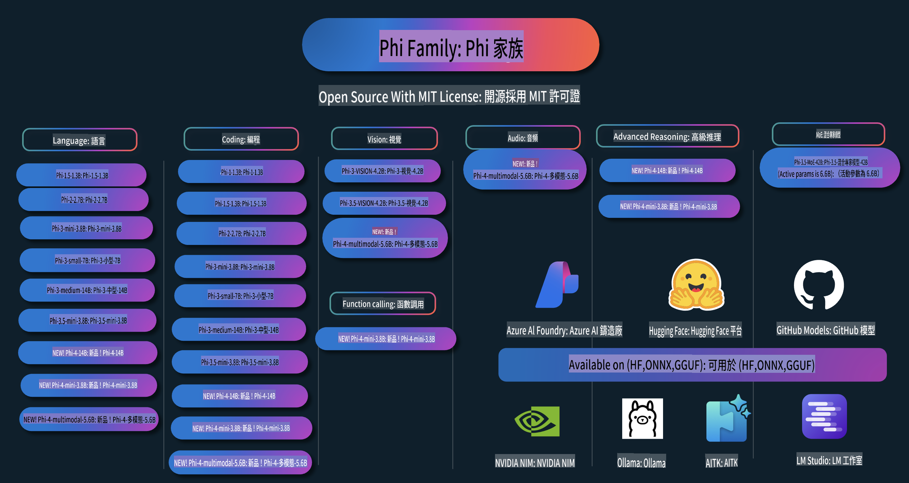

# Phi 食譜：Microsoft Phi 模型的實作範例

  

  
  
  

  
  

Phi 是 Microsoft 開發的一系列開源 AI 模型。

Phi 是目前最強大且具成本效益的小型語言模型（SLM），在多語言、推理、文本/聊天生成、編碼、圖像、音訊及其他場景的基準測試中表現非常出色。

您可以將 Phi 部署到雲端或邊緣設備，並能夠以有限的計算資源輕鬆構建生成式 AI 應用程式。

請按照以下步驟開始使用這些資源：
1. **Fork 此存儲庫**：點擊   
2. **克隆此存儲庫**：`git clone https://github.com/microsoft/PhiCookBook.git`  
3. [**加入 Microsoft AI Discord 社群，與專家和開發者交流**](https://discord.com/invite/ByRwuEEgH4?WT.mc_id=aiml-137032-kinfeylo)

## 目錄

- 介紹
  - [歡迎加入 Phi 家族](./md/01.Introduction/01/01.PhiFamily.md)
  - [設定您的環境](./md/01.Introduction/01/01.EnvironmentSetup.md)
  - [了解關鍵技術](./md/01.Introduction/01/01.Understandingtech.md)
  - [Phi 模型的 AI 安全性](./md/01.Introduction/01/01.AISafety.md)
  - [Phi 的硬體支援](./md/01.Introduction/01/01.Hardwaresupport.md)
  - [Phi 模型及其在不同平台的可用性](./md/01.Introduction/01/01.Edgeandcloud.md)
  - [使用 Guidance-ai 和 Phi](./md/01.Introduction/01/01.Guidance.md)
  - [GitHub Marketplace 模型](https://github.com/marketplace/models)
  - [Azure AI 模型目錄](https://ai.azure.com)

- 在不同環境中推理 Phi
  - [Hugging Face](./md/01.Introduction/02/01.HF.md)
  - [GitHub 模型](./md/01.Introduction/02/02.GitHubModel.md)
  - [Azure AI Foundry 模型目錄](./md/01.Introduction/02/03.AzureAIFoundry.md)
  - [Ollama](./md/01.Introduction/02/04.Ollama.md)
  - [AI 工具包 VSCode (AITK)](./md/01.Introduction/02/05.AITK.md)
  - [NVIDIA NIM](./md/01.Introduction/02/06.NVIDIA.md)

- Phi 家族推理
  - [在 iOS 中推理 Phi](./md/01.Introduction/03/iOS_Inference.md)
  - [在 Android 中推理 Phi](./md/01.Introduction/03/Android_Inference.md)
- [Jetson 上的 Phi 推理](./md/01.Introduction/03/Jetson_Inference.md)
    - [AI PC 上的 Phi 推理](./md/01.Introduction/03/AIPC_Inference.md)
    - [使用 Apple MLX 框架進行 Phi 推理](./md/01.Introduction/03/MLX_Inference.md)
    - [本地伺服器上的 Phi 推理](./md/01.Introduction/03/Local_Server_Inference.md)
    - [使用 AI 工具包在遠端伺服器上進行 Phi 推理](./md/01.Introduction/03/Remote_Interence.md)
    - [使用 Rust 進行 Phi 推理](./md/01.Introduction/03/Rust_Inference.md)
    - [本地的 Phi--Vision 推理](./md/01.Introduction/03/Vision_Inference.md)
    - [使用 Kaito AKS 和 Azure Containers（官方支援）進行 Phi 推理](./md/01.Introduction/03/Kaito_Inference.md)
- [Phi 系列量化](./md/01.Introduction/04/QuantifyingPhi.md)
    - [使用 llama.cpp 量化 Phi-3.5 / 4](./md/01.Introduction/04/UsingLlamacppQuantifyingPhi.md)
    - [使用 onnxruntime 的生成式 AI 擴展進行 Phi-3.5 / 4 量化](./md/01.Introduction/04/UsingORTGenAIQuantifyingPhi.md)
    - [使用 Intel OpenVINO 量化 Phi-3.5 / 4](./md/01.Introduction/04/UsingIntelOpenVINOQuantifyingPhi.md)
    - [使用 Apple MLX 框架量化 Phi-3.5 / 4](./md/01.Introduction/04/UsingAppleMLXQuantifyingPhi.md)

- 評估 Phi
    - [負責任的 AI](./md/01.Introduction/05/ResponsibleAI.md)
    - [使用 Azure AI Foundry 進行評估](./md/01.Introduction/05/AIFoundry.md)
    - [使用 Promptflow 進行評估](./md/01.Introduction/05/Promptflow.md)

- 使用 Azure AI Search 的 RAG
    - [如何使用 Azure AI Search 配合 Phi-4-mini 和 Phi-4-multimodal (RAG)](https://github.com/microsoft/PhiCookBook/blob/main/code/06.E2E/E2E_Phi-4-RAG-Azure-AI-Search.ipynb)

- Phi 應用開發範例
  - 文本與聊天應用
    - Phi-4 範例 🆕
      - [📓] [使用 Phi-4-mini ONNX 模型進行聊天](./md/02.Application/01.TextAndChat/Phi4/ChatWithPhi4ONNX/README.md)
      - [使用 Phi-4 本地 ONNX 模型進行聊天的 .NET 範例](../../md/04.HOL/dotnet/src/LabsPhi4-Chat-01OnnxRuntime)
      - [使用 Sementic Kernel 和 Phi-4 ONNX 的聊天 .NET 控制台應用](../../md/04.HOL/dotnet/src/LabsPhi4-Chat-02SK)
    - Phi-3 / 3.5 範例
      - [使用 Phi3、ONNX Runtime Web 和 WebGPU 的本地瀏覽器聊天機器人](https://github.com/microsoft/onnxruntime-inference-examples/tree/main/js/chat)
      - [OpenVino 聊天範例](./md/02.Application/01.TextAndChat/Phi3/E2E_OpenVino_Chat.md)
      - [多模型範例 - Phi-3-mini 和 OpenAI Whisper 的互動](./md/02.Application/01.TextAndChat/Phi3/E2E_Phi-3-mini_with_whisper.md)
      - [MLFlow - 建立包裝器並使用 Phi-3 和 MLFlow](./md//02.Application/01.TextAndChat/Phi3/E2E_Phi-3-MLflow.md)
      - [模型優化 - 如何使用 Olive 為 ONNX Runtime Web 優化 Phi-3-min 模型](https://github.com/microsoft/Olive/tree/main/examples/phi3)
      - [Phi-3 mini-4k-instruct-onnx 的 WinUI3 應用](https://github.com/microsoft/Phi3-Chat-WinUI3-Sample/)
      - [WinUI3 多模型 AI 驅動的筆記應用範例](https://github.com/microsoft/ai-powered-notes-winui3-sample)
      - [微調並整合自訂 Phi-3 模型與 Prompt flow](./md/02.Application/01.TextAndChat/Phi3/E2E_Phi-3-FineTuning_PromptFlow_Integration.md)
      - [在 Azure AI Foundry 中微調並整合自訂 Phi-3 模型與 Prompt flow](./md/02.Application/01.TextAndChat/Phi3/E2E_Phi-3-FineTuning_PromptFlow_Integration_AIFoundry.md)
      - [基於 Microsoft 負責任 AI 原則，評估在 Azure AI Foundry 中微調的 Phi-3 / Phi-3.5 模型](./md/02.Application/01.TextAndChat/Phi3/E2E_Phi-3-Evaluation_AIFoundry.md)
- [📓] [Phi-3.5-mini-instruct 語言預測範例 (中文/英文)](../../md/02.Application/01.TextAndChat/Phi3/phi3-instruct-demo.ipynb)
      - [Phi-3.5-Instruct WebGPU RAG 聊天機器人](./md/02.Application/01.TextAndChat/Phi3/WebGPUWithPhi35Readme.md)
      - [使用 Windows GPU 與 Phi-3.5-Instruct ONNX 建立 Prompt flow 解決方案](./md/02.Application/01.TextAndChat/Phi3/UsingPromptFlowWithONNX.md)
      - [使用 Microsoft Phi-3.5 tflite 建立 Android 應用程式](./md/02.Application/01.TextAndChat/Phi3/UsingPhi35TFLiteCreateAndroidApp.md)
      - [使用 Microsoft.ML.OnnxRuntime 的本地 ONNX Phi-3 模型進行問答 .NET 範例](../../md/04.HOL/dotnet/src/LabsPhi301)
      - [使用 Semantic Kernel 和 Phi-3 的主控台聊天 .NET 應用程式](../../md/04.HOL/dotnet/src/LabsPhi302)

  - Azure AI Inference SDK 程式碼範例
    - Phi-4 範例 🆕
      - [📓] [使用 Phi-4-multimodal 生成專案程式碼](./md/02.Application/02.Code/Phi4/GenProjectCode/README.md)
    - Phi-3 / 3.5 範例
      - [建立您自己的 Visual Studio Code GitHub Copilot 聊天機器人，使用 Microsoft Phi-3 家族](./md/02.Application/02.Code/Phi3/VSCodeExt/README.md)
      - [使用 GitHub 模型和 Phi-3.5 建立您自己的 Visual Studio Code 聊天助理](./md/02.Application/02.Code/Phi3/CreateVSCodeChatAgentWithGitHubModels.md)

  - 高級推理範例
    - Phi-4 範例 🆕
      - [📓] [Phi-4-mini 推理範例](./md/02.Application/03.AdvancedReasoning/Phi4/AdvancedResoningPhi4mini/README.md)

  - 演示
      - [Phi-4-mini 演示，託管於 Hugging Face Spaces](https://huggingface.co/spaces/microsoft/phi-4-mini?WT.mc_id=aiml-137032-kinfeylo)
      - [Phi-4-multimodal 演示，託管於 Hugging Face Spaces](https://huggingface.co/spaces/microsoft/phi-4-multimodal?WT.mc_id=aiml-137032-kinfeylo)
  - 視覺範例
    - Phi-4 範例 🆕
      - [📓] [使用 Phi-4-multimodal 讀取圖像並生成程式碼](./md/02.Application/04.Vision/Phi4/CreateFrontend/README.md) 
    - Phi-3 / 3.5 範例
      - [📓][Phi-3-vision-圖像文字轉文字](../../md/02.Application/04.Vision/Phi3/E2E_Phi-3-vision-image-text-to-text-online-endpoint.ipynb)
      - [Phi-3-vision-ONNX](https://onnxruntime.ai/docs/genai/tutorials/phi3-v.html)
      - [📓][Phi-3-vision CLIP 嵌入](../../md/02.Application/04.Vision/Phi3/E2E_Phi-3-vision-image-text-to-text-online-endpoint.ipynb)
      - [演示: Phi-3 回收](https://github.com/jennifermarsman/PhiRecycling/)
      - [Phi-3-vision - 視覺語言助手 - 使用 Phi3-Vision 和 OpenVINO](https://docs.openvino.ai/nightly/notebooks/phi-3-vision-with-output.html)
      - [Phi-3 Vision Nvidia NIM](./md/02.Application/04.Vision/Phi3/E2E_Nvidia_NIM_Vision.md)
      - [Phi-3 Vision OpenVino](./md/02.Application/04.Vision/Phi3/E2E_OpenVino_Phi3Vision.md)
      - [📓][Phi-3.5 Vision 多幀或多圖像範例](../../md/02.Application/04.Vision/Phi3/phi3-vision-demo.ipynb)
      - [Phi-3 Vision 本地 ONNX 模型，使用 Microsoft.ML.OnnxRuntime .NET](../../md/04.HOL/dotnet/src/LabsPhi303)
      - [基於選單的 Phi-3 Vision 本地 ONNX 模型，使用 Microsoft.ML.OnnxRuntime .NET](../../md/04.HOL/dotnet/src/LabsPhi304)

  - 音頻範例
    - Phi-4 範例 🆕
      - [📓] [使用 Phi-4-multimodal 提取音頻轉錄](./md/02.Application/05.Audio/Phi4/Transciption/README.md)
      - [📓] [Phi-4-multimodal 音頻範例](../../md/02.Application/05.Audio/Phi4/Siri/demo.ipynb)
      - [📓] [Phi-4-multimodal 語音翻譯範例](../../md/02.Application/05.Audio/Phi4/Translate/demo.ipynb)
      - [.NET 主控台應用程式，使用 Phi-4-multimodal 音頻分析音頻文件並生成轉錄](../../md/04.HOL/dotnet/src/LabsPhi4-MultiModal-02Audio)

  - MOE 範例
    - Phi-3 / 3.5 範例
      - [📓] [Phi-3.5 Mixture of Experts 模型 (MoEs) 社交媒體範例](../../md/02.Application/06.MoE/Phi3/phi3_moe_demo.ipynb)
      - [📓] [使用 NVIDIA NIM Phi-3 MOE、Azure AI 搜索和 LlamaIndex 建立檢索增強生成 (RAG) 管道](../../md/02.Application/06.MoE/Phi3/azure-ai-search-nvidia-rag.ipynb)
  - 函數調用範例
    - Phi-4 範例 🆕
      - [📓] [使用 Phi-4-mini 進行函數調用](./md/02.Application/07.FunctionCalling/Phi4/FunctionCallingBasic/README.md)
  - 多模態混合範例
    - Phi-4 範例 🆕
-  [📓] [作為科技記者使用 Phi-4-multimodal](../../md/02.Application/08.Multimodel/Phi4/TechJournalist/phi_4_mm_audio_text_publish_news.ipynb)
      - [使用 Phi-4-multimodal 分析圖像的 .NET 控制台應用程式](../../md/04.HOL/dotnet/src/LabsPhi4-MultiModal-01Images)

- Phi 範例微調
  - [微調場景](./md/03.FineTuning/FineTuning_Scenarios.md)
  - [微調與 RAG 的比較](./md/03.FineTuning/FineTuning_vs_RAG.md)
  - [微調讓 Phi-3 成為行業專家](./md/03.FineTuning/LetPhi3gotoIndustriy.md)
  - [使用 AI Toolkit for VS Code 微調 Phi-3](./md/03.FineTuning/Finetuning_VSCodeaitoolkit.md)
  - [使用 Azure Machine Learning Service 微調 Phi-3](./md/03.FineTuning/Introduce_AzureML.md)
  - [使用 Lora 微調 Phi-3](./md/03.FineTuning/FineTuning_Lora.md)
  - [使用 QLora 微調 Phi-3](./md/03.FineTuning/FineTuning_Qlora.md)
  - [使用 Azure AI Foundry 微調 Phi-3](./md/03.FineTuning/FineTuning_AIFoundry.md)
  - [使用 Azure ML CLI/SDK 微調 Phi-3](./md/03.FineTuning/FineTuning_MLSDK.md)
  - [使用 Microsoft Olive 微調](./md/03.FineTuning/FineTuning_MicrosoftOlive.md)
  - [Microsoft Olive 微調實作實驗室](./md/03.FineTuning/olive-lab/readme.md)
  - [使用 Weights and Bias 微調 Phi-3-vision](./md/03.FineTuning/FineTuning_Phi-3-visionWandB.md)
  - [使用 Apple MLX Framework 微調 Phi-3](./md/03.FineTuning/FineTuning_MLX.md)
  - [Phi-3-vision 微調（官方支援）](./md/03.FineTuning/FineTuning_Vision.md)
  - [使用 Kaito AKS 和 Azure Containers 微調 Phi-3（官方支援）](./md/03.FineTuning/FineTuning_Kaito.md)
  - [Phi-3 和 3.5 Vision 微調](https://github.com/2U1/Phi3-Vision-Finetune)

- 實作實驗室
  - [探索尖端模型：LLMs、SLMs、本地開發等](https://github.com/microsoft/aitour-exploring-cutting-edge-models)
  - [釋放 NLP 潛力：使用 Microsoft Olive 進行微調](https://github.com/azure/Ignite_FineTuning_workshop)

- 學術研究論文與出版物
  - [Textbooks Are All You Need II: phi-1.5 技術報告](https://arxiv.org/abs/2309.05463)
  - [Phi-3 技術報告：一個可以在手機本地運行的高效語言模型](https://arxiv.org/abs/2404.14219)
  - [Phi-4 技術報告](https://arxiv.org/abs/2412.08905)
  - [為車內功能呼叫優化的小型語言模型](https://arxiv.org/abs/2501.02342)
  - [(WhyPHI) 為多選題回答微調 PHI-3：方法論、結果與挑戰](https://arxiv.org/abs/2501.01588)

## 使用 Phi 模型

### Phi 在 Azure AI Foundry 上

您可以學習如何使用 Microsoft Phi 並在不同硬體設備上構建端到端解決方案。若想親自體驗 Phi，可以從試用模型並根據您的場景自訂 Phi 開始，使用 [Azure AI Foundry Azure AI Model Catalog](https://aka.ms/phi3-azure-ai)。您可以在[Azure AI Foundry 快速入門指南](/md/02.QuickStart/AzureAIFoundry_QuickStart.md)中了解更多。

**測試平台**  
每個模型都有專屬的測試平台可以試用：[Azure AI Playground](https://aka.ms/try-phi3)。

### Phi 在 GitHub 模型上

您可以學習如何使用 Microsoft Phi 並在不同硬體設備上構建端到端解決方案。若想親自體驗 Phi，可以從試用模型並根據您的場景自訂 Phi 開始，使用 [GitHub Model Catalog](https://github.com/marketplace/models?WT.mc_id=aiml-137032-kinfeylo)。您可以在[GitHub Model Catalog 快速入門指南](/md/02.QuickStart/GitHubModel_QuickStart.md)中了解更多。

**測試平台**
每個模型都有專屬的[測試模型的 Playground](/md/02.QuickStart/GitHubModel_QuickStart.md)。

### Phi 在 Hugging Face 上

你也可以在 [Hugging Face](https://huggingface.co/microsoft) 找到這個模型。

**Playground**  
[Hugging Chat Playground](https://huggingface.co/chat/models/microsoft/Phi-3-mini-4k-instruct)

## 負責任的 AI

Microsoft 致力於幫助客戶負責任地使用我們的 AI 產品，分享我們的經驗，並通過透明性說明和影響評估等工具建立基於信任的合作夥伴關係。許多這些資源可以在 [https://aka.ms/RAI](https://aka.ms/RAI) 找到。  
Microsoft 的負責任 AI 方法基於我們的 AI 原則，包括公平性、可靠性與安全性、隱私與安全性、包容性、透明性以及問責制。

大型自然語言、圖像和語音模型（例如本範例中使用的模型）可能會表現出不公平、不可靠或冒犯性的行為，進而導致傷害。請參閱 [Azure OpenAI 服務透明性說明](https://learn.microsoft.com/legal/cognitive-services/openai/transparency-note?tabs=text) 以了解相關風險和限制。

減輕這些風險的建議方法是在您的架構中加入一個安全系統，用於檢測和防止有害行為。[Azure AI Content Safety](https://learn.microsoft.com/azure/ai-services/content-safety/overview) 提供了一個獨立的保護層，能夠檢測應用程式和服務中用戶生成和 AI 生成的有害內容。Azure AI Content Safety 包括文字和圖像 API，允許您檢測有害材料。在 Azure AI Foundry 中，Content Safety 服務讓您可以查看、探索和試用檢測不同模態有害內容的範例代碼。以下的[快速入門文件](https://learn.microsoft.com/azure/ai-services/content-safety/quickstart-text?tabs=visual-studio%2Clinux&pivots=programming-language-rest) 將引導您向該服務發送請求。

另一個需要考慮的方面是整體應用程式的性能。對於多模態和多模型應用程式，我們認為性能是指系統能夠達到您和您的用戶的期望，包括不生成有害輸出。評估整體應用程式性能時，建議使用 [性能與質量以及風險與安全評估工具](https://learn.microsoft.com/azure/ai-studio/concepts/evaluation-metrics-built-in)。您還可以創建和評估[自定義評估工具](https://learn.microsoft.com/azure/ai-studio/how-to/develop/evaluate-sdk#custom-evaluators)。

您可以使用 [Azure AI Evaluation SDK](https://microsoft.github.io/promptflow/index.html) 在開發環境中評估您的 AI 應用程式。給定測試數據集或目標，您的生成式 AI 應用程式的生成結果可以通過內建評估工具或您選擇的自定義評估工具進行量化測量。要開始使用 Azure AI Evaluation SDK 評估您的系統，請參考[快速入門指南](https://learn.microsoft.com/azure/ai-studio/how-to/develop/flow-evaluate-sdk)。執行評估後，您可以[在 Azure AI Foundry 中可視化結果](https://learn.microsoft.com/azure/ai-studio/how-to/evaluate-flow-results)。

## 商標

本項目可能包含項目、產品或服務的商標或標誌。經授權使用 Microsoft 商標或標誌必須遵守並符合 [Microsoft 的商標和品牌準則](https://www.microsoft.com/legal/intellectualproperty/trademarks/usage/general)。  
在本項目的修改版本中使用 Microsoft 商標或標誌不得造成混淆或暗示 Microsoft 的贊助。任何第三方商標或標誌的使用均需遵守該第三方的政策。

**免責聲明**：  
本文件已使用機器翻譯服務進行翻譯。我們努力確保翻譯的準確性，但請注意，自動翻譯可能包含錯誤或不準確之處。應以原始語言的文件作為權威來源。對於關鍵資訊，建議尋求專業人工翻譯。我們對因使用此翻譯而引起的任何誤解或錯誤解讀概不負責。