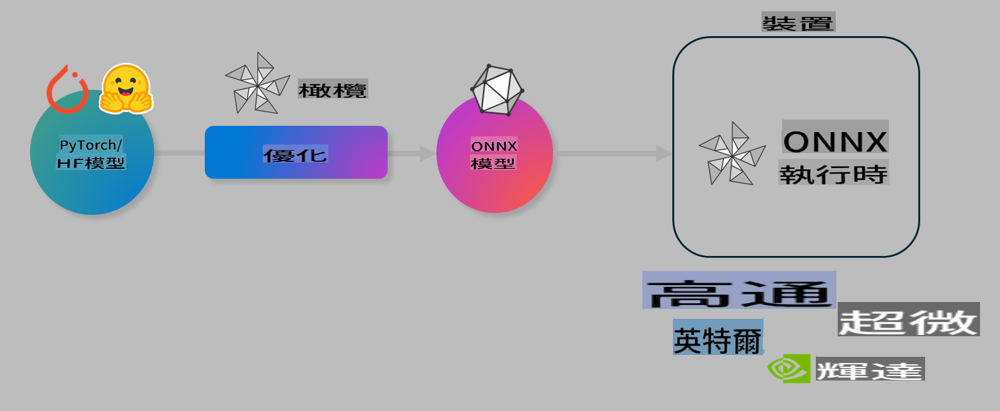

# 實驗室：優化 AI 模型以進行設備端推理

## 介紹

> [!IMPORTANT]
> 此實驗室需要安裝 **Nvidia A10 或 A100 GPU** 及相關驅動程式和 CUDA 工具包（版本 12+）。

> [!NOTE]
> 這是一個 **35 分鐘** 的實驗室，將為您提供使用 OLIVE 優化設備端推理模型的核心概念的實作體驗。

## 學習目標

完成此實驗室後，您將能夠使用 OLIVE 來：

- 使用 AWQ 量化方法對 AI 模型進行量化。
- 對 AI 模型進行針對特定任務的微調。
- 為 ONNX Runtime 上的高效設備端推理生成 LoRA 適配器（微調模型）。

### 什麼是 Olive

Olive (*O*NNX *live*) 是一個模型優化工具包，配有命令列介面（CLI），可讓您為 ONNX Runtime +++https://onnxruntime.ai+++ 部署高品質且高效能的模型。



Olive 的輸入通常是一個 PyTorch 或 Hugging Face 模型，而輸出則是一個經過優化的 ONNX 模型，可在運行 ONNX Runtime 的設備（部署目標）上執行。Olive 將根據硬體供應商（如 Qualcomm、AMD、Nvidia 或 Intel）提供的 AI 加速器（NPU、GPU、CPU）來優化模型。

Olive 執行一個 *工作流程*，這是一系列有序的單一模型優化任務，稱為 *passes*。例如，這些任務可能包括：模型壓縮、圖形捕獲、量化、圖形優化。每個任務都有一組參數，可進行調整以達到最佳指標，例如準確性和延遲，這些指標由相應的評估器進行評估。Olive 使用搜尋策略，通過搜尋演算法來自動調整每個任務（單個或多個）的參數。

#### Olive 的優勢

- **減少試錯的挫折和時間**：透過自動化的方式，避免手動嘗試不同的圖形優化、壓縮和量化技術。只需定義您的品質和效能限制，Olive 將自動為您找到最佳模型。
- **超過 40 種內建模型優化元件**：涵蓋量化、壓縮、圖形優化和微調的尖端技術。
- **簡單易用的 CLI**：用於常見的模型優化任務。例如，`olive quantize`、`olive auto-opt`、`olive finetune`。
- 內建模型打包和部署功能。
- 支援生成 **多 LoRA 服務** 模型。
- 使用 YAML/JSON 構建工作流程，以編排模型優化和部署任務。
- **Hugging Face** 和 **Azure AI** 集成。
- 內建 **快取機制**，以 **節省成本**。

## 實驗室說明
> [!NOTE]
> 請確保您已根據實驗室 1 的指導，配置 Azure AI Hub 和專案，並設置 A100 計算資源。

### 步驟 0：連接到 Azure AI 計算資源

您將使用 **VS Code** 的遠端功能連接到 Azure AI 計算資源。

1. 打開您的 **VS Code** 桌面應用程式：
2. 使用 **Shift+Ctrl+P** 打開 **命令面板**。
3. 在命令面板中搜尋 **AzureML - remote: Connect to compute instance in New Window**。
4. 按照螢幕上的指示，連接到計算資源。這將涉及選擇您在實驗室 1 中設置的 Azure 訂閱、資源群組、專案和計算名稱。
5. 一旦成功連接到 Azure ML 計算節點，您將在 **VS Code 左下角** 看到連接狀態 `><Azure ML: Compute Name`。

### 步驟 1：克隆此存儲庫

在 VS Code 中，您可以使用 **Ctrl+J** 打開新終端並克隆此存儲庫：

在終端中，您應該會看到提示：

```
azureuser@computername:~/cloudfiles/code$ 
```
克隆解決方案：

```bash
cd ~/localfiles
git clone https://github.com/microsoft/phi-3cookbook.git
```

### 步驟 2：在 VS Code 中打開資料夾

要在相關資料夾中打開 VS Code，請在終端中執行以下命令，這將打開一個新視窗：

```bash
code phi-3cookbook/code/04.Finetuning/Olive-lab
```

或者，您也可以通過選擇 **檔案** > **打開資料夾** 來手動打開資料夾。

### 步驟 3：安裝相依項目

在 VS Code 中的 Azure AI 計算實例中打開終端視窗（提示：**Ctrl+J**），並執行以下命令以安裝相依項目：

```bash
conda create -n olive-ai python=3.11 -y
conda activate olive-ai
pip install -r requirements.txt
az extension remove -n azure-cli-ml
az extension add -n ml
```

> [!NOTE]
> 安裝所有相依項目需要約 **5 分鐘**。

在此實驗室中，您將下載和上傳模型到 Azure AI 模型目錄。為了訪問模型目錄，您需要使用以下命令登錄 Azure：

```bash
az login
```

> [!NOTE]
> 登錄時，系統會要求您選擇訂閱。請確保將訂閱設置為本實驗室提供的訂閱。

### 步驟 4：執行 Olive 命令

在 VS Code 中的 Azure AI 計算實例中打開終端視窗（提示：**Ctrl+J**），並確保已激活 `olive-ai` conda 環境：

```bash
conda activate olive-ai
```

接下來，在命令列中執行以下 Olive 命令。

1. **檢查數據**：在此示例中，您將微調 Phi-3.5-Mini 模型，使其專注於回答與旅行相關的問題。以下代碼將顯示數據集的前幾條記錄，數據格式為 JSON 行格式：

    ```bash
    head data/data_sample_travel.jsonl
    ```
2. **量化模型**：在訓練模型之前，您首先使用稱為 Active Aware Quantization (AWQ) 的技術進行量化 +++https://arxiv.org/abs/2306.00978+++。AWQ 通過考慮推理過程中產生的激活值來量化模型的權重。這意味著量化過程考慮了激活值中的實際數據分佈，從而比傳統的權重量化方法更好地保留了模型準確性。

    ```bash
    olive quantize \
       --model_name_or_path microsoft/Phi-3.5-mini-instruct \
       --trust_remote_code \
       --algorithm awq \
       --output_path models/phi/awq \
       --log_level 1
    ```
    
    完成 AWQ 量化需要 **約 8 分鐘**，這將 **將模型大小從約 7.5GB 減少到約 2.5GB**。

    在此實驗室中，我們向您展示如何從 Hugging Face 輸入模型（例如：`microsoft/Phi-3.5-mini-instruct`). However, Olive also allows you to input models from the Azure AI catalog by updating the `model_name_or_path` argument to an Azure AI asset ID (for example:  `azureml://registries/azureml/models/Phi-3.5-mini-instruct/versions/4`). 

1. **Train the model:** Next, the `olive finetune` 命令微調量化後的模型。先進行量化再微調可以獲得更好的準確性，因為微調過程可以恢復部分因量化造成的損失。

    ```bash
    olive finetune \
        --method lora \
        --model_name_or_path models/phi/awq \
        --data_files "data/data_sample_travel.jsonl" \
        --data_name "json" \
        --text_template "<|user|>\n{prompt}<|end|>\n<|assistant|>\n{response}<|end|>" \
        --max_steps 100 \
        --output_path ./models/phi/ft \
        --log_level 1
    ```
    
    微調需要 **約 6 分鐘**（100 步）。

3. **優化**：訓練完成後，您可以使用 Olive 的 `auto-opt` command, which will capture the ONNX graph and automatically perform a number of optimizations to improve the model performance for CPU by compressing the model and doing fusions. It should be noted, that you can also optimize for other devices such as NPU or GPU by just updating the `--device` and `--provider` 參數優化模型。但在此實驗室中，我們將使用 CPU。

    ```bash
    olive auto-opt \
       --model_name_or_path models/phi/ft/model \
       --adapter_path models/phi/ft/adapter \
       --device cpu \
       --provider CPUExecutionProvider \
       --use_ort_genai \
       --output_path models/phi/onnx-ao \
       --log_level 1
    ```
    
    優化需要 **約 5 分鐘**。

### 步驟 5：快速測試模型推理

要測試模型的推理，請在您的資料夾中創建一個名為 **app.py** 的 Python 文件，並複製以下代碼：

```python
import onnxruntime_genai as og
import numpy as np

print("loading model and adapters...", end="", flush=True)
model = og.Model("models/phi/onnx-ao/model")
adapters = og.Adapters(model)
adapters.load("models/phi/onnx-ao/model/adapter_weights.onnx_adapter", "travel")
print("DONE!")

tokenizer = og.Tokenizer(model)
tokenizer_stream = tokenizer.create_stream()

params = og.GeneratorParams(model)
params.set_search_options(max_length=100, past_present_share_buffer=False)
user_input = "what is the best thing to see in chicago"
params.input_ids = tokenizer.encode(f"<|user|>\n{user_input}<|end|>\n<|assistant|>\n")

generator = og.Generator(model, params)

generator.set_active_adapter(adapters, "travel")

print(f"{user_input}")

while not generator.is_done():
    generator.compute_logits()
    generator.generate_next_token()

    new_token = generator.get_next_tokens()[0]
    print(tokenizer_stream.decode(new_token), end='', flush=True)

print("\n")
```

使用以下命令執行代碼：

```bash
python app.py
```

### 步驟 6：將模型上傳到 Azure AI

將模型上傳到 Azure AI 模型存儲庫後，您可以與開發團隊的其他成員共享模型，並管理模型的版本控制。執行以下命令將模型上傳：

> [!NOTE]
> 更新 `{}` placeholders with the name of your resource group and Azure AI Project Name. 

To find your resource group `"resourceGroup"` 和 Azure AI 專案名稱，然後執行以下命令：

```
az ml workspace show
```

或者，您也可以前往 +++ai.azure.com+++，選擇 **管理中心** > **專案** > **概覽**。

將 `{}` 占位符更新為您的資源群組和 Azure AI 專案名稱。

```bash
az ml model create \
    --name ft-for-travel \
    --version 1 \
    --path ./models/phi/onnx-ao \
    --resource-group {RESOURCE_GROUP_NAME} \
    --workspace-name {PROJECT_NAME}
```
您可以在 https://ml.azure.com/model/list 查看您上傳的模型並進行部署。

**免責聲明**：  
本文件使用基於機器的人工智能翻譯服務進行翻譯。儘管我們努力確保準確性，但請注意，自動翻譯可能包含錯誤或不準確之處。應以原始語言的文件作為權威來源。對於關鍵信息，建議尋求專業人工翻譯。我們對因使用此翻譯而引起的任何誤解或誤讀概不負責。