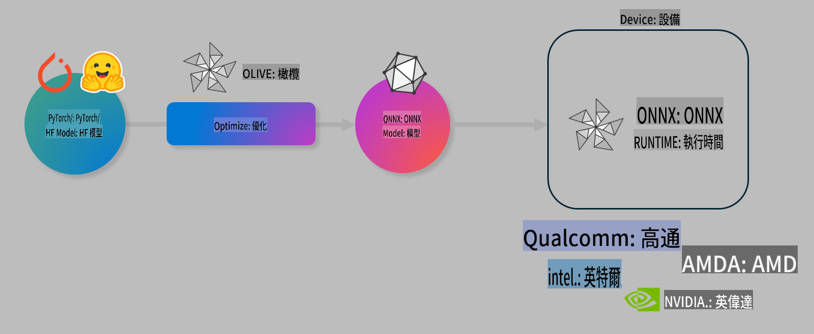

# Lab. 優化 AI 模型以進行裝置推理

## 簡介

> [!IMPORTANT]
> 本實驗需要 **Nvidia A10 或 A100 GPU**，並安裝相應的驅動程式和 CUDA 工具包（版本 12+）。

> [!NOTE]
> 這是一個 **35 分鐘** 的實驗，將為您提供使用 OLIVE 優化模型以進行裝置推理的核心概念的實作介紹。

## 學習目標

在本實驗結束時，您將能夠使用 OLIVE 來：

- 使用 AWQ 量化方法對 AI 模型進行量化。
- 針對特定任務微調 AI 模型。
- 生成適用於 ONNX Runtime 的 LoRA 適配器（微調模型），以實現高效的裝置推理。

### 什麼是 Olive

Olive (*O*NNX *live*) 是一個模型優化工具包，附帶 CLI，可以讓您為 ONNX runtime +++https://onnxruntime.ai+++ 部署高質量和高性能的模型。



Olive 的輸入通常是 PyTorch 或 Hugging Face 模型，輸出是一個優化的 ONNX 模型，該模型在運行 ONNX runtime 的裝置（部署目標）上執行。Olive 會針對由硬體供應商（如 Qualcomm、AMD、Nvidia 或 Intel）提供的部署目標的 AI 加速器（NPU、GPU、CPU）進行優化。

Olive 執行一個 *workflow*，這是一系列有序的個別模型優化任務，稱為 *passes* - 例如模型壓縮、圖捕獲、量化、圖優化。每個 pass 都有一組參數，可以調整以實現最佳的指標，如準確性和延遲，這些指標由相應的評估器評估。Olive 使用一種搜索策略，利用搜索算法自動調整每個 pass 或一組 passes。

#### Olive 的優勢

- **減少試錯過程中的挫敗感和時間**，通過不同技術進行圖優化、壓縮和量化。定義您的質量和性能約束，讓 Olive 自動為您找到最佳模型。
- **40 多個內建模型優化組件**，涵蓋量化、壓縮、圖優化和微調的尖端技術。
- **易於使用的 CLI**，用於常見的模型優化任務。例如，olive quantize、olive auto-opt、olive finetune。
- 內建模型包裝和部署功能。
- 支援生成 **Multi LoRA 服務** 的模型。
- 使用 YAML/JSON 構建工作流，以編排模型優化和部署任務。
- **Hugging Face** 和 **Azure AI** 集成。
- 內建 **快取** 機制以 **節省成本**。

## 實驗說明
> [!NOTE]
> 請確保您已按實驗 1 的要求配置 Azure AI Hub 和專案，並設置您的 A100 計算。

### 步驟 0：連接到 Azure AI 計算

您將使用 **VS Code** 的遠端功能連接到 Azure AI 計算。

1. 打開您的 **VS Code** 桌面應用：
1. 使用 **Shift+Ctrl+P** 打開 **命令面板**。
1. 在命令面板中搜索 **AzureML - remote: Connect to compute instance in New Window**。
1. 按照屏幕上的說明連接到計算。這將涉及選擇您在實驗 1 中設置的 Azure 訂閱、資源組、專案和計算名稱。
1. 一旦連接到您的 Azure ML 計算節點，這將顯示在 **Visual Code 左下角** `><Azure ML: Compute Name`

### 步驟 1：克隆這個倉庫

在 VS Code 中，您可以使用 **Ctrl+J** 打開一個新終端並克隆這個倉庫：

在終端中，您應該會看到提示

```
azureuser@computername:~/cloudfiles/code$ 
```
克隆解決方案

```bash
cd ~/localfiles
git clone https://github.com/microsoft/phi-3cookbook.git
```

### 步驟 2：在 VS Code 中打開文件夾

要在相關文件夾中打開 VS Code，請在終端中執行以下命令，這將打開一個新窗口：

```bash
code phi-3cookbook/code/04.Finetuning/Olive-lab
```

或者，您可以通過選擇 **文件** > **打開文件夾** 打開文件夾。

### 步驟 3：依賴項

在 VS Code 中的 Azure AI 計算實例中打開一個終端窗口（提示：**Ctrl+J**）並執行以下命令以安裝依賴項：

```bash
conda create -n olive-ai python=3.11 -y
conda activate olive-ai
pip install -r requirements.txt
az extension remove -n azure-cli-ml
az extension add -n ml
```

> [!NOTE]
> 安裝所有依賴項大約需要 5 分鐘。

在本實驗中，您將下載並上傳模型到 Azure AI 模型目錄。為了訪問模型目錄，您需要使用以下命令登錄 Azure：

```bash
az login
```

> [!NOTE]
> 登錄時會要求您選擇訂閱。請確保將訂閱設置為本實驗提供的訂閱。

### 步驟 4：執行 Olive 命令

在 VS Code 中的 Azure AI 計算實例中打開一個終端窗口（提示：**Ctrl+J**）並確保激活 `olive-ai` conda 環境：

```bash
conda activate olive-ai
```

接下來，在命令行中執行以下 Olive 命令。

1. **檢查數據：** 在這個例子中，您將微調 Phi-3.5-Mini 模型，使其專門回答與旅行相關的問題。以下代碼顯示數據集的前幾條記錄，這些記錄是 JSON lines 格式：
   
    ```bash
    head data/data_sample_travel.jsonl
    ```
1. **量化模型：** 在訓練模型之前，首先使用稱為 Active Aware Quantization (AWQ) +++https://arxiv.org/abs/2306.00978+++ 的技術進行量化。AWQ 通過考慮推理期間生成的激活來量化模型的權重。這意味著量化過程考慮了激活中的實際數據分佈，從而比傳統的權重量化方法更好地保留了模型的準確性。
    
    ```bash
    olive quantize \
       --model_name_or_path microsoft/Phi-3.5-mini-instruct \
       --trust_remote_code \
       --algorithm awq \
       --output_path models/phi/awq \
       --log_level 1
    ```
    
    完成 AWQ 量化大約需要 **8 分鐘**，這將 **將模型大小從約 7.5GB 減少到約 2.5GB**。
   
    在本實驗中，我們將向您展示如何從 Hugging Face 輸入模型（例如：`microsoft/Phi-3.5-mini-instruct`). However, Olive also allows you to input models from the Azure AI catalog by updating the `model_name_or_path` argument to an Azure AI asset ID (for example:  `azureml://registries/azureml/models/Phi-3.5-mini-instruct/versions/4`). 

1. **Train the model:** Next, the `olive finetune` 命令微調量化模型。先量化模型再微調比之後量化能獲得更好的準確性，因為微調過程會恢復一些量化帶來的損失。
    
    ```bash
    olive finetune \
        --method lora \
        --model_name_or_path models/phi/awq \
        --data_files "data/data_sample_travel.jsonl" \
        --data_name "json" \
        --text_template "<|user|>\n{prompt}<|end|>\n<|assistant|>\n{response}<|end|>" \
        --max_steps 100 \
        --output_path ./models/phi/ft \
        --log_level 1
    ```
    
    完成微調（100 步）大約需要 **6 分鐘**。

1. **優化：** 訓練完模型後，現在使用 Olive 的 `auto-opt` command, which will capture the ONNX graph and automatically perform a number of optimizations to improve the model performance for CPU by compressing the model and doing fusions. It should be noted, that you can also optimize for other devices such as NPU or GPU by just updating the `--device` and `--provider` 參數來優化模型 - 但在本實驗中，我們將使用 CPU。

    ```bash
    olive auto-opt \
       --model_name_or_path models/phi/ft/model \
       --adapter_path models/phi/ft/adapter \
       --device cpu \
       --provider CPUExecutionProvider \
       --use_ort_genai \
       --output_path models/phi/onnx-ao \
       --log_level 1
    ```
    
    完成優化大約需要 **5 分鐘**。

### 步驟 5：模型推理快速測試

要測試模型推理，請在您的文件夾中創建一個名為 **app.py** 的 Python 文件，並複製並粘貼以下代碼：

```python
import onnxruntime_genai as og
import numpy as np

print("loading model and adapters...", end="", flush=True)
model = og.Model("models/phi/onnx-ao/model")
adapters = og.Adapters(model)
adapters.load("models/phi/onnx-ao/model/adapter_weights.onnx_adapter", "travel")
print("DONE!")

tokenizer = og.Tokenizer(model)
tokenizer_stream = tokenizer.create_stream()

params = og.GeneratorParams(model)
params.set_search_options(max_length=100, past_present_share_buffer=False)
user_input = "what is the best thing to see in chicago"
params.input_ids = tokenizer.encode(f"<|user|>\n{user_input}<|end|>\n<|assistant|>\n")

generator = og.Generator(model, params)

generator.set_active_adapter(adapters, "travel")

print(f"{user_input}")

while not generator.is_done():
    generator.compute_logits()
    generator.generate_next_token()

    new_token = generator.get_next_tokens()[0]
    print(tokenizer_stream.decode(new_token), end='', flush=True)

print("\n")
```

使用以下命令執行代碼：

```bash
python app.py
```

### 步驟 6：上傳模型到 Azure AI

將模型上傳到 Azure AI 模型庫，使模型可以與開發團隊的其他成員共享，並處理模型的版本控制。要上傳模型，請運行以下命令：

> [!NOTE]
> 更新 `{}` placeholders with the name of your resource group and Azure AI Project Name. 

To find your resource group `"resourceGroup"和 Azure AI Project 名稱，運行以下命令

```
az ml workspace show
```

或者通過訪問 +++ai.azure.com+++ 並選擇 **管理中心** **專案** **概覽**

更新 `{}` 佔位符，填入您的資源組和 Azure AI Project 名稱。

```bash
az ml model create \
    --name ft-for-travel \
    --version 1 \
    --path ./models/phi/onnx-ao \
    --resource-group {RESOURCE_GROUP_NAME} \
    --workspace-name {PROJECT_NAME}
```
然後您可以在 https://ml.azure.com/model/list 查看上傳的模型並部署模型。

**免责声明**:
本文件已使用基于机器的AI翻译服务进行翻译。尽管我们努力确保准确性，但请注意，自动翻译可能包含错误或不准确之处。应将原始文件的母语版本视为权威来源。对于关键信息，建议使用专业的人类翻译。对于因使用本翻译而引起的任何误解或误读，我们不承担责任。