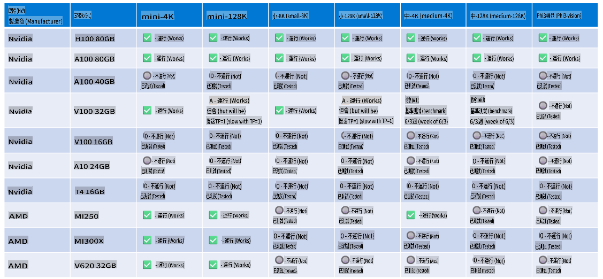

# Phi-3 硬體支援

Microsoft Phi-3 已經針對 ONNX Runtime 進行了優化，並支援 Windows DirectML。它在各種硬體類型上運行良好，包括 GPU、CPU 甚至是行動裝置。

## 裝置硬體
具體支援的硬體包括：

- GPU SKU: RTX 4090 (DirectML)
- GPU SKU: 1 A100 80GB (CUDA)
- CPU SKU: Standard F64s v2 (64 vCPUs, 128 GiB 記憶體)

## 行動裝置 SKU

- Android - Samsung Galaxy S21
- Apple iPhone 14 或更高版本 A16/A17 處理器

## Phi-3 硬體規格

- 最低配置需求。
- Windows: 支援 DirectX 12 的 GPU 和至少 4GB 的綜合 RAM

CUDA: NVIDIA GPU 計算能力 >= 7.02



## 在多個 GPU 上運行 onnxruntime

目前可用的 Phi-3 ONNX 模型僅支援 1 個 GPU。雖然有可能支援多 GPU 的 Phi-3 模型，但使用 2 個 GPU 的 ORT 不保證會比使用 2 個 ORT 實例提供更高的吞吐量。

在 [Build 2024 GenAI ONNX 團隊](https://youtu.be/WLW4SE8M9i8?si=EtG04UwDvcjunyfC) 宣布，他們已經為 Phi 模型啟用了多實例支援，而不是多 GPU 支援。

目前，這允許你使用 CUDA_VISIBLE_DEVICES 環境變數運行一個 onnxruntime 或 onnxruntime-genai 實例，如下所示。

```Python
CUDA_VISIBLE_DEVICES=0 python infer.py
CUDA_VISIBLE_DEVICES=1 python infer.py
```

歡迎在 [Azure AI Studio](https://ai.azure.com) 進一步探索 Phi-3

**免責聲明**:
本文件是使用基於機器的人工智能翻譯服務翻譯的。儘管我們努力確保準確性，但請注意，自動翻譯可能包含錯誤或不準確之處。應將原始語言的文件視為權威來源。對於關鍵信息，建議使用專業的人類翻譯。我們對因使用本翻譯而引起的任何誤解或誤讀不承擔責任。