# 微軟的 Phi-3 系列

Phi-3 模型是目前最強大且最具成本效益的小語言模型（SLM），在各種語言、推理、編碼和數學基準上超越了相同大小及更大一級的模型。此版本擴展了高品質模型的選擇，為客戶提供了更多實用的選擇來創作和構建生成式 AI 應用。

Phi-3 系列包括 mini、小型、中型和視覺版本，根據不同的參數數量進行訓練，以滿足各種應用場景。每個模型都經過指令調優，並按照微軟的負責任 AI、安全和安全標準進行開發，以確保其可即時使用。Phi-3-mini 的表現超越了其兩倍大小的模型，而 Phi-3-small 和 Phi-3-medium 則超越了包括 GPT-3.5T 在內的更大模型。

## Phi-3 任務示例

| | |
|-|-|
|任務|Phi-3|
|語言任務|是|
|數學與推理|是|
|編碼|是|
|函數調用|否|
|自我協作（助手）|否|
|專用嵌入模型|否|

## Phi-3-mini

Phi-3-mini 是一個擁有 38 億參數的語言模型，可在 [Microsoft Azure AI Studio](https://ai.azure.com/explore/models?selectedCollection=phi)、[Hugging Face](https://huggingface.co/collections/microsoft/phi-3-6626e15e9585a200d2d761e3) 和 [Ollama](https://ollama.com/library/phi3) 上使用。它提供兩種上下文長度：[128K](https://ai.azure.com/explore/models/Phi-3-mini-128k-instruct/version/9/registry/azureml) 和 [4K](https://ai.azure.com/explore/models/Phi-3-mini-4k-instruct/version/9/registry/azureml)。

Phi-3-mini 是一個基於 Transformer 的語言模型，擁有 38 億參數。它使用包含教育性有用信息的高質量數據進行訓練，並通過各種 NLP 合成文本和內部及外部聊天數據集的新數據源進行增強，顯著提高了聊天能力。此外，Phi-3-mini 在預訓練後經過監督微調（SFT）和直接偏好優化（DPO）進行了聊天微調。經過這些後期訓練，Phi-3-mini 在多個能力方面顯著提升，特別是在對齊、穩健性和安全性方面。該模型是 Phi-3 系列的一部分，具有 mini 版本，並有兩個變體，4K 和 128K，這代表它能夠支持的上下文長度（以 token 計）。

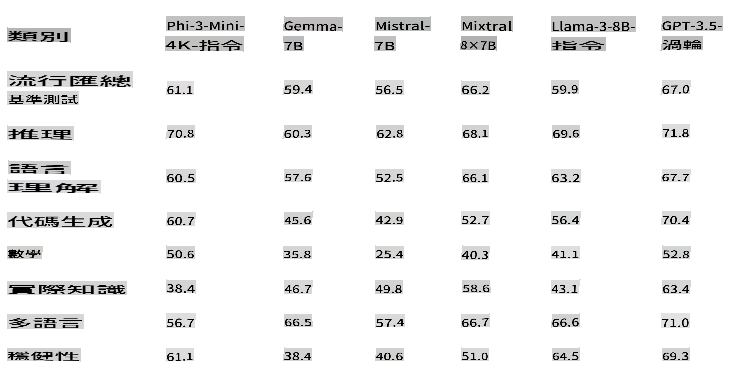

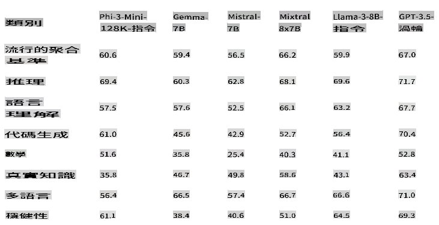

## Phi-3.5-mini-instruct 

[Phi-3.5 mini](https://ai.azure.com/explore/models/Phi-3.5-mini-instruct/version/1/registry/azureml) 是一個輕量級、先進的開放模型，基於 Phi-3 使用的數據集構建——合成數據和過濾的公開網站——專注於高質量、推理密集的數據。該模型屬於 Phi-3 模型家族，支持 128K token 上下文長度。該模型經過嚴格的增強過程，結合了監督微調、近端策略優化和直接偏好優化，以確保精確的指令遵循和強大的安全措施。

Phi-3.5 Mini 擁有 38 億參數，是一個僅解碼的 Transformer 模型，使用與 Phi-3 Mini 相同的 tokenizer。

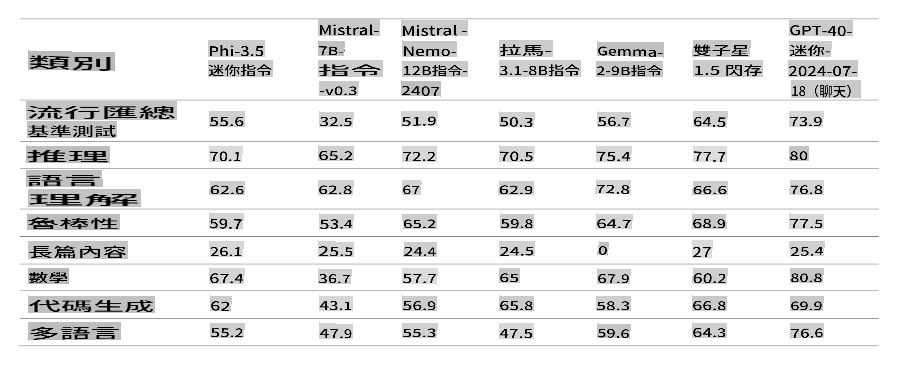

總體來說，該模型僅 38 億參數，達到了與更大模型相似的多語言理解和推理能力。然而，由於其大小的限制，在某些任務上仍有根本性的局限。該模型無法存儲過多的事實知識，因此用戶可能會遇到事實不準確的情況。不過，我們相信這種缺陷可以通過使用搜索引擎來增強 Phi-3.5 尤其是在 RAG 設置下使用模型時來解決。

### 語言支持

下表顯示了 Phi-3 在多語言 MMLU、MEGA 和多語言 MMLU-pro 數據集上的多語言能力。總體來說，我們觀察到，即使僅有 38 億活躍參數，該模型在多語言任務上的競爭力也非常強，與擁有更大活躍參數的其他模型相比。

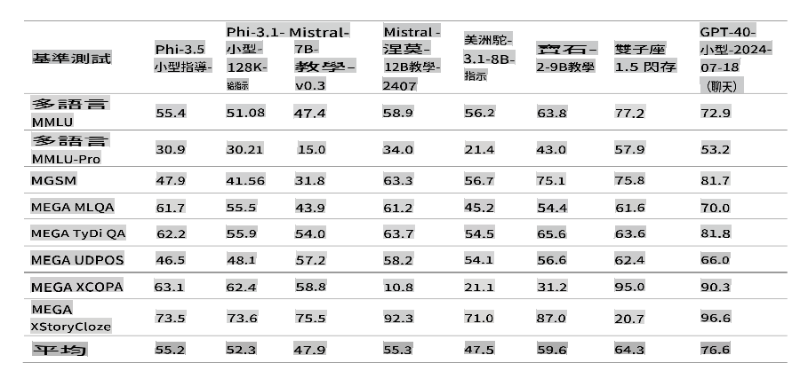

## Phi-3-small

Phi-3-small 是一個擁有 70 億參數的語言模型，提供兩種上下文長度 [128K](https://ai.azure.com/explore/models/Phi-3-small-128k-instruct/version/2/registry/azureml) 和 [8K.](https://ai.azure.com/explore/models/Phi-3-small-8k-instruct/version/2/registry/azureml)，在各種語言、推理、編碼和數學基準上超越 GPT-3.5T。

Phi-3-small 是一個基於 Transformer 的語言模型，擁有 70 億參數。它使用包含教育性有用信息的高質量數據進行訓練，並通過各種 NLP 合成文本和內部及外部聊天數據集的新數據源進行增強，顯著提高了聊天能力。此外，Phi-3-small 在預訓練後經過監督微調（SFT）和直接偏好優化（DPO）進行了聊天微調。經過這些後期訓練，Phi-3-small 在多個能力方面顯著提升，特別是在對齊、穩健性和安全性方面。與 Phi-3-Mini 相比，Phi-3-small 也更加密集地訓練了多語言數據集。該模型系列提供兩個變體，8K 和 128K，這代表它能夠支持的上下文長度（以 token 計）。

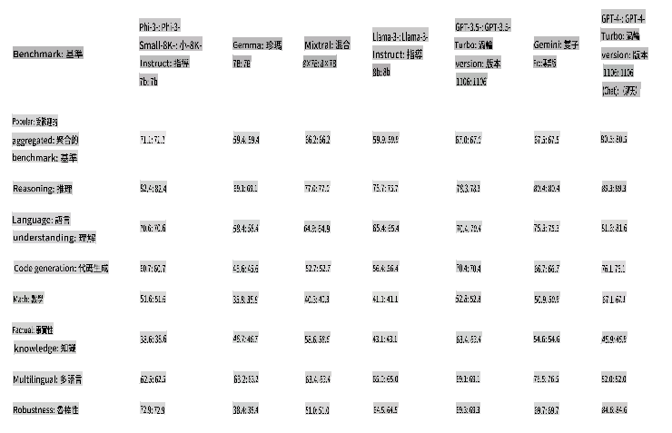

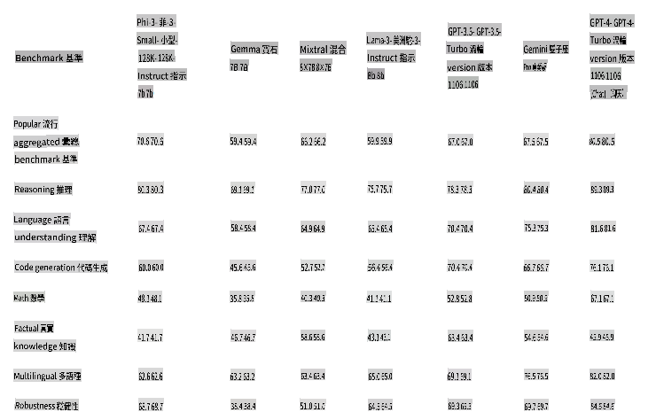

## Phi-3-medium

Phi-3-medium 是一個擁有 140 億參數的語言模型，提供兩種上下文長度 [128K](https://ai.azure.com/explore/models/Phi-3-medium-128k-instruct/version/2/registry/azureml) 和 [4K.](https://ai.azure.com/explore/models/Phi-3-medium-4k-instruct/version/2/registry/azureml)，在各種基準上繼續超越 Gemini 1.0 Pro。

Phi-3-medium 是一個基於 Transformer 的語言模型，擁有 140 億參數。它使用包含教育性有用信息的高質量數據進行訓練，並通過各種 NLP 合成文本和內部及外部聊天數據集的新數據源進行增強，顯著提高了聊天能力。此外，Phi-3-medium 在預訓練後經過監督微調（SFT）和直接偏好優化（DPO）進行了聊天微調。經過這些後期訓練，Phi-3-medium 在多個能力方面顯著提升，特別是在對齊、穩健性和安全性方面。該模型系列提供兩個變體，4K 和 128K，這代表它能夠支持的上下文長度（以 token 計）。

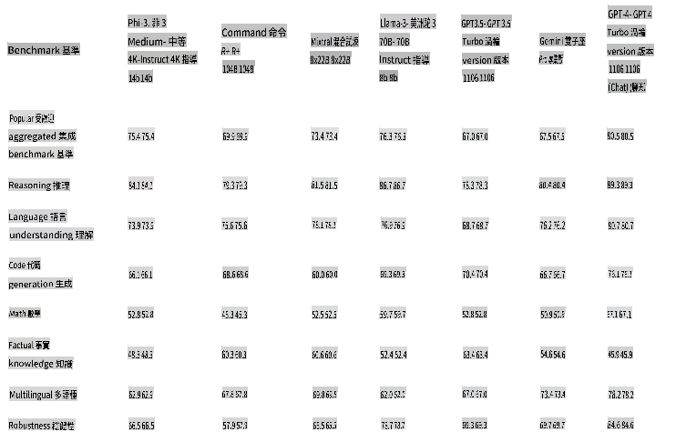

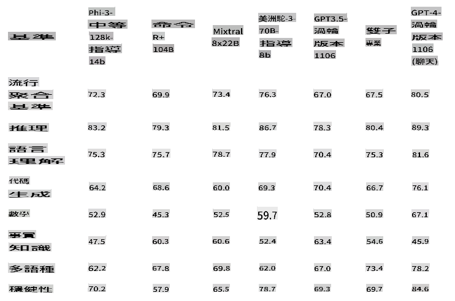

[!NOTE]
我們建議將 Phi-3-medium 升級為 Phi-3.5-MoE，因為 MoE 模型更好且成本效益更高。

## Phi-3-vision

[Phi-3-vision](https://ai.azure.com/explore/models/Phi-3-vision-128k-instruct/version/2/registry/azureml) 是一個擁有 42 億參數的多模態模型，具有語言和視覺能力，在一般視覺推理、OCR 和表格及圖表理解任務上超越了更大的模型，如 Claude-3 Haiku 和 Gemini 1.0 Pro V。

Phi-3-vision 是 Phi-3 系列中的第一個多模態模型，將文本和圖像結合在一起。Phi-3-vision 可用於對真實世界圖像進行推理，並從圖像中提取和推理文本。它還針對圖表和圖解理解進行了優化，可用於生成見解和回答問題。Phi-3-vision 基於 Phi-3-mini 的語言能力，繼續在小尺寸中打包強大的語言和圖像推理質量。

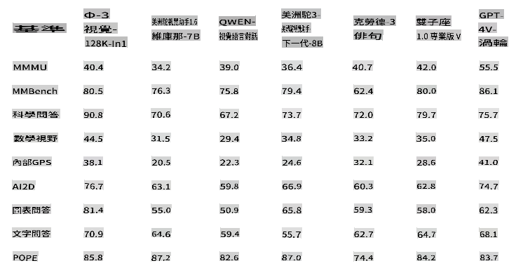

## Phi-3.5-vision

[Phi-3.5 Vision](https://ai.azure.com/explore/models/Phi-3.5-vision-instruct/version/1/registry/azureml) 是一個輕量級、先進的開放多模態模型，基於包括合成數據和過濾的公開網站在內的數據集構建，專注於高質量、推理密集的文本和視覺數據。該模型屬於 Phi-3 模型家族，多模態版本支持 128K token 上下文長度。該模型經過嚴格的增強過程，結合了監督微調和直接偏好優化，以確保精確的指令遵循和強大的安全措施。

Phi-3.5 Vision 擁有 42 億參數，包含圖像編碼器、連接器、投影器和 Phi-3 Mini 語言模型。

該模型旨在廣泛的商業和研究用途，主要用於英語。該模型為需要視覺和文本輸入能力的一般 AI 系統和應用提供了用途，包括：

1) 記憶/計算受限環境。
2) 延遲受限場景。
3) 一般圖像理解。
4) OCR。
5) 表格和圖表理解。
6) 多圖像比較。
7) 多圖像或視頻片段摘要。

Phi-3.5-vision 模型旨在加速高效語言和多模態模型的研究，用作生成式 AI 功能的構建模塊。

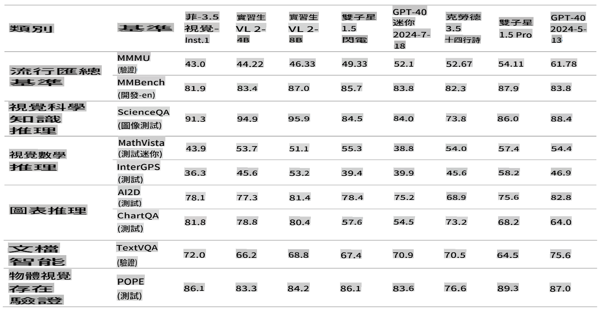

## Phi-3.5-MoE

[Phi-3.5 MoE](https://ai.azure.com/explore/models/Phi-3.5-MoE-instruct/version/1/registry/azureml) 是一個輕量級、先進的開放模型，基於 Phi-3 使用的數據集構建——合成數據和過濾的公開文件——專注於高質量、推理密集的數據。該模型支持多語言，並具有 128K token 上下文長度。該模型經過嚴格的增強過程，結合了監督微調、近端策略優化和直接偏好優化，以確保精確的指令遵循和強大的安全措施。

Phi-3 MoE 擁有 16x38 億參數，使用 2 個專家時具有 66 億活躍參數。該模型是一個專家混合僅解碼 Transformer 模型，使用詞彙大小為 32,064 的 tokenizer。

該模型旨在廣泛的商業和研究用途，主要用於英語。該模型為需要的一般 AI 系統和應用提供了用途，包括：

1) 記憶/計算受限環境。
2) 延遲受限場景。
3) 強大的推理能力（特別是數學和邏輯）。

MoE 模型旨在加速語言和多模態模型的研究，用作生成式 AI 功能的構建模塊，需要額外的計算資源。

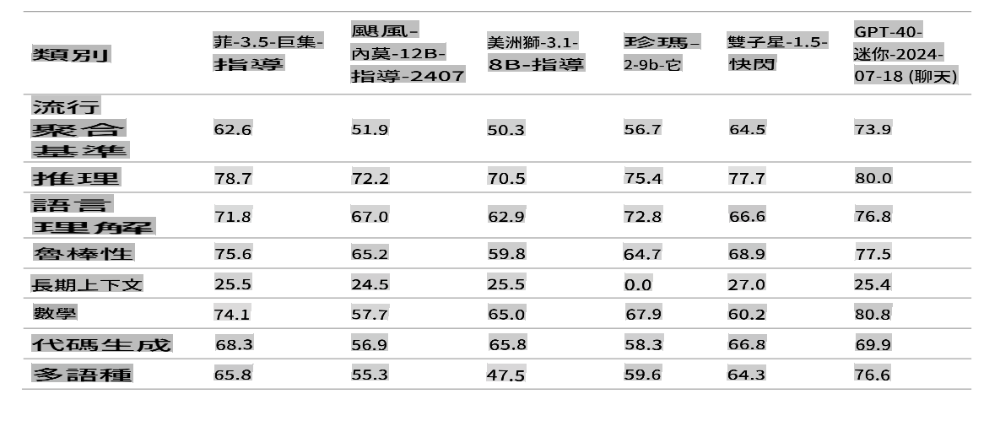

> [!NOTE]
>
> Phi-3 模型在事實知識基準（如 TriviaQA）上的表現不佳，因為較小的模型尺寸導致記憶事實的能力較低。

## Phi silica

我們正在介紹 Phi Silica，它是基於 Phi 系列模型構建的，專為 Copilot+ PC 中的 NPU 設計。Windows 是第一個擁有專為 NPU 定制的小語言模型（SLM）並內置的平臺。Phi Silica API 以及 OCR、Studio Effects、Live Captions 和 Recall User Activity API 將於六月在 Windows Copilot Library 中提供。更多 API 如 Vector Embedding、RAG API 和 Text Summarization 將在稍後推出。

## **查找所有 Phi-3 模型** 

- [Azure AI](https://ai.azure.com/explore/models?selectedCollection=phi)
- [Hugging Face](https://huggingface.co/collections/microsoft/phi-3-6626e15e9585a200d2d761e3) 

## ONNX 模型

兩個 ONNX 模型 “cpu-int4-rtn-block-32” 和 “cpu-int4-rtn-block-32-acc-level-4” 的主要區別在於準確度級別。具有 “acc-level-4” 的模型旨在平衡延遲和準確性，略微犧牲準確性以獲得更好的性能，這可能特別適合移動設備。

## 模型選擇示例

| | | | |
|-|-|-|-|
|客戶需求|任務|起始模型|更多細節|
|需要一個簡單總結消息線索的模型|對話總結|Phi-3 文本模型|決定因素在於客戶有一個明確且直接的語言任務|
|為孩子們提供免費的數學輔導應用|數學和推理|Phi-3 文本模型|因為應用是免費的，客戶希望解決方案不會產生經常性的費用|
|自我巡邏車攝像頭|視覺分析|Phi-Vision|需要一個可以在邊緣工作且無需網絡的解決方案|
|想要構建一個基於 AI 的旅行預訂助手|需要複雜的計劃、函數調用和協作|GPT 模型|需要能夠計劃、調用 API 以收集信息和執行的能力|
|想要為員工構建一個助手|RAG、多領域、複雜且開放式|GPT 模型|開放式場景，需要更廣泛的世界知識，因此更大的模型更合適|

**免責聲明**:
本文件已使用機器翻譯服務進行翻譯。儘管我們努力確保準確性，但請注意，自動翻譯可能包含錯誤或不準確之處。應將原始語言的文件視為權威來源。對於關鍵信息，建議進行專業的人工作翻譯。我們對因使用本翻譯而產生的任何誤解或誤釋不承擔責任。