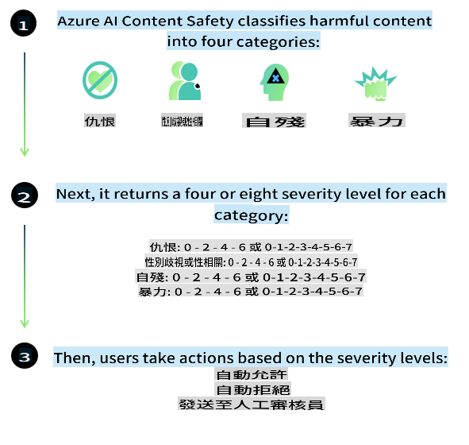
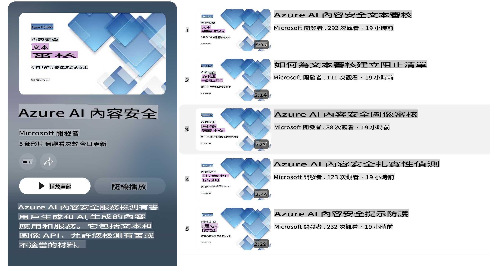

# Phi 模型的 AI 安全性

Phi 系列模型的開發遵循 [Microsoft 負責任 AI 標準](https://query.prod.cms.rt.microsoft.com/cms/api/am/binary/RE5cmFl)，這是一套公司範圍內的要求，基於以下六項原則：問責性、透明性、公平性、可靠性與安全性、隱私與安全性，以及包容性，這些原則構成了 [Microsoft 的負責任 AI 原則](https://www.microsoft.com/ai/responsible-ai)。

如同先前的 Phi 模型，我們採用了多層面的安全評估和安全後訓練方法，並針對本次版本的多語言能力採取了額外措施。我們的安全訓練與評估方法，包括跨多種語言和風險類別的測試，詳見 [Phi 安全後訓練論文](https://arxiv.org/abs/2407.13833)。儘管 Phi 模型受益於這種方法，開發者仍應應用負責任 AI 的最佳實踐，包括針對特定使用案例及其文化和語言背景進行風險的映射、測量和緩解。

## 最佳實踐

與其他模型一樣，Phi 系列模型可能會出現不公平、不可靠或冒犯性的行為。

需要注意的一些 SLM 和 LLM 的限制行為包括：

- **服務品質：** Phi 模型主要以英文文本進行訓練。非英語語言的性能可能較差，訓練數據中代表性較低的英語變體（如某些地區的英語）可能比標準美式英語表現更差。
- **傷害表現與刻板印象的延續：** 這些模型可能會過度或不足地表現某些群體，抹煞某些群體的存在，或加強貶低或負面的刻板印象。儘管進行了安全後訓練，由於不同群體的代表性水平或訓練數據中負面刻板印象的例子反映了現實世界的模式和社會偏見，這些限制可能仍然存在。
- **不適當或冒犯性內容：** 這些模型可能生成其他類型的不適當或冒犯性內容，因此在敏感場景中部署時，需採取針對使用案例的額外緩解措施。
- **信息可靠性：** 語言模型可能生成無意義的內容或捏造聽起來合理但實際上不準確或過時的內容。
- **程式碼範圍有限：** Phi-3 的大部分訓練數據基於 Python，並使用常見的套件，如 "typing, math, random, collections, datetime, itertools"。如果模型生成的 Python 腳本使用了其他套件或其他語言的腳本，我們強烈建議使用者手動驗證所有 API 使用情況。

開發者應應用負責任 AI 的最佳實踐，並確保特定使用案例符合相關法律和法規（如隱私、貿易等）。

## 負責任 AI 的考量

如同其他語言模型，Phi 系列模型可能會出現不公平、不可靠或冒犯性的行為。需要注意的一些限制行為包括：

**服務品質：** Phi 模型主要以英文文本進行訓練。非英語語言的性能可能較差，訓練數據中代表性較低的英語變體可能比標準美式英語表現更差。

**傷害表現與刻板印象的延續：** 這些模型可能會過度或不足地表現某些群體，抹煞某些群體的存在，或加強貶低或負面的刻板印象。儘管進行了安全後訓練，由於不同群體的代表性水平或訓練數據中負面刻板印象的例子反映了現實世界的模式和社會偏見，這些限制可能仍然存在。

**不適當或冒犯性內容：** 這些模型可能生成其他類型的不適當或冒犯性內容，因此在敏感場景中部署時，需採取針對使用案例的額外緩解措施。

**信息可靠性：** 語言模型可能生成無意義的內容或捏造聽起來合理但實際上不準確或過時的內容。

**程式碼範圍有限：** Phi-3 的大部分訓練數據基於 Python，並使用常見的套件，如 "typing, math, random, collections, datetime, itertools"。如果模型生成的 Python 腳本使用了其他套件或其他語言的腳本，我們強烈建議使用者手動驗證所有 API 使用情況。

開發者應應用負責任 AI 的最佳實踐，並確保特定使用案例符合相關法律和法規（如隱私、貿易等）。需要考慮的重要領域包括：

**資源分配：** 模型可能不適合用於對法律地位、資源分配或生活機會有重大影響的場景（例如：住房、就業、信用等），除非進行進一步的評估和額外的去偏技術。

**高風險場景：** 開發者應評估模型在高風險場景中的適用性，例如不公平、不可靠或冒犯性的輸出可能帶來高昂代價或造成傷害的情況。這包括在需要高度準確性和可靠性的敏感或專業領域提供建議（例如：法律或健康建議）。應根據部署情境，在應用層面實施額外的保護措施。

**錯誤信息：** 模型可能生成不準確的信息。開發者應遵循透明性最佳實踐，告知終端用戶他們正在與 AI 系統互動。在應用層面，開發者可以構建反饋機制和管道，將回應基於特定使用案例的背景信息，這種技術稱為檢索增強生成（Retrieval Augmented Generation, RAG）。

**有害內容生成：** 開發者應根據上下文評估輸出，並使用適合其使用案例的可用安全分類器或自訂解決方案。

**濫用：** 其他形式的濫用，如詐騙、垃圾郵件或惡意軟件的生成可能存在，開發者應確保其應用不違反適用的法律和法規。

### 微調與 AI 內容安全

在對模型進行微調後，我們強烈建議利用 [Azure AI 內容安全](https://learn.microsoft.com/azure/ai-services/content-safety/overview) 措施來監控模型生成的內容，識別並阻止潛在的風險、威脅和質量問題。

[Azure AI 內容安全](https://learn.microsoft.com/azure/ai-services/content-safety/overview) 支援文字和圖像內容。它可以部署在雲端、離線容器以及邊緣/嵌入式設備上。

## Azure AI 內容安全概覽

Azure AI 內容安全並非一種通用解決方案；它可以根據企業的特定政策進行自訂。此外，其多語言模型使其能夠同時理解多種語言。

- **Azure AI 內容安全**
- **Microsoft 開發者**
- **5 部影片**

Azure AI 內容安全服務可檢測應用和服務中的用戶生成及 AI 生成的有害內容。它包括文字和圖像 API，能夠檢測有害或不適當的材料。

[AI 內容安全播放清單](https://www.youtube.com/playlist?list=PLlrxD0HtieHjaQ9bJjyp1T7FeCbmVcPkQ)

**免責聲明**：  
本文件已使用基於機器的人工智能翻譯服務進行翻譯。我們致力於提供準確的翻譯，但請注意，自動翻譯可能包含錯誤或不準確之處。應以原始語言的文件作為權威來源。對於關鍵資訊，建議尋求專業人工翻譯。我們對因使用此翻譯而產生的任何誤解或錯誤解釋概不負責。