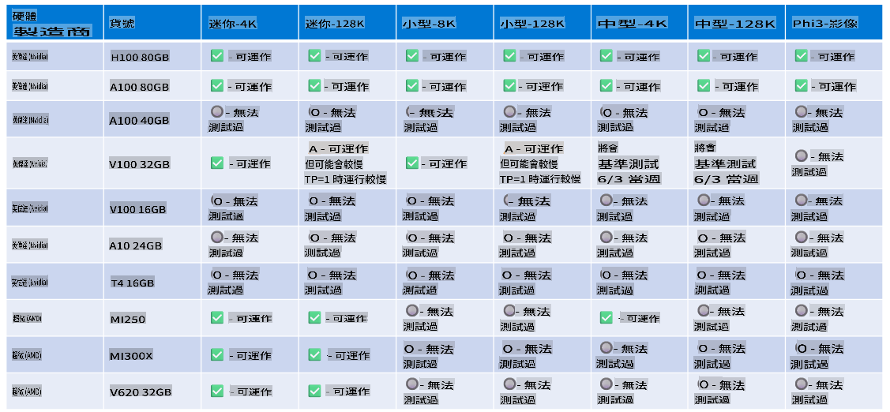

# Phi 硬體支援

Microsoft Phi 已針對 ONNX Runtime 進行優化，並支援 Windows DirectML。它在多種硬體類型上運作良好，包括 GPU、CPU，甚至是行動裝置。

## 裝置硬體
具體支援的硬體包括：

- GPU 型號：RTX 4090 (DirectML)
- GPU 型號：1 A100 80GB (CUDA)
- CPU 型號：Standard F64s v2 (64 vCPUs, 128 GiB 記憶體)

## 行動裝置型號

- Android - Samsung Galaxy S21
- Apple iPhone 14 或更高版本 A16/A17 處理器

## Phi 硬體規格

- 最低配置要求：
  - Windows：支援 DirectX 12 的 GPU，並且至少需要 4GB 的綜合記憶體
  - CUDA：NVIDIA GPU，計算能力 >= 7.02



## 在多 GPU 上執行 onnxruntime

目前提供的 Phi ONNX 模型僅適用於單 GPU。雖然 Phi 模型可以支援多 GPU，但使用兩個 GPU 的 ORT 並不保證能比兩個 ORT 實例提供更高的吞吐量。請參閱 [ONNX Runtime](https://onnxruntime.ai/) 以獲取最新更新。

在 [Build 2024 GenAI ONNX 團隊](https://youtu.be/WLW4SE8M9i8?si=EtG04UwDvcjunyfC) 上宣布，他們已為 Phi 模型啟用了多實例支援，而非多 GPU 支援。

目前，這允許您使用類似以下的 CUDA_VISIBLE_DEVICES 環境變數，執行一個 onnxruntime 或 onnxruntime-genai 實例。

```Python
CUDA_VISIBLE_DEVICES=0 python infer.py
CUDA_VISIBLE_DEVICES=1 python infer.py
```

歡迎前往 [Azure AI Foundry](https://ai.azure.com) 進一步探索 Phi。

**免責聲明**：  
本文件使用機器翻譯服務進行翻譯。我們致力於確保翻譯的準確性，但請注意，自動翻譯可能會包含錯誤或不準確之處。應以原文文件作為權威來源。對於關鍵信息，建議尋求專業人工翻譯。我們對因使用此翻譯而引起的任何誤解或誤讀不承擔責任。