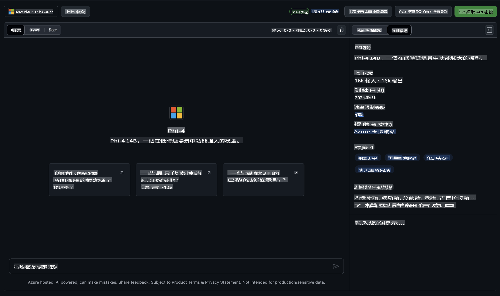

## GitHub 模型中的 Phi 系列

歡迎來到 [GitHub 模型](https://github.com/marketplace/models)！我們已經準備好一切，讓你可以探索 Azure AI 上託管的 AI 模型。


想了解更多有關 GitHub 模型的資訊，請查看 [GitHub 模型市集](https://github.com/marketplace/models)。

## 可用模型

每個模型都有專屬的操作介面和範例程式碼。



### GitHub 模型目錄中的 Phi 系列

- [Phi-4](https://github.com/marketplace/models/azureml/Phi-4)

- [Phi-3.5-MoE instruct (128k)](https://github.com/marketplace/models/azureml/Phi-3-5-MoE-instruct)

- [Phi-3.5-vision instruct (128k)](https://github.com/marketplace/models/azureml/Phi-3-5-vision-instruct)

- [Phi-3.5-mini instruct (128k)](https://github.com/marketplace/models/azureml/Phi-3-5-mini-instruct)

- [Phi-3-Medium-128k-Instruct](https://github.com/marketplace/models/azureml/Phi-3-medium-128k-instruct)

- [Phi-3-medium-4k-instruct](https://github.com/marketplace/models/azureml/Phi-3-medium-4k-instruct)

- [Phi-3-mini-128k-instruct](https://github.com/marketplace/models/azureml/Phi-3-mini-128k-instruct)

- [Phi-3-mini-4k-instruct](https://github.com/marketplace/models/azureml/Phi-3-mini-4k-instruct)

- [Phi-3-small-128k-instruct](https://github.com/marketplace/models/azureml/Phi-3-small-128k-instruct)

- [Phi-3-small-8k-instruct](https://github.com/marketplace/models/azureml/Phi-3-small-8k-instruct)

## 快速入門

我們提供了一些基本範例，供你直接執行。你可以在 samples 目錄中找到它們。如果你想直接使用自己喜愛的程式語言，以下語言都有相應的範例：

- Python  
- JavaScript  
- C#  
- Java  
- cURL  

此外，我們還提供了一個專屬的 Codespaces 環境，用於運行範例和模型。


## 範例程式碼

以下是一些用例的範例程式碼片段。如需更多有關 Azure AI Inference SDK 的資訊，請參閱完整文件和範例。

## 設定

1. 建立個人存取權杖  
你不需要為權杖分配任何權限。請注意，該權杖將被傳送到 Microsoft 服務。

要使用以下程式碼片段，請建立一個環境變數，將權杖設定為客戶端程式碼的金鑰。

如果你使用的是 bash：  
```
export GITHUB_TOKEN="<your-github-token-goes-here>"
```  
如果你使用的是 powershell：  

```
$Env:GITHUB_TOKEN="<your-github-token-goes-here>"
```  

如果你使用的是 Windows 命令提示字元：  

```
set GITHUB_TOKEN=<your-github-token-goes-here>
```  

## Python 範例

### 安裝依賴項  
使用 pip 安裝 Azure AI Inference SDK（需要：Python >=3.8）：  

```
pip install azure-ai-inference
```  

### 執行基本範例程式碼  

此範例展示了如何對 chat completion API 發出基本呼叫。它利用 GitHub AI 模型推理端點以及你的 GitHub 權杖。此呼叫是同步的。  

```python
import os
from azure.ai.inference import ChatCompletionsClient
from azure.ai.inference.models import SystemMessage, UserMessage
from azure.core.credentials import AzureKeyCredential

endpoint = "https://models.inference.ai.azure.com"
model_name = "Phi-4"
token = os.environ["GITHUB_TOKEN"]

client = ChatCompletionsClient(
    endpoint=endpoint,
    credential=AzureKeyCredential(token),
)

response = client.complete(
    messages=[
        UserMessage(content="I have $20,000 in my savings account, where I receive a 4% profit per year and payments twice a year. Can you please tell me how long it will take for me to become a millionaire? Also, can you please explain the math step by step as if you were explaining it to an uneducated person?"),
    ],
    temperature=0.4,
    top_p=1.0,
    max_tokens=2048,
    model=model_name
)

print(response.choices[0].message.content)
```  

### 執行多輪對話  

此範例展示了如何使用 chat completion API 進行多輪對話。在將模型用於聊天應用程式時，你需要管理對話的歷史記錄，並將最新消息傳送給模型。  

```
import os
from azure.ai.inference import ChatCompletionsClient
from azure.ai.inference.models import AssistantMessage, SystemMessage, UserMessage
from azure.core.credentials import AzureKeyCredential

token = os.environ["GITHUB_TOKEN"]
endpoint = "https://models.inference.ai.azure.com"
# Replace Model_Name
model_name = "Phi-4"

client = ChatCompletionsClient(
    endpoint=endpoint,
    credential=AzureKeyCredential(token),
)

messages = [
    SystemMessage(content="You are a helpful assistant."),
    UserMessage(content="What is the capital of France?"),
    AssistantMessage(content="The capital of France is Paris."),
    UserMessage(content="What about Spain?"),
]

response = client.complete(messages=messages, model=model_name)

print(response.choices[0].message.content)
```  

### 流式輸出  

為了提供更好的用戶體驗，你可能希望流式處理模型的回應，這樣第一個 token 可以及早顯示，避免等待較長的回應時間。  

```
import os
from azure.ai.inference import ChatCompletionsClient
from azure.ai.inference.models import SystemMessage, UserMessage
from azure.core.credentials import AzureKeyCredential

token = os.environ["GITHUB_TOKEN"]
endpoint = "https://models.inference.ai.azure.com"
# Replace Model_Name
model_name = "Phi-4"

client = ChatCompletionsClient(
    endpoint=endpoint,
    credential=AzureKeyCredential(token),
)

response = client.complete(
    stream=True,
    messages=[
        SystemMessage(content="You are a helpful assistant."),
        UserMessage(content="Give me 5 good reasons why I should exercise every day."),
    ],
    model=model_name,
)

for update in response:
    if update.choices:
        print(update.choices[0].delta.content or "", end="")

client.close()
```  

## GitHub 模型的免費使用與速率限制


[操作介面和免費 API 使用的速率限制](https://docs.github.com/en/github-models/prototyping-with-ai-models#rate-limits) 旨在幫助你嘗試模型並為你的 AI 應用程式進行原型設計。若需超出這些限制的使用，並將你的應用程式擴展至生產規模，你必須從 Azure 帳戶中配置資源，並從該處進行身份驗證，而不是使用 GitHub 個人存取權杖。你的程式碼中不需要進行其他變更。使用此連結了解如何超越 Azure AI 的免費層級限制。

### 聲明

請記住，與模型互動時，你正在嘗試 AI，因此可能會出現內容錯誤。

此功能受多種限制（包括每分鐘請求數、每日請求數、每次請求的 token 數以及同時請求數）的影響，並不適用於生產環境的使用案例。

GitHub 模型使用 Azure AI Content Safety。這些過濾器在 GitHub 模型體驗中無法關閉。如果你決定通過付費服務使用模型，請根據你的需求配置內容過濾器。

此服務適用於 GitHub 的預發布條款。

**免責聲明**:  
本文檔使用基於機器的人工智能翻譯服務進行翻譯。儘管我們努力確保準確性，但請注意，自動翻譯可能包含錯誤或不準確之處。應以原始語言的原始文檔作為權威來源。對於關鍵信息，建議尋求專業人工翻譯。我們對因使用此翻譯而產生的任何誤解或誤釋不承擔責任。