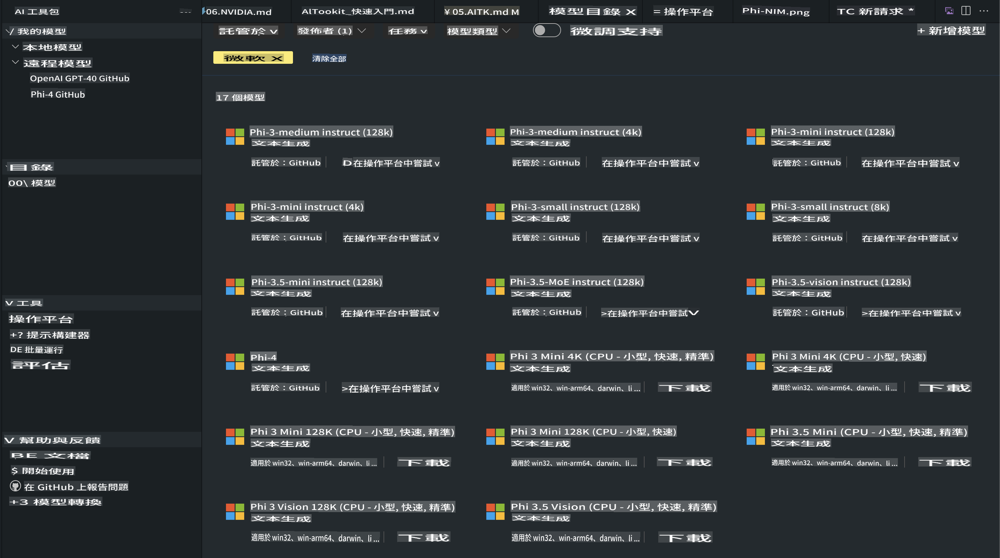
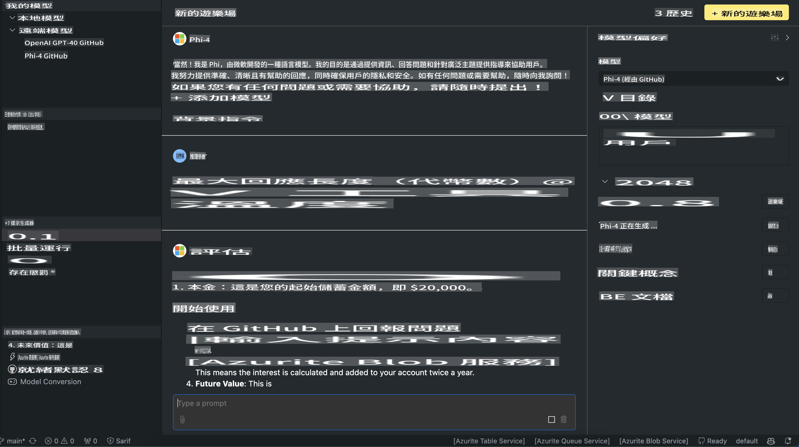

# AITK 的 Phi 家族

[適用於 VS Code 的 AI 工具包](https://marketplace.visualstudio.com/items?itemName=ms-windows-ai-studio.windows-ai-studio) 透過整合來自 Azure AI Foundry Catalog 和其他目錄（如 Hugging Face）的尖端 AI 開發工具和模型，簡化生成式 AI 應用程式的開發。您可以瀏覽由 GitHub Models 和 Azure AI Foundry Model Catalog 提供支持的 AI 模型目錄，並將它們下載到本地或遠端進行微調、測試，然後在您的應用程式中使用。

AI 工具包預覽版將在本地運行。本地推理或微調取決於您選擇的模型，可能需要像 NVIDIA CUDA GPU 這樣的 GPU。您也可以直接使用 AITK 運行 GitHub Models。

## 開始使用

[了解如何安裝 Windows 子系統 Linux](https://learn.microsoft.com/windows/wsl/install?WT.mc_id=aiml-137032-kinfeylo)

以及[更改預設的發行版本](https://learn.microsoft.com/windows/wsl/install#change-the-default-linux-distribution-installed)。

[AI 工具包 GitHub 儲存庫](https://github.com/microsoft/vscode-ai-toolkit/)

- 支援 Windows、Linux 和 macOS
  
- 若要在 Windows 和 Linux 上進行微調，您需要一個 Nvidia GPU。此外，**Windows** 還需要安裝具有 18.4 或更高版本的 Ubuntu 發行版本的子系統 Linux。[了解如何安裝 Windows 子系統 Linux](https://learn.microsoft.com/windows/wsl/install) 以及[更改預設的發行版本](https://learn.microsoft.com/windows/wsl/install#change-the-default-linux-distribution-installed)。

### 安裝 AI 工具包

AI 工具包作為 [Visual Studio Code 擴展](https://code.visualstudio.com/docs/setup/additional-components#_vs-code-extensions) 提供，因此您需要先安裝 [VS Code](https://code.visualstudio.com/docs/setup/windows?WT.mc_id=aiml-137032-kinfeylo)，然後從 [VS Marketplace](https://marketplace.visualstudio.com/items?itemName=ms-windows-ai-studio.windows-ai-studio) 下載 AI 工具包。
[AI 工具包可在 Visual Studio Marketplace 上獲得](https://marketplace.visualstudio.com/items?itemName=ms-windows-ai-studio.windows-ai-studio)，並且可以像其他 VS Code 擴展一樣安裝。

如果您不熟悉如何安裝 VS Code 擴展，請按照以下步驟操作：

### 登入

1. 在 VS Code 的活動欄中選擇 **擴展**
2. 在擴展搜索欄中輸入 "AI Toolkit"
3. 選擇 "AI Toolkit for Visual Studio code"
4. 選擇 **安裝**

現在，您已準備好使用此擴展了！

系統會提示您登入 GitHub，請點擊 "允許" 繼續。您將被重定向到 GitHub 登入頁面。

請登入並按照流程步驟操作。完成後，您將被重定向回 VS Code。

安裝完成後，您會在活動欄中看到 AI 工具包的圖示。

讓我們來探索可用的操作！

### 可用操作

AI 工具包的主側邊欄分為以下幾個部分：

- **模型**
- **資源**
- **遊樂場**  
- **微調**
- **評估**

這些功能可在資源區中使用。要開始，請選擇 **模型目錄**。

### 從目錄下載模型

啟動 VS Code 側邊欄中的 AI 工具包後，您可以從以下選項中進行選擇：



- 從 **模型目錄** 中找到支援的模型並下載到本地
- 在 **模型遊樂場** 中測試模型推理
- 在 **模型微調** 中本地或遠端微調模型
- 通過 AI 工具包的命令面板將微調後的模型部署到雲端
- 評估模型

> [!NOTE]
>
> **GPU 與 CPU**
>
> 您會注意到模型卡顯示了模型大小、平台和加速器類型（CPU、GPU）。對於具有至少一個 GPU 的 **Windows 設備**，選擇僅針對 Windows 的模型版本以獲得最佳效能。
>
> 這可確保您獲得針對 DirectML 加速器優化的模型。
>
> 模型名稱的格式為
>
> - `{model_name}-{accelerator}-{quantization}-{format}`。
>
> 要檢查您的 Windows 設備是否有 GPU，請打開 **任務管理器**，然後選擇 **效能** 標籤。如果有 GPU，將列出名稱，例如 "GPU 0" 或 "GPU 1"。

### 在遊樂場運行模型

設置好所有參數後，點擊 **生成項目**。

下載模型後，請在目錄中的模型卡上選擇 **在遊樂場中加載**：

- 啟動模型下載
- 安裝所有必要條件和依賴項
- 創建 VS Code 工作區



### 在應用程式中使用 REST API 

AI 工具包附帶了一個本地 REST API 網頁伺服器，**埠號為 5272**，使用 [OpenAI 聊天完成格式](https://platform.openai.com/docs/api-reference/chat/create)。

這使您能夠在本地測試應用程式，而無需依賴雲端 AI 模型服務。例如，以下 JSON 文件展示了如何配置請求的主體：

```json
{
    "model": "Phi-4",
    "messages": [
        {
            "role": "user",
            "content": "what is the golden ratio?"
        }
    ],
    "temperature": 0.7,
    "top_p": 1,
    "top_k": 10,
    "max_tokens": 100,
    "stream": true
}
```

您可以使用 [Postman](https://www.postman.com/) 或 CURL（Client URL）工具測試 REST API：

```bash
curl -vX POST http://127.0.0.1:5272/v1/chat/completions -H 'Content-Type: application/json' -d @body.json
```

### 使用 OpenAI 的 Python 客戶端庫

```python
from openai import OpenAI

client = OpenAI(
    base_url="http://127.0.0.1:5272/v1/", 
    api_key="x" # required for the API but not used
)

chat_completion = client.chat.completions.create(
    messages=[
        {
            "role": "user",
            "content": "what is the golden ratio?",
        }
    ],
    model="Phi-4",
)

print(chat_completion.choices[0].message.content)
```

### 使用 Azure OpenAI 的 .NET 客戶端庫

使用 NuGet 將 [Azure OpenAI 的 .NET 客戶端庫](https://www.nuget.org/packages/Azure.AI.OpenAI/) 添加到您的項目中：

```bash
dotnet add {project_name} package Azure.AI.OpenAI --version 1.0.0-beta.17
```

向您的項目添加一個名為 **OverridePolicy.cs** 的 C# 文件，並粘貼以下代碼：

```csharp
// OverridePolicy.cs
using Azure.Core.Pipeline;
using Azure.Core;

internal partial class OverrideRequestUriPolicy(Uri overrideUri)
    : HttpPipelineSynchronousPolicy
{
    private readonly Uri _overrideUri = overrideUri;

    public override void OnSendingRequest(HttpMessage message)
    {
        message.Request.Uri.Reset(_overrideUri);
    }
}
```

接下來，將以下代碼粘貼到您的 **Program.cs** 文件中：

```csharp
// Program.cs
using Azure.AI.OpenAI;

Uri localhostUri = new("http://localhost:5272/v1/chat/completions");

OpenAIClientOptions clientOptions = new();
clientOptions.AddPolicy(
    new OverrideRequestUriPolicy(localhostUri),
    Azure.Core.HttpPipelinePosition.BeforeTransport);
OpenAIClient client = new(openAIApiKey: "unused", clientOptions);

ChatCompletionsOptions options = new()
{
    DeploymentName = "Phi-4",
    Messages =
    {
        new ChatRequestSystemMessage("You are a helpful assistant. Be brief and succinct."),
        new ChatRequestUserMessage("What is the golden ratio?"),
    }
};

StreamingResponse<StreamingChatCompletionsUpdate> streamingChatResponse
    = await client.GetChatCompletionsStreamingAsync(options);

await foreach (StreamingChatCompletionsUpdate chatChunk in streamingChatResponse)
{
    Console.Write(chatChunk.ContentUpdate);
}
```


## 使用 AI 工具包進行微調

- 開始探索模型並使用遊樂場。
- 使用本地計算資源進行模型微調和推理。
- 使用 Azure 資源進行遠端微調和推理。

[使用 AI 工具包進行微調](../../03.FineTuning/Finetuning_VSCodeaitoolkit.md)

## AI 工具包 Q&A 資源

請參考我們的 [Q&A 頁面](https://github.com/microsoft/vscode-ai-toolkit/blob/main/archive/QA.md) 獲取常見問題和解決方案。

**免責聲明**：  
本文件是使用機器翻譯AI服務進行翻譯的。儘管我們努力確保準確性，但請注意，自動翻譯可能包含錯誤或不精確之處。應以原文作為權威來源。對於關鍵資訊，建議尋求專業人工翻譯。我們對於使用此翻譯可能引起的任何誤解或錯誤解讀概不負責。