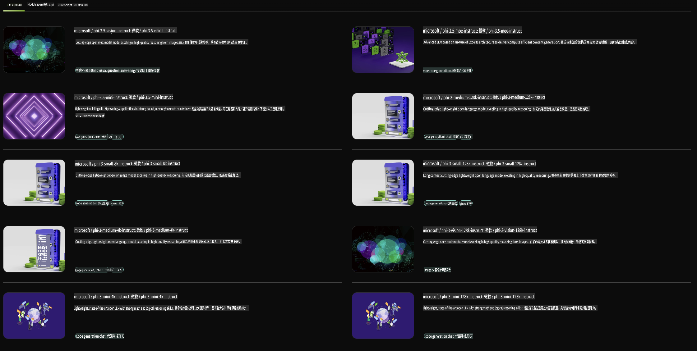

## NVIDIA NIM 的 Phi 家族

NVIDIA NIM 是一組易於使用的微服務，專為加速生成式 AI 模型在雲端、資料中心和工作站中的部署而設計。NIM 根據模型家族和每個模型進行分類。例如，針對大型語言模型（LLMs）的 NVIDIA NIM 將最先進的 LLM 能力帶入企業應用，提供無與倫比的自然語言處理和理解能力。

NIM 使 IT 和 DevOps 團隊能夠輕鬆在其自有的管理環境中自行部署大型語言模型（LLMs），同時為開發者提供業界標準的 API，讓他們能夠構建功能強大的輔助工具、聊天機器人和 AI 助手，徹底改變業務運作。藉助 NVIDIA 最先進的 GPU 加速技術和可擴展部署，NIM 提供了通往推理的最快途徑，並具有無與倫比的效能。

您可以使用 NVIDIA NIM 來進行 Phi 家族模型的推理。



### **範例 - NVIDIA NIM 中的 Phi-3-Vision**

假設您有一張圖片 (`demo.png`)，並希望生成 Python 程式碼來處理這張圖片並保存其新版本 (`phi-3-vision.jpg`)。

上述程式碼通過以下方式自動化此過程：

1. 設置環境和必要的配置。
2. 創建一個提示，指導模型生成所需的 Python 程式碼。
3. 將提示發送給模型並收集生成的程式碼。
4. 提取並執行生成的程式碼。
5. 顯示原始圖片和處理後的圖片。

此方法利用 AI 的強大功能來自動化圖片處理任務，使您更輕鬆、更快速地實現目標。

[範例程式碼解決方案](../../../../../code/06.E2E/E2E_Nvidia_NIM_Phi3_Vision.ipynb)

讓我們逐步解析整段程式碼的功能：

1. **安裝必要的套件**：
    ```python
    !pip install langchain_nvidia_ai_endpoints -U
    ```
    此命令安裝 `langchain_nvidia_ai_endpoints` 套件，確保其為最新版本。

2. **匯入必要模組**：
    ```python
    from langchain_nvidia_ai_endpoints import ChatNVIDIA
    import getpass
    import os
    import base64
    ```
    這些匯入將必要的模組帶入，用於與 NVIDIA AI 端點互動、安全處理密碼、與作業系統交互，以及以 base64 格式編碼/解碼數據。

3. **設置 API 金鑰**：
    ```python
    if not os.getenv("NVIDIA_API_KEY"):
        os.environ["NVIDIA_API_KEY"] = getpass.getpass("Enter your NVIDIA API key: ")
    ```
    此程式碼檢查是否設置了 `NVIDIA_API_KEY` 環境變數。如果未設置，則提示用戶安全地輸入其 API 金鑰。

4. **定義模型和圖片路徑**：
    ```python
    model = 'microsoft/phi-3-vision-128k-instruct'
    chat = ChatNVIDIA(model=model)
    img_path = './imgs/demo.png'
    ```
    這段程式碼設定要使用的模型，使用指定的模型創建 `ChatNVIDIA` 實例，並定義圖片檔案的路徑。

5. **創建文字提示**：
    ```python
    text = "Please create Python code for image, and use plt to save the new picture under imgs/ and name it phi-3-vision.jpg."
    ```
    這段程式碼定義了一個文字提示，指導模型生成處理圖片的 Python 程式碼。

6. **將圖片編碼為 Base64**：
    ```python
    with open(img_path, "rb") as f:
        image_b64 = base64.b64encode(f.read()).decode()
    image = f''
    ```
    此程式碼讀取圖片檔案，將其編碼為 base64，並創建一個包含編碼數據的 HTML 圖片標籤。

7. **將文字和圖片結合成提示**：
    ```python
    prompt = f"{text} {image}"
    ```
    這段程式碼將文字提示和 HTML 圖片標籤結合為一個字符串。

8. **使用 ChatNVIDIA 生成程式碼**：
    ```python
    code = ""
    for chunk in chat.stream(prompt):
        print(chunk.content, end="")
        code += chunk.content
    ```
    此程式碼將提示發送給 `ChatNVIDIA` 並收集生成的內容，然後將其保存到 `code` 字符串中。

9. **從生成內容中提取 Python 程式碼**：
    ```python
    begin = code.index('```python') + 9
    code = code[begin:]
    end = code.index('```')
    code = code[:end]
    ```
    這段程式碼通過移除 markdown 格式，從生成的內容中提取實際的 Python 程式碼。

10. **執行生成的程式碼**：
    ```python
    import subprocess
    result = subprocess.run(["python", "-c", code], capture_output=True)
    ```
    此程式碼將提取的 Python 程式碼作為子進程執行，並捕獲其輸出。

11. **顯示圖片**：
    ```python
    from IPython.display import Image, display
    display(Image(filename='./imgs/phi-3-vision.jpg'))
    display(Image(filename='./imgs/demo.png'))
    ```
    這些程式碼行使用 `IPython.display` 模組顯示圖片。

**免責聲明**：  
本文件使用機器翻譯服務進行翻譯。儘管我們努力確保準確性，但請注意，自動翻譯可能包含錯誤或不準確之處。應以原文檔案作為權威來源。對於關鍵資訊，建議尋求專業人工翻譯。我們對因使用此翻譯而引起的任何誤解或誤讀不承擔責任。