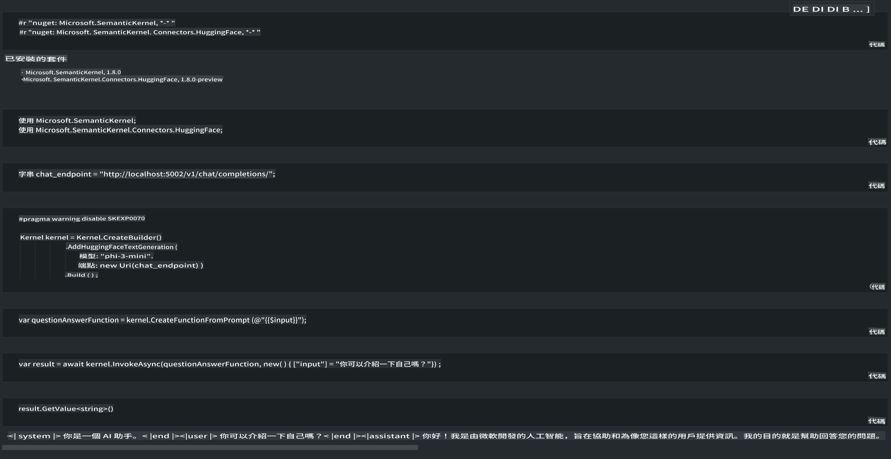

# **在本地伺服器上推理 Phi-3**

我們可以將 Phi-3 部署在本地伺服器上。使用者可以選擇 [Ollama](https://ollama.com) 或 [LM Studio](https://llamaedge.com) 解決方案，或者撰寫自己的程式碼。您可以透過 [Semantic Kernel](https://github.com/microsoft/semantic-kernel?WT.mc_id=aiml-138114-kinfeylo) 或 [Langchain](https://www.langchain.com/) 連接 Phi-3 的本地服務，來構建 Copilot 應用程式。

## **使用 Semantic Kernel 存取 Phi-3-mini**

在 Copilot 應用程式中，我們透過 Semantic Kernel 或 LangChain 建立應用程式。這類應用程式框架通常與 Azure OpenAI Service / OpenAI 模型相容，也能支援 Hugging Face 的開源模型以及本地模型。如果我們想使用 Semantic Kernel 存取 Phi-3-mini 該怎麼做呢？以 .NET 為例，我們可以將其與 Semantic Kernel 的 Hugging Face Connector 結合使用。預設情況下，它可以對應 Hugging Face 上的模型 ID（首次使用時，模型會從 Hugging Face 下載，耗時較長）。您也可以連接到自建的本地服務。相比之下，我們推薦使用後者，因為它具有更高的自主性，特別是在企業應用中。

從圖中可以看到，透過 Semantic Kernel 存取本地服務，可以輕鬆連接到自建的 Phi-3-mini 模型伺服器。以下是執行結果：

***範例程式碼*** https://github.com/kinfey/Phi3MiniSamples/tree/main/semantickernel

**免責聲明**：  
本文件使用機器翻譯服務進行翻譯。儘管我們力求準確，但請注意，自動翻譯可能包含錯誤或不精確之處。應以原始語言的文件作為權威來源。對於關鍵資訊，建議尋求專業人工翻譯。我們對因使用此翻譯而引起的任何誤解或誤讀不承擔責任。