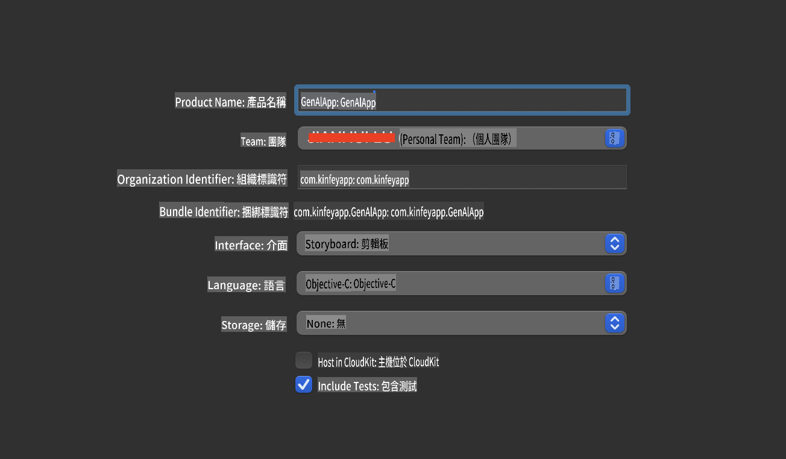
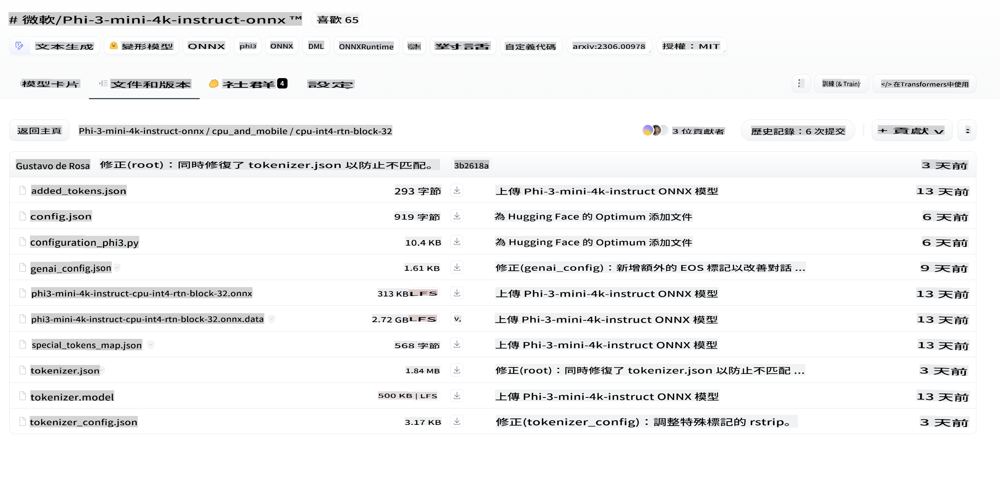
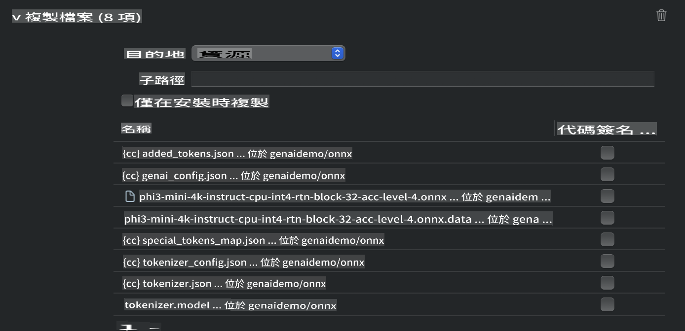
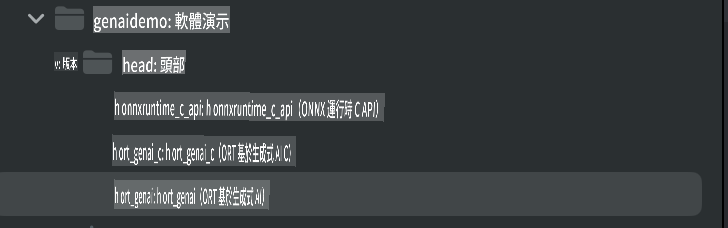
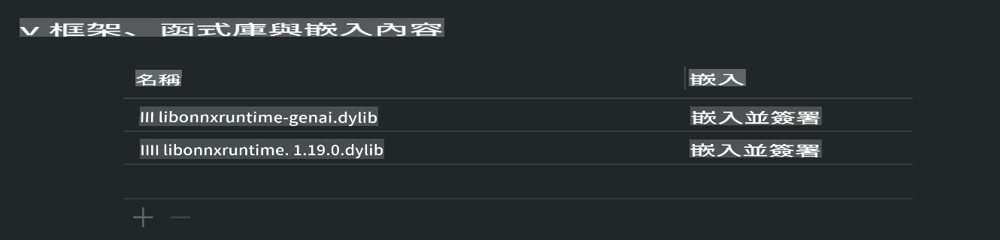
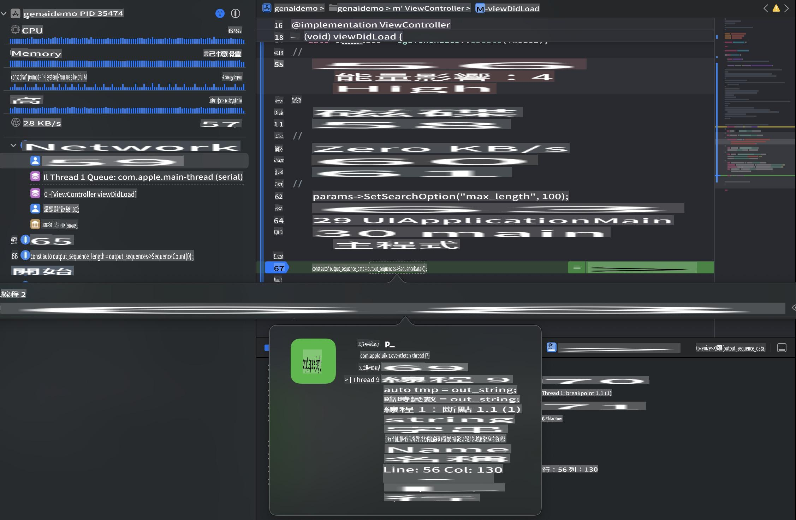

# **在 iOS 上推理 Phi-3**

Phi-3-mini 是 Microsoft 推出的新一代模型系列，支持在邊緣設備和物聯網設備上部署大型語言模型 (LLMs)。Phi-3-mini 可用於 iOS、Android 和邊緣設備部署，使生成式 AI 能夠在 BYOD 環境中運行。以下範例展示如何在 iOS 上部署 Phi-3-mini。

## **1. 準備工作**

- **a.** macOS 14 以上版本
- **b.** Xcode 15 以上版本
- **c.** iOS SDK 17.x（iPhone 14 A16 或更高版本）
- **d.** 安裝 Python 3.10+（推薦使用 Conda）
- **e.** 安裝 Python 庫：`python-flatbuffers`
- **f.** 安裝 CMake

### Semantic Kernel 和推理

Semantic Kernel 是一個應用框架，允許您創建與 Azure OpenAI Service、OpenAI 模型甚至本地模型兼容的應用程序。通過 Semantic Kernel 訪問本地服務，可以輕鬆整合您自託管的 Phi-3-mini 模型服務器。

### 使用 Ollama 或 LlamaEdge 調用量化模型

許多用戶更喜歡使用量化模型來本地運行模型。[Ollama](https://ollama.com) 和 [LlamaEdge](https://llamaedge.com) 允許用戶調用不同的量化模型：

#### **Ollama**

您可以直接運行 `ollama run phi3` 或離線配置它。創建一個 Modelfile，指定 `gguf` 文件的路徑。以下是運行 Phi-3-mini 量化模型的示例代碼：

```gguf
FROM {Add your gguf file path}
TEMPLATE \"\"\"<|user|> .Prompt<|end|> <|assistant|>\"\"\"
PARAMETER stop <|end|>
PARAMETER num_ctx 4096
```

#### **LlamaEdge**

如果您希望同時在雲端和邊緣設備上使用 `gguf`，LlamaEdge 是一個不錯的選擇。

## **2. 為 iOS 編譯 ONNX Runtime**

```bash

git clone https://github.com/microsoft/onnxruntime.git

cd onnxruntime

./build.sh --build_shared_lib --ios --skip_tests --parallel --build_dir ./build_ios --ios --apple_sysroot iphoneos --osx_arch arm64 --apple_deploy_target 17.5 --cmake_generator Xcode --config Release

cd ../

```

### **注意事項**

- **a.** 在編譯之前，確保 Xcode 已正確配置，並在終端中將其設置為活動開發者目錄：

    ```bash
    sudo xcode-select -switch /Applications/Xcode.app/Contents/Developer
    ```

- **b.** ONNX Runtime 需要為不同的平台編譯。對於 iOS，可以編譯為 `arm64` or `x86_64`。

- **c.** 建議使用最新的 iOS SDK 進行編譯。不過，如果需要與舊版 SDK 兼容，也可以使用舊版。

## **3. 為 iOS 編譯帶有 ONNX Runtime 的生成式 AI**

> **注意：** 由於帶有 ONNX Runtime 的生成式 AI 處於預覽階段，請注意可能的變更。

```bash

git clone https://github.com/microsoft/onnxruntime-genai
 
cd onnxruntime-genai
 
mkdir ort
 
cd ort
 
mkdir include
 
mkdir lib
 
cd ../
 
cp ../onnxruntime/include/onnxruntime/core/session/onnxruntime_c_api.h ort/include
 
cp ../onnxruntime/build_ios/Release/Release-iphoneos/libonnxruntime*.dylib* ort/lib
 
export OPENCV_SKIP_XCODEBUILD_FORCE_TRYCOMPILE_DEBUG=1
 
python3 build.py --parallel --build_dir ./build_ios --ios --ios_sysroot iphoneos --ios_arch arm64 --ios_deployment_target 17.5 --cmake_generator Xcode --cmake_extra_defines CMAKE_XCODE_ATTRIBUTE_CODE_SIGNING_ALLOWED=NO

```

## **4. 在 Xcode 中創建 App 應用程序**

我選擇使用 Objective-C 作為 App 的開發方式，因為使用帶有 ONNX Runtime 的 C++ API 時，Objective-C 具有更好的兼容性。當然，您也可以通過 Swift bridging 完成相關調用。



## **5. 將 ONNX 量化 INT4 模型複製到 App 應用程序項目中**

我們需要導入 ONNX 格式的 INT4 量化模型，首先需要下載它。



下載後，將其添加到 Xcode 項目的 Resources 目錄中。



## **6. 在 ViewControllers 中添加 C++ API**

> **注意：**

- **a.** 將相應的 C++ 標頭文件添加到項目中。

  

- **b.** 包含 `onnxruntime-genai` dynamic library in Xcode.

  

- **c.** Use the C Samples code for testing. You can also add additional features like ChatUI for more functionality.

- **d.** Since you need to use C++ in your project, rename `ViewController.m` to `ViewController.mm` 以啟用 Objective-C++ 支持。

```objc

    NSString *llmPath = [[NSBundle mainBundle] resourcePath];
    char const *modelPath = llmPath.cString;

    auto model =  OgaModel::Create(modelPath);

    auto tokenizer = OgaTokenizer::Create(*model);

    const char* prompt = "<|system|>You are a helpful AI assistant.<|end|><|user|>Can you introduce yourself?<|end|><|assistant|>";

    auto sequences = OgaSequences::Create();
    tokenizer->Encode(prompt, *sequences);

    auto params = OgaGeneratorParams::Create(*model);
    params->SetSearchOption("max_length", 100);
    params->SetInputSequences(*sequences);

    auto output_sequences = model->Generate(*params);
    const auto output_sequence_length = output_sequences->SequenceCount(0);
    const auto* output_sequence_data = output_sequences->SequenceData(0);
    auto out_string = tokenizer->Decode(output_sequence_data, output_sequence_length);
    
    auto tmp = out_string;

```

## **7. 運行應用程序**

完成設置後，您可以運行應用程序，查看 Phi-3-mini 模型推理的結果。



有關更多示例代碼和詳細說明，請訪問 [Phi-3 Mini Samples repository](https://github.com/Azure-Samples/Phi-3MiniSamples/tree/main/ios)。

**免責聲明**：  
本文件使用基於機器的人工智慧翻譯服務進行翻譯。雖然我們努力確保準確性，但請注意，自動翻譯可能包含錯誤或不準確之處。應以原語言的原始文件作為權威來源。對於關鍵資訊，建議尋求專業人工翻譯。我們對因使用本翻譯而產生的任何誤解或誤讀概不負責。