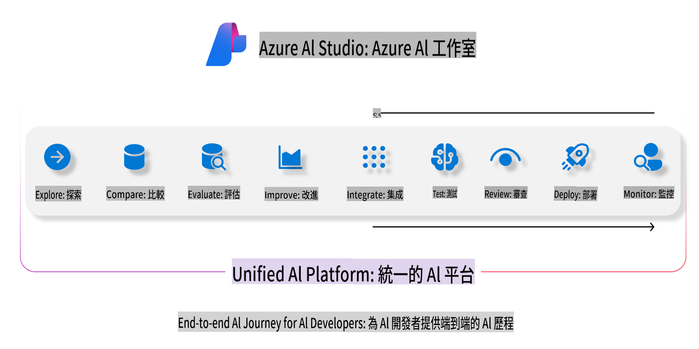
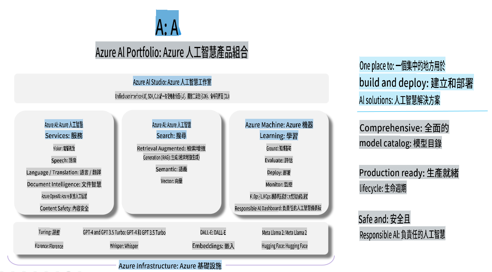

# **使用 Azure AI Foundry 進行評估**

如何使用 [Azure AI Foundry](https://ai.azure.com?WT.mc_id=aiml-138114-kinfeylo) 評估您的生成式 AI 應用程式。不論是單輪對話還是多輪對話，Azure AI Foundry 都提供了工具來評估模型的性能與安全性。

## 如何使用 Azure AI Foundry 評估生成式 AI 應用程式
更多詳細指導，請參閱 [Azure AI Foundry 文件](https://learn.microsoft.com/azure/ai-studio/how-to/evaluate-generative-ai-app?WT.mc_id=aiml-138114-kinfeylo)

以下是開始的步驟：

## 在 Azure AI Foundry 中評估生成式 AI 模型

**必要條件**

- 一個測試數據集，格式為 CSV 或 JSON。
- 已部署的生成式 AI 模型（例如 Phi-3、GPT 3.5、GPT 4 或 Davinci 模型）。
- 一個具有運算實例的運行環境以執行評估。

## 內建評估指標

Azure AI Foundry 允許您評估單輪對話以及複雜的多輪對話。
對於基於檢索增強生成（RAG）的場景，模型基於特定數據，您可以使用內建的評估指標來衡量性能。
此外，您還可以評估一般的單輪問答場景（非 RAG）。

## 建立評估運行

從 Azure AI Foundry 的介面中，導航至 Evaluate 頁面或 Prompt Flow 頁面。
按照評估建立嚮導的指引來設定一個評估運行。為您的評估提供一個可選的名稱。
選擇與您的應用目標相符的場景。
選擇一個或多個評估指標來評估模型的輸出。

## 自訂評估流程（可選）

若需要更高的靈活性，您可以建立自訂的評估流程。根據您的特定需求調整評估過程。

## 查看結果

完成評估後，記錄、查看並分析 Azure AI Foundry 中詳細的評估指標。深入了解您的應用程式的能力與限制。

**注意** Azure AI Foundry 目前處於公開預覽階段，因此僅用於實驗與開發用途。對於生產環境工作負載，請考慮其他選項。探索官方 [AI Foundry 文件](https://learn.microsoft.com/azure/ai-studio/?WT.mc_id=aiml-138114-kinfeylo) 獲取更多詳細資訊與分步指導。

**免責聲明**：  
本文件使用機器翻譯人工智慧服務進行翻譯。雖然我們努力確保翻譯的準確性，但請注意，自動翻譯可能包含錯誤或不準確之處。原始語言的文件應被視為具有權威性的來源。對於關鍵資訊，建議尋求專業人工翻譯。我們對因使用本翻譯而引起的任何誤解或誤讀不承擔責任。