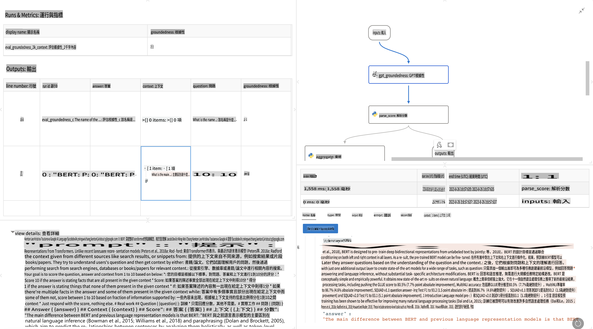

# **介紹 Promptflow**

[Microsoft Prompt Flow](https://microsoft.github.io/promptflow/index.html?WT.mc_id=aiml-138114-kinfeylo) 是一款可視化的工作流程自動化工具，讓使用者能透過預建模板和自定義連接器來創建自動化工作流程。它旨在幫助開發者和商業分析師快速構建數據管理、協作和流程優化等任務的自動化過程。借助 Prompt Flow，使用者可以輕鬆連接不同的服務、應用程式和系統，並自動化處理複雜的業務流程。

Microsoft Prompt Flow 的設計目的是簡化由大型語言模型 (LLMs) 驅動的 AI 應用程式的端到端開發週期。無論是構思、原型設計、測試、評估還是部署基於 LLM 的應用程式，Prompt Flow 都能簡化這些過程，並幫助您構建具備生產品質的 LLM 應用程式。

## 以下是使用 Microsoft Prompt Flow 的主要功能與優勢：

**互動式的創作體驗**

Prompt Flow 提供工作流程結構的可視化表示，讓您輕鬆理解和導航專案。
它提供類似筆記本的編碼體驗，提升工作流程開發和除錯效率。

**提示變體與調整**

創建和比較多種提示變體，促進迭代優化過程。評估不同提示的效能，並選擇最有效的方案。

**內建的評估流程**

使用內建的評估工具，評估提示和流程的質量與效能。
了解基於 LLM 的應用程式表現如何。

**全面的資源**

Prompt Flow 包含內建工具、範例和模板庫。這些資源可作為開發的起點，激發創意並加速流程。

**協作與企業就緒**

支援團隊協作，允許多位使用者共同參與提示工程專案。
維護版本控制，有效分享知識。簡化提示工程流程，從開發、評估到部署與監控。

## 在 Prompt Flow 中進行評估

在 Microsoft Prompt Flow 中，評估在衡量 AI 模型效能方面起著至關重要的作用。讓我們探討如何在 Prompt Flow 中自定義評估流程與指標：

**理解 Prompt Flow 中的評估**

在 Prompt Flow 中，一個流程代表一系列處理輸入並生成輸出的節點。評估流程是一種特殊的流程類型，旨在根據特定標準與目標評估執行結果的效能。

**評估流程的主要特性**

通常在被測試的流程之後執行，使用其輸出。計算分數或指標以衡量被測流程的效能。指標可以包括準確性、相關性分數或其他相關衡量標準。

### 自定義評估流程

**定義輸入**

評估流程需要接收被測試流程的輸出作為輸入。定義輸入的方式與標準流程相似。
例如，如果您正在評估一個問答流程，可以將輸入命名為 "answer"；如果評估分類流程，則可將輸入命名為 "category"。還可能需要基準輸入（例如實際標籤）。

**輸出與指標**

評估流程會生成用於衡量被測流程效能的結果。指標可以使用 Python 或大型語言模型 (LLM) 計算。使用 log_metric() 函數記錄相關指標。

**使用自定義評估流程**

開發針對特定任務與目標量身定制的評估流程。根據評估目標自定義指標。
將這些自定義的評估流程應用於批次執行，以進行大規模測試。

## 內建的評估方法

Prompt Flow 也提供內建的評估方法。
您可以提交批次執行，並使用這些方法來評估流程在大型數據集上的效能。
查看評估結果、比較指標並根據需要進行迭代。
請記住，評估是確保 AI 模型符合預期標準與目標的關鍵步驟。請參閱官方文件，了解有關在 Microsoft Prompt Flow 中開發與使用評估流程的詳細指導。

總結來說，Microsoft Prompt Flow 透過簡化提示工程並提供穩健的開發環境，幫助開發者創建高品質的 LLM 應用程式。如果您正在使用 LLM，Prompt Flow 是一個值得探索的重要工具。請參閱 [Prompt Flow 評估文件](https://learn.microsoft.com/azure/machine-learning/prompt-flow/how-to-develop-an-evaluation-flow?view=azureml-api-2?WT.mc_id=aiml-138114-kinfeylo)，了解有關在 Microsoft Prompt Flow 中開發與使用評估流程的詳細指導。

**免責聲明**：  
本文件是使用機器翻譯AI服務進行翻譯的。我們努力確保翻譯的準確性，但請注意，自動翻譯可能會包含錯誤或不精確之處。應以原文檔的母語版本作為權威來源。對於關鍵信息，建議尋求專業的人工作翻譯。我們對因使用此翻譯而產生的任何誤解或錯誤解釋不承擔責任。