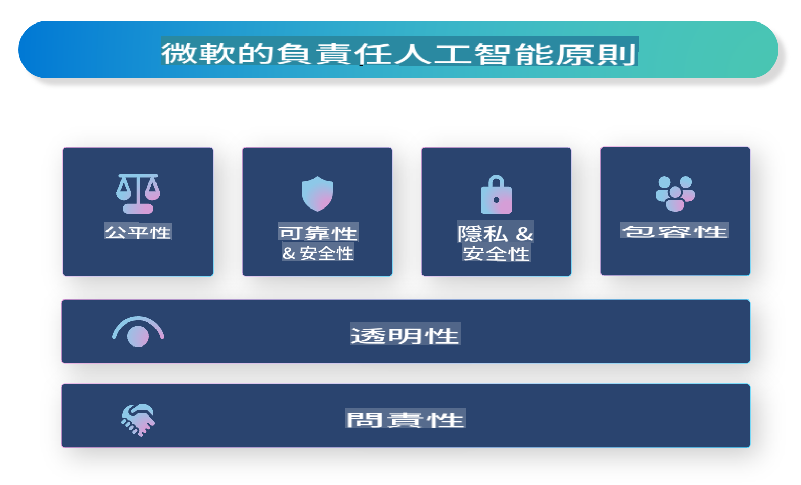

# **介紹負責任的 AI**

[Microsoft Responsible AI](https://www.microsoft.com/ai/responsible-ai?WT.mc_id=aiml-138114-kinfeylo) 是一項旨在幫助開發者和組織構建透明、可信且負責任的 AI 系統的倡議。該倡議提供了開發負責任 AI 解決方案的指導和資源，這些解決方案與隱私、公平性和透明度等道德原則保持一致。我們還將探討構建負責任 AI 系統所面臨的一些挑戰和最佳實踐。

## Microsoft Responsible AI 概覽

**道德原則**

Microsoft Responsible AI 以一系列道德原則為指導，例如隱私、公平性、透明度、問責性和安全性。這些原則旨在確保 AI 系統以道德且負責任的方式開發。

**透明的 AI**

Microsoft Responsible AI 強調 AI 系統的透明性。這包括提供清晰的解釋說明 AI 模型如何運作，以及確保數據來源和算法公開可用。

**可問責的 AI**

[Microsoft Responsible AI](https://www.microsoft.com/ai/responsible-ai?WT.mc_id=aiml-138114-kinfeylo) 推動開發可問責的 AI 系統，這些系統可以提供有關 AI 模型如何做出決策的見解。這有助於用戶理解並信任 AI 系統的輸出。

**包容性**

AI 系統應該設計為惠及所有人。Microsoft 致力於創造考慮多元觀點且避免偏見或歧視的包容性 AI。

**可靠性與安全性**

確保 AI 系統的可靠性和安全性至關重要。Microsoft 專注於構建穩健的模型，這些模型能穩定執行並避免造成有害結果。

**AI 的公平性**

Microsoft Responsible AI 認識到，如果 AI 系統基於有偏見的數據或算法進行訓練，可能會延續偏見。該倡議為開發不基於種族、性別或年齡等因素進行歧視的公平 AI 系統提供指導。

**隱私和安全**

Microsoft Responsible AI 強調在 AI 系統中保護用戶隱私和數據安全的重要性。這包括實施強大的數據加密和訪問控制，以及定期審核 AI 系統的漏洞。

**問責與責任**

Microsoft Responsible AI 提倡在 AI 的開發和部署中實現問責與責任。這包括確保開發者和組織了解 AI 系統可能帶來的風險，並採取措施來減輕這些風險。

## 構建負責任 AI 系統的最佳實踐

**使用多元數據集開發 AI 模型**

為避免 AI 系統中的偏見，重要的是使用代表多元觀點和經驗的數據集。

**使用可解釋的 AI 技術**

可解釋的 AI 技術可以幫助用戶理解 AI 模型如何做出決策，從而提高對系統的信任。

**定期審核 AI 系統的漏洞**

定期審核 AI 系統可以幫助識別需要解決的潛在風險和漏洞。

**實施強大的數據加密和訪問控制**

數據加密和訪問控制可以幫助保護 AI 系統中的用戶隱私和安全。

**在 AI 開發中遵循道德原則**

遵循公平性、透明度和問責性等道德原則，可以幫助建立對 AI 系統的信任，並確保它們以負責任的方式開發。

## 使用 AI Foundry 實現負責任的 AI

[Azure AI Foundry](https://ai.azure.com?WT.mc_id=aiml-138114-kinfeylo) 是一個強大的平台，允許開發者和組織快速創建智能、尖端、市場就緒且負責任的應用程序。以下是 Azure AI Foundry 的一些主要功能和能力：

**開箱即用的 API 和模型**

Azure AI Foundry 提供了預構建和可定制的 API 和模型。這些涵蓋了多種 AI 任務，包括生成式 AI、會話自然語言處理、搜索、監控、翻譯、語音、視覺和決策。

**Prompt Flow**

Azure AI Foundry 的 Prompt Flow 能幫助您創建會話式 AI 體驗。它允許您設計和管理會話流程，使構建聊天機器人、虛擬助理和其他互動式應用程序變得更加容易。

**檢索增強生成 (RAG)**

RAG 是一種結合檢索式和生成式方法的技術。它通過利用現有知識（檢索）和創造性生成（生成）來提升生成響應的質量。

**生成式 AI 的評估和監控指標**

Azure AI Foundry 提供用於評估和監控生成式 AI 模型的工具。您可以評估其性能、公平性和其他重要指標，以確保負責任的部署。此外，如果您已創建儀表板，可以使用 Azure Machine Learning Studio 的無代碼界面自定義並生成基於 [Responsible AI Toolbox](https://responsibleaitoolbox.ai/?WT.mc_id=aiml-138114-kinfeylo) Python 庫的負責任 AI 儀表板及相關評分卡。此評分卡幫助您向技術和非技術利益相關者分享與公平性、特徵重要性和其他負責任部署考量相關的關鍵見解。

要使用 AI Foundry 實現負責任的 AI，您可以遵循以下最佳實踐：

**明確定義 AI 系統的問題和目標**

在開始開發過程之前，明確定義您的 AI 系統旨在解決的問題或目標非常重要。這將幫助您確定構建有效模型所需的數據、算法和資源。

**收集和預處理相關數據**

用於訓練 AI 系統的數據質量和數量對其性能有重大影響。因此，收集相關數據、清理、預處理並確保其能代表您試圖解決的人群或問題非常重要。

**選擇適當的評估方法**

有多種評估算法可供選擇。根據您的數據和問題選擇最合適的算法至關重要。

**評估並解釋模型**

在構建 AI 模型後，使用適當的指標評估其性能，並以透明的方式解釋結果。這將幫助您識別模型中的任何偏見或限制，並在必要時進行改進。

**確保透明性和可解釋性**

AI 系統應該是透明且可解釋的，這樣用戶才能理解其運作方式以及如何做出決策。這對於對人類生活有重大影響的應用（例如醫療、金融和法律系統）尤為重要。

**監控並更新模型**

AI 系統應該持續監控和更新，以確保其隨時間保持準確和有效。這需要對模型進行持續的維護、測試和重新訓練。

總之，Microsoft Responsible AI 是一項旨在幫助開發者和組織構建透明、可信且負責任 AI 系統的倡議。請記住，實現負責任的 AI 至關重要，而 Azure AI Foundry 致力於使其對組織更具實用性。通過遵循道德原則和最佳實踐，我們可以確保 AI 系統以負責任的方式開發和部署，從而造福整個社會。

**免責聲明**：  
本文件是使用機器翻譯AI服務進行翻譯的。儘管我們努力確保準確性，但請注意，自動翻譯可能包含錯誤或不準確之處。應以原始語言的文件作為權威來源。對於關鍵信息，建議尋求專業人工翻譯。我們對因使用此翻譯而產生的任何誤解或錯誤解釋概不負責。