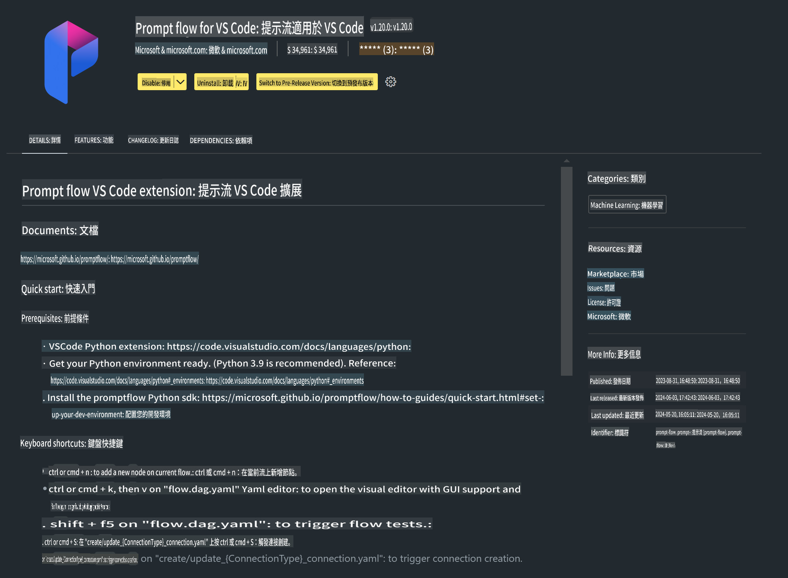

# **Lab 0 - 安裝**

進入 Lab 後，我們需要配置相關的環境：

### **1. Python 3.11+**

建議使用 miniforge 來配置 Python 環境。

關於 miniforge 的配置，請參考 [https://github.com/conda-forge/miniforge](https://github.com/conda-forge/miniforge)

配置完成後，在 Power Shell 中執行以下指令：

```bash

conda create -n pyenv python==3.11.8 -y

conda activate pyenv

```

### **2. 安裝 Prompt flow SDK**

在 Lab 1 中，我們會使用 Prompt flow，因此需要先配置 Prompt flow SDK。

```bash

pip install promptflow --upgrade

```

可以透過以下指令檢查 Prompt flow SDK 是否已安裝成功：

```bash

pf --version

```

### **3. 安裝 Visual Studio Code Prompt flow 擴展**



### **4. Apple 的 MLX 框架**

MLX 是 Apple 機器學習研究團隊為 Apple Silicon 開發的陣列框架，用於機器學習研究。透過 **Apple MLX 框架**，可以加速 Apple Silicon 上的 LLM / SLM。如果想了解更多，可以參考 [https://github.com/microsoft/PhiCookBook/blob/main/md/01.Introduction/03/MLX_Inference.md](https://github.com/microsoft/PhiCookBook/blob/main/md/01.Introduction/03/MLX_Inference.md)。

在 bash 中安裝 MLX 框架庫：

```bash

pip install mlx-lm

```

### **5. 其他 Python 庫**

建立一個 `requirements.txt` 檔案，並加入以下內容：

```txt

notebook
numpy 
scipy 
scikit-learn 
matplotlib 
pandas 
pillow 
graphviz

```

### **6. 安裝 NVM**

在 Power Shell 中安裝 nvm：

```bash

brew install nvm

```

安裝 Node.js 18.20：

```bash

nvm install 18.20.0

nvm use 18.20.0

```

### **7. 安裝 Visual Studio Code 開發支援**

```bash

npm install --global yo generator-code

```

恭喜！您已成功配置 SDK。接下來可以進行實作步驟了。

**免責聲明**：  
本文件是使用基於機器的人工智能翻譯服務進行翻譯的。儘管我們努力確保準確性，但請注意，自動翻譯可能包含錯誤或不準確之處。應以原文的母語版本作為權威來源。對於關鍵信息，建議尋求專業的人類翻譯服務。我們對因使用此翻譯而引起的任何誤解或誤讀概不負責。