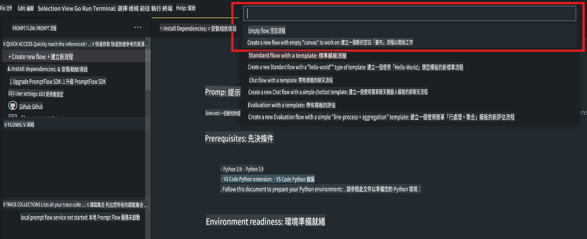
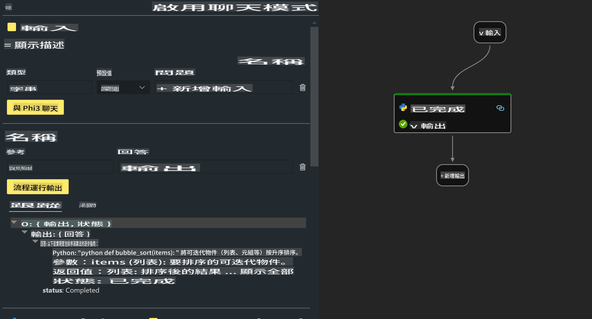

# **Lab 2 - 在 AIPC 中使用 Phi-3-mini 執行 Prompt flow**

## **什麼是 Prompt flow**

Prompt flow 是一套開發工具，旨在簡化基於大型語言模型 (LLM) 的 AI 應用程序的完整開發週期，從構思、原型設計、測試、評估到生產部署和監控。它讓提示工程變得更容易，並幫助您構建具有生產品質的 LLM 應用程序。

使用 Prompt flow，您可以：

- 建立能將 LLM、提示、Python 代碼和其他工具連接在一起的可執行工作流程。

- 輕鬆調試和迭代您的流程，特別是與 LLM 的交互。

- 評估您的流程，通過更大的數據集計算質量和性能指標。

- 將測試和評估整合到您的 CI/CD 系統中，以確保流程的質量。

- 將您的流程部署到您選擇的服務平台，或輕鬆整合到應用程序的代碼基礎中。

- （可選但強烈推薦）通過在 Azure AI 中利用 Prompt flow 的雲端版本，與您的團隊進行協作。


## **在 Apple Silicon 上構建生成代碼流程**

***注意***：如果您尚未完成環境安裝，請訪問 [Lab 0 - 安裝指南](./01.Installations.md)

1. 在 Visual Studio Code 中打開 Prompt flow 擴展，並創建一個空的流程專案。



2. 添加輸入和輸出參數，並將 Python 代碼作為新流程添加。



您可以參考此結構（flow.dag.yaml）來構建您的流程：

```yaml

inputs:
  prompt:
    type: string
    default: Write python code for Fibonacci serie. Please use markdown as output
outputs:
  result:
    type: string
    reference: ${gen_code_by_phi3.output}
nodes:
- name: gen_code_by_phi3
  type: python
  source:
    type: code
    path: gen_code_by_phi3.py
  inputs:
    prompt: ${inputs.prompt}


```

3. 量化 phi-3-mini

我們希望能更好地在本地設備上運行 SLM。通常，我們會對模型進行量化（INT4、FP16、FP32）。

```bash

python -m mlx_lm.convert --hf-path microsoft/Phi-3-mini-4k-instruct

```

**注意：** 預設文件夾為 mlx_model 

4. 在 ***Chat_With_Phi3.py*** 中添加代碼：

```python


from promptflow import tool

from mlx_lm import load, generate


# The inputs section will change based on the arguments of the tool function, after you save the code
# Adding type to arguments and return value will help the system show the types properly
# Please update the function name/signature per need
@tool
def my_python_tool(prompt: str) -> str:

    model_id = './mlx_model_phi3_mini'

    model, tokenizer = load(model_id)

    # <|user|>\nWrite python code for Fibonacci serie. Please use markdown as output<|end|>\n<|assistant|>

    response = generate(model, tokenizer, prompt="<|user|>\n" + prompt  + "<|end|>\n<|assistant|>", max_tokens=2048, verbose=True)

    return response


```

4. 您可以從 Debug 或 Run 測試流程，檢查生成代碼是否正常。


5. 在終端中將流程作為開發 API 運行：

```

pf flow serve --source ./ --port 8080 --host localhost   

```

您可以使用 Postman 或 Thunder Client 測試它。


### **注意事項**

1. 首次運行需要較長時間，建議通過 Hugging Face CLI 下載 phi-3 模型。

2. 考慮到 Intel NPU 的計算能力有限，建議使用 Phi-3-mini-4k-instruct。

3. 我們使用 Intel NPU 加速進行 INT4 量化轉換，但如果重新運行服務，您需要刪除快取和 nc_workshop 文件夾。


## **資源**

1. 學習 Promptflow [https://microsoft.github.io/promptflow/](https://microsoft.github.io/promptflow/)

2. 學習 Intel NPU 加速 [https://github.com/intel/intel-npu-acceleration-library](https://github.com/intel/intel-npu-acceleration-library)

3. 範例代碼，下載 [本地 NPU Agent 範例代碼](../../../../../../../../../code/07.Lab/01/AIPC/local-npu-agent)

**免責聲明**：  
本文件是使用基於機器的人工智能翻譯服務進行翻譯的。我們致力於提供準確的翻譯，但請注意，自動翻譯可能會包含錯誤或不準確之處。應以原文作為權威來源。對於關鍵信息，建議尋求專業人工翻譯。我們對因使用本翻譯而引起的任何誤解或錯誤解讀概不負責。