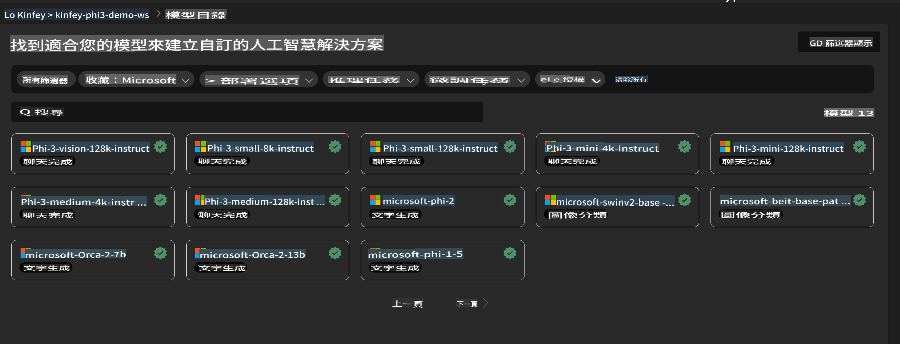
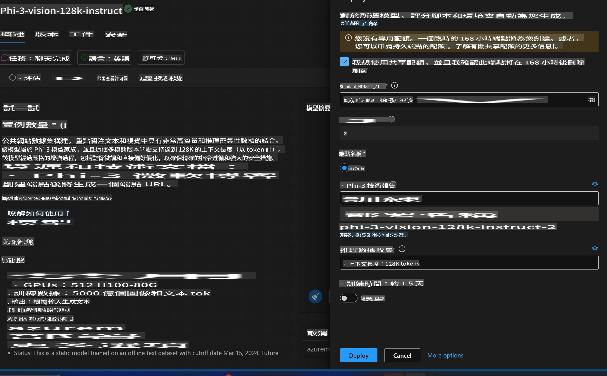

# **Lab 3 - 在 Azure Machine Learning Service 部署 Phi-3-Vision**

我們使用 NPU 完成本地代碼的生產部署，接著希望藉助它引入 PHI-3-VISION 的功能，實現從圖片生成代碼的目標。

透過本介紹，我們可以快速在 Azure Machine Learning Service 上構建一個 Model As Service 的 Phi-3 Vision 服務。

***Note***：Phi-3 Vision 需要計算資源來更快地生成內容。我們需要雲端計算能力來幫助我們實現這一點。


### **1. 建立 Azure Machine Learning Service**

我們需要在 Azure Portal 中建立一個 Azure Machine Learning Service。如果您想了解如何操作，請訪問此連結 [https://learn.microsoft.com/azure/machine-learning/quickstart-create-resources?view=azureml-api-2](https://learn.microsoft.com/azure/machine-learning/quickstart-create-resources?view=azureml-api-2)


### **2. 在 Azure Machine Learning Service 中選擇 Phi-3 Vision**




### **3. 在 Azure 部署 Phi-3-Vision**




### **4. 使用 Postman 測試端點**


***Note***

1. 傳遞的參數必須包括 Authorization、azureml-model-deployment 和 Content-Type。您需要檢查部署資訊以獲取這些參數。

2. 傳遞參數時，Phi-3-Vision 需要傳遞一個圖片連結。請參考 GPT-4-Vision 的方法來傳遞參數，例如：

```json

{
  "input_data":{
    "input_string":[
      {
        "role":"user",
        "content":[ 
          {
            "type": "text",
            "text": "You are a Python coding assistant.Please create Python code for image "
          },
          {
              "type": "image_url",
              "image_url": {
                "url": "https://ajaytech.co/wp-content/uploads/2019/09/index.png"
              }
          }
        ]
      }
    ],
    "parameters":{
          "temperature": 0.6,
          "top_p": 0.9,
          "do_sample": false,
          "max_new_tokens": 2048
    }
  }
}

```

3. 使用 Post 方法呼叫 **/score**

**恭喜您**！您已經完成了快速部署 PHI-3-VISION，並嘗試了如何使用圖片生成代碼。接下來，我們可以結合 NPU 和雲端構建應用程式。

**免責聲明**：  
本文件是使用機器翻譯AI服務進行翻譯的。我們努力追求準確性，但請注意，自動翻譯可能包含錯誤或不準確之處。應以原始語言的文件作為權威來源。對於關鍵信息，建議尋求專業人工翻譯。我們對因使用此翻譯而引起的任何誤解或誤釋不承擔責任。