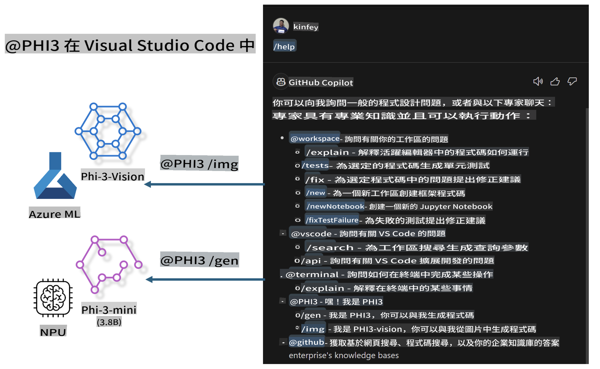

# **打造屬於你的 Visual Studio Code GitHub Copilot Chat，結合 Microsoft Phi-3 系列**

你是否使用過 GitHub Copilot Chat 的工作區代理？是否想要建立屬於你團隊的程式碼代理？本實作課程旨在結合開源模型，打造企業級的程式碼業務代理。

## **基礎**

### **為什麼選擇 Microsoft Phi-3**

Phi-3 是一個系列家族，包括 phi-3-mini、phi-3-small 和 phi-3-medium，基於不同的訓練參數，適用於文字生成、對話補全以及程式碼生成。此外，還有基於視覺的 phi-3-vision，適合企業或不同團隊建立離線生成式 AI 解決方案。

建議閱讀以下連結：[https://github.com/microsoft/PhiCookBook/blob/main/md/01.Introduction/01/01.PhiFamily.md](https://github.com/microsoft/PhiCookBook/blob/main/md/01.Introduction/01/01.PhiFamily.md)

### **Microsoft GitHub Copilot Chat**

GitHub Copilot Chat 擴展提供了一個聊天介面，讓你可以與 GitHub Copilot 互動，並直接在 VS Code 中獲得與程式碼相關問題的答案，無需瀏覽文件或搜尋線上論壇。

Copilot Chat 可能會使用語法高亮、縮排和其他格式功能，讓生成的回應更清晰。根據使用者的問題類型，結果可能包含 Copilot 用於生成回應的上下文連結，例如原始碼檔案或文件，或是用於存取 VS Code 功能的按鈕。

- Copilot Chat 無縫整合到你的開發流程中，並在需要時提供幫助：

- 從編輯器或終端直接啟動內嵌聊天，獲得即時協助

- 使用聊天視圖，隨時獲得 AI 助手的支援

- 啟動快速聊天，快速提問並繼續手邊的工作

你可以在多種場景下使用 GitHub Copilot Chat，例如：

- 解答如何最佳解決問題的程式碼問題

- 解釋他人程式碼並提出改進建議

- 提出程式碼修正建議

- 生成單元測試案例

- 生成程式碼文件

建議閱讀以下連結：[https://code.visualstudio.com/docs/copilot/copilot-chat](https://code.visualstudio.com/docs/copilot/copilot-chat?WT.mc_id=aiml-137032-kinfeylo)

### **Microsoft GitHub Copilot Chat @workspace**

在 Copilot Chat 中引用 **@workspace**，可以針對整個程式碼庫提問。根據問題，Copilot 會智能檢索相關檔案和符號，並在回應中以連結和程式碼範例的形式呈現。

為了回答你的問題，**@workspace** 會搜尋開發者在 VS Code 中瀏覽程式碼庫時可能使用的相同資源：

- 工作區中的所有檔案，除了被 .gitignore 忽略的檔案

- 包含嵌套資料夾和檔案名稱的目錄結構

- 如果工作區是 GitHub 儲存庫且被程式碼搜尋索引，則使用 GitHub 的程式碼搜尋索引

- 工作區中的符號和定義

- 目前選定的文字或在編輯器中可見的文字

注意：如果你打開了一個被忽略的檔案或選中了其中的文字，.gitignore 將被繞過。

建議閱讀以下連結：[https://code.visualstudio.com/docs/copilot/copilot-chat](https://code.visualstudio.com/docs/copilot/workspace-context?WT.mc_id=aiml-137032-kinfeylo)

## **了解更多關於這個實作課程**

GitHub Copilot 大幅提升了企業的編程效率，每個企業都希望能夠自訂 GitHub Copilot 的相關功能。許多企業基於自身業務場景和開源模型，定制了類似 GitHub Copilot 的擴展功能。對於企業而言，自訂的擴展功能更容易控制，但也可能影響使用者體驗。畢竟，GitHub Copilot 在處理通用場景和專業性方面更具優勢。如果能保持一致的體驗，並且同時擁有企業自訂的功能，那將是更好的使用者體驗。

本實作課程主要結合 Phi-3 模型、本地 NPU 和 Azure 混合架構，打造 GitHub Copilot Chat 的自訂代理 ***@PHI3***，幫助企業開發者完成程式碼生成 ***(@PHI3 /gen)***，以及基於圖片生成程式碼 ***(@PHI3 /img)***。

### ***注意:*** 

本實作課程目前已在 Intel CPU 的 AIPC 和 Apple Silicon 平台上實現。我們將持續更新 Qualcomm NPU 版本。

## **實作課程**

| 名稱 | 描述 | AIPC | Apple |
| ------------ | ----------- | -------- |-------- |
| Lab0 - 安裝 (✅) | 配置並安裝相關環境與工具 | [前往](./HOL/AIPC/01.Installations.md) |[前往](./HOL/Apple/01.Installations.md) |
| Lab1 - 使用 Phi-3-mini 運行 Prompt flow (✅) | 結合 AIPC / Apple Silicon，利用本地 NPU 通過 Phi-3-mini 進行程式碼生成 | [前往](./HOL/AIPC/02.PromptflowWithNPU.md) |  [前往](./HOL/Apple/02.PromptflowWithMLX.md) |
| Lab2 - 在 Azure Machine Learning Service 部署 Phi-3-vision (✅) | 通過部署 Azure Machine Learning Service 的模型目錄 Phi-3-vision 圖片進行程式碼生成 | [前往](./HOL/AIPC/03.DeployPhi3VisionOnAzure.md) |[前往](./HOL/Apple/03.DeployPhi3VisionOnAzure.md) |
| Lab3 - 在 GitHub Copilot Chat 中創建 @phi-3 代理 (✅)  | 在 GitHub Copilot Chat 中創建自訂的 Phi-3 代理，完成程式碼生成、圖像生成程式碼、RAG 等 | [前往](./HOL/AIPC/04.CreatePhi3AgentInVSCode.md) | [前往](./HOL/Apple/04.CreatePhi3AgentInVSCode.md) |
| 範例程式碼 (✅)  | 下載範例程式碼 | [前往](../../../../../../../code/07.Lab/01/AIPC) | [前往](../../../../../../../code/07.Lab/01/Apple) |

## **資源**

1. Phi-3 Cookbook [https://github.com/microsoft/Phi-3CookBook](https://github.com/microsoft/Phi-3CookBook)

2. 了解更多關於 GitHub Copilot [https://learn.microsoft.com/training/paths/copilot/](https://learn.microsoft.com/training/paths/copilot/?WT.mc_id=aiml-137032-kinfeylo)

3. 了解更多關於 GitHub Copilot Chat [https://learn.microsoft.com/training/paths/accelerate-app-development-using-github-copilot/](https://learn.microsoft.com/training/paths/accelerate-app-development-using-github-copilot/?WT.mc_id=aiml-137032-kinfeylo)

4. 了解更多關於 GitHub Copilot Chat API [https://code.visualstudio.com/api/extension-guides/chat](https://code.visualstudio.com/api/extension-guides/chat?WT.mc_id=aiml-137032-kinfeylo)

5. 了解更多關於 Azure AI Foundry [https://learn.microsoft.com/training/paths/create-custom-copilots-ai-studio/](https://learn.microsoft.com/training/paths/create-custom-copilots-ai-studio/?WT.mc_id=aiml-137032-kinfeylo)

6. 了解更多關於 Azure AI Foundry 的模型目錄 [https://learn.microsoft.com/azure/ai-studio/how-to/model-catalog-overview](https://learn.microsoft.com/azure/ai-studio/how-to/model-catalog-overview)

**免責聲明**：  
本文件使用機器翻譯服務進行翻譯。儘管我們努力確保準確性，但請注意，自動翻譯可能包含錯誤或不準確之處。應以原文文件作為權威來源。對於關鍵資訊，建議尋求專業人工翻譯。我們對因使用此翻譯而產生的任何誤解或錯誤解讀概不負責。