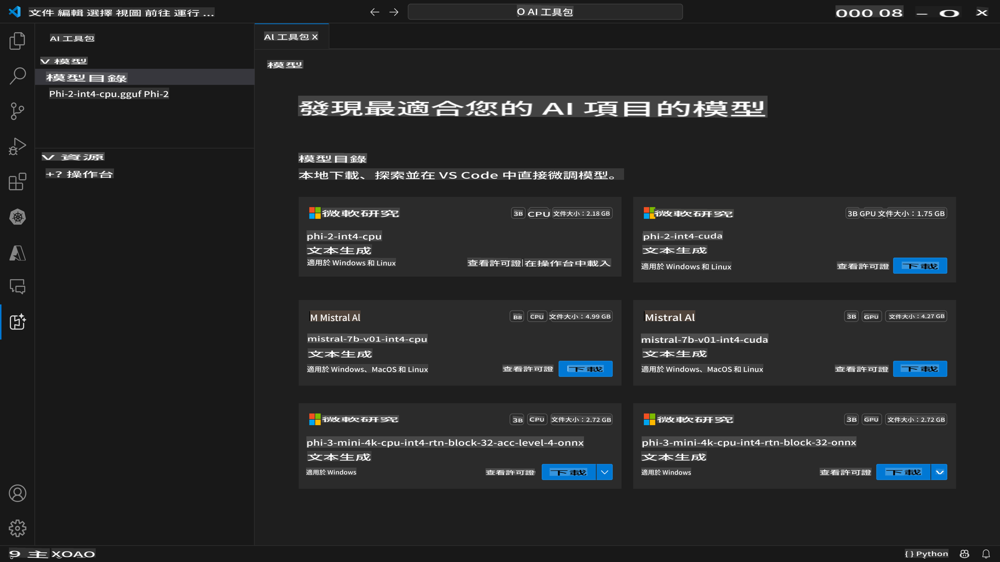
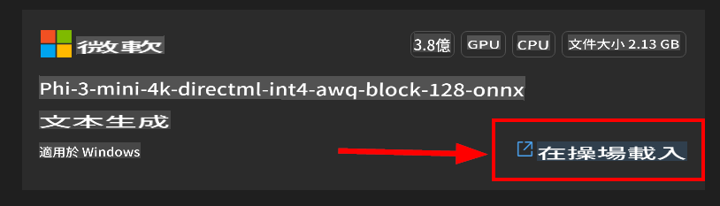
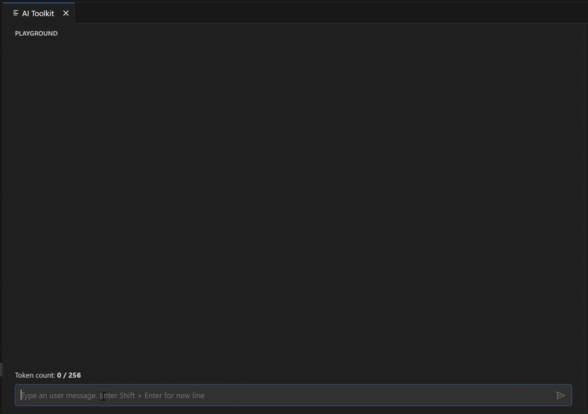

# AI Toolkit for VScode (Windows)

[AI Toolkit for VS Code](https://marketplace.visualstudio.com/items?itemName=ms-windows-ai-studio.windows-ai-studio) 透過整合來自 Azure AI Foundry Catalog 和其他目錄（如 Hugging Face）的尖端 AI 開發工具和模型，簡化生成式 AI 應用程式的開發。你可以瀏覽由 Azure ML 和 Hugging Face 提供支持的 AI 模型目錄，將它們下載到本地，進行微調、測試並在你的應用程式中使用。

AI Toolkit 預覽版將在本地運行。根據你選擇的模型，有些任務僅支持 Windows 和 Linux。

本地推理或微調取決於你選擇的模型，可能需要像 NVIDIA CUDA GPU 這樣的 GPU。

如果你在遠端運行，雲端資源需要有 GPU，請確保檢查你的環境。對於在 Windows + WSL 上本地運行，應安裝並設置 WSL Ubuntu 發行版 18.4 或更高版本為默認值，然後再使用 AI Toolkit。

## 開始使用

[了解如何安裝 Windows 子系統 Linux](https://learn.microsoft.com/windows/wsl/install?WT.mc_id=aiml-137032-kinfeylo)

和[更改默認發行版](https://learn.microsoft.com/windows/wsl/install#change-the-default-linux-distribution-installed)。

[AI Tooklit GitHub Repo](https://github.com/microsoft/vscode-ai-toolkit/)

- Windows 或 Linux。
- **MacOS 支持即將推出**
- 對於在 Windows 和 Linux 上進行微調，你需要 Nvidia GPU。此外，**Windows** 需要有 Ubuntu 發行版 18.4 或更高版本的 Linux 子系統。[了解如何安裝 Windows 子系統 Linux](https://learn.microsoft.com/windows/wsl/install) 和 [更改默認發行版](https://learn.microsoft.com/windows/wsl/install#change-the-default-linux-distribution-installed)。

### 安裝 AI Toolkit

AI Toolkit 作為 [Visual Studio Code 擴展](https://code.visualstudio.com/docs/setup/additional-components#_vs-code-extensions)提供，因此你需要先安裝 [VS Code](https://code.visualstudio.com/docs/setup/windows?WT.mc_id=aiml-137032-kinfeylo)，然後從 [VS Marketplace](https://marketplace.visualstudio.com/items?itemName=ms-windows-ai-studio.windows-ai-studio) 下載 AI Toolkit。
[AI Toolkit 在 Visual Studio Marketplace 可用](https://marketplace.visualstudio.com/items?itemName=ms-windows-ai-studio.windows-ai-studio)，可以像安裝其他 VS Code 擴展一樣安裝它。

如果你不熟悉如何安裝 VS Code 擴展，請按照以下步驟：

### 登入

1. 在 VS Code 的活動欄中選擇 **Extensions**
2. 在擴展搜索欄中輸入 "AI Toolkit"
3. 選擇 "AI Toolkit for Visual Studio code"
4. 選擇 **Install**

現在，你已經準備好使用這個擴展了！

系統會提示你登入 GitHub，請點擊 "Allow" 繼續。你將被重定向到 GitHub 登入頁面。

請登入並按照步驟完成過程。成功完成後，你將被重定向到 VS Code。

安裝擴展後，你會看到 AI Toolkit 圖標出現在你的活動欄中。

讓我們來探索可用的操作！

### 可用操作

AI Toolkit 的主側邊欄分為以下幾個部分：

- **Models**
- **Resources**
- **Playground**
- **Fine-tuning**

這些操作可在 Resources 部分找到。要開始，請選擇 **Model Catalog**。

### 從目錄下載模型

從 VS Code 側邊欄啟動 AI Toolkit 後，你可以選擇以下選項：



- 從 **Model Catalog** 中找到支持的模型並下載到本地
- 在 **Model Playground** 中測試模型推理
- 在 **Model Fine-tuning** 中本地或遠程微調模型
- 通過 AI Toolkit 的命令面板將微調過的模型部署到雲端

> [!NOTE]
>
> **GPU Vs CPU**
>
> 你會注意到模型卡片顯示模型大小、平台和加速器類型（CPU、GPU）。對於 **Windows 設備上至少有一個 GPU** 的情況，選擇僅針對 Windows 的模型版本以獲得最佳性能。
>
> 這確保你擁有為 DirectML 加速器優化的模型。
>
> 模型名稱的格式為
>
> - `{model_name}-{accelerator}-{quantization}-{format}`。
>
>要檢查你的 Windows 設備是否有 GPU，打開 **Task Manager**，然後選擇 **Performance** 標籤。如果你有 GPU，它們將列在像 "GPU 0" 或 "GPU 1" 這樣的名稱下。

### 在 playground 中運行模型

設置好所有參數後，點擊 **Generate Project**。

下載模型後，在目錄中的模型卡片上選擇 **Load in Playground**：

- 啟動模型下載
- 安裝所有前提條件和依賴項
- 創建 VS Code 工作區



下載模型後，你可以從 AI Toolkit 啟動項目。

> ***Note*** 如果你想嘗試預覽功能以遠程進行推理或微調，請遵循 [這個指南](https://github.com/microsoft/vscode-ai-toolkit/blob/main/archive/remote-overall.md)

### Windows 優化模型

你應該會看到模型回應回傳給你：

AI Toolkit 提供了已為 Windows 優化的公開可用 AI 模型集合。這些模型存儲在不同位置，包括 Hugging Face、GitHub 等，但你可以瀏覽這些模型，並在一個地方找到它們，準備下載並在你的 Windows 應用程式中使用。



### 模型選擇

如果你的 *Windows* 設備上 **沒有** 可用的 **GPU**，但你選擇了

- Phi-3-mini-4k-**directml**-int4-awq-block-128-onnx 模型

模型回應將會 *非常慢*。

你應該下載 CPU 優化版本：

- Phi-3-mini-4k-**cpu**-int4-rtn-block-32-acc-level-4-onnx。

你也可以更改：

**Context Instructions:** 幫助模型理解你請求的更大背景。這可以是背景信息、你想要的示例/演示或解釋你任務的目的。

**Inference parameters:**

- *Maximum response length*: 模型返回的最大 token 數量。
- *Temperature*: 模型溫度是一個參數，控制語言模型輸出的隨機性。較高的溫度意味著模型會更冒險，給你一個多樣化的詞語組合。相反，較低的溫度使模型更加保守，保持更專注和可預測的回應。
- *Top P*: 也稱為核取樣，是一個設置，控制語言模型在預測下一個詞時考慮的可能詞語或短語數量。
- *Frequency penalty*: 此參數影響模型在輸出中重複詞語或短語的頻率。較高的值（接近 1.0）鼓勵模型 *避免* 重複詞語或短語。
- *Presence penalty*: 此參數用於生成式 AI 模型中，以鼓勵生成文本的多樣性和特異性。較高的值（接近 1.0）鼓勵模型包含更多新穎和多樣的 token。較低的值更可能使模型生成常見或陳詞濫調的短語。

### 在你的應用程式中使用 REST API

AI Toolkit 附帶一個本地 REST API Web 伺服器 **在端口 5272**，使用 [OpenAI 聊天完成格式](https://platform.openai.com/docs/api-reference/chat/create)。

這使你可以在本地測試你的應用程式，而不必依賴雲端 AI 模型服務。例如，以下 JSON 文件顯示了如何配置請求的主體：

```json
{
    "model": "Phi-3-mini-4k-directml-int4-awq-block-128-onnx",
    "messages": [
        {
            "role": "user",
            "content": "what is the golden ratio?"
        }
    ],
    "temperature": 0.7,
    "top_p": 1,
    "top_k": 10,
    "max_tokens": 100,
    "stream": true
}
```

你可以使用（例如）[Postman](https://www.postman.com/) 或 CURL (Client URL) 工具測試 REST API：

```bash
curl -vX POST http://127.0.0.1:5272/v1/chat/completions -H 'Content-Type: application/json' -d @body.json
```

### 使用 OpenAI Python 客戶端庫

```python
from openai import OpenAI

client = OpenAI(
    base_url="http://127.0.0.1:5272/v1/", 
    api_key="x" # required for the API but not used
)

chat_completion = client.chat.completions.create(
    messages=[
        {
            "role": "user",
            "content": "what is the golden ratio?",
        }
    ],
    model="Phi-3-mini-4k-cuda-int4-onnx",
)

print(chat_completion.choices[0].message.content)
```

### 使用 Azure OpenAI .NET 客戶端庫

使用 NuGet 將 [Azure OpenAI .NET 客戶端庫](https://www.nuget.org/packages/Azure.AI.OpenAI/) 添加到你的項目中：

```bash
dotnet add {project_name} package Azure.AI.OpenAI --version 1.0.0-beta.17
```

向你的項目添加一個名為 **OverridePolicy.cs** 的 C# 文件，並粘貼以下代碼：

```csharp
// OverridePolicy.cs
using Azure.Core.Pipeline;
using Azure.Core;

internal partial class OverrideRequestUriPolicy(Uri overrideUri)
    : HttpPipelineSynchronousPolicy
{
    private readonly Uri _overrideUri = overrideUri;

    public override void OnSendingRequest(HttpMessage message)
    {
        message.Request.Uri.Reset(_overrideUri);
    }
}
```

接下來，將以下代碼粘貼到你的 **Program.cs** 文件中：

```csharp
// Program.cs
using Azure.AI.OpenAI;

Uri localhostUri = new("http://localhost:5272/v1/chat/completions");

OpenAIClientOptions clientOptions = new();
clientOptions.AddPolicy(
    new OverrideRequestUriPolicy(localhostUri),
    Azure.Core.HttpPipelinePosition.BeforeTransport);
OpenAIClient client = new(openAIApiKey: "unused", clientOptions);

ChatCompletionsOptions options = new()
{
    DeploymentName = "Phi-3-mini-4k-directml-int4-awq-block-128-onnx",
    Messages =
    {
        new ChatRequestSystemMessage("You are a helpful assistant. Be brief and succinct."),
        new ChatRequestUserMessage("What is the golden ratio?"),
    }
};

StreamingResponse<StreamingChatCompletionsUpdate> streamingChatResponse
    = await client.GetChatCompletionsStreamingAsync(options);

await foreach (StreamingChatCompletionsUpdate chatChunk in streamingChatResponse)
{
    Console.Write(chatChunk.ContentUpdate);
}
```

## 使用 AI Toolkit 進行微調

- 開始進行模型發現和 playground。
- 使用本地計算資源進行模型微調和推理。
- 使用 Azure 資源進行遠程微調和推理。

[使用 AI Toolkit 進行微調](../04.Fine-tuning/Finetuning_VSCodeaitoolkit.md)

## AI Toolkit Q&A 資源

請參閱我們的 [Q&A 頁面](https://github.com/microsoft/vscode-ai-toolkit/blob/main/archive/QA.md) 以獲取最常見的問題和解決方案

**免責聲明**：
本文件使用機器翻譯服務進行翻譯。儘管我們努力保證準確性，但請注意，自動翻譯可能包含錯誤或不準確之處。應以原語言的文件為權威來源。對於關鍵信息，建議使用專業的人類翻譯。我們不對使用本翻譯所引起的任何誤解或誤讀承擔責任。