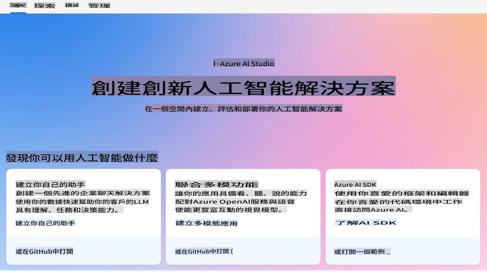
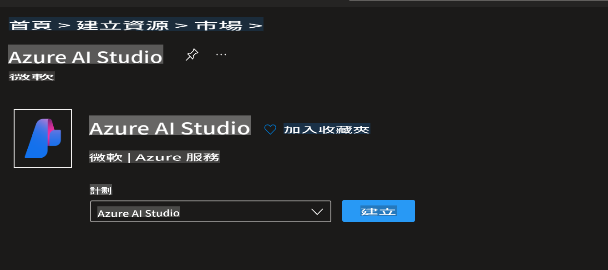
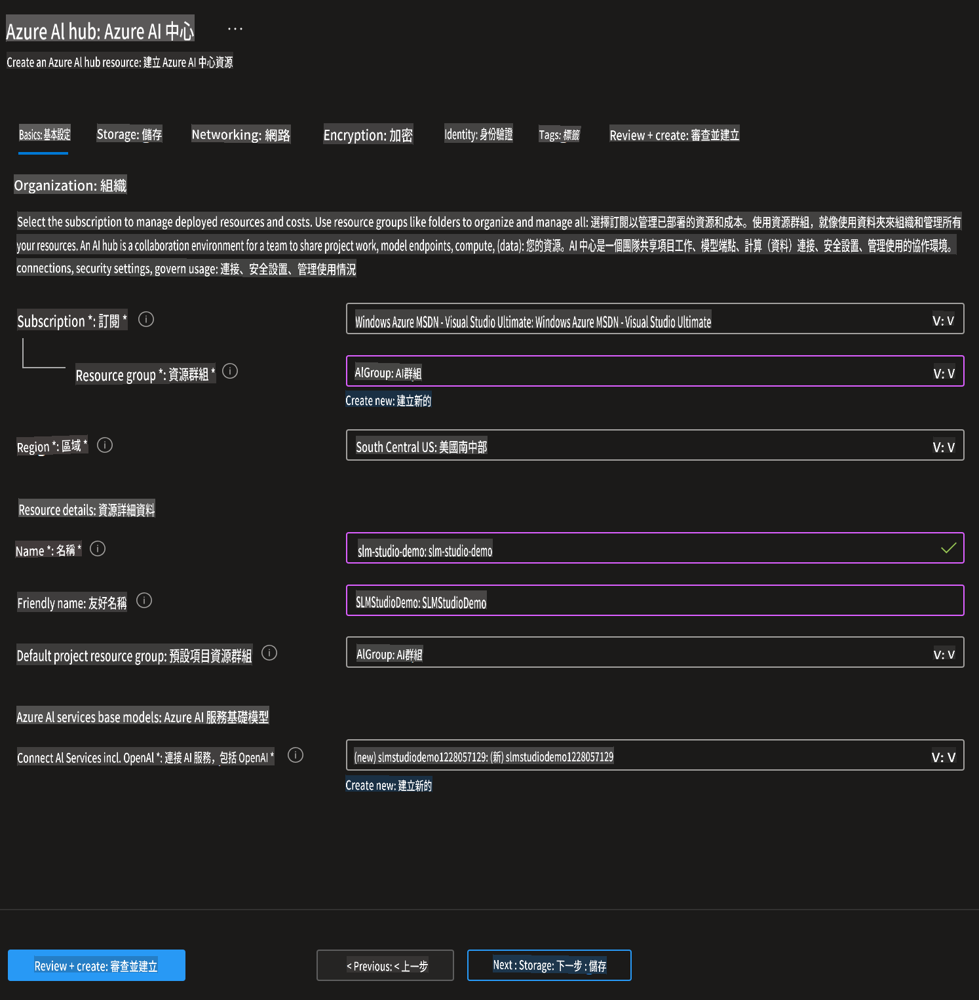
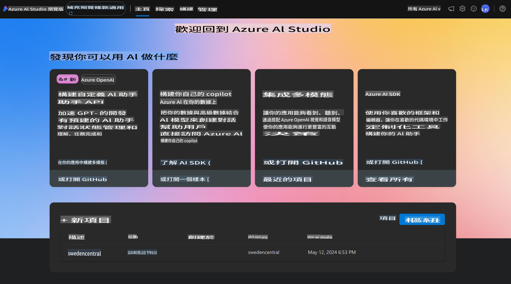
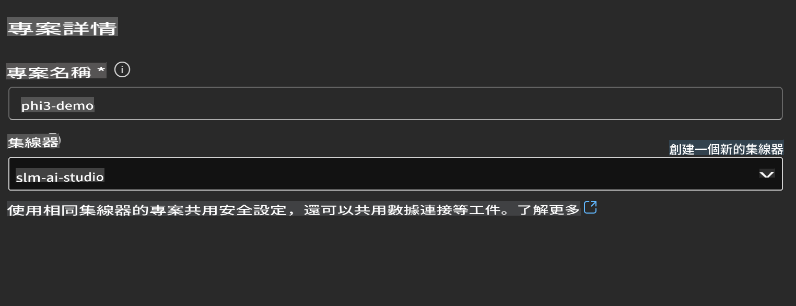
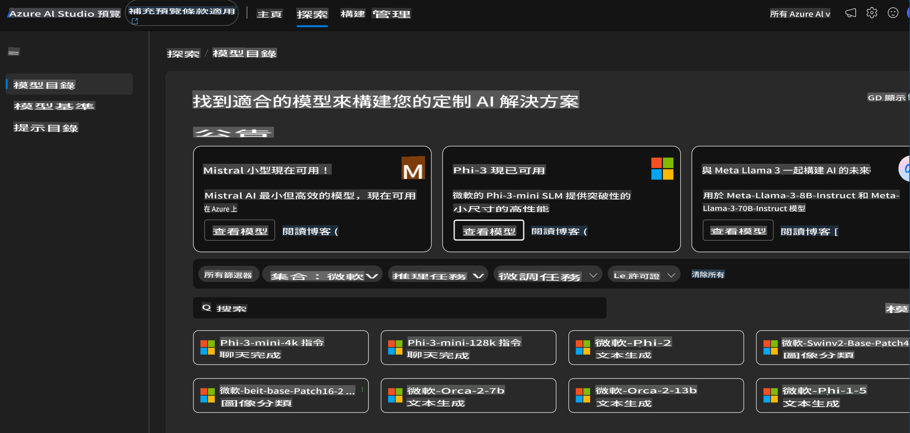
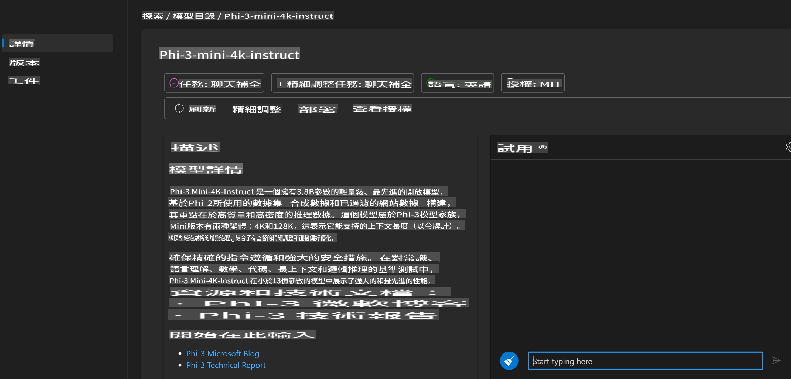
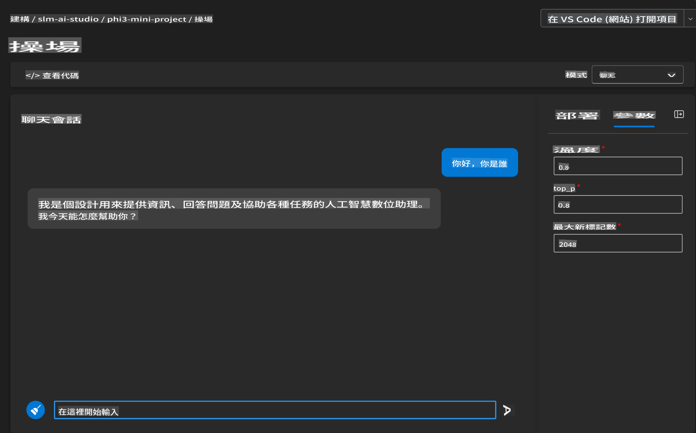
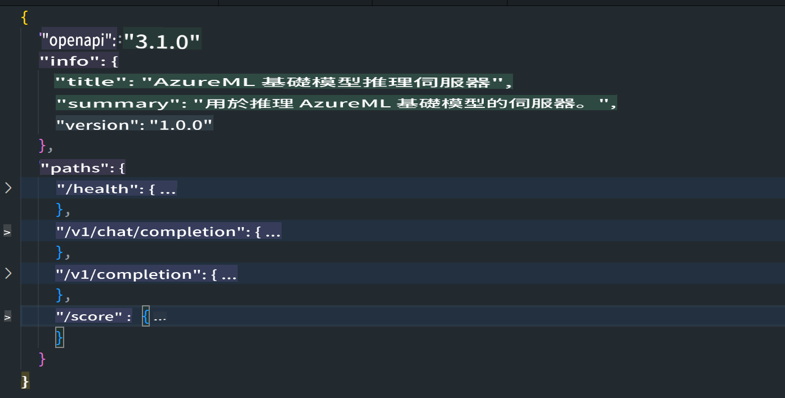
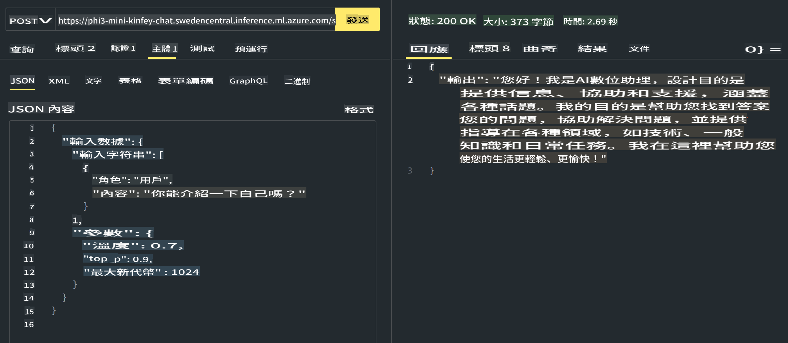

# **在 Azure AI Studio 中使用 Phi-3**

隨著生成式 AI 的發展，我們希望使用一個統一的平台來管理不同的 LLM 和 SLM，企業數據整合、微調/RAG 操作，以及在整合 LLM 和 SLM 後對不同企業業務的評估等，以便更好地實現生成式 AI 的智能應用。[Azure AI Studio](https://ai.azure.com) 是一個企業級的生成式 AI 應用平台。



透過 Azure AI Studio，你可以評估大型語言模型（LLM）的回應，並使用 prompt flow 組織 prompt 應用組件以獲得更好的性能。這個平台有助於將概念驗證轉變為完整的生產環境，並且易於擴展。持續的監控和改進支持長期成功。

我們可以通過簡單的步驟在 Azure AI Studio 上快速部署 Phi-3 模型，然後使用 Azure AI Studio 完成 Phi-3 相關的 Playground/Chat、微調、評估等相關工作。

## **1. 準備工作**

## [AZD AI Studio 入門範本](https://azure.github.io/awesome-azd/?name=AI+Studio)

### Azure AI Studio 入門

這是一個 Bicep 模板，部署你開始使用 Azure AI Studio 所需的一切。包括 AI Hub 及其依賴資源、AI 項目、AI 服務和一個線上端點。

### 快速使用

如果你已經在你的機器上安裝了 [Azure Developer CLI](https://learn.microsoft.com/azure/developer/azure-developer-cli/overview?WT.mc_id=aiml-138114-kinfeylo)，使用這個範本就像在一個新目錄中運行這個命令一樣簡單。

### 終端命令

```bash
azd init -t azd-aistudio-starter
```

或者
如果使用 azd VS Code 擴展，你可以將這個 URL 貼到 VS Code 命令終端。

### 終端 URL

```bash
azd-aistudio-starter
```

## 手動創建

在 [Azure Portal](https://portal.azure.com?WT.mc_id=aiml-138114-kinfeylo) 上創建 Azure AI Studio



完成命名和設置區域後即可創建



創建成功後，你可以通過 [ai.azure.com](https://ai.azure.com/) 訪問你創建的 Studio



一個 AI Studio 可以有多個項目。在 AI Studio 中創建一個項目以進行準備。



## **2. 在 Azure AI Studio 部署 Phi-3 模型**

點擊項目的 Explore 選項進入模型目錄並選擇 Phi-3



選擇 Phi-3-mini-4k-instruct



點擊 'Deploy' 部署 Phi-3-mini-4k-instruct 模型

> [!NOTE]
>
> 部署時可以選擇計算資源

## **3. 在 Azure AI Studio 的 Playground 中與 Phi-3 聊天**

進入部署頁面，選擇 Playground，並與 Azure AI Studio 的 Phi-3 進行聊天



## **4. 從 Azure AI Studio 部署模型**

要從 Azure 模型目錄部署模型，你可以按照以下步驟進行：

- 登錄 Azure AI Studio。
- 從 Azure AI Studio 模型目錄中選擇你想要部署的模型。
- 在模型的詳細頁面，選擇 Deploy，然後選擇帶有 Azure AI Content Safety 的無伺服器 API。
- 選擇你想要部署模型的項目。要使用無伺服器 API，工作區必須屬於 East US 2 或 Sweden Central 區域。你可以自定義部署名稱。
- 在部署嚮導中，選擇 Pricing and terms 以了解定價和使用條款。
- 選擇 Deploy。等待部署完成，你會被重定向到 Deployments 頁面。
- 選擇 Open in playground 開始與模型互動。
- 你可以返回 Deployments 頁面，選擇部署，並記下端點的目標 URL 和密鑰，這些可以用來調用部署並生成完成。
- 你可以隨時通過導航到 Build 標籤並從 Components 部分選擇 Deployments 來找到端點的詳細信息、URL 和訪問密鑰。

> [!NOTE]
> 請注意，你的帳戶必須在資源組上具有 Azure AI Developer 角色權限才能執行這些步驟。

## **5. 在 Azure AI Studio 中使用 Phi-3 API**

你可以通過 Postman GET 訪問 https://{Your project name}.region.inference.ml.azure.com/swagger.json，並結合密鑰了解提供的接口



例如訪問 score api


你可以非常方便地獲取請求參數以及回應參數。這是 Postman 的結果



免责声明：此翻译是由AI模型从原文翻译而来，可能不够完美。请审核输出并进行必要的修正。