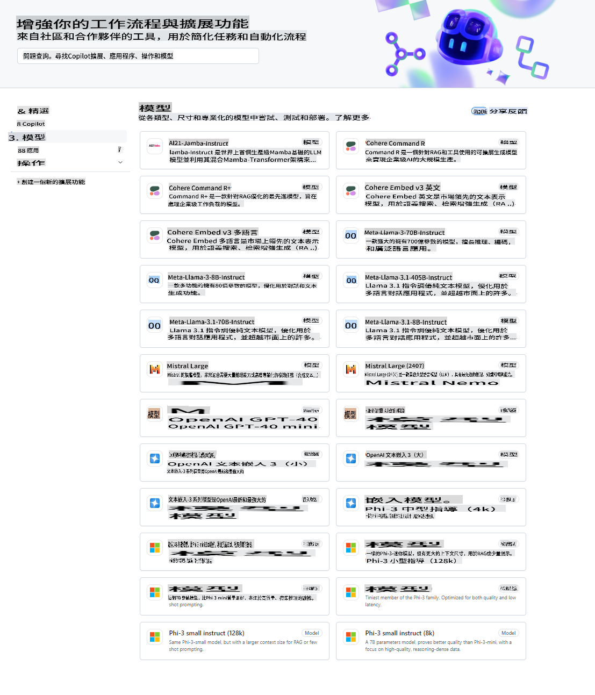
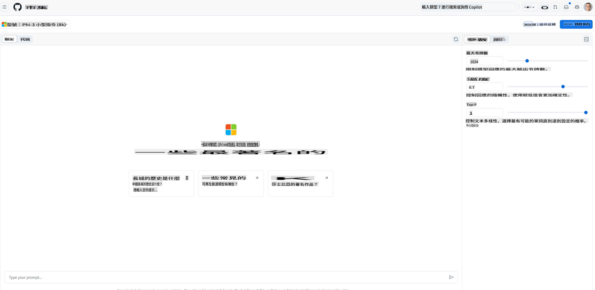
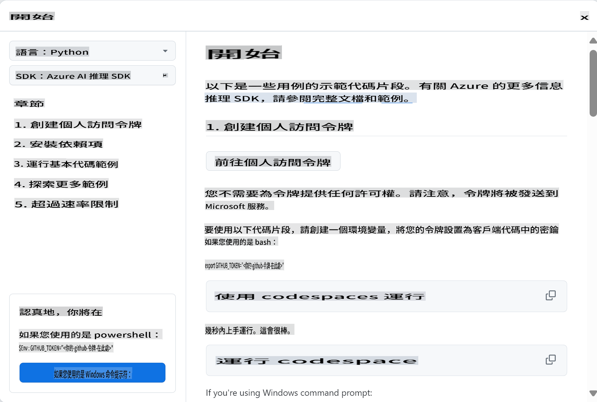
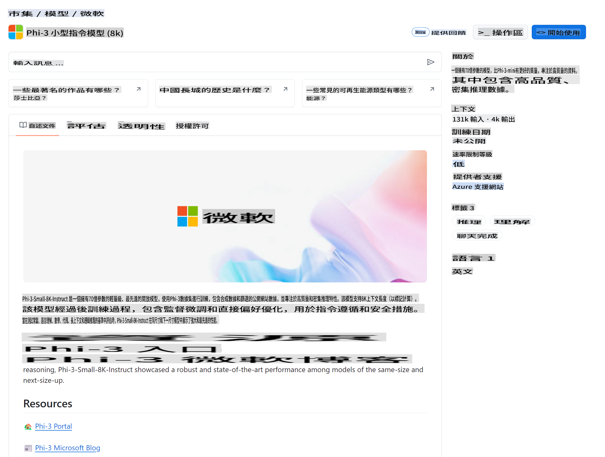

## GitHub 模型 - 限定公開測試

歡迎來到 [GitHub Models](https://github.com/marketplace/models)！我們已經準備好一切，讓你可以探索在 Azure AI 上託管的 AI 模型。



如需有關 GitHub Models 上可用模型的更多資訊，請查看 [GitHub Model Marketplace](https://github.com/marketplace/models)

## 可用模型

每個模型都有專門的 playground 和範例代碼



### GitHub 模型目錄中的 Phi-3 模型

[Phi-3-Medium-128k-Instruct](https://github.com/marketplace/models/azureml/Phi-3-medium-128k-instruct)

[Phi-3-medium-4k-instruct](https://github.com/marketplace/models/azureml/Phi-3-medium-4k-instruct)

[Phi-3-mini-128k-instruct](https://github.com/marketplace/models/azureml/Phi-3-mini-128k-instruct)

[Phi-3-mini-4k-instruct](https://github.com/marketplace/models/azureml/Phi-3-mini-4k-instruct)

[Phi-3-small-128k-instruct](https://github.com/marketplace/models/azureml/Phi-3-small-128k-instruct)

[Phi-3-small-8k-instruct](https://github.com/marketplace/models/azureml/Phi-3-small-8k-instruct)

## 入門指南

我們已經為你準備了一些基本的範例，你可以在 samples 目錄中找到它們。如果你想直接跳到你喜愛的語言，可以在以下語言中找到範例：

- Python
- JavaScript
- cURL

還有一個專門的 Codespaces 環境來運行範例和模型。



## 範例代碼

下面是一些用例的範例代碼片段。如需有關 Azure AI Inference SDK 的更多資訊，請參閱完整文檔和範例。

## 設置

1. 創建個人訪問令牌
你不需要給這個令牌任何權限。請注意，令牌將被發送到 Microsoft 服務。

要使用下面的代碼片段，請創建一個環境變量來設置你的令牌作為客戶端代碼的密鑰。

如果你使用的是 bash:
```
export GITHUB_TOKEN="<your-github-token-goes-here>"
```
如果你使用的是 powershell:

```
$Env:GITHUB_TOKEN="<your-github-token-goes-here>"
```

如果你使用的是 Windows 命令提示符:

```
set GITHUB_TOKEN=<your-github-token-goes-here>
```

## Python 範例

### 安裝依賴項
使用 pip 安裝 Azure AI Inference SDK (要求：Python >=3.8):

```
pip install azure-ai-inference
```
### 運行基本代碼範例

這個範例展示了如何基本調用 chat completion API。它利用了 GitHub AI 模型推理端點和你的 GitHub 令牌。調用是同步的。

```
import os
from azure.ai.inference import ChatCompletionsClient
from azure.ai.inference.models import SystemMessage, UserMessage
from azure.core.credentials import AzureKeyCredential

endpoint = "https://models.inference.ai.azure.com"
# Replace Model_Name 
model_name = "Phi-3-small-8k-instruct"
token = os.environ["GITHUB_TOKEN"]

client = ChatCompletionsClient(
    endpoint=endpoint,
    credential=AzureKeyCredential(token),
)

response = client.complete(
    messages=[
        SystemMessage(content="You are a helpful assistant."),
        UserMessage(content="What is the capital of France?"),
    ],
    model=model_name,
    temperature=1.,
    max_tokens=1000,
    top_p=1.
)

print(response.choices[0].message.content)
```

### 運行多輪對話

這個範例展示了如何使用 chat completion API 進行多輪對話。在為聊天應用程序使用模型時，你需要管理對話的歷史記錄並將最新消息發送到模型。

```
import os
from azure.ai.inference import ChatCompletionsClient
from azure.ai.inference.models import AssistantMessage, SystemMessage, UserMessage
from azure.core.credentials import AzureKeyCredential

token = os.environ["GITHUB_TOKEN"]
endpoint = "https://models.inference.ai.azure.com"
# Replace Model_Name
model_name = "Phi-3-small-8k-instruct"

client = ChatCompletionsClient(
    endpoint=endpoint,
    credential=AzureKeyCredential(token),
)

messages = [
    SystemMessage(content="You are a helpful assistant."),
    UserMessage(content="What is the capital of France?"),
    AssistantMessage(content="The capital of France is Paris."),
    UserMessage(content="What about Spain?"),
]

response = client.complete(messages=messages, model=model_name)

print(response.choices[0].message.content)
```

### 流式輸出

為了提供更好的用戶體驗，你會希望流式傳輸模型的響應，以便第一個 token 盡早顯示，並避免等待長時間的響應。

```
import os
from azure.ai.inference import ChatCompletionsClient
from azure.ai.inference.models import SystemMessage, UserMessage
from azure.core.credentials import AzureKeyCredential

token = os.environ["GITHUB_TOKEN"]
endpoint = "https://models.inference.ai.azure.com"
# Replace Model_Name
model_name = "Phi-3-small-8k-instruct"

client = ChatCompletionsClient(
    endpoint=endpoint,
    credential=AzureKeyCredential(token),
)

response = client.complete(
    stream=True,
    messages=[
        SystemMessage(content="You are a helpful assistant."),
        UserMessage(content="Give me 5 good reasons why I should exercise every day."),
    ],
    model=model_name,
)

for update in response:
    if update.choices:
        print(update.choices[0].delta.content or "", end="")

client.close()
```
## JavaScript

### 安裝依賴項

安裝 Node.js。

將以下文本行複製並保存為文件 package.json 到你的文件夾中。

```
{
  "type": "module",
  "dependencies": {
    "@azure-rest/ai-inference": "latest",
    "@azure/core-auth": "latest",
    "@azure/core-sse": "latest"
  }
}
```

注意: @azure/core-sse 僅在你流式傳輸 chat completions 響應時需要。

在這個文件夾中打開一個終端窗口並運行 npm install。

對於下面的每個代碼片段，將內容複製到文件 sample.js 中並使用 node sample.js 運行。

### 運行基本代碼範例

這個範例展示了如何基本調用 chat completion API。它利用了 GitHub AI 模型推理端點和你的 GitHub 令牌。調用是同步的。

```
import ModelClient from "@azure-rest/ai-inference";
import { AzureKeyCredential } from "@azure/core-auth";

const token = process.env["GITHUB_TOKEN"];
const endpoint = "https://models.inference.ai.azure.com";
// Update your modelname
const modelName = "Phi-3-small-8k-instruct";

export async function main() {

  const client = new ModelClient(endpoint, new AzureKeyCredential(token));

  const response = await client.path("/chat/completions").post({
    body: {
      messages: [
        { role:"system", content: "You are a helpful assistant." },
        { role:"user", content: "What is the capital of France?" }
      ],
      model: modelName,
      temperature: 1.,
      max_tokens: 1000,
      top_p: 1.
    }
  });

  if (response.status !== "200") {
    throw response.body.error;
  }
  console.log(response.body.choices[0].message.content);
}

main().catch((err) => {
  console.error("The sample encountered an error:", err);
});
```

### 運行多輪對話

這個範例展示了如何使用 chat completion API 進行多輪對話。在為聊天應用程序使用模型時，你需要管理對話的歷史記錄並將最新消息發送到模型。

```
import ModelClient from "@azure-rest/ai-inference";
import { AzureKeyCredential } from "@azure/core-auth";

const token = process.env["GITHUB_TOKEN"];
const endpoint = "https://models.inference.ai.azure.com";
// Update your modelname
const modelName = "Phi-3-small-8k-instruct";

export async function main() {

  const client = new ModelClient(endpoint, new AzureKeyCredential(token));

  const response = await client.path("/chat/completions").post({
    body: {
      messages: [
        { role: "system", content: "You are a helpful assistant." },
        { role: "user", content: "What is the capital of France?" },
        { role: "assistant", content: "The capital of France is Paris." },
        { role: "user", content: "What about Spain?" },
      ],
      model: modelName,
    }
  });

  if (response.status !== "200") {
    throw response.body.error;
  }

  for (const choice of response.body.choices) {
    console.log(choice.message.content);
  }
}

main().catch((err) => {
  console.error("The sample encountered an error:", err);
});
```

### 流式輸出
為了提供更好的用戶體驗，你會希望流式傳輸模型的響應，以便第一個 token 盡早顯示，並避免等待長時間的響應。

```
import ModelClient from "@azure-rest/ai-inference";
import { AzureKeyCredential } from "@azure/core-auth";
import { createSseStream } from "@azure/core-sse";

const token = process.env["GITHUB_TOKEN"];
const endpoint = "https://models.inference.ai.azure.com";
// Update your modelname
const modelName = "Phi-3-small-8k-instruct";

export async function main() {

  const client = new ModelClient(endpoint, new AzureKeyCredential(token));

  const response = await client.path("/chat/completions").post({
    body: {
      messages: [
        { role: "system", content: "You are a helpful assistant." },
        { role: "user", content: "Give me 5 good reasons why I should exercise every day." },
      ],
      model: modelName,
      stream: true
    }
  }).asNodeStream();

  const stream = response.body;
  if (!stream) {
    throw new Error("The response stream is undefined");
  }

  if (response.status !== "200") {
    stream.destroy();
    throw new Error(`Failed to get chat completions, http operation failed with ${response.status} code`);
  }

  const sseStream = createSseStream(stream);

  for await (const event of sseStream) {
    if (event.data === "[DONE]") {
      return;
    }
    for (const choice of (JSON.parse(event.data)).choices) {
        process.stdout.write(choice.delta?.content ?? ``);
    }
  }
}

main().catch((err) => {
  console.error("The sample encountered an error:", err);
});
```

## REST

### 運行基本代碼範例

將以下內容粘貼到 shell 中:

```
curl -X POST "https://models.inference.ai.azure.com/chat/completions" \
    -H "Content-Type: application/json" \
    -H "Authorization: Bearer $GITHUB_TOKEN" \
    -d '{
        "messages": [
            {
                "role": "system",
                "content": "You are a helpful assistant."
            },
            {
                "role": "user",
                "content": "What is the capital of France?"
            }
        ],
        "model": "Phi-3-small-8k-instruct"
    }'
```
### 運行多輪對話

調用 chat completion API 並傳遞聊天歷史記錄:

```
curl -X POST "https://models.inference.ai.azure.com/chat/completions" \
    -H "Content-Type: application/json" \
    -H "Authorization: Bearer $GITHUB_TOKEN" \
    -d '{
        "messages": [
            {
                "role": "system",
                "content": "You are a helpful assistant."
            },
            {
                "role": "user",
                "content": "What is the capital of France?"
            },
            {
                "role": "assistant",
                "content": "The capital of France is Paris."
            },
            {
                "role": "user",
                "content": "What about Spain?"
            }
        ],
        "model": "Phi-3-small-8k-instruct"
    }'
```
### 流式輸出

這是調用端點並流式傳輸響應的範例。

```
curl -X POST "https://models.inference.ai.azure.com/chat/completions" \
    -H "Content-Type: application/json" \
    -H "Authorization: Bearer $GITHUB_TOKEN" \
    -d '{
        "messages": [
            {
                "role": "system",
                "content": "You are a helpful assistant."
            },
            {
                "role": "user",
                "content": "Give me 5 good reasons why I should exercise every day."
            }
        ],
        "stream": true,
        "model": "Phi-3-small-8k-instruct"
    }'
```

## GitHub 模型的免費使用和速率限制



[playground 和免費 API 使用的速率限制](https://docs.github.com/en/github-models/prototyping-with-ai-models#rate-limits) 旨在幫助你實驗模型並原型化你的 AI 應用程序。超出這些限制的使用，以及將你的應用程序擴展到規模，你必須從 Azure 帳戶中配置資源，並從那裡進行身份驗證，而不是使用你的 GitHub 個人訪問令牌。你不需要更改代碼中的其他任何內容。使用此鏈接來了解如何超越 Azure AI 中的免費層限制。

### 披露

請記住，在與模型交互時，你是在實驗 AI，因此內容錯誤是可能的。

該功能受各種限制（包括每分鐘請求數、每天請求數、每次請求的 token 數和並發請求數）限制，並不適用於生產環境使用。

GitHub 模型使用 Azure AI 內容安全性。這些過濾器不能在 GitHub 模型體驗中關閉。如果你決定通過付費服務使用模型，請配置你的內容過濾器以滿足你的要求。

此服務受 GitHub 的預發佈條款約束。

**免責聲明**：
本文件是使用機器翻譯服務翻譯的。我們力求準確，但請注意，自動翻譯可能包含錯誤或不準確之處。應以原語言的文件為權威來源。對於關鍵信息，建議使用專業的人類翻譯。我們不對因使用此翻譯而引起的任何誤解或誤讀負責。