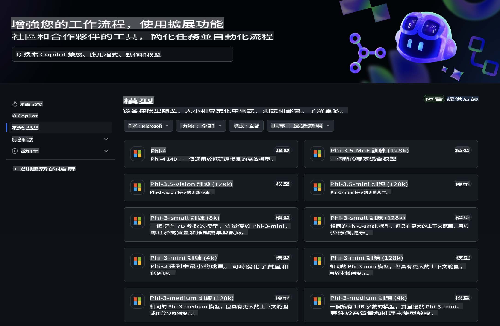
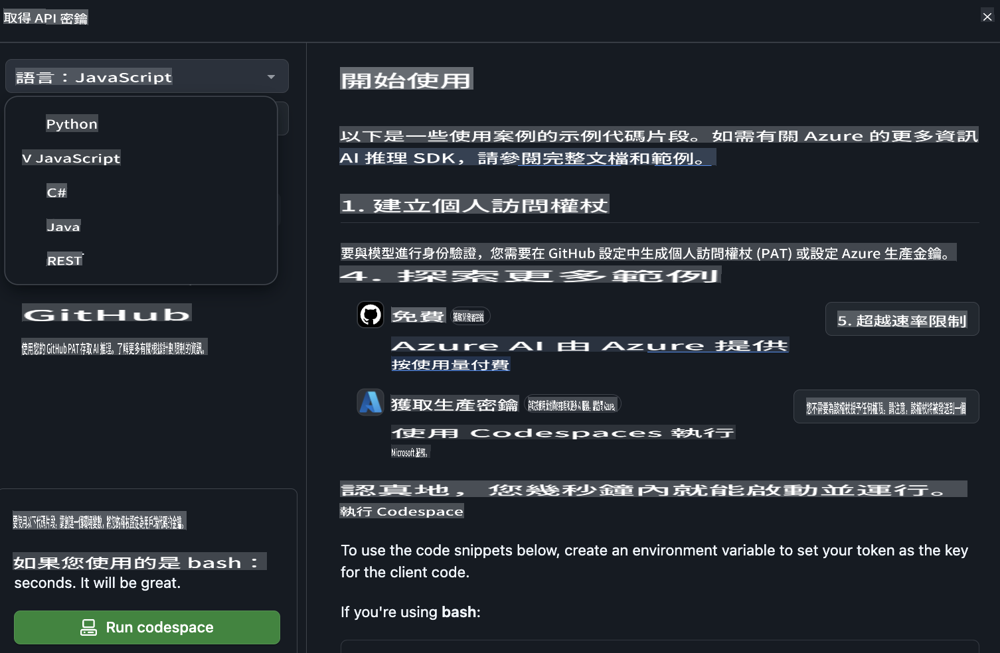
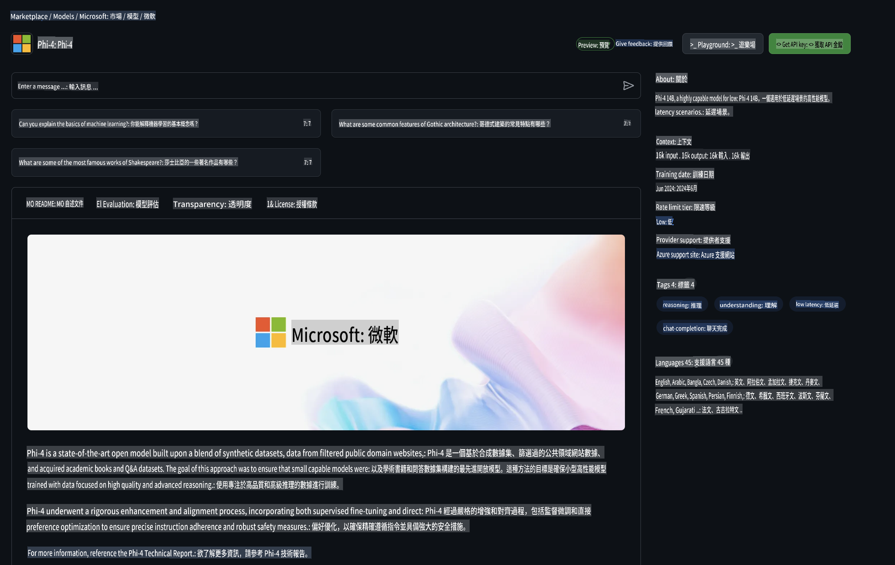

## GitHub 模型 - 公開測試版

歡迎來到 [GitHub 模型](https://github.com/marketplace/models)！我們已經準備好讓您探索 Azure AI 上託管的 AI 模型。



如需更多有關 GitHub 模型的資訊，請查看 [GitHub 模型市場](https://github.com/marketplace/models)。

## 可用模型

每個模型都有專屬的測試平台和範例程式碼。


### GitHub 模型目錄中的 Phi-3 模型

[Phi-3-Medium-128k-Instruct](https://github.com/marketplace/models/azureml/Phi-3-medium-128k-instruct)

[Phi-3-medium-4k-instruct](https://github.com/marketplace/models/azureml/Phi-3-medium-4k-instruct)

[Phi-3-mini-128k-instruct](https://github.com/marketplace/models/azureml/Phi-3-mini-128k-instruct)

[Phi-3-mini-4k-instruct](https://github.com/marketplace/models/azureml/Phi-3-mini-4k-instruct)

[Phi-3-small-128k-instruct](https://github.com/marketplace/models/azureml/Phi-3-small-128k-instruct)

[Phi-3-small-8k-instruct](https://github.com/marketplace/models/azureml/Phi-3-small-8k-instruct)

## 快速上手

我們已經準備了一些基本範例，您可以直接運行。您可以在 samples 目錄中找到它們。如果您想直接使用自己喜歡的程式語言，以下是範例的可用語言：

- Python
- JavaScript
- cURL

此外，還有專屬的 Codespaces 環境可供運行範例和模型。



## 範例程式碼

以下是一些使用案例的範例程式碼片段。如需更多有關 Azure AI Inference SDK 的資訊，請參閱完整文件和範例。

## 設置

1. 建立個人存取權杖  
您不需要為權杖授予任何權限。請注意，該權杖將被傳送至 Microsoft 服務。

要使用以下程式碼片段，請建立一個環境變數，將您的權杖設置為客戶端程式碼的金鑰。

如果您使用的是 bash：
```
export GITHUB_TOKEN="<your-github-token-goes-here>"
```  
如果您使用的是 PowerShell：

```
$Env:GITHUB_TOKEN="<your-github-token-goes-here>"
```  

如果您使用的是 Windows 命令提示字元：

```
set GITHUB_TOKEN=<your-github-token-goes-here>
```  

## Python 範例

### 安裝相依項目
使用 pip 安裝 Azure AI Inference SDK（需求：Python >=3.8）：

```
pip install azure-ai-inference
```  
### 運行基本範例程式碼

此範例展示了如何基本調用聊天補全 API。它利用 GitHub AI 模型推理端點和您的 GitHub 權杖。該調用是同步的。

```
import os
from azure.ai.inference import ChatCompletionsClient
from azure.ai.inference.models import SystemMessage, UserMessage
from azure.core.credentials import AzureKeyCredential

endpoint = "https://models.inference.ai.azure.com"
# Replace Model_Name 
model_name = "Phi-3-small-8k-instruct"
token = os.environ["GITHUB_TOKEN"]

client = ChatCompletionsClient(
    endpoint=endpoint,
    credential=AzureKeyCredential(token),
)

response = client.complete(
    messages=[
        SystemMessage(content="You are a helpful assistant."),
        UserMessage(content="What is the capital of France?"),
    ],
    model=model_name,
    temperature=1.,
    max_tokens=1000,
    top_p=1.
)

print(response.choices[0].message.content)
```  

### 運行多輪對話

此範例展示了如何使用聊天補全 API 進行多輪對話。在用於聊天應用時，您需要管理對話歷史並將最新消息發送至模型。

```
import os
from azure.ai.inference import ChatCompletionsClient
from azure.ai.inference.models import AssistantMessage, SystemMessage, UserMessage
from azure.core.credentials import AzureKeyCredential

token = os.environ["GITHUB_TOKEN"]
endpoint = "https://models.inference.ai.azure.com"
# Replace Model_Name
model_name = "Phi-3-small-8k-instruct"

client = ChatCompletionsClient(
    endpoint=endpoint,
    credential=AzureKeyCredential(token),
)

messages = [
    SystemMessage(content="You are a helpful assistant."),
    UserMessage(content="What is the capital of France?"),
    AssistantMessage(content="The capital of France is Paris."),
    UserMessage(content="What about Spain?"),
]

response = client.complete(messages=messages, model=model_name)

print(response.choices[0].message.content)
```  

### 串流輸出

為了更好的使用者體驗，您可能希望串流模型的響應，這樣第一個字元能夠更早顯示，避免等待較長的回應。

```
import os
from azure.ai.inference import ChatCompletionsClient
from azure.ai.inference.models import SystemMessage, UserMessage
from azure.core.credentials import AzureKeyCredential

token = os.environ["GITHUB_TOKEN"]
endpoint = "https://models.inference.ai.azure.com"
# Replace Model_Name
model_name = "Phi-3-small-8k-instruct"

client = ChatCompletionsClient(
    endpoint=endpoint,
    credential=AzureKeyCredential(token),
)

response = client.complete(
    stream=True,
    messages=[
        SystemMessage(content="You are a helpful assistant."),
        UserMessage(content="Give me 5 good reasons why I should exercise every day."),
    ],
    model=model_name,
)

for update in response:
    if update.choices:
        print(update.choices[0].delta.content or "", end="")

client.close()
```  

## JavaScript

### 安裝相依項目

安裝 Node.js。

將以下文字複製並儲存為 package.json 檔案，放置在您的資料夾中。

```
{
  "type": "module",
  "dependencies": {
    "@azure-rest/ai-inference": "latest",
    "@azure/core-auth": "latest",
    "@azure/core-sse": "latest"
  }
}
```  

注意：@azure/core-sse 僅在您串流聊天補全回應時需要。

在此資料夾中打開終端並執行 npm install。

對於以下每個程式碼片段，將內容複製到檔案 sample.js 中，並使用 node sample.js 運行。

### 運行基本範例程式碼

此範例展示了如何基本調用聊天補全 API。它利用 GitHub AI 模型推理端點和您的 GitHub 權杖。該調用是同步的。

```
import ModelClient from "@azure-rest/ai-inference";
import { AzureKeyCredential } from "@azure/core-auth";

const token = process.env["GITHUB_TOKEN"];
const endpoint = "https://models.inference.ai.azure.com";
// Update your modelname
const modelName = "Phi-3-small-8k-instruct";

export async function main() {

  const client = new ModelClient(endpoint, new AzureKeyCredential(token));

  const response = await client.path("/chat/completions").post({
    body: {
      messages: [
        { role:"system", content: "You are a helpful assistant." },
        { role:"user", content: "What is the capital of France?" }
      ],
      model: modelName,
      temperature: 1.,
      max_tokens: 1000,
      top_p: 1.
    }
  });

  if (response.status !== "200") {
    throw response.body.error;
  }
  console.log(response.body.choices[0].message.content);
}

main().catch((err) => {
  console.error("The sample encountered an error:", err);
});
```  

### 運行多輪對話

此範例展示了如何使用聊天補全 API 進行多輪對話。在用於聊天應用時，您需要管理對話歷史並將最新消息發送至模型。

```
import ModelClient from "@azure-rest/ai-inference";
import { AzureKeyCredential } from "@azure/core-auth";

const token = process.env["GITHUB_TOKEN"];
const endpoint = "https://models.inference.ai.azure.com";
// Update your modelname
const modelName = "Phi-3-small-8k-instruct";

export async function main() {

  const client = new ModelClient(endpoint, new AzureKeyCredential(token));

  const response = await client.path("/chat/completions").post({
    body: {
      messages: [
        { role: "system", content: "You are a helpful assistant." },
        { role: "user", content: "What is the capital of France?" },
        { role: "assistant", content: "The capital of France is Paris." },
        { role: "user", content: "What about Spain?" },
      ],
      model: modelName,
    }
  });

  if (response.status !== "200") {
    throw response.body.error;
  }

  for (const choice of response.body.choices) {
    console.log(choice.message.content);
  }
}

main().catch((err) => {
  console.error("The sample encountered an error:", err);
});
```  

### 串流輸出
為了更好的使用者體驗，您可能希望串流模型的響應，這樣第一個字元能夠更早顯示，避免等待較長的回應。

```
import ModelClient from "@azure-rest/ai-inference";
import { AzureKeyCredential } from "@azure/core-auth";
import { createSseStream } from "@azure/core-sse";

const token = process.env["GITHUB_TOKEN"];
const endpoint = "https://models.inference.ai.azure.com";
// Update your modelname
const modelName = "Phi-3-small-8k-instruct";

export async function main() {

  const client = new ModelClient(endpoint, new AzureKeyCredential(token));

  const response = await client.path("/chat/completions").post({
    body: {
      messages: [
        { role: "system", content: "You are a helpful assistant." },
        { role: "user", content: "Give me 5 good reasons why I should exercise every day." },
      ],
      model: modelName,
      stream: true
    }
  }).asNodeStream();

  const stream = response.body;
  if (!stream) {
    throw new Error("The response stream is undefined");
  }

  if (response.status !== "200") {
    stream.destroy();
    throw new Error(`Failed to get chat completions, http operation failed with ${response.status} code`);
  }

  const sseStream = createSseStream(stream);

  for await (const event of sseStream) {
    if (event.data === "[DONE]") {
      return;
    }
    for (const choice of (JSON.parse(event.data)).choices) {
        process.stdout.write(choice.delta?.content ?? ``);
    }
  }
}

main().catch((err) => {
  console.error("The sample encountered an error:", err);
});
```  

## REST

### 運行基本範例程式碼

將以下內容貼到 shell 中：

```
curl -X POST "https://models.inference.ai.azure.com/chat/completions" \
    -H "Content-Type: application/json" \
    -H "Authorization: Bearer $GITHUB_TOKEN" \
    -d '{
        "messages": [
            {
                "role": "system",
                "content": "You are a helpful assistant."
            },
            {
                "role": "user",
                "content": "What is the capital of France?"
            }
        ],
        "model": "Phi-3-small-8k-instruct"
    }'
```  
### 運行多輪對話

調用聊天補全 API 並傳遞聊天歷史：

```
curl -X POST "https://models.inference.ai.azure.com/chat/completions" \
    -H "Content-Type: application/json" \
    -H "Authorization: Bearer $GITHUB_TOKEN" \
    -d '{
        "messages": [
            {
                "role": "system",
                "content": "You are a helpful assistant."
            },
            {
                "role": "user",
                "content": "What is the capital of France?"
            },
            {
                "role": "assistant",
                "content": "The capital of France is Paris."
            },
            {
                "role": "user",
                "content": "What about Spain?"
            }
        ],
        "model": "Phi-3-small-8k-instruct"
    }'
```  
### 串流輸出

這是一個調用端點並串流回應的範例。

```
curl -X POST "https://models.inference.ai.azure.com/chat/completions" \
    -H "Content-Type: application/json" \
    -H "Authorization: Bearer $GITHUB_TOKEN" \
    -d '{
        "messages": [
            {
                "role": "system",
                "content": "You are a helpful assistant."
            },
            {
                "role": "user",
                "content": "Give me 5 good reasons why I should exercise every day."
            }
        ],
        "stream": true,
        "model": "Phi-3-small-8k-instruct"
    }'
```  

## GitHub 模型的免費使用和速率限制



[遊樂場和免費 API 使用的速率限制](https://docs.github.com/en/github-models/prototyping-with-ai-models#rate-limits) 是為了幫助您實驗模型並原型化您的 AI 應用程式。如果需要超出這些限制的使用，並將您的應用程式擴展，您必須從 Azure 帳戶中配置資源，並從該處進行身份驗證，而不是使用您的 GitHub 個人存取權杖。您不需要更改程式碼中的其他任何內容。使用此連結了解如何突破 Azure AI 的免費層限制。

### 聲明

請記住，在與模型互動時，您是在實驗 AI，因此可能會出現內容錯誤。

此功能受多種限制（包括每分鐘請求數、每日請求數、每次請求的字元數和並發請求數）的約束，並不適合生產使用場景。

GitHub 模型使用 Azure AI Content Safety。這些過濾器無法在 GitHub 模型體驗中關閉。如果您決定通過付費服務使用模型，請配置您的內容過濾器以滿足您的需求。

此服務適用於 GitHub 的預發布條款。

**免責聲明**：  
本文件是使用機器翻譯AI服務翻譯的。我們致力於提供準確的翻譯，但請注意，自動翻譯可能包含錯誤或不準確之處。原始語言的文件應被視為權威來源。對於關鍵信息，建議尋求專業人工翻譯。我們對因使用此翻譯而產生的任何誤解或誤讀概不負責。