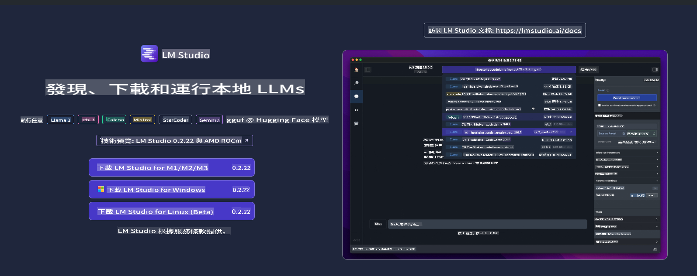
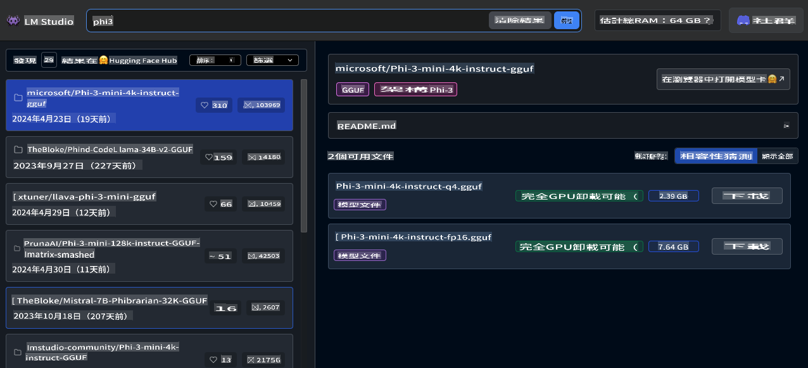
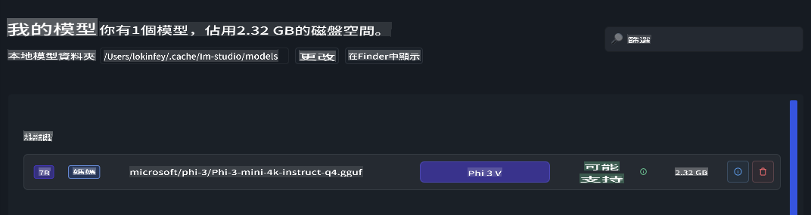
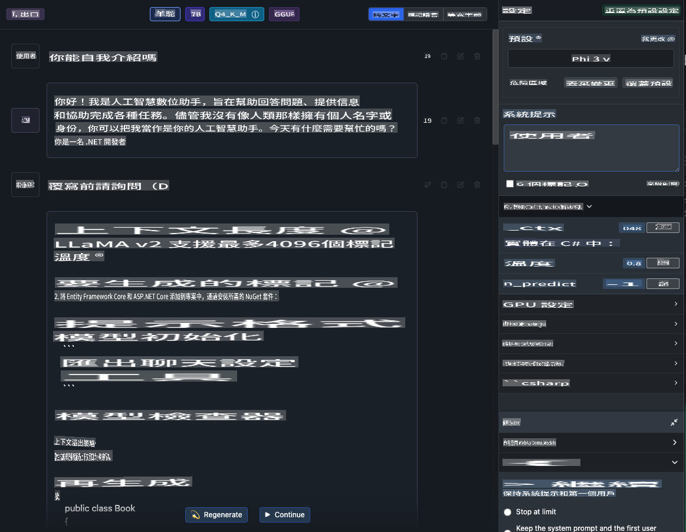
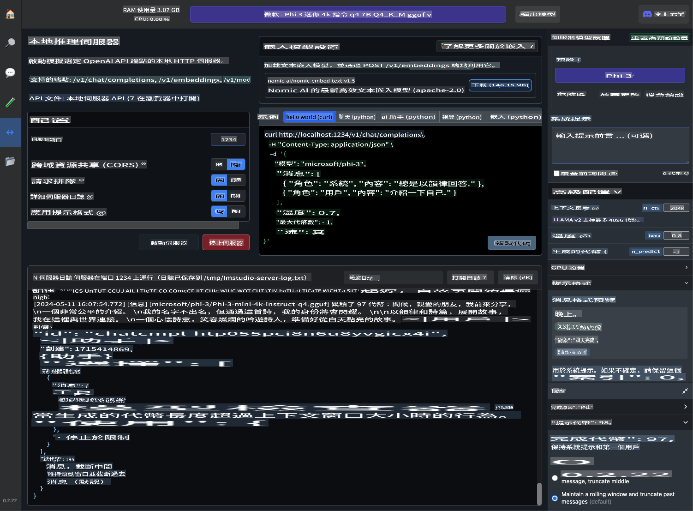
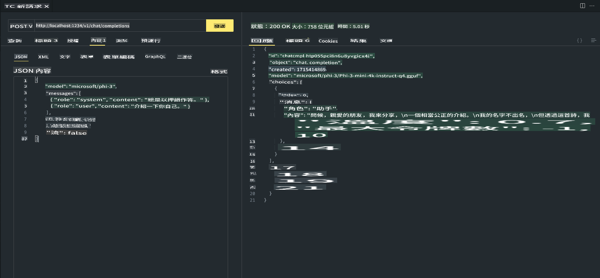

# **在 LM Studio 中使用 Phi-3**

[LM Studio](https://lmstudio.ai) 是一個用於在本地桌面應用程式中調用 SLM 和 LLM 的應用程式。它允許用戶輕鬆使用不同的模型，並支持使用 NVIDIA/AMD GPU/Apple Silicon 進行加速計算。通過 LM Studio，用戶可以下載、安裝和運行基於 Hugging Face 的各種開源 LLM 和 SLM，在本地測試模型性能，無需編寫代碼。

## **1. 安裝**

你可以通過 LM Studio 的網站 [https://lmstudio.ai/](https://lmstudio.ai/) 選擇在 Windows、Linux、macOS 上進行安裝。

## **2. 在 LM Studio 中下載 Phi-3**

LM Studio 調用的是量化的 gguf 格式的開源模型。你可以直接從 LM Studio 搜索界面提供的平台下載，或者自行下載並指定在相關目錄中調用。

***我們在 LM Studio 搜索中搜索 Phi3 並下載 Phi-3 gguf 模型***

***通過 LM Studio 管理已下載的模型***

## **3. 在 LM Studio 中與 Phi-3 聊天**

我們在 LM Studio Chat 中選擇 Phi-3，並設置聊天模板（Preset - Phi3），開始與 Phi-3 進行本地聊天。

***注意***：

a. 你可以通過 LM Studio 控制面板中的 Advance Configuration 設置參數

b. 由於 Phi-3 有特定的聊天模板要求，必須在 Preset 中選擇 Phi-3

c. 你還可以設置不同的參數，例如 GPU 使用情況等

## **4. 從 LM Studio 調用 Phi-3 API**

LM Studio 支持快速部署本地服務，你可以在無需編寫代碼的情況下構建模型服務。

這是在 Postman 中的結果

**免责声明**：
本文档使用基于机器的AI翻译服务进行翻译。虽然我们力求准确，但请注意，自动翻译可能包含错误或不准确之处。应将原始语言的文档视为权威来源。对于关键信息，建议进行专业的人类翻译。我们对使用此翻译所产生的任何误解或误读不承担责任。