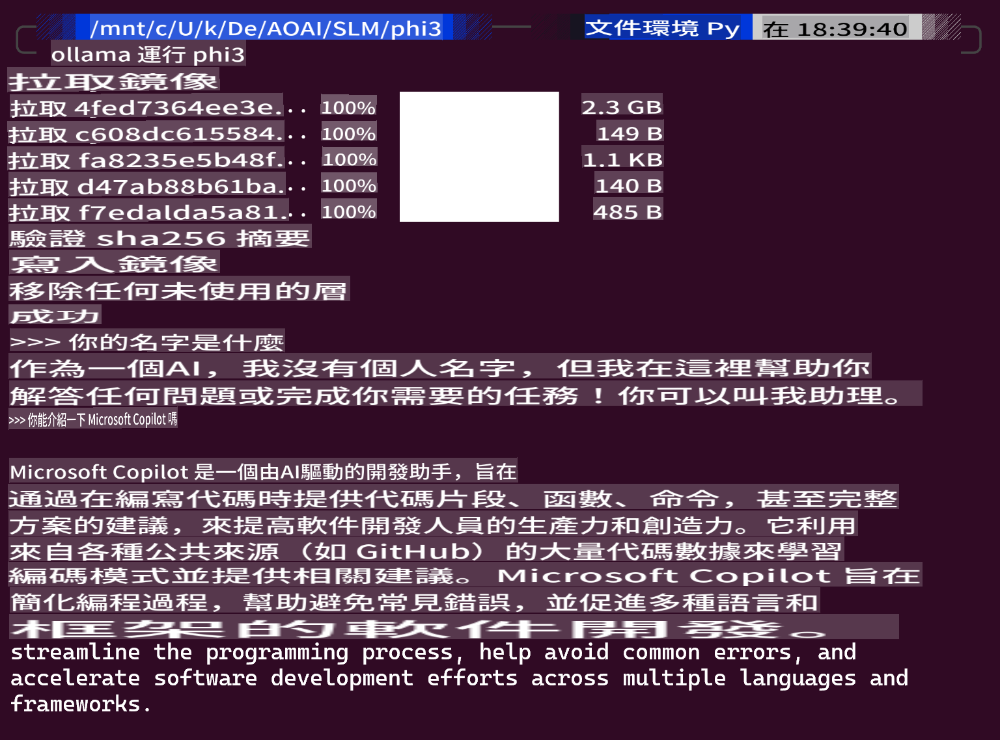
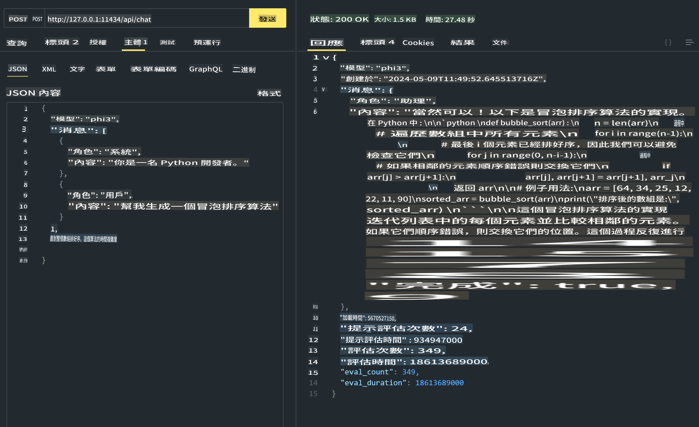
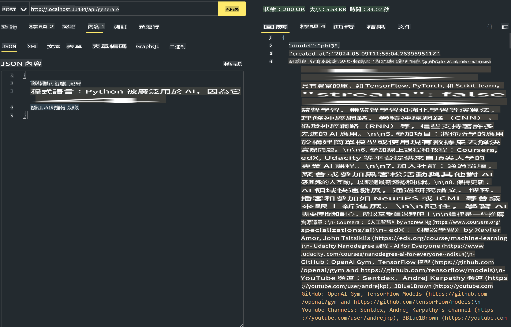

# **在 Ollama 中使用 Phi-3**

[Ollama](https://ollama.com) 讓更多人可以透過簡單的腳本直接部署開源的 LLM 或 SLM，還可以建立 API 來支援本地 Copilot 的應用場景。

## **1. 安裝**

Ollama 支援在 Windows、macOS 和 Linux 上運行。你可以透過這個連結 ([https://ollama.com/download](https://ollama.com/download)) 來安裝 Ollama。安裝成功後，你可以直接使用 Ollama 腳本通過終端窗口調用 Phi-3。你可以查看 [Ollama 中所有可用的庫](https://ollama.com/library)。如果你在 Codespace 中打開這個存儲庫，它已經安裝了 Ollama。

```bash

ollama run phi3

```

> [!NOTE]
> 第一次運行時，模型會先被下載。當然，你也可以直接指定已下載的 Phi-3 模型。我們以 WSL 為例來運行命令。模型成功下載後，你可以直接在終端上進行互動。



## **2. 從 Ollama 調用 phi-3 API**

如果你想調用由 Ollama 生成的 Phi-3 API，可以在終端中使用這個命令來啟動 Ollama 服務器。

```bash

ollama serve

```

> [!NOTE]
> 如果運行 MacOS 或 Linux，請注意你可能會遇到以下錯誤 **"Error: listen tcp 127.0.0.1:11434: bind: address already in use"**。你在運行命令時可能會遇到這個錯誤。你可以忽略這個錯誤，因為它通常表示服務器已經在運行，或者你可以停止並重新啟動 Ollama：

**macOS**

```bash

brew services restart ollama

```

**Linux**

```bash

sudo systemctl stop ollama

```

Ollama 支援兩個 API：generate 和 chat。你可以根據需求調用 Ollama 提供的模型 API，通過向本地服務發送請求（端口為 11434）。

**Chat**

```bash

curl http://127.0.0.1:11434/api/chat -d '{
  "model": "phi3",
  "messages": [
    {
      "role": "system",
      "content": "Your are a python developer."
    },
    {
      "role": "user",
      "content": "Help me generate a bubble algorithm"
    }
  ],
  "stream": false
  
}'


```

這是在 Postman 中的結果



```bash

curl http://127.0.0.1:11434/api/generate -d '{
  "model": "phi3",
  "prompt": "<|system|>Your are my AI assistant.<|end|><|user|>tell me how to learn AI<|end|><|assistant|>",
  "stream": false
}'


```

這是在 Postman 中的結果



## 其他資源

查看 Ollama 中可用模型的列表在 [他們的庫](https://ollama.com/library)。

使用這個命令從 Ollama 服務器拉取你的模型

```bash
ollama pull phi3
```

使用這個命令運行模型

```bash
ollama run phi3
```

***注意:*** 訪問這個連結 [https://github.com/ollama/ollama/blob/main/docs/api.md](https://github.com/ollama/ollama/blob/main/docs/api.md) 了解更多

## 從 Python 調用 Ollama

你可以使用 `requests` 或 `urllib3` 向上述本地服務端點發送請求。然而，在 Python 中使用 Ollama 的一個流行方式是通過 [openai](https://pypi.org/project/openai/) SDK，因為 Ollama 提供了與 OpenAI 相容的服務端點。

這是 phi3-mini 的一個例子：

```python
import openai

client = openai.OpenAI(
    base_url="http://localhost:11434/v1",
    api_key="nokeyneeded",
)

response = client.chat.completions.create(
    model="phi3",
    temperature=0.7,
    n=1,
    messages=[
        {"role": "system", "content": "You are a helpful assistant."},
        {"role": "user", "content": "Write a haiku about a hungry cat"},
    ],
)

print("Response:")
print(response.choices[0].message.content)
```

## 從 JavaScript 調用 Ollama 

```javascript
// 使用 Phi-3 總結文件的例子
script({
    model: "ollama:phi3",
    title: "Summarize with Phi-3",
    system: ["system"],
})

// 總結的例子
const file = def("FILE", env.files)
$`Summarize ${file} in a single paragraph.`
```

## 從 C# 調用 Ollama

建立一個新的 C# 控制台應用並添加以下 NuGet 套件：

```bash
dotnet add package Microsoft.SemanticKernel --version 1.13.0
```

然後在 `Program.cs` 文件中替換這段代碼

```csharp
using Microsoft.SemanticKernel;
using Microsoft.SemanticKernel.ChatCompletion;

// 使用本地 ollama 服務端點添加聊天完成服務
#pragma warning disable SKEXP0001, SKEXP0003, SKEXP0010, SKEXP0011, SKEXP0050, SKEXP0052
builder.AddOpenAIChatCompletion(
    modelId: "phi3.5",
    endpoint: new Uri("http://localhost:11434/"),
    apiKey: "non required");

// 向聊天服務發送一個簡單的提示
string prompt = "Write a joke about kittens";
var response = await kernel.InvokePromptAsync(prompt);
Console.WriteLine(response.GetValue<string>());
```

使用以下命令運行應用：

```bash
dotnet run
```

免責聲明：本翻譯由AI模型從原文翻譯而來，可能並不完美。請檢查輸出並進行任何必要的修改。