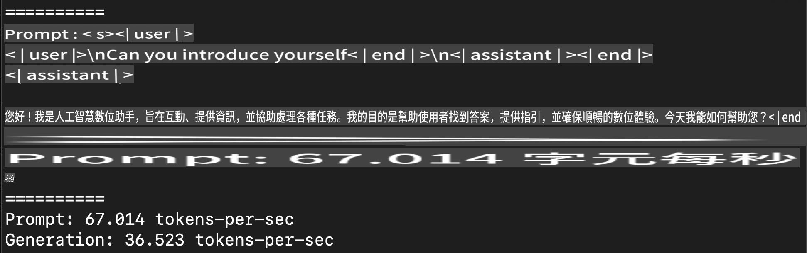
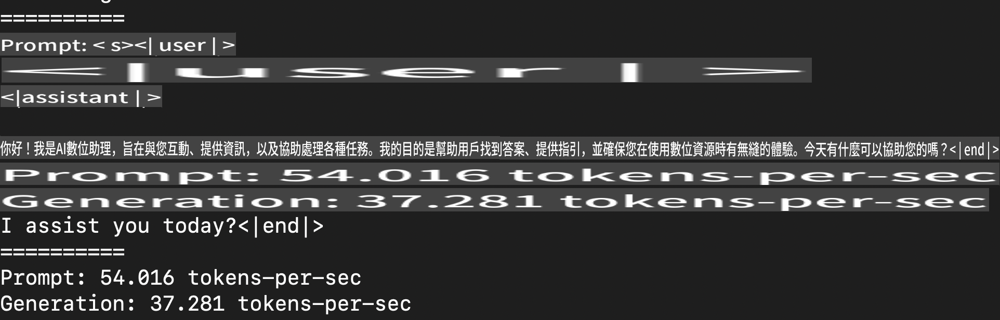
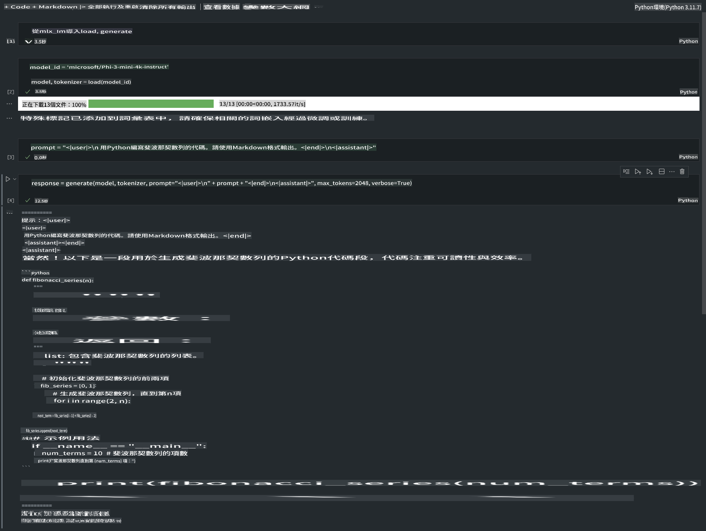

# **使用 Apple MLX 框架推理 Phi-3**

## **什麼是 MLX 框架**

MLX 是一個專為 Apple Silicon 上的機器學習研究設計的矩陣框架，由 Apple 機器學習研究團隊開發。

MLX 是由機器學習研究人員為機器學習研究人員設計的。這個框架旨在易於使用，同時仍然高效地訓練和部署模型。框架本身的設計概念也非常簡單。我們希望研究人員可以輕鬆擴展和改進 MLX，以便快速探索新的想法。

透過 MLX，LLM 可以在 Apple Silicon 設備上加速運行，並且可以非常方便地在本地執行模型。

## **使用 MLX 推理 Phi-3-mini**

### **1. 設置 MLX 環境**

1. Python 3.11.x  
2. 安裝 MLX 庫  

```bash

pip install mlx-lm

```

### **2. 在終端中使用 MLX 運行 Phi-3-mini**

```bash

python -m mlx_lm.generate --model microsoft/Phi-3-mini-4k-instruct --max-token 2048 --prompt  "<|user|>\nCan you introduce yourself<|end|>\n<|assistant|>"

```

結果（我的環境是 Apple M1 Max，64GB）如下：



### **3. 在終端中使用 MLX 量化 Phi-3-mini**

```bash

python -m mlx_lm.convert --hf-path microsoft/Phi-3-mini-4k-instruct

```

***注意：*** 模型可以通過 mlx_lm.convert 進行量化，預設量化為 INT4。本範例將 Phi-3-mini 量化為 INT4。

模型可以通過 mlx_lm.convert 進行量化，預設量化為 INT4。本範例將 Phi-3-mini 量化為 INT4。量化後的模型將存儲在預設目錄 ./mlx_model。

我們可以在終端中測試使用 MLX 量化的模型：

```bash

python -m mlx_lm.generate --model ./mlx_model/ --max-token 2048 --prompt  "<|user|>\nCan you introduce yourself<|end|>\n<|assistant|>"

```

結果如下：



### **4. 在 Jupyter Notebook 中使用 MLX 運行 Phi-3-mini**



***注意：*** 請閱讀此範例 [點擊此連結](../../../../../code/03.Inference/MLX/MLX_DEMO.ipynb)

## **資源**

1. 了解 Apple MLX 框架 [https://ml-explore.github.io](https://ml-explore.github.io/mlx/build/html/index.html)

2. Apple MLX GitHub 資源庫 [https://github.com/ml-explore](https://github.com/ml-explore)

**免責聲明**:  
本文檔是使用基於機器的人工智能翻譯服務進行翻譯的。我們雖然努力確保準確性，但請注意，自動翻譯可能包含錯誤或不準確之處。應以原始語言的文件作為權威來源。對於關鍵信息，建議尋求專業人工翻譯。我們對因使用本翻譯而引起的任何誤解或誤讀不承擔責任。