# 使用 Azure AI Foundry 微調 Phi-3

讓我們來探索如何利用 Azure AI Foundry 微調 Microsoft 的 Phi-3 Mini 語言模型。微調可以讓 Phi-3 Mini 適應特定任務，使其更強大且更具上下文感知能力。

## 注意事項

- **功能：** 哪些模型可以進行微調？基礎模型可以被微調成什麼樣子？
- **成本：** 微調的定價模式是什麼？
- **可定制性：** 我可以如何以及在多大程度上修改基礎模型？
- **便利性：** 微調過程是怎麼進行的？是否需要撰寫自定義程式碼？是否需要自備運算資源？
- **安全性：** 微調模型可能存在安全風險，是否有任何防護措施來防止意外傷害？

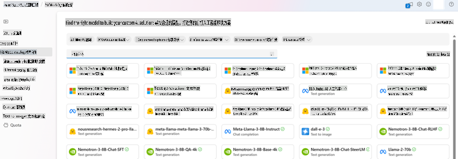

## 微調準備

### 先決條件

> [!NOTE]  
> 對於 Phi-3 系列模型，按需付費的微調服務僅適用於在 **East US 2** 區域建立的中心。

- 一個 Azure 訂閱。如果您還沒有 Azure 訂閱，請建立一個[付費 Azure 帳戶](https://azure.microsoft.com/pricing/purchase-options/pay-as-you-go)以開始使用。

- 一個 [AI Foundry 專案](https://ai.azure.com?WT.mc_id=aiml-138114-kinfeylo)。  
- 使用 Azure 基於角色的存取控制 (Azure RBAC) 來授予 Azure AI Foundry 操作的存取權限。要執行本文中的步驟，您的使用者帳戶必須在資源群組中被指派為 __Azure AI 開發人員角色__。

### 訂閱提供者註冊

確認您的訂閱已註冊到 `Microsoft.Network` 資源提供者。

1. 登入 [Azure 入口網站](https://portal.azure.com)。  
2. 從左側選單中選擇 **訂閱**。  
3. 選擇您想使用的訂閱。  
4. 從左側選單中選擇 **AI 專案設定** > **資源提供者**。  
5. 確認 **Microsoft.Network** 是否在資源提供者列表中。如果沒有，請新增它。

### 資料準備

準備您的訓練和驗證資料來微調模型。您的訓練和驗證資料集應包含模型執行方式的輸入與輸出範例。

確保所有訓練範例符合預期的推理格式。為了有效地微調模型，需確保資料集的平衡性與多樣性。

這包括維持資料平衡、涵蓋各種情境，並定期調整訓練資料以符合真實世界的期望，最終可提升模型回應的準確性與平衡性。

不同的模型類型需要不同格式的訓練資料。

### 聊天補全

您使用的訓練和驗證資料**必須**格式化為 JSON Lines (JSONL) 文件。對於 `Phi-3-mini-128k-instruct`，微調資料集必須採用聊天補全 API 所使用的對話格式。

### 範例檔案格式

```json
    {"messages": [{"role": "system", "content": "You are an Xbox customer support agent whose primary goal is to help users with issues they are experiencing with their Xbox devices. You are friendly and concise. You only provide factual answers to queries, and do not provide answers that are not related to Xbox."}, {"role": "user", "content": "Is Xbox better than PlayStation?"}, {"role": "assistant", "content": "I apologize, but I cannot provide personal opinions. My primary job is to assist you with any issues related to your Xbox device. Do you have any Xbox-related issues that need addressing?"}]}
    {"messages": [{"role": "system", "content": "You are an Xbox customer support agent whose primary goal is to help users with issues they are experiencing with their Xbox devices. You are friendly and concise. You only provide factual answers to queries, and do not provide answers that are not related to Xbox."}, {"role": "user", "content": "Can I play PC games on my Xbox?"}, {"role": "assistant", "content": "While Xbox consoles don't natively support PC games, they can play an array of Xbox games, many of which are also available on PC. Can I assist you with finding games compatible with your Xbox device?"}]}
    {"messages": [{"role": "system", "content": "You are an Xbox customer support agent whose primary goal is to help users with issues they are experiencing with their Xbox devices. You are friendly and concise. You only provide factual answers to queries, and do not provide answers that are not related to Xbox."}, {"role": "user", "content": "I'm having trouble connecting my Xbox to the Wi-Fi."}, {"role": "assistant", "content": "No worries, let's go through the network settings on your Xbox. Can you please tell me what happens when you try to connect it to the Wi-Fi?"}]}
```

支援的檔案類型為 JSON Lines。檔案將被上傳到預設的資料存儲區，並在您的專案中可用。

## 使用 Azure AI Foundry 微調 Phi-3

Azure AI Foundry 讓您能夠透過微調過程，將大型語言模型調整為適合您的專屬資料集。微調能夠提供顯著的價值，實現針對特定任務和應用的定制與最佳化。這能帶來更好的效能、成本效益、降低延遲以及量身定制的輸出。

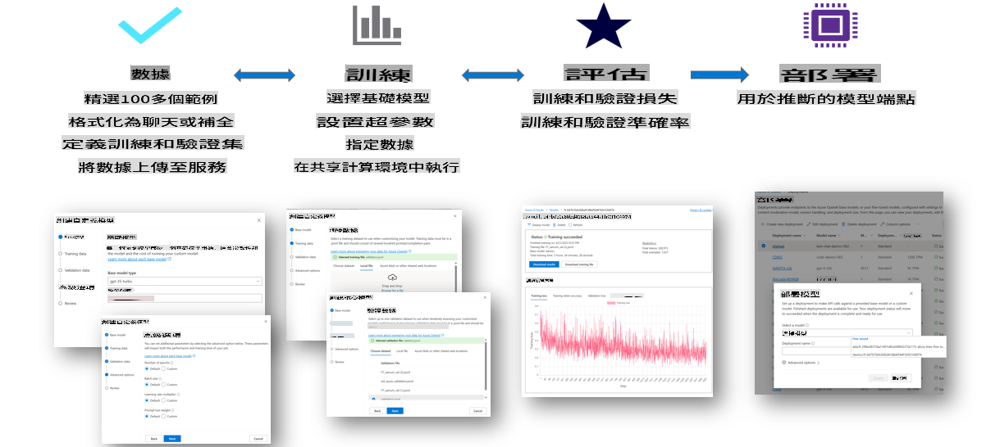

### 建立新專案

1. 登入 [Azure AI Foundry](https://ai.azure.com)。  

2. 選擇 **+ 新專案** 以在 Azure AI Foundry 中建立新專案。

    

3. 執行以下任務：

    - 專案 **中心名稱**。必須是唯一值。  
    - 選擇要使用的 **中心**（如有需要，建立新的中心）。  

    

4. 執行以下任務以建立新中心：

    - 輸入 **中心名稱**。必須是唯一值。  
    - 選擇您的 Azure **訂閱**。  
    - 選擇要使用的 **資源群組**（如有需要，建立新的資源群組）。  
    - 選擇您想使用的 **位置**。  
    - 選擇 **連接 Azure AI 服務**（如有需要，建立新的服務）。  
    - 選擇 **連接 Azure AI 搜索** 為 **略過連接**。  

    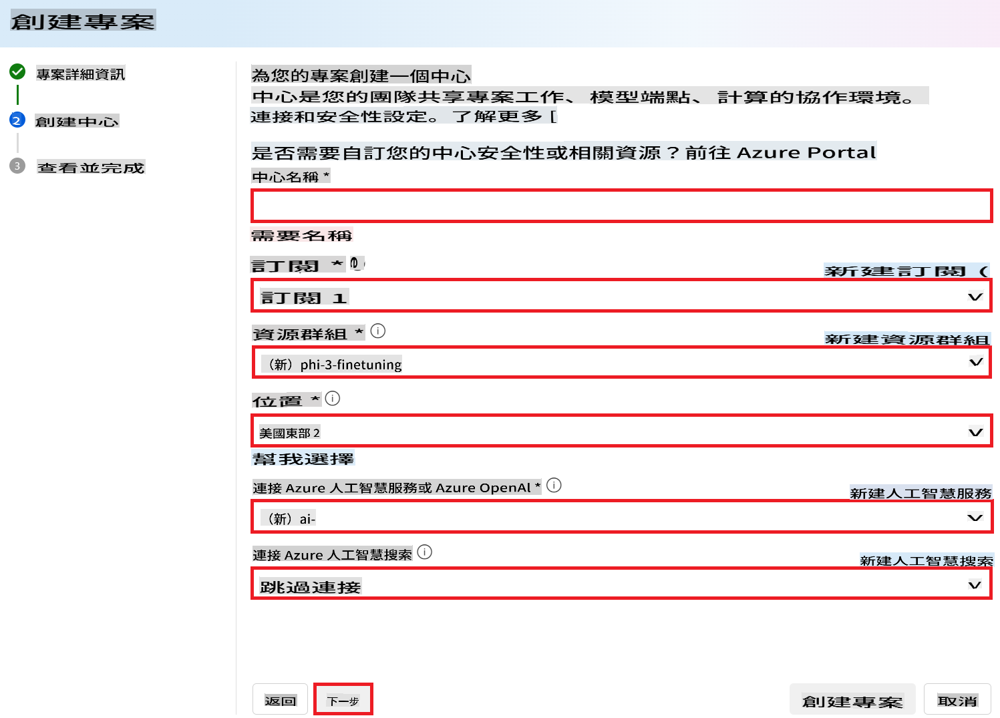

5. 選擇 **下一步**。  
6. 選擇 **建立專案**。

### 資料準備

在微調之前，收集或建立與您的任務相關的資料集，例如聊天指令、問答對或其他相關文本資料。清理並預處理這些資料，移除雜訊、處理缺失值並對文本進行分詞。

### 在 Azure AI Foundry 微調 Phi-3 模型

> [!NOTE]  
> Phi-3 模型的微調目前僅支援位於 East US 2 的專案。

1. 從左側選單中選擇 **模型目錄**。

2. 在 **搜尋欄** 中輸入 *phi-3* 並選擇您想使用的 phi-3 模型。

    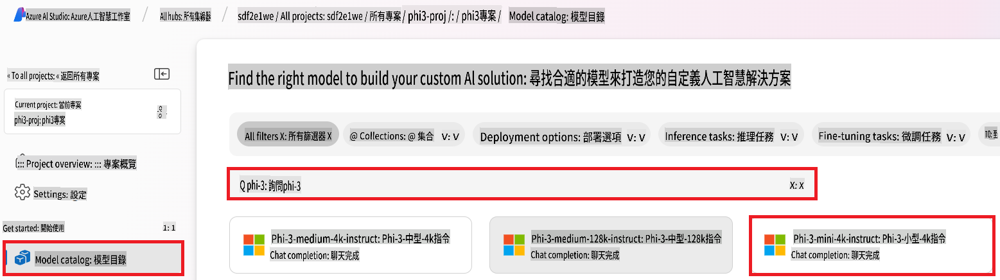

3. 選擇 **微調**。

    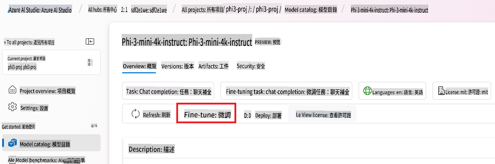

4. 輸入 **微調模型名稱**。

    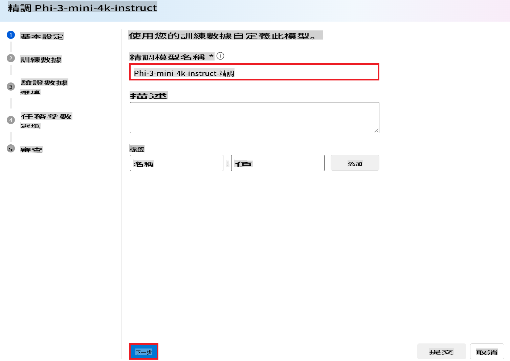

5. 選擇 **下一步**。

6. 執行以下任務：

    - 將 **任務類型** 設定為 **聊天補全**。  
    - 選擇您想使用的 **訓練資料**。您可以透過 Azure AI Foundry 的資料或從本地環境上傳。  

    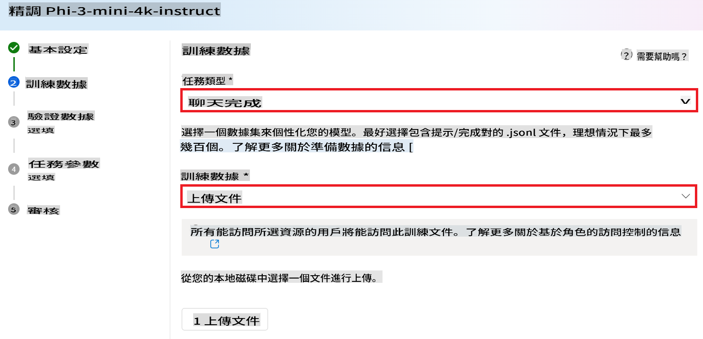

7. 選擇 **下一步**。

8. 上傳您想使用的 **驗證資料**，或者選擇 **自動分割訓練資料**。

    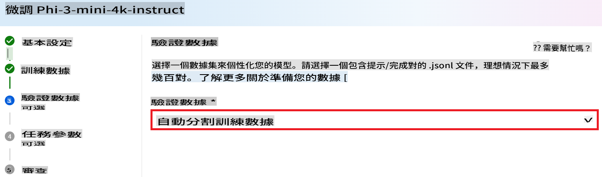

9. 選擇 **下一步**。

10. 執行以下任務：

    - 選擇您想使用的 **批量大小倍數**。  
    - 選擇您想使用的 **學習率**。  
    - 選擇您想使用的 **訓練週期數**。  

    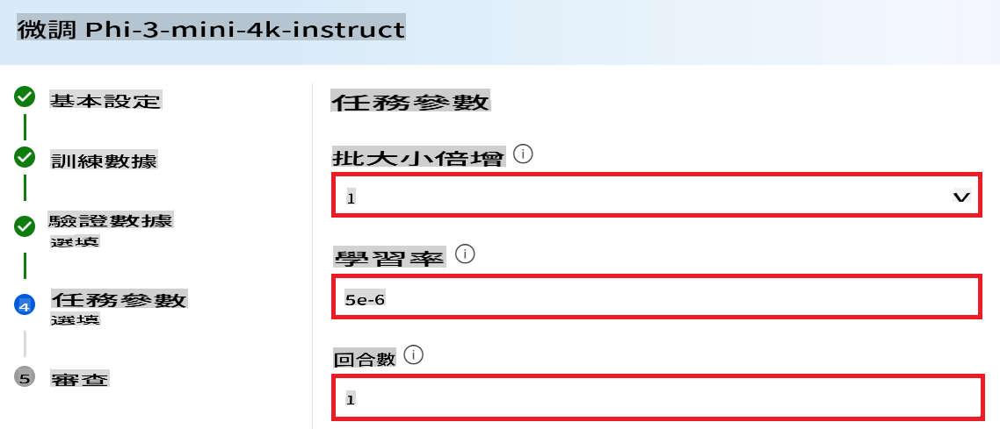

11. 選擇 **提交** 以開始微調過程。

    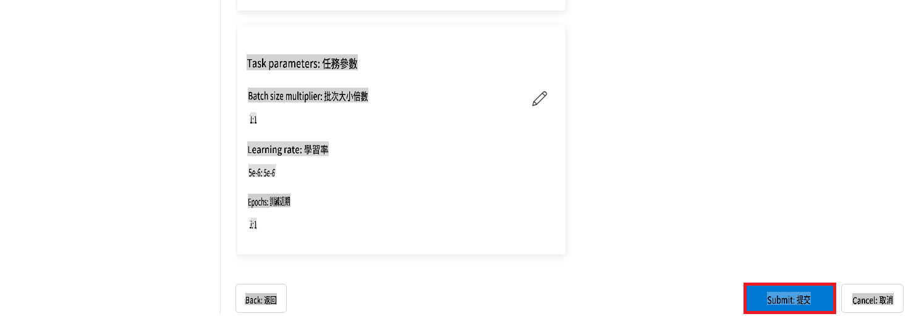

12. 當您的模型完成微調後，狀態將顯示為 **已完成**，如下圖所示。現在，您可以部署該模型，並將其用於自己的應用程式、測試平台或提示流程。更多資訊，請參閱 [如何使用 Azure AI Foundry 部署 Phi-3 小型語言模型](https://learn.microsoft.com/azure/ai-studio/how-to/deploy-models-phi-3?tabs=phi-3-5&pivots=programming-language-python)。

    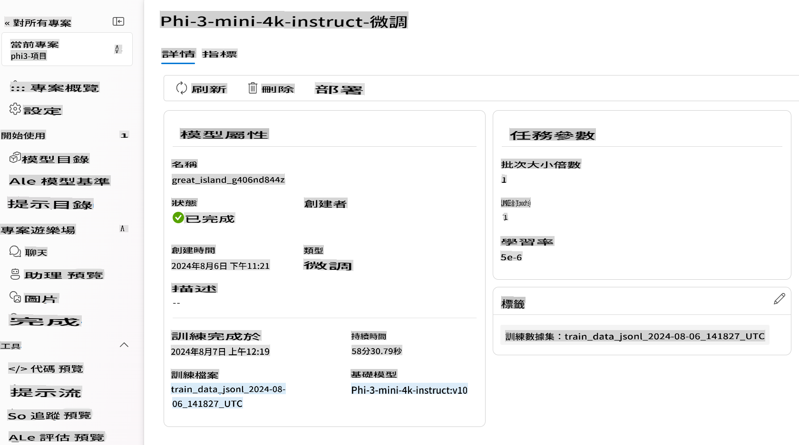

> [!NOTE]  
> 如需有關微調 Phi-3 的更詳細資訊，請參閱 [在 Azure AI Foundry 微調 Phi-3 模型](https://learn.microsoft.com/azure/ai-studio/how-to/fine-tune-phi-3?tabs=phi-3-mini)。

## 清理您的微調模型

您可以從 [Azure AI Foundry](https://ai.azure.com) 的微調模型列表或模型詳細資訊頁面中刪除微調模型。在微調頁面中選擇要刪除的微調模型，然後選擇刪除按鈕以刪除該模型。

> [!NOTE]  
> 如果自訂模型有現有的部署，您無法刪除該模型。在刪除自訂模型之前，您必須先刪除模型部署。

## 成本與配額

### 作為服務的 Phi-3 模型微調的成本與配額考量

由 Microsoft 提供的 Phi 模型作為服務進行微調，並整合到 Azure AI Foundry 中使用。您可以在[部署](https://learn.microsoft.com/azure/ai-studio/how-to/deploy-models-phi-3?tabs=phi-3-5&pivots=programming-language-python)或微調模型時，透過部署精靈的定價與條款頁籤找到定價資訊。

## 內容過濾

作為服務部署並採用按需付費模式的模型受到 Azure AI 內容安全保護。當部署到即時端點時，您可以選擇停用此功能。啟用 Azure AI 內容安全後，提示和補全都會經過一系列分類模型的檢測，以防止生成有害內容。內容過濾系統會檢測並對輸入提示和輸出補全中特定類別的潛在有害內容採取行動。了解更多關於 [Azure AI 內容安全](https://learn.microsoft.com/azure/ai-studio/concepts/content-filtering)。

**微調配置**

超參數：定義學習率、批量大小和訓練週期數等超參數。

**損失函數**

選擇適合任務的損失函數（例如交叉熵）。

**優化器**

選擇一個優化器（例如 Adam）來在訓練期間進行梯度更新。

**微調過程**

- 加載預訓練模型：加載 Phi-3 Mini 的檢查點。  
- 添加自訂層：添加任務特定的層（例如聊天指令的分類頭）。

**訓練模型**  
使用準備好的資料集微調模型。監控訓練進度並根據需要調整超參數。

**評估與驗證**

驗證集：將資料分為訓練集和驗證集。

**評估效能**  
使用準確率、F1 分數或困惑度等指標來評估模型效能。

## 保存微調模型

**檢查點**  
保存微調模型的檢查點以供日後使用。

## 部署

- 部署為 Web 服務：將微調模型部署為 Azure AI Foundry 中的 Web 服務。  
- 測試端點：向已部署的端點發送測試查詢以驗證其功能。

## 迭代與改進

迭代：如果效能不令人滿意，通過調整超參數、添加更多資料或增加訓練週期來進行迭代。

## 監控與優化

持續監控模型的行為並根據需要進行改進。

## 自訂與擴展

自訂任務：Phi-3 Mini 可被微調用於聊天指令以外的各種任務。探索其他使用案例！  
實驗：嘗試不同的架構、層組合和技術來提升效能。

> [!NOTE]  
> 微調是一個迭代過程。實驗、學習並調整您的模型，以在特定任務中獲得最佳結果！

**免責聲明**：  
本文檔使用基於機器的人工智能翻譯服務進行翻譯。我們努力確保準確性，但請注意，自動翻譯可能包含錯誤或不準確之處。應以原文檔的母語版本作為權威來源。對於關鍵信息，建議尋求專業人工翻譯。我們對因使用此翻譯而引起的任何誤解或誤讀不承擔責任。