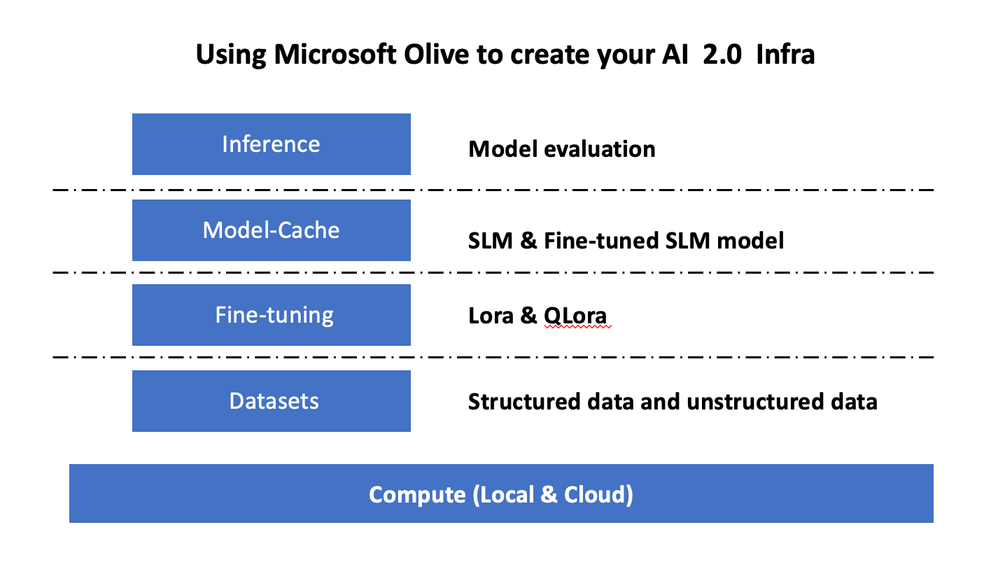
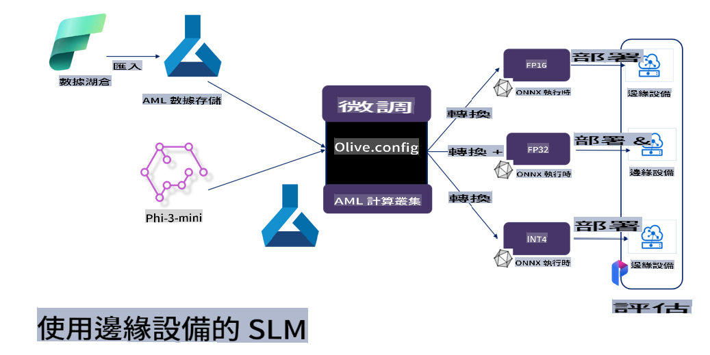

# **使用 Microsoft Olive 微調 Phi-3**

[Olive](https://github.com/microsoft/OLive?WT.mc_id=aiml-138114-kinfeylo) 是一款簡單易用且硬體感知的模型優化工具，結合了業界領先的模型壓縮、優化和編譯技術。

它旨在簡化機器學習模型的優化過程，確保模型能夠在特定硬體架構上高效運行。

無論您是在開發基於雲端的應用還是邊緣設備，Olive 都能讓您的模型優化變得輕鬆高效。

## 主要功能：
- Olive 整合並自動化了針對特定硬體目標的優化技術。
- 沒有單一的優化技術適用於所有場景，因此 Olive 提供擴展性，允許業界專家插入他們的創新優化方法。

## 減少工程工作量：
- 開發人員通常需要學習並使用多種硬體供應商特定的工具鏈來準備和優化訓練後的模型以進行部署。
- Olive 通過自動化優化技術，簡化了這一過程。

## 即插即用的端到端優化解決方案：

通過整合和調整多種技術，Olive 提供了一個統一的端到端優化解決方案。
在優化模型的同時，還會考慮準確性和延遲等限制條件。

## 使用 Microsoft Olive 進行微調

Microsoft Olive 是一款非常易於使用的開源模型優化工具，能夠涵蓋生成式人工智慧領域中的微調和推理。只需簡單配置，結合使用開源的小型語言模型和相關的運行環境（AzureML / 本地 GPU、CPU、DirectML），即可通過自動優化完成模型的微調或推理，並找到最佳模型部署到雲端或邊緣設備。讓企業能夠在本地和雲端構建自己的行業垂直模型。



## 使用 Microsoft Olive 微調 Phi-3



## Phi-3 Olive 範例代碼與示例
在此示例中，您將使用 Olive 來：

- 微調一個 LoRA 適配器，將短語分類為 Sad、Joy、Fear、Surprise。
- 將適配器權重合併到基礎模型中。
- 將模型優化並量化為 int4。

[範例代碼](../../code/03.Finetuning/olive-ort-example/README.md)

### 安裝 Microsoft Olive

Microsoft Olive 的安裝非常簡單，並且可以安裝在 CPU、GPU、DirectML 和 Azure ML 上。

```bash
pip install olive-ai
```

如果您希望使用 CPU 運行 ONNX 模型，可以使用：

```bash
pip install olive-ai[cpu]
```

如果您希望使用 GPU 運行 ONNX 模型，可以使用：

```python
pip install olive-ai[gpu]
```

如果您希望使用 Azure ML，可以使用：

```python
pip install git+https://github.com/microsoft/Olive#egg=olive-ai[azureml]
```

**注意**
操作系統需求：Ubuntu 20.04 / 22.04 

### **Microsoft Olive 的 Config.json**

安裝完成後，您可以通過配置文件設定不同的模型相關設置，包括數據、計算、訓練、部署和模型生成。

**1. 數據**

在 Microsoft Olive 上，可以支持本地數據和雲端數據的訓練，並可在設置中進行配置。

*本地數據設置*

您可以簡單地設置需要進行微調的數據集，通常為 json 格式，並配合數據模板使用。這需要根據模型的要求進行調整（例如，適配到 Microsoft Phi-3-mini 所需的格式。如果有其他模型，請參考其他模型的微調格式要求進行處理）。

```json

    "data_configs": [
        {
            "name": "dataset_default_train",
            "type": "HuggingfaceContainer",
            "load_dataset_config": {
                "params": {
                    "data_name": "json", 
                    "data_files":"dataset/dataset-classification.json",
                    "split": "train"
                }
            },
            "pre_process_data_config": {
                "params": {
                    "dataset_type": "corpus",
                    "text_cols": [
                            "phrase",
                            "tone"
                    ],
                    "text_template": "### Text: {phrase}\n### The tone is:\n{tone}",
                    "corpus_strategy": "join",
                    "source_max_len": 2048,
                    "pad_to_max_len": false,
                    "use_attention_mask": false
                }
            }
        }
    ],
```

**雲端數據源設置**

通過連接 Azure AI Studio / Azure Machine Learning Service 的數據存儲，可以鏈接雲端數據，並選擇通過 Microsoft Fabric 和 Azure Data 將不同數據源引入 Azure AI Studio / Azure Machine Learning Service，作為微調數據的支持。

```json

    "data_configs": [
        {
            "name": "dataset_default_train",
            "type": "HuggingfaceContainer",
            "load_dataset_config": {
                "params": {
                    "data_name": "json", 
                    "data_files": {
                        "type": "azureml_datastore",
                        "config": {
                            "azureml_client": {
                                "subscription_id": "Your Azure Subscrition ID",
                                "resource_group": "Your Azure Resource Group",
                                "workspace_name": "Your Azure ML Workspaces name"
                            },
                            "datastore_name": "workspaceblobstore",
                            "relative_path": "Your train_data.json Azure ML Location"
                        }
                    },
                    "split": "train"
                }
            },
            "pre_process_data_config": {
                "params": {
                    "dataset_type": "corpus",
                    "text_cols": [
                            "Question",
                            "Best Answer"
                    ],
                    "text_template": "<|user|>\n{Question}<|end|>\n<|assistant|>\n{Best Answer}\n<|end|>",
                    "corpus_strategy": "join",
                    "source_max_len": 2048,
                    "pad_to_max_len": false,
                    "use_attention_mask": false
                }
            }
        }
    ],
    
```

**2. 計算配置**

如果需要本地運行，可以直接使用本地數據資源。如果需要使用 Azure AI Studio / Azure Machine Learning Service 的資源，則需要配置相關的 Azure 參數、計算資源名稱等。

```json

    "systems": {
        "aml": {
            "type": "AzureML",
            "config": {
                "accelerators": ["gpu"],
                "hf_token": true,
                "aml_compute": "Your Azure AI Studio / Azure Machine Learning Service Compute Name",
                "aml_docker_config": {
                    "base_image": "Your Azure AI Studio / Azure Machine Learning Service docker",
                    "conda_file_path": "conda.yaml"
                }
            }
        },
        "azure_arc": {
            "type": "AzureML",
            "config": {
                "accelerators": ["gpu"],
                "aml_compute": "Your Azure AI Studio / Azure Machine Learning Service Compute Name",
                "aml_docker_config": {
                    "base_image": "Your Azure AI Studio / Azure Machine Learning Service docker",
                    "conda_file_path": "conda.yaml"
                }
            }
        }
    },
```

***注意***

由於是在 Azure AI Studio / Azure Machine Learning Service 上通過容器運行，因此需要配置所需的環境。這是在 conda.yaml 環境中配置的。

```yaml

name: project_environment
channels:
  - defaults
dependencies:
  - python=3.8.13
  - pip=22.3.1
  - pip:
      - einops
      - accelerate
      - azure-keyvault-secrets
      - azure-identity
      - bitsandbytes
      - datasets
      - huggingface_hub
      - peft
      - scipy
      - sentencepiece
      - torch>=2.2.0
      - transformers
      - git+https://github.com/microsoft/Olive@jiapli/mlflow_loading_fix#egg=olive-ai[gpu]
      - --extra-index-url https://aiinfra.pkgs.visualstudio.com/PublicPackages/_packaging/ORT-Nightly/pypi/simple/ 
      - ort-nightly-gpu==1.18.0.dev20240307004
      - --extra-index-url https://aiinfra.pkgs.visualstudio.com/PublicPackages/_packaging/onnxruntime-genai/pypi/simple/
      - onnxruntime-genai-cuda

    

```

**3. 選擇您的 SLM**

您可以直接從 Hugging Face 使用模型，也可以結合 Azure AI Studio / Azure Machine Learning 的 Model Catalog 選擇要使用的模型。在以下代碼示例中，我們將以 Microsoft Phi-3-mini 為例。

如果您有本地模型，可以使用此方法：

```json

    "input_model":{
        "type": "PyTorchModel",
        "config": {
            "hf_config": {
                "model_name": "model-cache/microsoft/phi-3-mini",
                "task": "text-generation",
                "model_loading_args": {
                    "trust_remote_code": true
                }
            }
        }
    },
```

如果您希望使用 Azure AI Studio / Azure Machine Learning Service 上的模型，可以使用此方法：

```json

    "input_model":{
        "type": "PyTorchModel",
        "config": {
            "model_path": {
                "type": "azureml_registry_model",
                "config": {
                    "name": "microsoft/Phi-3-mini-4k-instruct",
                    "registry_name": "azureml-msr",
                    "version": "11"
                }
            },
             "model_file_format": "PyTorch.MLflow",
             "hf_config": {
                "model_name": "microsoft/Phi-3-mini-4k-instruct",
                "task": "text-generation",
                "from_pretrained_args": {
                    "trust_remote_code": true
                }
            }
        }
    },
```

**注意：**
我們需要與 Azure AI Studio / Azure Machine Learning Service 集成，因此在設置模型時，請參考版本號和相關命名。

Azure 上的所有模型都需要設置為 PyTorch.MLflow。

您需要擁有一個 Hugging Face 帳號，並將密鑰綁定到 Azure AI Studio / Azure Machine Learning 的 Key 值。

**4. 演算法**

Microsoft Olive 將 Lora 和 QLora 微調演算法封裝得非常完善。您只需要配置一些相關參數。這裡以 QLora 為例。

```json
        "lora": {
            "type": "LoRA",
            "config": {
                "target_modules": [
                    "o_proj",
                    "qkv_proj"
                ],
                "double_quant": true,
                "lora_r": 64,
                "lora_alpha": 64,
                "lora_dropout": 0.1,
                "train_data_config": "dataset_default_train",
                "eval_dataset_size": 0.3,
                "training_args": {
                    "seed": 0,
                    "data_seed": 42,
                    "per_device_train_batch_size": 1,
                    "per_device_eval_batch_size": 1,
                    "gradient_accumulation_steps": 4,
                    "gradient_checkpointing": false,
                    "learning_rate": 0.0001,
                    "num_train_epochs": 3,
                    "max_steps": 10,
                    "logging_steps": 10,
                    "evaluation_strategy": "steps",
                    "eval_steps": 187,
                    "group_by_length": true,
                    "adam_beta2": 0.999,
                    "max_grad_norm": 0.3
                }
            }
        },
```

如果需要進行量化轉換，Microsoft Olive 主分支已支持 onnxruntime-genai 方法。您可以根據需要進行設置：

1. 將適配器權重合併到基礎模型中。
2. 通過 ModelBuilder 將模型轉換為所需精度的 ONNX 模型。

例如轉換為量化的 INT4：

```json

        "merge_adapter_weights": {
            "type": "MergeAdapterWeights"
        },
        "builder": {
            "type": "ModelBuilder",
            "config": {
                "precision": "int4"
            }
        }
```

**注意** 
- 如果使用 QLoRA，目前不支持 ONNXRuntime-genai 的量化轉換。

- 需要指出的是，您可以根據自己的需求設置上述步驟。並非必須完全配置上述步驟。根據需求，您可以直接使用演算法的步驟，而不進行微調。最後，您需要配置相關的引擎。

```json

    "engine": {
        "log_severity_level": 0,
        "host": "aml",
        "target": "aml",
        "search_strategy": false,
        "execution_providers": ["CUDAExecutionProvider"],
        "cache_dir": "../model-cache/models/phi3-finetuned/cache",
        "output_dir" : "../model-cache/models/phi3-finetuned"
    }
```

**5. 完成微調**

在命令列中，在 olive-config.json 所在的目錄下執行：

```bash
olive run --config olive-config.json  
```

**免責聲明**：  
本文件使用基於機器的人工智能翻譯服務進行翻譯。儘管我們努力確保準確性，但請注意，自動翻譯可能包含錯誤或不準確之處。應以原始語言的文件作為權威來源。對於關鍵信息，建議尋求專業人工翻譯。我們對於使用此翻譯而引起的任何誤解或誤讀概不負責。