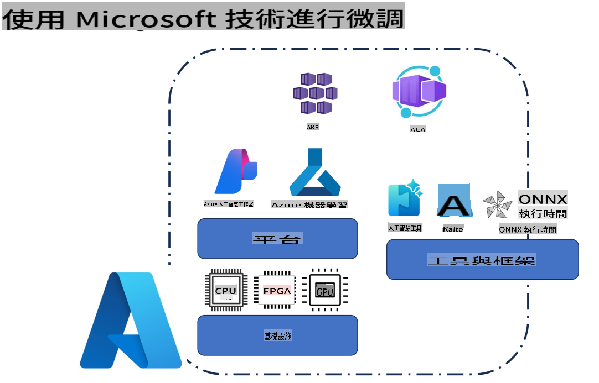
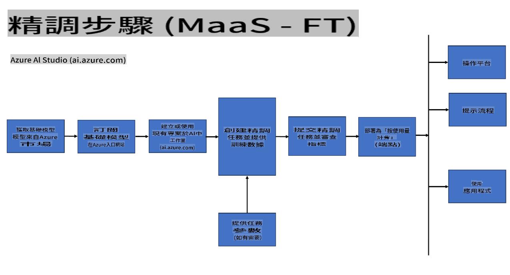
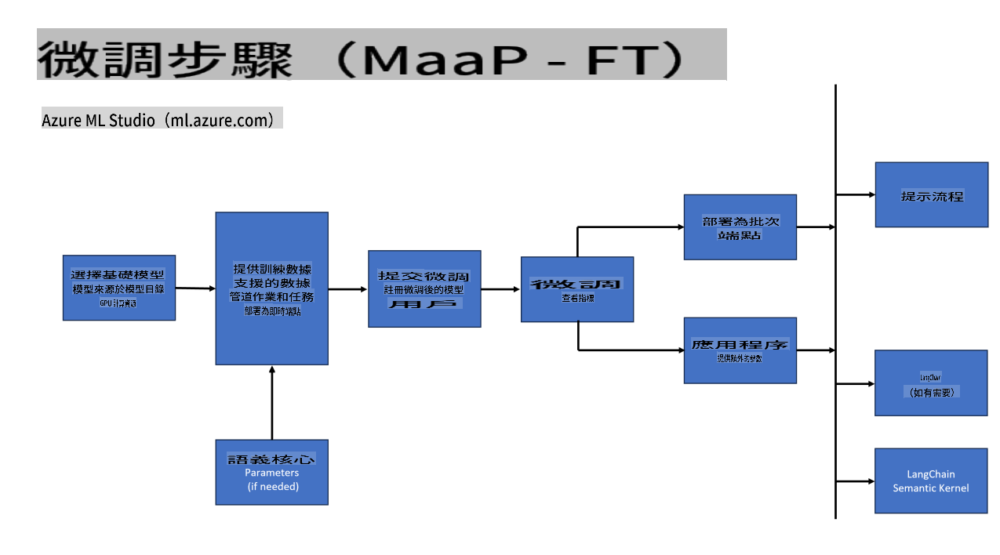
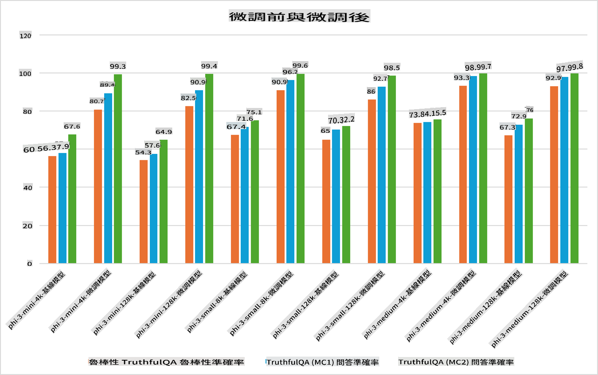

## 微調場景

**平台** 包括各種技術，例如 Azure AI Foundry、Azure Machine Learning、AI Tools、Kaito 和 ONNX Runtime。

**基礎設施** 包括 CPU 和 FPGA，這些是微調過程中的重要組成部分。以下是這些技術的圖標。

**工具與框架** 包括 ONNX Runtime 和 ONNX Runtime。以下是這些技術的圖標。
[插入 ONNX Runtime 和 ONNX Runtime 的圖標]

使用 Microsoft 技術進行微調涉及多種組件與工具。透過了解並運用這些技術，我們可以有效地微調應用程式並創造更好的解決方案。

## 模型即服務

透過託管微調進行模型微調，無需建立或管理運算資源。

無伺服器微調適用於 Phi-3-mini 和 Phi-3-medium 模型，讓開發者能快速且輕鬆地為雲端和邊緣場景定制模型，無需安排運算資源。我們還宣布，Phi-3-small 現已通過我們的模型即服務提供，開發者可以迅速且輕鬆地開始 AI 開發，無需管理底層基礎設施。

## 模型即平台

用戶需自行管理運算資源以微調模型。

[微調範例](https://github.com/Azure/azureml-examples/blob/main/sdk/python/foundation-models/system/finetune/chat-completion/chat-completion.ipynb)

## 微調場景

| | | | | | | |
|-|-|-|-|-|-|-|
|場景|LoRA|QLoRA|PEFT|DeepSpeed|ZeRO|DORA|
|將預訓練的 LLM 適配於特定任務或領域|是|是|是|是|是|是|
|針對 NLP 任務（如文本分類、命名實體識別和機器翻譯）進行微調|是|是|是|是|是|是|
|針對 QA 任務進行微調|是|是|是|是|是|是|
|針對聊天機器人生成類似人類的回應進行微調|是|是|是|是|是|是|
|針對音樂、藝術或其他創意形式進行生成微調|是|是|是|是|是|是|
|降低計算和財務成本|是|是|否|是|是|否|
|降低記憶體使用量|否|是|否|是|是|是|
|使用較少的參數進行高效微調|否|是|是|否|否|是|
|一種記憶體高效的數據並行形式，可訪問所有可用 GPU 設備的總體 GPU 記憶體|否|否|否|是|是|是|

## 微調性能範例

**免責聲明**：  
本文件已使用基於機器的人工智能翻譯服務進行翻譯。我們雖然努力確保翻譯的準確性，但請注意，自動翻譯可能包含錯誤或不準確之處。應以原文文件作為權威來源。對於關鍵信息，建議尋求專業人工翻譯。我們對因使用本翻譯而引起的任何誤解或誤讀概不負責。