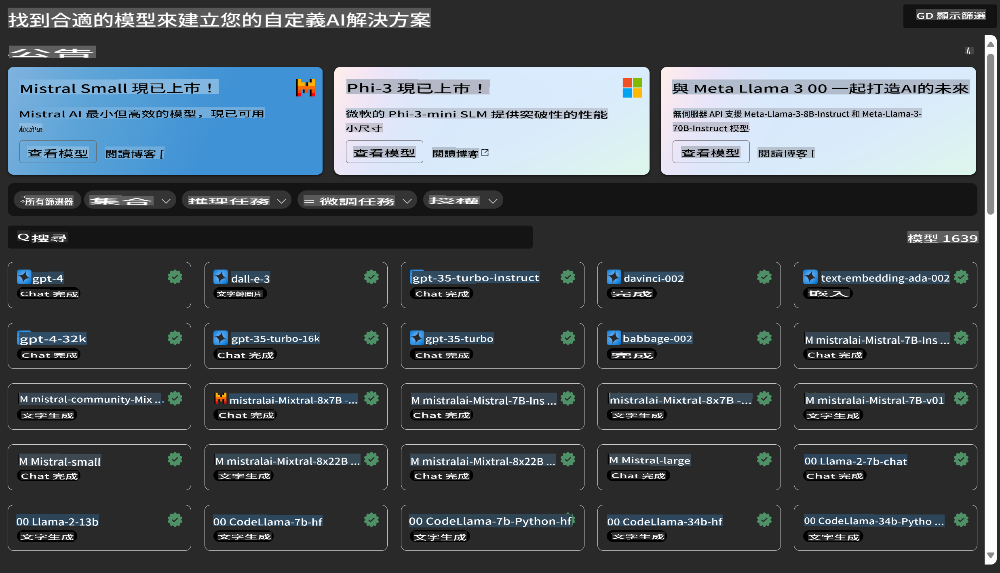

# **介紹 Azure Machine Learning 服務**

[Azure Machine Learning](https://ml.azure.com?WT.mc_id=aiml-138114-kinfeylo) 是一項雲端服務，旨在加速並管理機器學習 (ML) 專案的生命週期。

ML 專業人士、數據科學家以及工程師可以在日常工作流程中使用它來：

- 訓練和部署模型。
- 管理機器學習操作 (MLOps)。
- 你可以在 Azure Machine Learning 中建立模型，或者使用從開源平台（如 PyTorch、TensorFlow 或 scikit-learn）建立的模型。
- MLOps 工具可幫助你監控、重新訓練和重新部署模型。

## 誰適合使用 Azure Machine Learning？

**數據科學家和 ML 工程師**

他們可以使用工具來加速並自動化日常工作流程。  
Azure ML 提供公平性、可解釋性、追蹤性和審核性的功能。

**應用程式開發人員**

他們可以將模型無縫整合到應用程式或服務中。

**平台開發人員**

他們可使用由強大的 Azure Resource Manager API 支援的工具集，來建構進階的 ML 工具。

**企業**

在 Microsoft Azure 雲端中運作的企業，能從熟悉的安全性和基於角色的存取控制中受益。  
設置專案以控制對受保護數據和特定操作的存取。

## 提升團隊每個成員的生產力

ML 專案通常需要具備多元技能的團隊來建立和維護。

Azure ML 提供的工具能讓你：

- 通過共享的筆記本、運算資源、無伺服器運算、數據和環境與團隊協作。
- 開發具公平性、可解釋性、追蹤性和審核性的模型，以滿足譜系和審計合規要求。
- 快速、輕鬆地大規模部署 ML 模型，並通過 MLOps 高效地管理和治理。
- 使用內建的治理、安全性和合規性，隨時隨地執行機器學習工作負載。

## 跨平台兼容的工具

ML 團隊中的任何人都可以使用他們偏好的工具來完成工作。  
無論是進行快速實驗、超參數調整、構建管道，還是管理推理，你都可以使用熟悉的介面，包括：

- Azure Machine Learning Studio
- Python SDK (v2)
- Azure CLI (v2)
- Azure Resource Manager REST APIs

在模型精煉和整個開發週期的協作過程中，你可以在 Azure Machine Learning Studio 的 UI 中分享和查找資產、資源和指標。

## **Azure ML 中的 LLM/SLM**

Azure ML 添加了許多與 LLM/SLM 相關的功能，結合 LLMOps 和 SLMOps，打造企業級生成式人工智慧技術平台。

### **模型目錄**

企業用戶可以通過模型目錄根據不同的業務場景部署不同的模型，並以 Model as Service 的形式提供服務，供企業開發者或用戶存取。

Azure Machine Learning Studio 中的模型目錄是發現和使用各種模型的樞紐，這些模型能幫助你構建生成式 AI 應用程式。模型目錄包含數百個來自不同模型提供商的模型，例如 Azure OpenAI 服務、Mistral、Meta、Cohere、Nvidia、Hugging Face，以及由 Microsoft 訓練的模型。來自 Microsoft 以外提供商的模型屬於非 Microsoft 產品（根據 Microsoft 的產品條款定義），並受模型附帶條款的約束。

### **作業管道**

機器學習管道的核心在於將完整的機器學習任務拆分為多步驟的工作流程。每個步驟都是可以單獨開發、優化、配置和自動化的可管理組件。步驟通過明確定義的介面進行連接。Azure Machine Learning 管道服務會自動協調管道步驟之間的所有依賴關係。

在微調 SLM / LLM 時，我們可以通過管道管理數據、訓練和生成過程。

### **Prompt Flow**

**使用 Azure Machine Learning Prompt Flow 的好處**  
Azure Machine Learning Prompt Flow 提供了一系列好處，幫助用戶從創意階段過渡到實驗階段，最終實現基於 LLM 的應用程式的生產準備：

**Prompt 工程的靈活性**

- **互動式撰寫體驗**：Azure Machine Learning Prompt Flow 提供了流程結構的可視化表示，讓用戶能輕鬆理解並導航專案。此外，它還提供類似筆記本的編碼體驗，用於高效的流程開發和調試。
- **Prompt 調整的變體**：用戶可以創建和比較多個 Prompt 變體，促進迭代改進的過程。
- **評估**：內建的評估流程使用戶能夠評估 Prompt 和流程的質量和有效性。
- **全面的資源**：Azure Machine Learning Prompt Flow 包括內建工具、範例和模板的庫，這些資源可作為開發的起點，激發創意並加速過程。

**基於 LLM 應用的企業就緒性**

- **協作**：Azure Machine Learning Prompt Flow 支援團隊協作，允許多個用戶在 Prompt 工程專案上共同工作、分享知識並維持版本控制。
- **一體化平台**：Azure Machine Learning Prompt Flow 簡化了整個 Prompt 工程過程，從開發和評估到部署和監控。用戶可以輕鬆地將他們的流程部署為 Azure Machine Learning 端點，並實時監控其性能，確保最佳運行和持續改進。
- **Azure Machine Learning 企業級解決方案**：Prompt Flow 利用 Azure Machine Learning 強大的企業級解決方案，為流程的開發、實驗和部署提供安全、可擴展且可靠的基礎。

通過 Azure Machine Learning Prompt Flow，用戶可以釋放 Prompt 工程的靈活性，有效協作，並利用企業級解決方案成功開發和部署基於 LLM 的應用程式。

結合 Azure ML 的計算能力、數據和不同組件，企業開發者可以輕鬆構建自己的人工智慧應用程式。

**免責聲明**：  
本文件使用機器翻譯服務進行翻譯。我們雖然力求準確，但請注意，自動翻譯可能包含錯誤或不準確之處。應以原始語言的文件作為權威來源。對於關鍵信息，建議尋求專業人工翻譯。我們對因使用此翻譯而產生的任何誤解或誤讀不承擔責任。